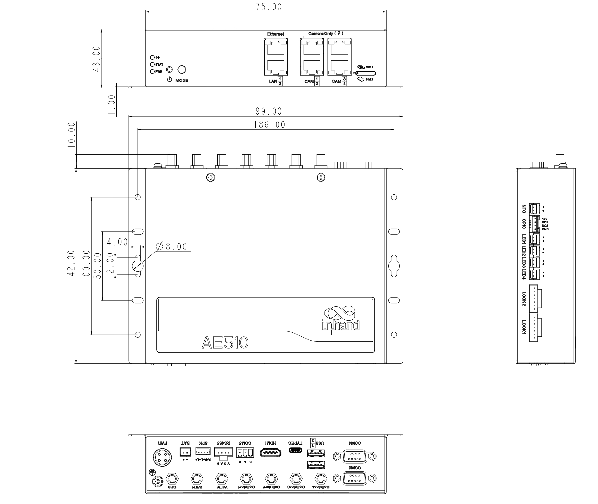
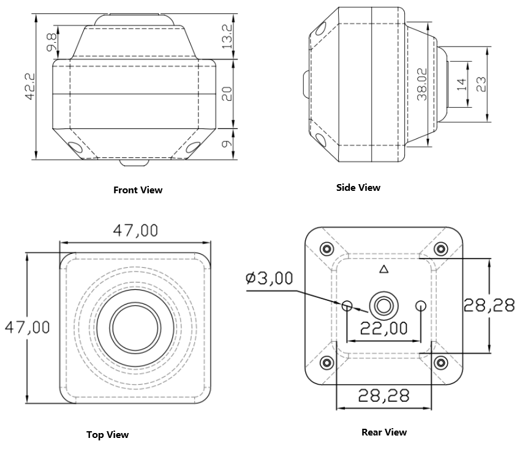
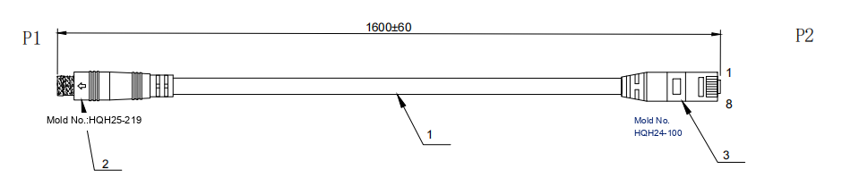
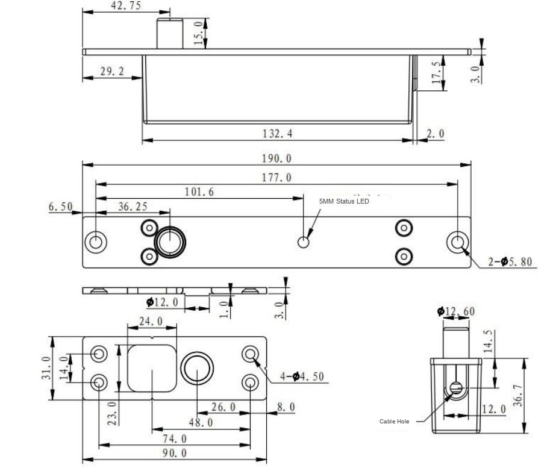
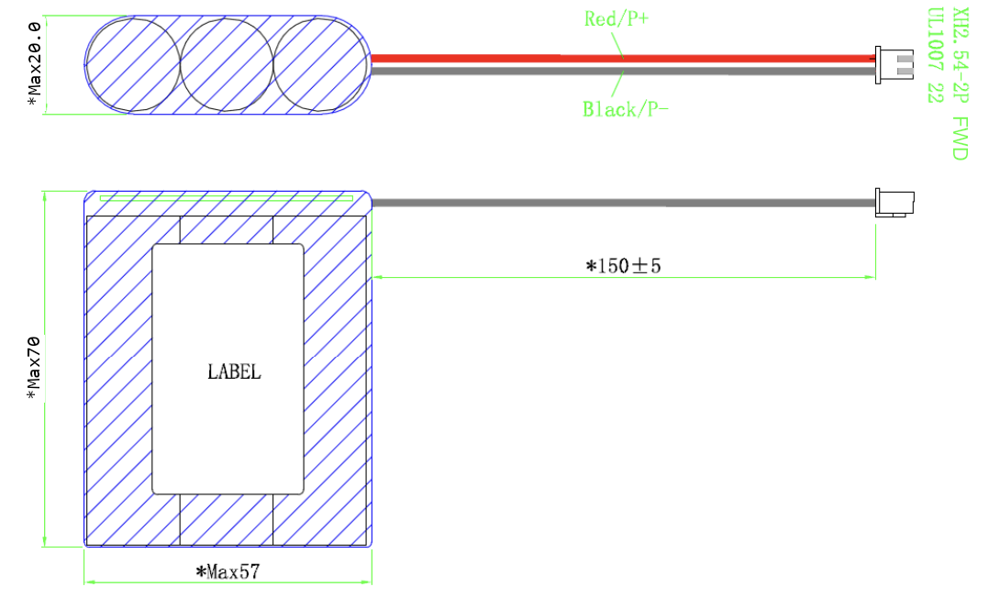
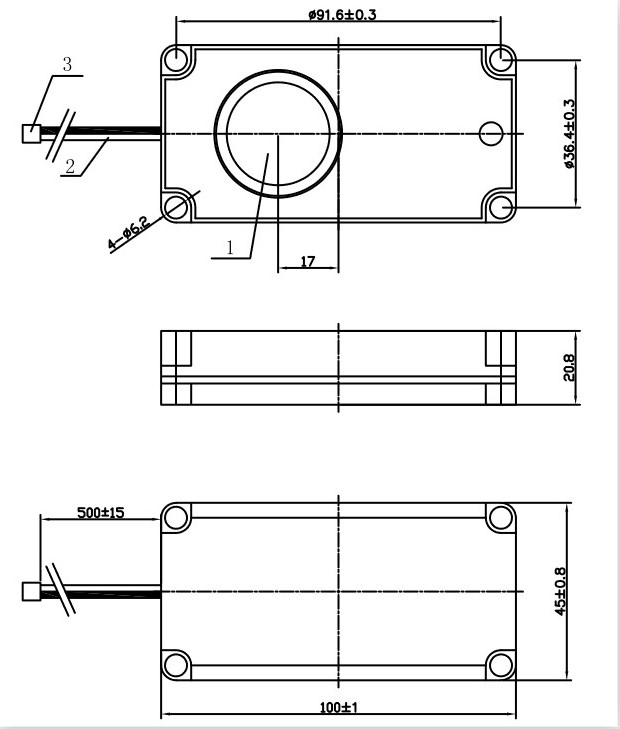
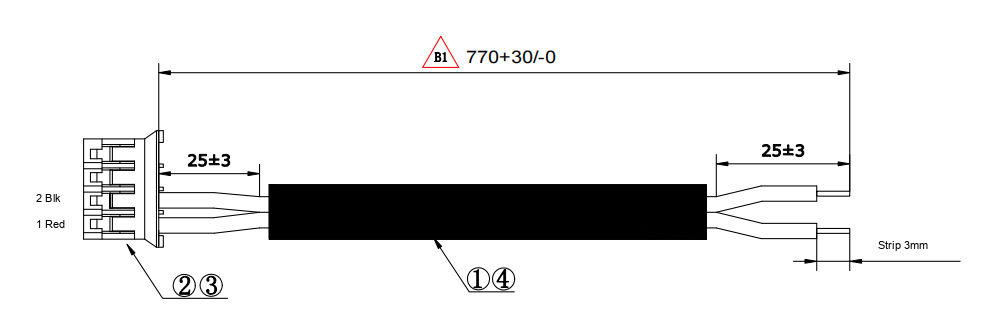

  

    

      
    

    

      Edge-side AI Recognition, Accurate and Fast Settlement
    

  

  

    

      AE510 Smart Kit
    

    

      

        
· Edge Computing

        
· 14 TOPS AI

      

      

        
· 4-Camera Vision

        
· Smart Lock

      

    

  

# 1. Product Overview

**AI vending machine retrofit kit with edge-side AI recognition for accurate, fast automated checkout.**

**Key Features:**

- **Edge-side AI:** 14 TOPS AI computing power with octa-core processor for real-time recognition
- **Vision System:** 4 × AI cameras with advanced image recognition for accurate item capture
- **Flexible Retrofit:** Highly compatible upgrade solution for traditional vending machines
- **All-in-One Kit:** Integrated smart lock, backup battery, and voice speaker
- **Open Platform:** Android 12 OS supporting custom application development

## Core Technical Specifications

| Item                   | Specification                               |
| ---------------------- | ------------------------------------------- |
| AI Computing Power     | 14 TOPS                                     |
| OS                     | Android 12                                  |
| Edge Recognition       | Real-time AI image recognition              |
| Camera Protocol        | ONVIF, H.264/H.265, 1080P @ 25 fps          |
| Lock Control           | Smart electronic lock, LED status indicator |
| Voice Output           | 5 W speaker support                         |
| CPU                    | Octa-core, up to 2.7 GHz                    |
| RAM / Storage          | 8 GB / 128 GB                               |
| Ethernet               | 4 × 10/100 Mbps (PoE) + 2 × 10/100 Mbps     |
| Dimensions (W × D × H) | 199 × 152 × 43 mm                           |
| Power Input            | 12 V DC                                     |
| Operating Temperature  | -10 ~ 60 °C                                 |

# 2. Product Dimensions

  
   AE510

  
   AI Camera

  
   AI Camera Cable

  
   LOCK

  
   Battery

  
   Speaker

  
   Speaker Cable

  
Note:

  
1. All dimensions are in millimeters (mm).

  
2. All dimensions are approximate and for reference only.

  
3. Illustrated dimensions must not be used for production.

  
4. Dimensions are subject to component and manufacturing tolerances.

  
5. Dimensions are subject to change without notice.

## Interface Definition

### AE510 Interfaces

| Interface           | Quantity | Specification                              |
|:-------------------:|:--------:|:------------------------------------------ |
| Ethernet            | 4        | 10/100 Mbps RJ45 with PoE (for IP cameras) |
| Ethernet            | 2        | 10/100 Mbps RJ45                           |
| SIM                 | 2        | Nano SIM Slot                              |
| RS232               | 2        | DB9                                        |
| RS485               | 2        | 15EDGRC-3.81 / HX25035-4WAP2               |
| USB Type-A          | 2        | —                                          |
| USB Type-C          | 1        | —                                          |
| HDMI                | 1        | —                                          |
| Lock Interface      | 2        | HX25035-7Y                                 |
| Battery Interface   | 1        | HX25003-2WAP2                              |
| Speaker Interface   | 1        | Supports 5 W speaker                       |
| DO (Digital Output) | 2        | S04B-XASK-1                                |
| NTC                 | 1        | S02B-XARK-1                                |
| LED                 | 4        | S02B-XASK-1                                |
| Antenna (4G)        | 2        | SMA                                        |
| Antenna (Wi-Fi)     | 2        | RP-SMA                                     |

# 3. Hardware Specifications

| Category / Parameter                                        | Specification                                                        |
| ----------------------------------------------------------- | -------------------------------------------------------------------- |
| **Processor**            |                                                                      |
| CPU                                                         | Octa-core, up to 2.7 GHz                                             |
| AI Computing Power                                          | 14 TOPS                                                              |
| RAM                                                         | 8 GB                                                                 |
| Storage                                                     | 128 GB                                                               |
| OS                                                          | Android 12                                                           |
| **Interface**            |                                                                      |
| SIM                                                         | 2 × Nano SIM Slot                                                    |
| Ethernet                                                    | 4 × 10/100 Mbps RJ45 (PoE for IP cameras) + 2 × 10/100 Mbps RJ45     |
| Serial Port                                                 | 2 × RS232 (DB9), 1 × RS485 (15EDGRC-3.81), 1 × RS485 (HX25035-4WAP2) |
| USB                                                         | 2 × Type-A, 1 × Type-C                                               |
| HDMI                                                        | 1 × HDMI                                                             |
| Lock Interface                                              | 2 × HX25035-7Y                                                       |
| Speaker Interface                                           | 1 × SPK, supports 5 W speaker                                        |
| Battery Interface                                           | 1 × HX25003-2WAP2                                                    |
| DO (Digital Output)                                         | 2 × S04B-XASK-1                                                      |
| NTC                                                         | 1 × S02B-XARK-1                                                      |
| LED                                                         | 4 × S02B-XASK-1                                                      |
| **Antenna**              |                                                                      |
| 4G Antenna                                                  | 2 × SMA                                                              |
| Wi-Fi Antenna                                               | 2 × RP-SMA                                                           |
| **Buttons & Indicators** |                                                                      |
| Buttons                                                     | 1 × Power Button, 1 × Mode Button                                    |
| Indicators                                                  | 1 × Power, 1 × Status, 1 × 3G/4G                                     |
| **AI Camera**            |                                                                      |
| Quantity                                                    | 4                                                                    |
| Lens                                                        | F:2.0, FOV D: 140°, H: 115°, V: 65°, Focal length 3.0 mm             |
| Image Sensor                                                | 1/2.8" CMOS                                                          |
| Max Resolution                                              | 1920 × 1080                                                          |
| Max Frame Rate                                              | 25 fps                                                               |
| Low Illumination                                            | Supported                                                            |
| Wide Dynamic Range                                          | Supported                                                            |
| White Balance                                               | Auto                                                                 |
| 3D Noise Reduction                                          | Supported                                                            |
| Encoding Format                                             | H.264 / H.265                                                        |
| Protocol                                                    | ONVIF                                                                |
| Power Input                                                 | 12 V DC                                                              |
| Power Consumption                                           | ≤ 1.8 W                                                              |
| Operating Temperature                                       | -10 ~ 50 °C                                                          |
| **Smart Lock**           |                                                                      |
| Working Voltage                                             | 12 V DC ± 10%                                                        |
| Working Current                                             | Start 1.2 A, Steady 0.13 A                                           |
| Panel Size                                                  | 190 × 25 × 3 mm                                                      |
| Lock Dimensions                                             | 190 × 25 × 37 mm                                                     |
| LED Indicator                                               | Green (unlock), Red (lock)                                           |
| Mechanical Life                                             | ≥ 300,000 cycles, failure rate < 3%                                  |
| **Speaker**              |                                                                      |
| Dimensions                                                  | Φ100 × 45 mm                                                         |
| Magnet                                                      | Φ12.5 × 4.0 mm Nd-Fe-B                                               |
| Nominal Power                                               | 3.0 W                                                                |
| Max Power                                                   | 5.0 W                                                                |
| **Backup Battery**       |                                                                      |
| Dimensions                                                  | 70 × 57 × 20 mm                                                      |
| Typical Capacity                                            | 2000 mAh                                                             |
| Nominal Voltage                                             | 11.1 ~ 12.6 V                                                        |
| Max Discharge Current                                       | 2 A                                                                  |
| Cycle Life                                                  | ≥ 300 cycles @ 80% capacity retention                                |
| Operating Temperature                                       | Charging: 0 ~ 45 °C, Discharging: -20 ~ 60 °C                        |
| Protection                                                  | Overcharge, overdischarge, overcurrent, short circuit                |
| **Mechanical**           |                                                                      |
| Dimensions (W × D × H)                                      | 199 × 152 × 43 mm (including installation parts)                     |
| Housing                                                     | Metal                                                                |
| Cooling                                                     | Fanless                                                              |
| Protection Rating                                           | IP40                                                                 |
| **Environmental**        |                                                                      |
| Operating Temperature                                       | -10 ~ 60 °C                                                          |
| Storage Temperature                                         | -40 ~ 85 °C                                                          |
| Humidity                                                    | 5 ~ 95% (non-condensing)                                             |
| **Compliance**           |                                                                      |
| EMC                                                         | ESD / EFT / Surge: Level 2                                           |

# 4. Software Specifications

| Category / Parameter                                    | Specification                                              |
| ------------------------------------------------------- | ---------------------------------------------------------- |
| **Operating System** |                                                            |
| OS                                                      | Android 12                                                 |
| **Camera & Video**   |                                                            |
| Video Encoding                                          | H.264 / H.265                                              |
| Image Resolution                                        | 1080P / 720P / 360P / D1 @ 25 fps                          |
| Transmission Protocol                                   | ONVIF                                                      |
| Image Processing                                        | Auto white balance, 3D noise reduction, wide dynamic range |
| Low Illumination                                        | Supported                                                  |
| **Edge Computing**   |                                                            |
| AI Computing Power                                      | 14 TOPS                                                    |
| Recognition                                             | Edge-side AI image recognition                             |
| Development Environment                                 | Android application development support                    |
| **Network**          |                                                            |
| Cellular                                                | 4G LTE                                                     |
| Wi-Fi                                                   | 2.4 GHz                                                    |
| Ethernet                                                | 4 × 10/100 Mbps PoE + 2 × 10/100 Mbps                      |

# 5. Ordering Information

## Model List

| Code       | Model                    | Description                                                                                                                                                                               |
| ---------- | ------------------------ | ----------------------------------------------------------------------------------------------------------------------------------------------------------------------------------------- |
| GPRO310071 | AE510 Dynamic Vision Kit | AI Vending Machine single door cabinet, AE510 version dynamic vision kit, local recognition solution. Includes AE510 controller, AI camera × 4, smart lock, speaker, backup battery, etc. |
| SLCD000007 | InTouch-ZXD08            | 8-inch widescreen display                                                                                                                                                                 |
| SMDM120002 | InPOS-IM30               | POS Payment module                                                                                                                                                                        |

**Note:** Order network cables according to installation length.

# 6. Contact Us

- **Website:** [InHand Networks](https://www.inhand.com)
- **Copyright:** &copy; InHand Networks. All rights reserved.
