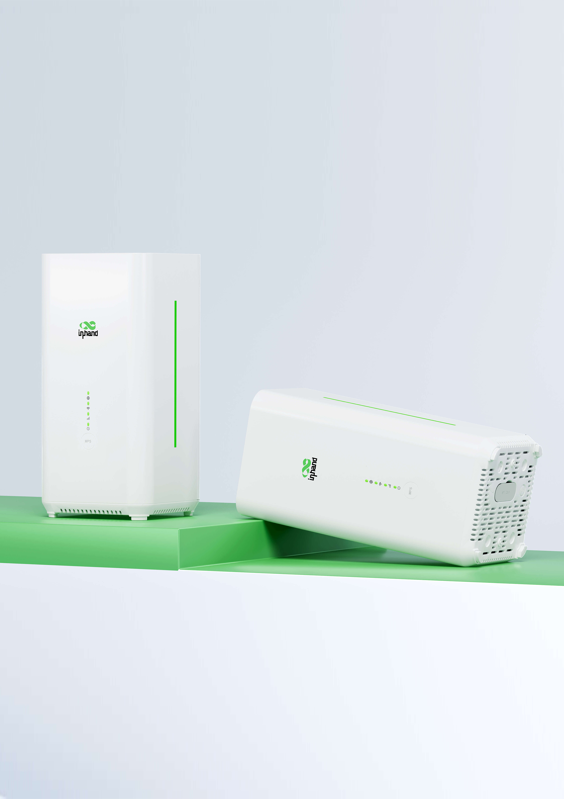
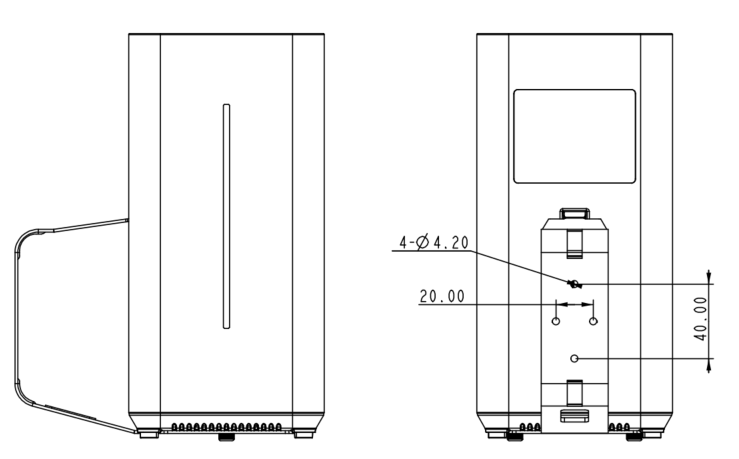

  
  

    

      
    

    

      Simple Connectivity, Convenient Life
    

  

  

    

      CPE02 5G Router
    

    

      

        
· 5G SA/NSA

        
· Wi-Fi 6 AX5400

      

      

        
· Cloud-Managed

        
· Plug & Play

      

    

  

# 1. Product Overview

**CPE02 is an indoor CPE solution launched by InHand, based on a 5G Qualcomm X62 Module design. It converts 5G/4G cellular signals into Wi-Fi signals, providing maximum rate AX5400 Wi-Fi 6 high-speed internet access. It also integrates with the InCloud Manager platform, enabling IT teams to manage devices in bulk, greatly improve management efficiency.**

**Features and Advantages:** 
- **Convenient Cellular Access with High-speed 5G:** Paired with a 5G cellular module supporting DL 3.4G and UL 550M, the CPE02 can provide high-bandwidth, low-latency network solutions for various commercial scenarios
- **5G + Broadband Backup:** With automatic failover and load balancing, you can easily build redundancy and backup systems to minimize single points of failure for seamless service continuity and minimal downtime
- **High-speed Wi-Fi 6:** Supports dual-band Wi-Fi 6 with 2.4GHz and 5GHz, offering a maximum rate of up to 5400Mbps. Supports multiple SSIDs and various encryption settings
- **Plug & Play:** Supports plug-and-play operation and can be easily used without requiring specialized IT expertise
- **Centralized Management:** InCloud Manager platform for unified device access, zero-touch remote deployment, bulk remote upgrades, configuration deployment, and connector remote maintenance

## Core Technical Specifications

|Technical Item|Specification|
| --- | --- |
| Cellular | 5G SA/NSA + 4G LTE; 5G DL up to 2.6 Gbps |
| Cloud Management | InCloud Manager |
| VPN | IPsec, L2TP, OpenVPN* |
| Network Features | IPv4/IPv6; NAT, VLAN, DHCP; PPPoE; dual-SIM policy; static routing |
| Wi-Fi | Wi-Fi 6 (AX5400), 2.4/5 GHz; multi-SSID, VLAN, WPA2/WPA3* |
| Throughput / Users | Firewall 1 Gbps; up to 200 users (128 Wi-Fi) |
| SIM | 1 × Nano 4FF + optional eSIM |
| Ethernet | 2 × GbE (EU/APAC) or 2.5G + 1G (US); WAN/LAN, dual LAN |
| Dimensions / Mount | 105 × 105 × 217 mm; 800 g; desktop / wall-mount |
| Power | 12 V / 2 A; ≤ 15 W |
| Environment | -10 °C ~ +40 °C op.; -40 °C ~ +85 °C stg.; 5%–95% RH; IP20 |
| Certification | CE, FCC, IC, PTCRB, AT&T, Verizon, T-Mobile; EMC Level 2 |

# 2. Product Dimensions

  

    
    
Front View

  

  

    
    
Interface Dimensions

  

  

    
Note:

    
1. All dimensions are in millimeters (mm).

    
2. Dimensions (L × W × H): 105 × 105 × 217 mm.

    
3. Mounting bracket optional.

    
4. All dimensions are approximate, for reference only.

    
5. Dimensions shown shall not be used for production.

  

# 3. Hardware Specifications

| Category/Parameter | Specification |
| --- | --- |
| **Performance Metrics** | |
| CPU | IPQ5018 |
| Firewall Throughput | 1 Gbps |
| Recommended Users | 200 (Wi-Fi: 128) |
| **Interfaces** | |
| Cellular | 5G NSA: 2.6 Gbps DL / 650 Mbps UL; 5G SA: 2.0 Gbps DL / 1.0 Gbps UL; 4G LTE: 600 Mbps DL / 150 Mbps UL |
|  | 4×4 MIMO 5G Sub-6 GHz, 256QAM |
| Ethernet | 2 × GbE (EU/APAC) or 2.5G + 1G (US), WAN/LAN and dual LAN support |
| SIM Card | 1 × Nano 4FF, 1 × eSIM optional |
| Type-C | Debug only |
| Reset | Hardware factory reset |
| WPS | Client one-touch Wi-Fi connection |
| **Wi-Fi** | |
| Standard | Wi-Fi 6, 802.11 a/b/g/n/ac/ax |
| Max Rate | 5400 Mbps |
| TX Power | 2.4 GHz: 17 dBm; 5 GHz: 17 dBm |
| Antenna Gain | ≤ 5 dBi |
| **Power** | |
| Input | 12 V / 2 A |
| Power Consumption | ≤ 15 W |
| **LEDs** | |
| LED | 5G, Wi-Fi, Signal, Power |
| **Mechanical** | |
| Dimensions (L × W × H) | 105 × 105 × 217 mm |
| Weight | 800 g |
| Installation | Desktop, wall-mount |
| Protection | IP20 |
| **Environment** | |
| Operating Temperature | -10 °C ~ +40 °C |
| Storage Temperature | -40 °C ~ +85 °C |
| Humidity | 5 % ~ 95 % RH (non-condensing) |
| **Certification** | |
| Certification | CE, FCC, IC, PTCRB, AT&T, Verizon, T-Mobile |
| EMC | EMC Level 2 |

# 4. Software Specifications

| Category/Parameter | Specification |
| --- | --- |
| **Cloud Management** | |
| Platform | InCloud Manager |
| Features | Unified device access, zero-touch remote deployment, bulk remote upgrades, configuration deployment, connector remote maintenance, two-factor authentication |
| Dashboard | Device connectivity status, traffic statistics, cellular signal statistics, interface status, client statistics and analysis, uplink management |
| **Network Features** | |
| Access | 5G/4G, wired |
| Dialing | PPPoE, cellular automatic redial, dual SIM switching policy, APN configuration |
| Intelligent Links | Real-time link detection |
| IP Protocols | IPv4, IPv6 |
| Network Protocols | VLAN, DHCP, DNS, URL Filtering, DDNS, Fixed Address allocation, IP Passthrough, STP, ARP, ICMP |
| Speed Test | Support for device speed testing* |
| VPN | IPsec VPN, L2TP VPN, OpenVPN* |
| Routing | Static routing |
| **Wi-Fi** | |
| Features | Multiple SSID, SSID VLAN, SSID hidden |
| Encryption | WPA, WPA2, WPA3* |
| **Reliability** | |
| Upgrade | Scheduled upgrade |
| Logs | Runtime logs, diagnostic logs |
| Events | User login, connection disconnect, device reboot |
| Alerts | Local email; platform SMS, email |
| Diagnostics | ICMP, packet capture, tracert |

# 5. Ordering Information
## Model Code

**Model code:** CPE02-\<WMNN\>-\<WLAN/NA\>

\<WMNN\>: Cellular Type & Module

## Product Models

| Model | Region | 5G Sub-6 | LTE-FDD | LTE-TDD | Ethernet | Wi-Fi |
| --- | --- | --- | --- | --- | --- | --- |
| CPE02-NANR | US | SA n1/n2/n3/n5/n7/n8/n12/n13/n14/n18/n20/n25/n26/n28/n29/n30/n38/n40/n41/n48/n66/n70/n71/n75/n76/n77/n78/n79; NSA same | B1/B2/B3/B4/B5/B7/B8/B12/B13/B14/B17/B18/B19/B20/B25/B26/B28/B29/B30/B32/B66/B71 | B34/B38/B39/B40/B41/B42/B43/B48 | 1 × 2.5G + 1 × 1G | AX5400 |
| CPE02-EUNR | EU & APAC | SA n1/n3/n5/n7/n8/n20/n28/n38/n40/n41/n66/n77/n78; NSA n1/n3/n7/n28/n38/n40/n41/n77/n78 | B1/B2/B3/B4/B5/B7/B8/B20/B28/B66 | B34/B40/B41 | 2 × GbE | AX5400 |

# 6. Contact Us

- **Website:** [InHand Networks](https://www.inhand.com.cn)
- **Copyright:** © InHand Networks. All rights reserved.
