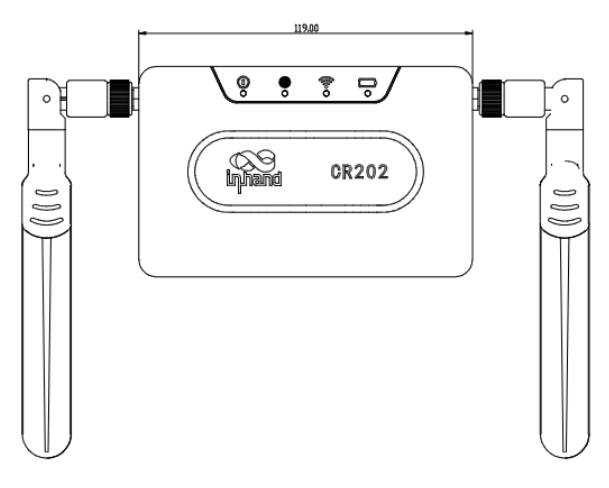
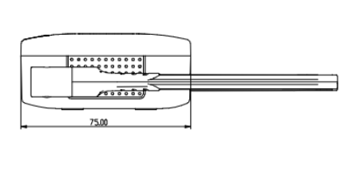
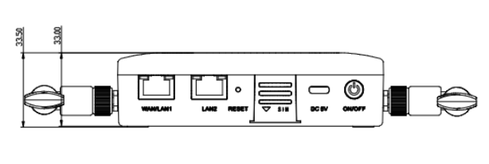

  

    

      
    

    

      Stay Connected Anywhere
    

  

  

    

      CR202-Lite Portable 4G Router
    

    

      

        
· 4G

        
· Wi-Fi

      

      

        
· Built-in Battery

        
· Cloud-Managed

      

    

  

# 1. Product Overview

**The CR202-Lite is a versatile cellular router that integrates various network access technologies, including 4G, Wi-Fi, and wired connections. It features a foldable antenna and a detachable 3000mAh lithium battery, making it easy to carry and ensuring stable network access anytime and anywhere.**

**Features and Advantages:** 
- **Exquisite and Portable:** Compact body with foldable antenna design, easy to store and carry, pocket-friendly
- **Versatile Power Supply:** Powered by adapter or 3000mAh lithium battery for up to 8 hours; detachable battery for easy replacement
- **Convenient Network Access:** Cellular, Wi-Fi, and wired connections; supports 32 terminal devices simultaneously
- **Device Manager - Cloud Management:** Seamlessly integrates with Device Manager for real-time management of tens of thousands of distributed devices
- **Compact Design:** 122 × 90.8 × 26.4 mm dimensions; desktop or wall mounting

## Core Technical Specifications

|Technical Item|Specification|
| --- | --- |
| Cellular | 4G LTE (CAT4/CAT6); up to 300 Mbps DL / 50 Mbps UL (CAT6) |
| Cloud Management | InHand Device Manager |
| VPN | IPsec, OpenVPN, WireGuard |
| Network & Security | NAT, static routing; SPI firewall, DoS, ACL, URL filtering |
| Wi-Fi | 2.4 GHz 802.11 b/g/n, 300 Mbps; AP / STA |
| Throughput / Users | 100 Mbps; up to 32 users |
| SIM | 1 × Nano + optional eSIM |
| Ethernet / Antenna | 2 × 10/100 Mbps (WAN/LAN, dual-LAN); 2 × 4G external + 2 × Wi-Fi internal |
| Power / Battery | USB-C 5 V / 2 A; optional 3000 mAh, up to 8 h |
| Dimensions / Weight | 122 × 90.8 × 26.4 mm; 235 g |
| Installation / Environment | Desktop / wall; -10 °C ~ +50 °C op.; -20 °C ~ +60 °C stg.; IP30 |
| Certification / Warranty | FCC, IC, PTCRB, Verizon, AT&T, FirstNet*, T-MOBILE, CE, UN38.3; 3 y (battery 1 y) |

# 2. Product Dimensions

  

    
    
Top View

  

  

    
    
Side View

  

    

    
    
Interface Dimensions

  

  

    
Note:

    
1. All dimensions are in millimeters (mm).

    
2. Dimensions (L × W × H): 122 × 75 × 26.4 mm (excluding antenna).

    
3. All dimensions are approximate, for reference only.

    
4. Dimensions shown shall not be used for production.

  

# 3. Hardware Specifications

| Category/Parameter | Specification |
| --- | --- |
| **Performance Metrics** | |
| Data Throughput | 100 Mbps |
| Recommended Users | 32 |
| **Interfaces** | |
| Cellular | 4G LTE CAT4/CAT6; CAT6: 300 Mbps DL / 50 Mbps UL |
| Ethernet | 2 × 10/100 Mbps, WAN/LAN switchable, dual-LAN |
| SIM | 1 × Nano SIM, 1 × eSIM optional |
| Reset | Reset button |
| ON/OFF | ON/OFF button |
| Antenna | 2 × external 4G cellular antennas, 2 × internal Wi-Fi antennas |
| **LEDs** | |
| LED | System, Cellular, Wi-Fi, Battery |
| **Wi-Fi** | |
| Frequency | Single-band 2.4 GHz |
| Max Bandwidth | 300 Mbps |
| Protocol | 802.11 b/g/n |
| Mode | AP / STA |
| **Power** | |
| Input | TYPE-C, 5 V / 2 A |
| Battery | 3000mAh optional, lasts up to 8 hours |
| **Mechanical** | |
| Installation | Desktop, wall mounting |
| Dimensions | 122 × 90.8 × 26.4 mm |
| Weight | 235 g |
| Housing | Plastic |
| Cooling | Fanless |
| **Environment** | |
| Operating Temperature | -10 °C ~ +50 °C |
| Storage Temperature | -20 °C ~ +60 °C |
| Protection | IP30 |
| **Certification** | |
| Certification | FCC, IC, PTCRB, Verizon, AT&T, FirstNet*, T-MOBILE, CE, UN38.3 |
| Warranty | 3 years (Battery: 1 year) |

# 4. Software Specifications

| Category/Parameter | Specification |
| --- | --- |
| **Network Features** | |
| Access | APN authentication |
| Authentication | CHAP/PAP |
| Network Standard | GSM/EDGE, WCDMA, TDD LTE/FDD LTE |
| LAN Protocol | ARP |
| WAN Protocol | Static IP, PPPoE, DHCP |
| IP Application | Ping, DHCP Server, DHCP Client, DNS relay, Telnet, IP Passthrough |
| Routing | Static routing |
| NAT | Supports NAT |
| **Security** | |
| Firewall | SPI, DoS protection |
| Access Control | ACL, URL filtering |
| Other | NAT, DMZ, port mapping |
| **VPN** | |
| VPN | IPSec VPN, OpenVPN, WireGuard VPN |
| **Reliability** | |
| Link Backup | Hot backup, cold backup, load balancing |
| Dual SIM Failover | Supports dual SIM failover (North American model only) |
| Link Detection | Heartbeat detection, auto-reconnect |
| Watchdog | Self-check, fault self-recovery |
| **Management** | |
| Configuration | Telnet, Web, SSH |
| Upgrade | Web upgrade, Device Manager upgrade |
| SMS Functions | Status query, restart |
| Dial-on-demand | Dial-on-demand, data / SMS activation |
| Traffic Management | Data traffic threshold, traffic statistics, traffic alarm |
| Alarm | System restart alarm, LAN port online/offline alarm, data traffic alarm, SIM card failure alarm |
| Maintenance Tools | Ping, Traceroute |
| Status Query | System status, modem status, network connection status, routing status |
| Device Manager | InHand Device Manager for bulk management |

# 5. Ordering Information

## Model Code

**Model code:** CR202-\u003cWMNN\u003e-WLAN-\u003cB/NA\u003e-Lite

\u003cWMNN\u003e: Cellular Type & Module

WLAN: Wi-Fi

\u003cB/NA\u003e: B = Battery, NA = No battery

## Product Models

| Model | Region | Specification |
| --- | --- | --- |
| CR202-NAC6-WLAN-\u003cB/NA\u003e-Lite | North America | LTE CAT6; LTE-FDD B2/B4/B5/B7/B12/B13/B14/B25/B26/B29/B30/B66/B71; LTE-TDD B41/B48; WLAN Wi-Fi; B with battery, NA without battery; Support eSIM and external Nano SIM |
| CR202-EUC4-WLAN-\u003cB/NA\u003e-Lite | Europe/APAC | LTE CAT4; LTE-FDD B1/B3/B5/B7/B8/B20/B28; LTE-TDD B38/B40/B41; WCDMA B1/B5/B8; GSM/EDGE B3/B8; WLAN Wi-Fi; B with battery, NA without battery; External Nano SIM only |

**Example:** CR202-NAC6-WLAN-B-Lite: CR202 series cellular router, supporting FDD, TDD networks, with Wi-Fi AP & Client modes, equipped with battery, supporting eSIM and external SIM card simultaneously.

**Note:** Users are asked to join InHand User Experience Plan at first login. If agreed, the router will connect to InHand cloud platform by default. Users can modify in Device Service → User Experience Plan.

# 6. Contact Us

- **Website:** [InHand Networks](https://www.inhand.com.cn)
- **Copyright:** © InHand Networks. All rights reserved.
