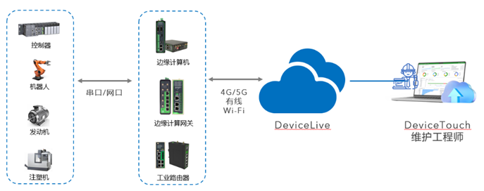
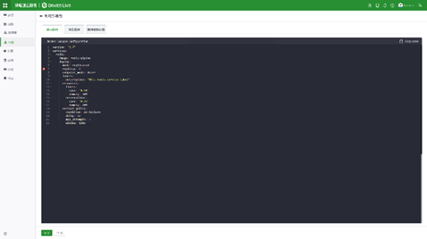

  

    

      
    

    

      IoT Device Management and Operations Platform
    

  

  

    

      DeviceLive
    

    

      

        
· Device Management

        
· Remote Monitoring

      

      

        
· Edge Computing

        
· Remote Maintenance

      

    

  

# 1. Product Overview

**DeviceLive** is an industrial IoT device management and operations platform. Combined with InHand edge intelligence hardware, it helps industrial enterprises rapidly build smart edge networks. The platform provides four core capabilities: **device management, remote monitoring, edge computing application management, and remote terminal maintenance**. Through cloud-edge collaboration, it enables intelligent edge deployment and upgrades, edge data collection and preprocessing, and visualized status monitoring.

The rapid development of IoT has brought massive numbers of devices and business data. To address digitalization challenges, industrial sectors apply digital and information technologies to achieve **IT/OT convergence**, improving production efficiency, optimizing processes, and enhancing product quality.

## Core Value

**Real-Time Monitoring and Remote Control**: DeviceLive enables real-time monitoring of device status and operation, and supports remote control (such as parameter adjustment and device reboot), improving device reliability and production efficiency.

**Fault Prediction and Maintenance Optimization**: Potential faults can be identified through operational data monitoring, enabling proactive maintenance and reducing downtime and production line interruptions.

**Data Analysis and Decision Optimization**: In-depth analysis of device data provides insights into production processes, optimizes planning and workflows, reduces waste, and improves quality.

**Enhanced Customer Experience**: Supports preventive maintenance, intelligent repair, and fast response to improve customer satisfaction and loyalty.

# 2. Platform Capability Overview

DeviceLive provides four core capabilities: **device management, network monitoring, edge computing application management, and remote terminal maintenance**. With cloud-edge collaboration, it enables intelligent edge deployment and upgrades, edge data collection and preprocessing, and visualized status monitoring, comprehensively improving management efficiency.

## Remote Terminal Access Control

<table>
  <tr>
    <td valign="top" style="text-align: center;">
      
    </td>
  </tr>
  <tr>
    <td valign="top">
      DeviceLive supports engineers in **remotely accessing terminal devices connected downstream of routers**, enabling remote terminal maintenance and program deployment, while establishing transmission channels for continuous terminal data reporting to business centers. It is suitable for distributed terminal access scenarios and supports Ethernet terminal access for industrial PCs, servers, cameras, PLCs, HMIs, controllers, and more.
    </td>
  </tr>
</table>

## Edge Computing Application Management

<table>
  <tr>
    <td valign="top" style="text-align: center;">
      
    </td>
  </tr>
  <tr>
    <td valign="top">
      For edge intelligence hardware products, DeviceLive provides management and deployment of edge computing container applications and native applications, without requiring users to build their own OTA services, delivering a one-stop solution.  
      DeviceLive can centrally configure edge intelligence hardware, manage containers, and upgrade edge computing apps. It supports unified deployment package strategies and rule definitions, enabling centralized upgrades and control of distributed intelligent sites.
    </td>
  </tr>
</table>

## Zero-Touch Deployment and O&M Features

| Capability | Description |
|------|------|
| **Plug-and-Play Devices** | Complete configuration and deployment remotely from the cloud |
| **Simple Configuration** | Web GUI configuration without complex CLI commands |
| **Centralized Cloud Management** | Unified device management with batch configuration and upgrades |
| **Fault Warning and Remote Diagnostics** | Multiple alert strategies and remote diagnostics for time-saving troubleshooting |
| **Multi-Dimensional Security Policies** | Data encryption, multi-role permissions, and multi-factor authentication |
| **Visualized Monitoring** | Comprehensive insights into connection status, network quality, cellular signal, and more |

# 3. Edge Intelligence Hardware and Cloud Data Integration

## Multi-Function Edge Hardware

- Multiple **CPU** options: from single-core to multi-core ARM processors  
- Multiple **AI computing power** options: approximately 1-26 TOPS, suitable for edge AI scenarios such as facial recognition, speech recognition, and image recognition  
- Multiple **interfaces**: Ethernet, serial, USB, IO, CAN, HDMI, LVDS, etc.  

## Distribution Linux and Secondary Development

- Edge intelligence products are built on **distribution Linux**, providing a standard software development environment  
- Supports high-level programming languages and Linux community resources to improve development efficiency  

## DeviceSupervisor™ Agent

- InHand **DeviceSupervisor™ Agent** is built in at factory delivery. No programming is required; simple configuration enables **data-to-cloud**  
- Supports local data preprocessing to reduce upload traffic and cloud load  
- Supports mainstream industrial protocols (such as Modbus, OPC UA, ISO on TCP, etc.)  
- Supports integration with major public clouds and IoT cloud platforms, including **AWS, Microsoft Azure, and Alibaba Cloud**  

# 4. Application Scenarios

InHand edge intelligence solutions integrate 5G, AI, IoT, and cloud computing, and can be used in **public utility digitalization, predictive equipment maintenance, new energy digitalization, and factory digitalization**.

| Domain | Description |
|------|------|
| **Industrial IoT (IIoT)** | Real-time monitoring of device status to improve production efficiency; predictive maintenance to reduce fault risks |
| **Smart City** | Smart traffic management and urban digital applications to improve governance efficiency |
| **Healthcare** | Improved service accessibility with real-time patient status monitoring |
| **Energy Management** | Improved energy utilization efficiency, optimized consumption, and reduced waste |

# 5. Platform Feature List

<table style="width:100%;">
  <colgroup>
    <col style="width:35%;">
    <col style="width:47%;">
    <col style="width:9%;">
    <col style="width:9%;">
  </colgroup>
  <tr>
    <th align="left">Feature</th>
    <th align="left">Description</th>
    <th align="center">Basic Edition</th>
    <th align="center">Advanced Edition</th>
  </tr>
  <tr><td>Batch Remote Device Configuration</td><td>Configure devices remotely</td><td align="center">√</td><td align="center">√</td></tr>
  <tr><td>Batch Device Firmware Upgrade</td><td>Remotely upgrade device firmware with flexible scheduled upgrade settings</td><td align="center">√</td><td align="center">√</td></tr>
  <tr><td>Device Group Management</td><td>Classify devices by business needs for flexible management</td><td align="center">√</td><td align="center">√</td></tr>
  <tr><td>Remote Control Commands</td><td>Remotely reboot devices and restore factory settings</td><td align="center">√</td><td align="center">√</td></tr>
  <tr><td>Connection Status Statistics</td><td>Monitor device connection status, network type, and more</td><td align="center">√</td><td align="center">√</td></tr>
  <tr><td>Network Status Analysis</td><td>Monitor interface connection status, link status, and traffic consumption</td><td align="center">√</td><td align="center">√</td></tr>
  <tr><td>Network Quality Monitoring</td><td>Monitor cellular signal, network latency, jitter, packet loss, and throughput</td><td align="center">√</td><td align="center">√</td></tr>
  <tr><td>DSA Management</td><td>Remote DSA configuration, upgrade updates, and status viewing</td><td align="center">√</td><td align="center">√</td></tr>
  <tr><td>Remote Diagnostic Tools</td><td>Diagnostic logs, Ping, Traceroute, packet capture, and event analysis</td><td align="center">√</td><td align="center">√</td></tr>
  <tr><td>Geolocation Management</td><td>Supports GPS/base-station/manual positioning and map-based device distribution overview</td><td align="center">√</td><td align="center">√</td></tr>
  <tr><td>Status Alert Notifications</td><td>Supports multiple alert strategies such as CPU utilization, link status, and cellular traffic monitoring; supports SMS, email, and app notifications</td><td align="center">√</td><td align="center">√</td></tr>
  <tr><td>Remote Terminal Maintenance</td><td>Quickly establish remote channels and support engineer remote access and control of terminal devices</td><td align="center">—</td><td align="center">√</td></tr>
  <tr><td>Edge Computing Management</td><td>Container management, native application management, and edge computing app upgrade deployment</td><td align="center">—</td><td align="center">√</td></tr>
  <tr><td>MFA</td><td>Multi-factor account authentication for comprehensive security assurance</td><td align="center">√</td><td align="center">√</td></tr>
  <tr><td>DeviceLive App</td><td>Supports app-based QR code device onboarding and app-based network status monitoring</td><td align="center">√</td><td align="center">√</td></tr>
</table>

**Platform URL:** [device.inhandcloud.cn](https://device.inhandcloud.cn)

# 6. Contact Us

- **Website:** [InHand Networks](https://www.inhand.com.cn)
- **Copyright Notice:** © InHand Networks. All rights reserved.
