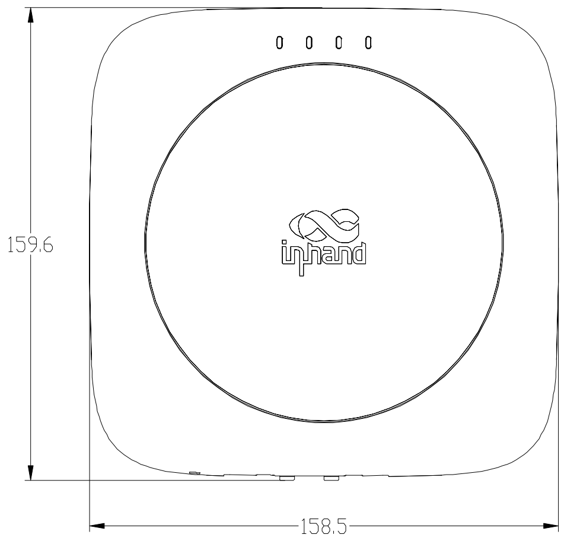
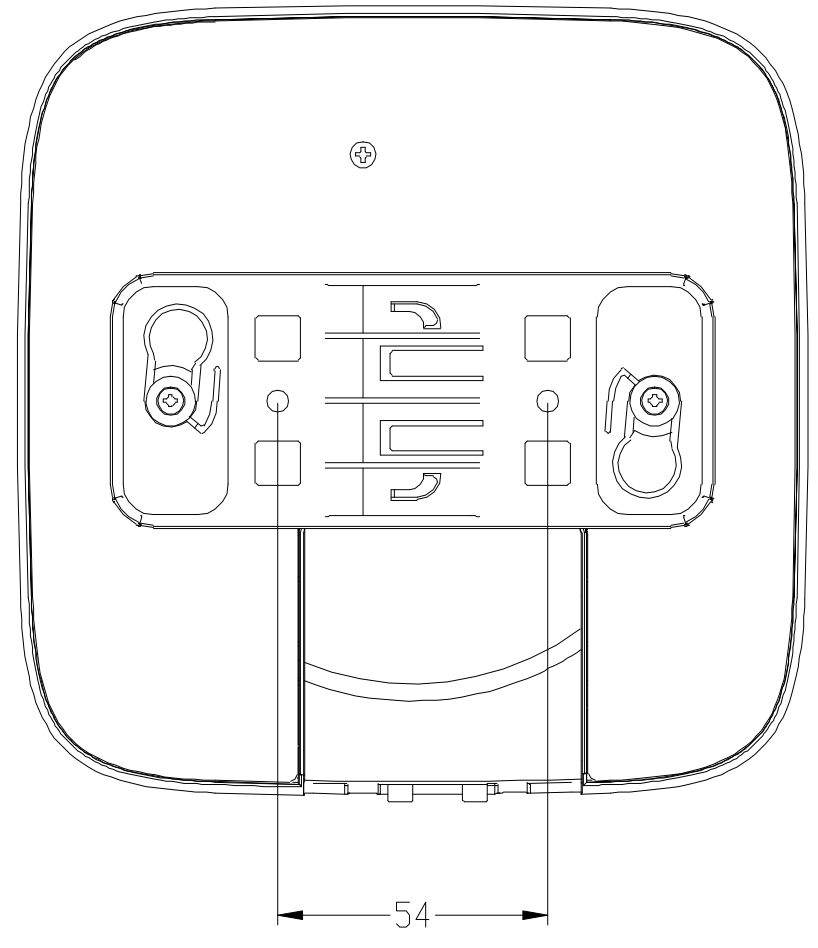

  

    

      
    

    

      Stay Ahead with Wi-Fi 6: Fast, Reliable, and Secure
    

  

  

    

      EAP600 Enterprise Access Point
    

    

      

        
· Wi-Fi 6

        
· High Performance

      

      

        
· Cloud-Managed

        
· Mesh Networking

      

    

  

# 1. Product Overview

**The EAP600 is a high-performance indoor dual-band Wi-Fi 6 Access Point (AP). With its powerful Wi-Fi 6 capability, it provides increased connection density, lower latency, enhanced coverage range, and stronger security for retail stores, hotels, enterprise offices, and various business scenarios. Combined with the InCloud Manager platform, it enables centralized management and monitoring of distributed EAP600 devices.**

**Features and Advantages:** 
- **Embrace New Network Experience with Wi-Fi 6:** Supports 802.11b/g/n/ac/ax standards with dual-frequency concurrency; 5GHz band up to 2.4Gbps, dual-band concurrent up to 2974Mbps; 8 SSIDs per band, high-density access
- **Fast Deployment, Flexible Mesh Networking:** Mesh networking for distributed self-organizing network, enhanced coverage and reliability
- **Perfect Security Strategy:** WPA-PSK/WPA/WPA2/WPA3 authentication, guest/business network isolation, MAC whitelist/blacklist filtering
- **Cloud-Managed:** InCloud Manager for centralized management and monitoring
- **Wide Application:** Retail stores, clothing stores, digital arcades, coffee shops, fast food restaurants

## Core Technical Specifications

| Technical Item | Specification |
| --- | --- |
| Cloud Management | InCloud Manager with centralized management, unified device access, zero-touch deployment, and batch upgrade management |
| Wi-Fi Performance | Wi-Fi 6 (802.11b/g/n/ac/ax), dual-band concurrent up to 2974 Mbps (2.4G 574 Mbps + 5G 2.4 Gbps) |
| SSID & Access Control | 8 SSIDs per band, guest/business network isolation, MAC blacklist/whitelist filtering |
| Visualization & O&M | Dashboard, topology*, client monitor, Wi-Fi experience, FAT-Routing/FAT-Bridge mode |
| Recommended Users | Up to 150 users |
| Memory & Storage | 512 MB RAM, 128 MB NAND Flash |
| Ethernet Interface | 1 × Gigabit Ethernet port, 1 × Reset button, 4 × LEDs (PWR/WAN/2.4G/5G) |
| Radio & Antenna | 2 × 2 MU-MIMO, 2 × built-in dual-frequency antenna, no Bluetooth |
| Power Supply | 12 V / 2 A DC, 802.3af PoE |
| Environment & Compliance | Operating 0 °C to +45 °C, storage -40 °C to +70 °C, 5%~95% RH, IP30, CE/IC/FCC |

# 2. Product Dimensions

  

    
    
Front View

  

  

    
    
Interface View

  

  

    
    
Side View

  

  

    
Note:

    
1. All dimensions are in millimeters (mm).

    
2. All dimensions are approximate, for reference only.

    
3. Dimensions shown shall not be used for production.

  

# 3. Hardware Specifications

| Category/Parameter | Specification |
| --- | --- |
| **Performance Metrics** | |
| RAM | 512 MB |
| Flash | 128 MB NAND |
| Recommended Users | ≤150 |
| **Interfaces** | |
| Ethernet | 1 × Gigabit Ethernet port |
| Button | 1 × Reset button |
| LED | 4 × LED (PWR/WAN/2.4GHz/5GHz) |
| Antenna | 2 × built-in dual-frequency antenna |
| Bluetooth | No |
| **Radio** | |
| Radio | 2 × 2 MU-MIMO, dual-band concurrent max 2974 Mbps |
| 2.4 GHz | 802.11b/g/n/ac/ax, max 574 Mbps |
| 5 GHz | 802.11a/n/ac/ax, max 2.4 Gbps |
| **Power** | |
| Power Supply | 12 V/2 A DC; 802.3af PoE |
| **Environment** | |
| Operating Temperature | 0 °C ~ +45 °C |
| Storage Temperature | -40 °C ~ +70 °C |
| Humidity | 5% ~ 95% |
| IP Level | IP30 |
| **Certification** | |
| Certification | CE, IC, FCC |

# 4. Software Specifications

| Category/Parameter | Specification |
| --- | --- |
| **Cloud Management** | |
| InCloud Manager | Centralized management, unified device access, zero-touch remote deployment, batch upgrade and management |
| **Network Features** | |
| Network Access | Static IP / DHCP |
| Standards | 802.11b/g/n/ac/ax (Wi-Fi 6) |
| SSID | 8 SSIDs per band |
| Mesh | Mesh networking supported |
| IP Protocol | IPv4/IPv6* |
| VLAN & IP | Custom Wi-Fi network IP address or VLAN ID |
| Radio Setting | Bandwidth and transmit power configuration |
| Guest Access | Visitor network for temporary users |
| Portal* | Radius, mobile phone, and Facebook portal authentication |
| **Security** | |
| Authentication | WPA-PSK, WPA/WPA2/WPA3 (WPA/Enterprise*) |
| Isolation | Guest network and business network isolation |
| Access Control | MAC whitelist/blacklist filtering |
| **Visualization** | |
| Dashboard | Device information, interface status, traffic statistics, client access, and alarms |
| Topology* | AP upstream/downstream topology connection status |
| Client Monitor | Client traffic and connection duration statistics |
| Wi-Fi Experience | Wi-Fi client quality analysis |
| **Mode** | |
| Work Mode | FAT-Routing Mode / FAT-Bridge Mode |

# 5. Ordering Information

## Product Models

| Model | Region | Specification |
| --- | --- | --- |
| EAP600-LITE | Global | Enterprise entry-level indoor Wi-Fi 6 AP, 2.4GHz/5GHz dual RF, max speed 2974 Mbps, 1 × Gigabit Ethernet port |

# 6. Contact Us

- **Website:** [InHand Networks](https://www.inhand.com.cn)
- **Copyright:** © InHand Networks. All rights reserved.
