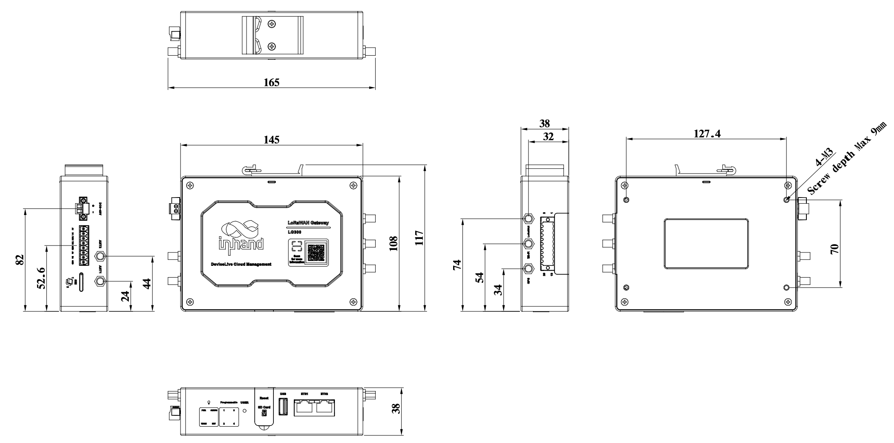
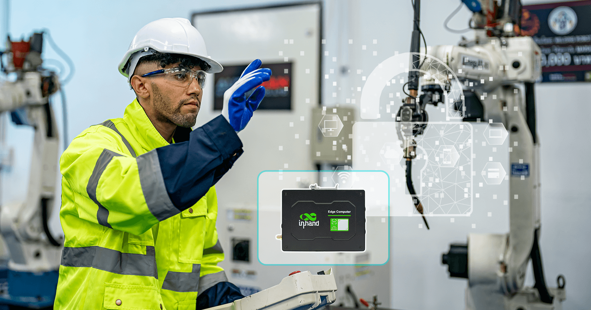

  

    

      
    

    

      Embrace LPWAN, Empower Industrial Digitalization
    

  

  

    

      EC312 LoRaWAN Gateway
    

    

      

        
· Multi-link

        
· LoRaWAN

      

      

        
· Programmable

        
· Cloud-managed

      

    

  

# 1. Product Overview

**EC312 is an industrial-grade LoRaWAN gateway designed for large-scale LPWAN deployments with secure, reliable, and cloud-manageable connectivity.**

**Key features:**
- **High-capacity LoRaWAN:** Semtech SX1302, up to 2,000 node access
- **Wide coverage:** Up to 15 km LOS / 2 km NLOS (deployment dependent)
- **Reliable communications:** Ethernet/cellular/Wi-Fi backup with dual SIM failover
- **Security architecture:** Secure Boot, TPM 2.0, TrustZone, firewall, VPN
- **Open edge platform:** Debian 11 + Docker + DeviceLive remote management

## Core Technical Specifications

| Technical Indicator | Specification |
|------|---------------|
| LoRaWAN Capability | SX1302, 8-channel half-duplex, up to 2,000 nodes |
| Cellular Access | LTE Cat1, APN/VPDN, CHAP/PAP |
| Network Features | ARP/Ethernet, static IP/DHCP, ICMP, DNS, TCP/UDP, static routing |
| Security | Multi-level user roles, firewall, OpenVPN, IPSec VPN |
| Open Platform | Debian 11 + Docker, cloud integration for AWS/Azure/AliCloud |
| Device Management | Web/Telnet/SSH, FOTA/DFOTA, local/remote logs, DeviceLive remote operations |
| Dimensions (W x D x H) | 145 x 106 x 36 mm |
| Weight | 339 g |
| Interfaces | 2xFE, 1xRS-232/485 + 1xRS-485, USB2.0 Type-A, Nano SIM x2 |
| Power Input | 9 to 48 V DC |
| Operating Temperature | -20 to 70 C |
| Protection and Certifications | IP30, CE/FCC/IC/PTCRB |

# 2. Product Dimensions

  

    
    
Front View

  

  

    
    
Interface Diagram

  

  

  

    
    
Side View

  
  
  

    
Note:

1. All dimensions are in millimeters (mm).

2. All dimensions are approximate and for reference only.

3. Dimensioned drawings are not intended for machining.

4. Dimensions are subject to part and manufacturing tolerances.

5. Specifications may change without prior notice.

  

# 3. Hardware Specifications

| Category/Parameter | Specification |
|--------------------------|------|
| **Hardware Platform** |  |
| CPU | ARM Cortex-A53 @ 1.4 GHz |
| RAM | 1 GB DDR4 |
| FLASH | 8 GB eMMC |
| **LoRaWAN Performance** |  |
| LoRaWAN Baseband Chip | Semtech SX1302 |
| Channel | 8, half-duplex |
| Frequency | RU864/IN865/EU868/US915/AU915/KR920/AS923/CN470 |
| Maximum EIRP | 27 dBm |
| Receiver Sensitivity | -140 dBm (125KHz/SF12) |
| Node Capacity | Up to 2,000 nodes |
| Communication Range | 2 km NLOS / 15 km LOS (depending on environment and antenna installation) |
| **Connectivity & Interfaces** |  |
| Ethernet Ports | 2 x 10/100 Mbps FE |
| Serial Ports | 1 x RS-232/485 + 1 x RS-485 (isolated) |
| SIM Card Holders | Nano SIM x2 |
| Antenna Connectors | LTE: SMA x1, Wi-Fi: SMA x1, GPS: SMA x1, LoRaWAN: SMA x1 (North American LTE model: SMA x2) |
| USB | USB 2.0 Type-A |
| Buttons | Pinhole reset button x1; programmable button x1 |
| TF Card | MicroSD support, up to 32GB expansion |
| LED Indicators | PWR, STATUS, WARN, NET, USER x4 |
| WiFi | Wi-Fi STA (802.11ac/a/b/g/n, 2.4/5 GHz) |
| Bluetooth | BLE 4.2 |
| GPS | Satellite location GPS, 1 x SMA |
| **Power & Power Consumption** |  |
| Power Input | 9 to 48 V DC |
| Power Interface | DC terminal input (industrial terminal block) |
| Power Failure Protection | Hold for 20 seconds after power failure (safe shutdown) |
| Power Failure Alarm | Power failure alarms when power failure happens |
| **Mechanical Specifications** |  |
| Product Dimensions | 145 x 106 x 36 mm |
| Product Weight | 339 g |
| Mounting Method | Panel mounting / DIN-rail mounting |
| Protection Rating | IP30 |
| Enclosure & Heat Dissipation | Metal + plastic enclosure, fanless design |
| RTC |  Support (button battery backup) |
| Hardware Watchdog | Supported |
| TPM | TPM 2.0 |
| **Environment & Certifications** |  |
| Storage Temperature | -40 to 85 ℃ |
| Operating Temperature | -20 to 70 ℃ |
| Environmental Humidity | 5 to 95% RH (non-condensing) |
| Physical Characteristics | IEC60068-2-27 shock resistance IEC60068-2-6 vibration resistance IEC60068-2-32 drop resistance |
| EMC Standard | EN61000-4-2, level 3, Static EN61000-4-3, level 3, Radiation Electric Field EN61000-4-4, level 3, Pulsed Electric Field EN61000-4-5, level 3, Surge EN61000-4-6, level 3, Conducted Distubance Immunity EN61000-4-8, Power Frequency Field Resistance, horizontal / vertical 400A/m (>level 2) EN61000-4-12,level 3,Shock Wave Resistance |
| Certifications | CE, FCC, IC, PTCRB |

# 4. Software Specifications

| Category/Parameter | Specification |
|--------------------------|------|
| **Operating System** |  |
| Operating System | Debian 11 (Kernel 5.10.168) |
| **LoRaWAN** |  |
| LoRaWAN LNS | Built-in LoRaWAN network server, compatible with The Things Stack and ChirpStack |
| LoRaWAN Protocol | LoRaWAN 1.0/1.0.2, Class A/B/C |
| **Network Features** |  |
| Network Type | LTE Cat1 |
| Network Access | APN, VPDN |
| Access Authentication | CHAP, PAP |
| WAN Protocols | Static IP, DHCP |
| LAN Protocols | ARP, Ethernet |
| IP Applications | ICMP, DNS, TCP/UDP, TCP Server, DHCP |
| IP Routing | Static routing |
| **Security** |  |
| Secure Boot | Supported |
| Trust Zone | TrustZone supported |
| Network Security | Firewall |
| Data Security |  OpenVPN, IPSec VPN |
| User Management | Multi-level user roles / management rights |
| **Reliability** |  |
| Link Detection | Heartbeat-based link detection with auto reconnect |
| Built-in Watchdog | Embedded watchdog |
| Dual SIM Switchover | Supported |
| **Open Platform & Data Acquisition Protocols (DSA)** |  |
| Secondary Development Environment | multi-programming language development platform |
| Access Cloud Platform | AWS, Azure, Ali and other cloud platforms |
| Docker | Supported |
| Industrial Protocols | Modbus RTU Master/Slave, Modbus TCP Master/Slave, EtherNet/IP, ISO on TCP, OPC UA Client/Server, Mitsubishi MC 3C/3E/3C Over TCP, Mitsubishi CPU Port, FINSUDP, HostLink, PPI, DLT645-2007, IEC104 Server |
| **Network Management** |  |
| Configuration Method | Web / Telnet / SSH |
| Upgrade Method | Web, FOTA, DFOTA |
| Log Functions | Support local system log, remote log, and important log power-off autosave |
| Configuration Backup | Import/export of configuration files |
| Remote Management | InHand DeviceLive or HTTP / HTTPS / Telnet / SSH |
| Platform Feature | Supports cloud-based parameter configuration, container management, application and firmware management |

# 5. Ordering Information

## Model Rule

**Model code:** EC312-H-\<WMNN\>-\<Lxxx\>

\<WMNN\>: Cellular Type & Module  
\<Lxxx\>: LoRaWAN regional band

## Model List

| Model | Region | \<WMNN\>: Cellular Type & Module | \<Lxxx\>: LoRaWAN Band |
|-------|--------|----------------------------------|-------------------------|
| EC312-H-FQ53-L868 | EMEA | CAT1 FDD: B1/B3/B7/B8/B20/B28 TDD: B38/B40/B41 GSM: B2/B3/B5/B8 | EU868 |
| EC312-H-FQ33-L915 | North America | CAT1 FDD: B2/B4/B5/B12/B13/B25/B26 WCDMA: B2/B4/B5 | US915/AS923 |
| EC312-H-FQ53-L915 | EMEA | CAT1 FDD: B1/B3/B7/B8/B20/B28 TDD: B38/B40/B41 GSM: B2/B3/B5/B8 | US915/AS923 |
| EC312-H-LQA3-L470 | China | CAT1 LTE-FDD: B1/B3/B5/B8 LTE-TDD: B34/B38/B39/B40/B41 | CN470 |

# 6. Contact Us

- **Website:** [InHand Networks](https://www.inhand.com)
- **Copyright:** © InHand Networks. All rights reserved.
