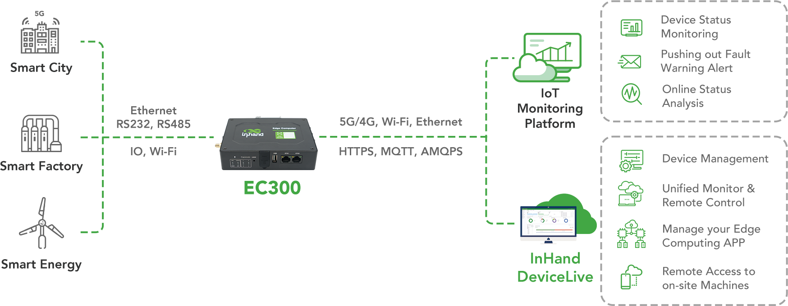

  

    

      
    

    

      Embrace edge computing, Empower Industrial Digitalization
    

  

  

    

      EC312 Series Secure Edge Computer
    

    

      

        
· IEC62443 Certified

        
· Standard Linux OS

      

      

        
· Cloud Management

        
· Rich Interfaces

      

    

  

# 1. Product Overview

**EC312 is a secure industrial edge computer designed for lightweight edge applications with reliable connectivity, flexible expansion, and cloud-native operations.**

**Key features:**
- **Industrial security:** IEC62443 certified, Secure Boot, TPM2.0, TrustZone
- **Reliable connectivity:** Ethernet/cellular/Wi-Fi backup with dual SIM failover
- **Flexible expansion:** Supports CAN, DIO, analog input, and extra serial options
- **Open software stack:** Debian 11 and Yocto options, Docker-ready platform
- **Remote operations:** DeviceLive for remote monitoring and app/container management

## Core Technical Specifications

| Technical Indicator | Specification |
|------|---------------|
| Cellular Network | LTE Cat1 / Cat6 (model-dependent) |
| Network Features | APN, VPDN, CHAP/PAP, ARP, DHCP, ICMP, DNS, TCP/UDP, static routing |
| Security | IEC62443 certification, Secure Boot, TrustZone, firewall |
| Cloud Management | DeviceLive, HTTP/HTTPS/SSH remote management |
| Data Acquisition | Modbus RTU/TCP, EtherNet/IP, OPC UA, DNP3.0, BACnet, CNC |
| Open Platform | Debian 11 / Yocto, Docker-ready, multi-language development |
| CPU | ARM Cortex-A53 @1.4GHz |
| Memory / Storage | 1GB DDR4 / 8GB eMMC |
| Interfaces | 2×FE, 1×RS-232/485 + 1×RS-485, USB2.0 Type-A, Nano SIM×2, MicroSD |
| Power Input | 9~48V DC (max 6W) |
| Dimensions (W × D × H) | 145 × 106 × 36 mm |
| Protection Rating | IP30 |

# 2. Product Dimensions

  

    
    
Front View

  

  

    
    
Interface Diagram

  

  

  

    
    
Side View

  
  
  

    
Note:

1. All dimensions are in millimeters (mm).

2. All dimensions are approximate and for reference only.

3. Dimensioned drawings are not intended for machining.

4. Dimensions are subject to part and manufacturing tolerances.

5. Specifications may change without prior notice.

  

# 3. Hardware Specifications

| Category/Parameter | Specification |
|--------------------------|------|
| **Hardware Platform** |  |
| CPU | ARM Cortex-A53 @1.4GHz |
| RAM | 1GB DDR4 |
| FLASH | 8GB eMMC |
| **Connectivity & Interfaces** |  |
| Ethernet Ports | 2x 10/100Mbps Ethernet port |
| Serial Ports | 1×RS-232/485 + 1×RS-485 (isolated) |
| CAN | Up to 2×CAN FD (isolated, via expansion module) |
| SIM Card Holders | Nano SIM×2 |
| Antenna Connectors | LTE: SMA×1, Wi-Fi: SMA×1, GPS: SMA×1, LoRa: SMA×1 (North America models: 2×SMA 4G antenna connectors) |
| USB | USB2.0 Type-A |
| TF | MicroSD (up to 32GB) |
| Buttons | Pinhole reset button ×1; programmable button ×1 |
| WiFi(Optional) | Wi-Fi STA/AP (802.11ac/a/b/g/n, 2.4/5GHz) |
| Bluetooth(Optional) | BLE4.2 |
| GPS(Optional) |  Satellite location GPS |
| Expansion Interfaces | Up to 2×RS-232/485/analog input/CAN FD, isolation  up to 4×DI + 4×DO, isolation |
| **Power & Power Consumption** |  |
| Input Voltage | 9~48V DC |
| Power Interface | DC terminal input |
| Maximum Value (Full Load) | Max 6W |
| Power Failure Protection | Hold for 20 seconds after power failure (safe shutdown) |
| Power Failure Alarm | Power failure alarms when power failure happens |
| **Mechanical Specifications** |  |
| Product Dimensions | 145×106×36mm |
| Product Weight | 339g |
| Mounting Method | Panel / DIN-rail mounting |
| Protection Rating | IP30 |
| Enclosure & Heat Dissipation | Metal + plastic enclosure, fanless industrial design |
| RTC | RTC backup supported |
| Hardware Watchdog | Supported |
| TPM(optional) | TPM2.0 |
| LED Indicators | PWR, STATUS, WARN, NET, USER ×4 |
| **Environment & Certifications** |  |
| Storage Temperature | -40~85℃ |
| Operating Temperature | -20~70℃ |
| Environmental Humidity | 5~95% RH (non-condensing) |
| Physical Characteristics | IEC60068-2-27 shock resistance IEC60068-2-6 vibration resistance IEC60068-2-32 drop resistance |
| EMC Standard | EN61000-4-2, level 3, Static EN61000-4-3, level 3, Radiation Electric Field EN61000-4-4, level 3, Pulsed Electric Field EN61000-4-5, level 3, Surge EN61000-4-6, level 3, Conducted Distubance Immunity EN61000-4-8, Power Frequency Field Resistance, horizontal / vertical 400A/m (>level 2) EN61000-4-12,level 3,Shock Wave Resistance |
| Certifications | CE, FCC, IC, PTCRB, UL, Verizon, AT&T, T-Mobile, IEC62443-4-2 |

# 4. Software Specifications

| Category/Parameter | Specification |
|--------------------------|------|
| **Operating System** |  |
| Operating System | Debian 11 (Kernel 5.10.168) / Yocto |
| **Network Features** |  |
| Network Type | LTE Cat1 / LTE Cat6 (North America region), Ethernet |
| Network Access | APN, VPDN |
| Access Authentication | CHAP/PAP |
| WAN Protocols | Static IP, DHCP |
| LAN Protocols | ARP, Ethernet |
| IP Applications | ICMP, DNS, TCP/UDP, TCP Server, DHCP |
| IP Routing | Static routing |
| **Security** |  |
| Secure Boot | Supported |
| Trust Zone | Supported |
| User Management | Multi-level management rights |
| Network Security | Firewall |
| Data Security | VPN |
| Other Technologies | IEC62443 security architecture |
| **Reliability** |  |
| Link Detection | Sends heartbeat packets to detect, auto redials when disconnected |
| Built-in Watchdog | Embedded watchdog |
| Dual SIM Switchover | Supported |
| **Open platform & Data Acquisition Protocols (DSA)** |  |
| Secondary Development Environment | Multi-language development environment |
| Access Cloud Platform | AWS, Azure, Ali and other cloud platforms |
| Docker | Supported |
| Industrial Protocols | Modbus RTU Master/Slave, Modbus TCP Master/Slave, EtherNet/IP, ISO on TCP, OPC UA Client/Server, Mitsubishi MC 3C/3E/3C Over TCP, Mitsubishi CPU Port, FINSUDP, HostLink, PPI |
| Power Protocols | DLT645-2007, IEC101/104, DNP3.0 |
| Other Protocols | BACnet, CNC |
| **Network Management** |  |
| Configuration Method | Web / SSH |
| Upgrade Method | Web / FOTA / DFOTA |
| Log Functions | Local and remote logs with important log power-off preservation |
| Configuration Backup | Import/export configuration |
| Remote Management | DeviceLive / HTTP / HTTPS / SSH |
| DeviceLive Cloud | supports cloud-based parameter configuration, container management, application and firmware management |

# 5. Ordering Information

## Model Rule

**Model code:** EC312-\<B/H\>-\<WMNN\>-[XXXX]-[X]

\<B/H\>: GPS/Wi-Fi/BT/TPM support (B=No, H=Yes)  
\<WMNN\>: Cellular Type & Module  
[XXXX]: Extension module option (optional)  
[X]: Operating system option (optional)

## Base Models

| Model | \<B/H\> | Region | \<WMNN\>: Cellular Type & Module | Memory/Flash | Ethernet/Serial |
|------|---------|--------|----------------------------------|--------------|-----------------|
| EC312-B-LQA3 | NO | China | Cat1, FDD: B1/B3/B5/B8, TDD: B34/B38/B39/B40/B41 | 1GB/8GB | 2×10/100M, 1×RS232/485 + 1×RS485 |
| EC312-H-LQA3 | YES | China | Cat1, FDD: B1/B3/B5/B8, TDD: B34/B38/B39/B40/B41 | 1GB/8GB | 2×10/100M, 1×RS232/485 + 1×RS485 |
| EC312-B-FQ53 | NO | EMEA & APAC | Cat1, FDD: B1/B3/B7/B8/B20/B28, TDD: B38/B40/B41, GSM: B2/B3/B5/B8 | 1GB/8GB | 2×10/100M, 1×RS232/485 + 1×RS485 |
| EC312-H-FQ53 | YES | EMEA & APAC | Cat1, FDD: B1/B3/B7/B8/B20/B28, TDD: B38/B40/B41, GSM: B2/B3/B5/B8 | 1GB/8GB | 2×10/100M, 1×RS232/485 + 1×RS485 |
| EC312-H-FQ33 | YES | North America | Cat1, FDD: B2/B4/B5/B12/B13/B25/B26, WCDMA: B2/B4/B5 | 1GB/8GB | 2×10/100M, 1×RS232/485 + 1×RS485 |
| EC312-H-FQ39 | YES | North America | Cat6, FDD: B2/B4/B5/B7/B12/B13/B14/B17/B25/B26/B29/B30/B66/B71, TDD: B41/B48 | 1GB/8GB | 2×10/100M, 1×RS232/485 + 1×RS485 |
| EC312-H-FQ73 | YES | Australia & Latin America | Cat1, FDD: B1/B2/B3/B4/B5/B7/B8/B28/B66, TDD: B38/B40/B41, GSM: B2/B3/B5/B8 | 1GB/8GB | 2×10/100M, 1×RS232/485 + 1×RS485 |
| EC312-H-EN00 | YES (GNSS not supported) | No Cellular | No cellular | 1GB/8GB | 2×10/100M, 1×RS232/485 + 1×RS485 |

## Extension Module (Optional)

| [XXXX] P/N Code | Feature |
|-----------------|---------|
| NAAD | 2×4-20mA analog input + 4×DI + 4×DO |
| N44C | 2×RS-485 + 1×CAN FD |
| N4CC | 1×RS-485 + 2×CAN FD |
| N44D | 2×RS-485 + 4×DI + 4×DO |
| — | NONE |

## Operating System (Optional)

| [X] P/N Code | Feature |
|--------------|---------|
| — | IEOS (default) |
| D | Debian Linux OS |

# 6. Contact Us

- **Website:** [InHand Networks](https://www.inhand.com)
- **Copyright:** © InHand Networks. All rights reserved.
