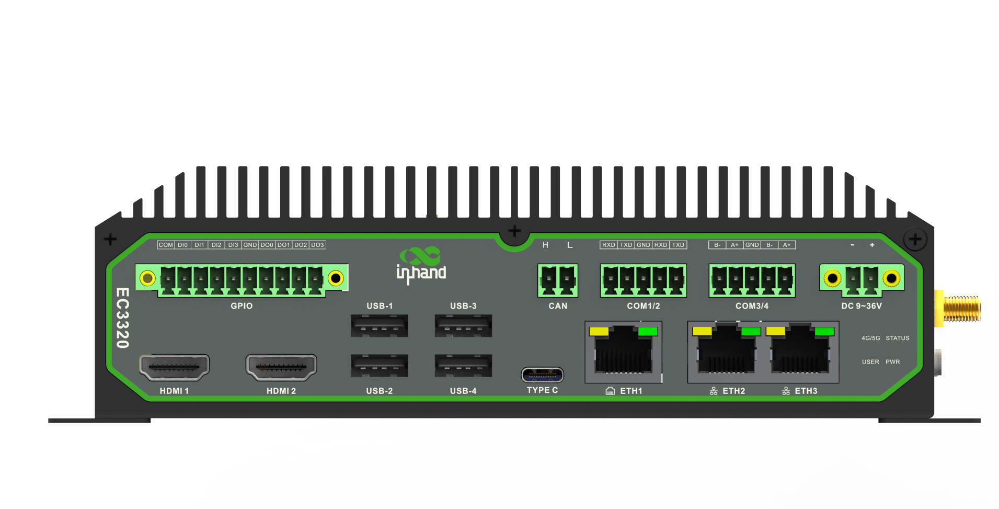

  

    

      
    

    

      Embrace Edge AI, Empower Industrial Digitalization
    

  

  

    

      EC3320 Series AI Edge Computer
    

    

      

        
· Strong Computing

        
· High Security

      

      

        
· High Reliability

        
· Cloud-Managed

      

    

  

# 1. Product Overview

**EC3320 is a high-performance AI edge computer built for industrial local computing, real-time decision-making, and secure cloud-connected operations.**

**Key features:**
- **High computing capability:** RK3588-based platform with multi-core CPU, high-performance GPU, and up to 6 TOPS NPU
- **Scalable AI acceleration:** Supports Hailo-8 module expansion up to 26 TOPS
- **Rich industrial interfaces:** 3×GE, serial, CAN, DI/DO, HDMI, USB3.0, audio I/O
- **Secure and reliable:** Secure Boot, TPM2.0 (Optional), watchdog, dual SIM failover
- **Cloud-managed operations:** DeviceLive remote monitoring and edge app/container management

## Core Technical Specifications

| Technical Indicator | Specification |
|------|---------------|
| Cellular Network | 5G NR / 4G Cat6 (model-dependent) |
| Network Features | Dual SIM backup, multi-level link detection, auto-redial |
| Security (TPM2.0 Optional) | Secure Boot, TPM2.0 |
| Cloud Management | DeviceLive, HTTP/HTTPS/SSH remote management |
| Data Acquisition | Modbus RTU/TCP, EtherNet/IP, OPC UA, DNP3.0, BACnet, CNC |
| Open Platform | Linux with edge app/container management |
| CPU | 4×Cortex-A76 + 4×Cortex-A55, up to 2.4GHz |
| GPU | Mali-G610 MC4 |
| NPU | Up to 6 TOPS (INT8), Hailo expansion up to 26 TOPS |
| Memory / Storage | 8GB / 64GB eMMC |
| Interfaces | 3×GE, 2×RS232 + 2×RS485, CAN, DI/DO, USB3.0, HDMI, MIC/SPK |
| Power Input | 9~36V DC |

# 2. Product Dimensions

  

    
    
Front View

  

  

    
    
Side View

  

    

    
    
Interface Diagram

  

  

    
Note:

1. All dimensions are in millimeters (mm).

2. All dimensions are approximate and for reference only.

3. Dimensioned drawings are not intended for machining.

4. Dimensions are subject to part and manufacturing tolerances.

5. Specifications may change without prior notice.

  

# 3. Hardware Specifications

| Category/Parameter | Specification |
|--------------------------|------|
| **Hardware Platform** |  |
| CPU | Quad Cortex-A76 + Quad Cortex-A55, up to 2.4GHz |
| GPU |  Quad-core Mali-G610 MC4 high-performance GPU |
| NPU | Up to 6 TOPS (INT8) Support INT4/INT8/lNT16 mixed operations and framework switching of TensorFlow / MXNet / PyTorch / Caffe |
| RAM | 8GB |
| FLASH | 64GB eMMC |
| **Connectivity & Interfaces** |  |
| Ethernet Ports | 3×10/100/1000Mbps GE |
| I/O Ports |  10pin industrial green terminal (4IN, 4OUT, 2GND) |
| Serial Ports | 2×RS232 + 2×RS485, industrial terminal |
| CAN | 1×CAN2.0 |
| Buttons | 1×Power, 1×Reset |
| SIM Card Holders | 2×Nano SIM |
| LED Indicators | Power, Status, 4G, USER |
| USB | 4×USB3.0 |
| Expansion Interfaces | 1x M.2(Supports SATA3.0 SSD, supports 2242 size) 1x M.2(Supports Hailo-8 M.2 module, up to 26TOPs computing power) |
| HDMI | 2×HDMI2.0 |
| MIC | Supported |
| SPK | Supported |
| WiFi | STA, 802.11ac/a/b/g/n, 2.4G/5G dual band |
| Bluetooth | BLE5.0 |
| GPS | Supported (requires cellular module support) |
| **Power & Power Consumption** |  |
| Input Voltage | 9~36V DC (2pin green industrial terminal, with flange) |
| Power Interface | Industrial DC terminal input |
| **Mechanical Specifications** |  |
| Product Dimensions | 180×136×54mm |
| Mounting Method | DIN-rail / wall mounting |
| Protection Rating | IP40 |
| Enclosure & Heat Dissipation | Metal enclosure, fanless design |
| TPM (Optional) | TPM2.0 |
| **Environment & Certifications** |  |
| Storage Temperature | -40~85℃ |
| Operating Temperature | -20~60℃ |
| Environmental Humidity | 5~95% RH (non-condensing) |
| Physical Characteristics | IEC60068-2-27 shock resistance IEC60068-2-6 vibration resistance IEC60068-2-32 drop resistance |
| EMC Standard | EN61000-4-2, level 3, Static EN61000-4-3, level 3, Radiation Electric Field EN61000-4-4, level 3, Pulsed Electric Field EN61000-4-5, level 3, Surge EN61000-4-6, level 3, Conducted Disturbance Immunity EN61000-4-8, Power Frequency Field Resistance, horizontal / vertical 400A/m (>level 2) EN61000-4-12, level 3, Shock Wave Resistance |

# 4. Software Specifications

| Category/Parameter | Specification |
|--------------------------|------|
| **Operating System** |  |
| Operating System | Linux |
| **Network Features** |  |
| Network Access | 5G NR / LTE Cat6 (model-dependent), Ethernet |
| **Security** |  |
| Secure Boot | Supported |
| **Reliability** |  |
| Link Detection | Multi-level link detection with auto-redial |
| Built-in Watchdog | Embedded watchdog |
| Dual SIM Switchover | Supported |
| **Data Acquisition Protocols (DSA)** |  |
| Industrial Protocols | Modbus RTU Master/Slave, Modbus TCP Master/Slave, EtherNet/IP, ISO on TCP, OPC UA Client/Server, Mitsubishi MC 3C/3E/3C OverTCP, Mitsubishi CPU Port, FINSUDP, HostLink, PPI |
| Electricity Protocols | DLT645-2007, IEC101/104, DNP3.0 |
| Other Protocols | BACnet, CNC |
| **Network Management** |  |
| Upgrade Method | Supports patent upgrade mechanism, local or remote firmware upgrade |
| Log Functions | Local/remote logs |
| Remote Management | DeviceLive / HTTP / HTTPS / SSH remote management |
| DeviceLive Cloud | Supports cloud-based parameter configuration, container management, application and firmware management|

# 5. Ordering Information

## Model Rule

**Model code:** EC3320-\<WMNN\>-[XY]

\<WMNN\>: Cellular Type & Frequency Band  
[XY] (Optional): AI Expansion Module

## Model List

| Model | Region | \<WMNN\>: Cellular Band | Memory/Storage | Ethernet/Serial | Wi-Fi/BT/CAN/MIC/SPK/IO | GPS |
|------|--------|-------------------------------------------|----------------|-----------------|----------------------------|-----|
| EC3320-NRQ3 | Global | 5G NR NSA/SA: n1/n2/n3/n5/n7/n8/n12/n20/n25/n28/n38/n40/n41/n48/n66/n71/n77/n78/n79 LTE FDD: B1/B2/B3/B5/B7/B8/B12(B17)/B13/B14/B18/B19/B20/B25/B26/B28/B29/B30/B32/B66/B71 LTE TDD: B34/B38/B39/B40/B41/B42/B48 LAA: B46 WCDMA: B1/B2/B3/B4/B5/B6/B8/B19 | 8GB/64GB | 3×1000Mbps; 2×RS232 + 2×RS485 | YES | YES |
| EC3320-FQ09 | Global | 4G CAT6 LTE FDD: B1/B2/B3/B4/B5/B7/B8/B12/B13/B14/B17/B18/B19/B20/B25/B26/B28/B29/B30/B32/B66/B71 LTE TDD: B34/B38/B39/B40/B41/B42/B43/B46(LAA)/B48(CBRS) | 8GB/64GB | 3×1000Mbps; 2×RS232 + 2×RS485 | YES | YES |
| EC3320-EN00 | No Cellular | No Cellular | 8GB/64GB | 3×1000Mbps; 2×RS232 + 2×RS485 | YES | NO |

## AI Expansion Module (Optional)

| [XY] P/N Code | Feature |
|---------------|---------|
| — | None |
| H8 | Hailo-8, M.2 Key B+M 2280 |

# 6. Contact Us

- **Website:** [InHand Networks](https://www.inhand.com)
- **Copyright:** © InHand Networks. All rights reserved.
