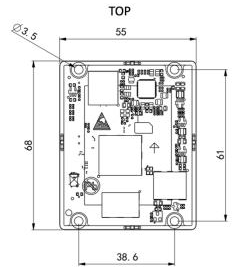

  

    

      
    

    

      Embrace Edge AI, Empower Industrial Digitalization
    

  

  

    

      EC3576-C AI System on Module
    

    

      

        
· RK3576J ARM SoC

        
· 4×A72+4×A53

      

      

        
· 6TOPS NPU

        
· 8K Video Codec

      

    

  

# 1. Product Overview

**EC3576-C system on module is powered by the Rockchip RK3576 processor, tailored for AIoT and industrial markets.**

**Product Features:**
- **High-Performance CPU:** 8nm octa-core, 4×A72+4×A53 @ 2.3 GHz
- **Powerful AI NPU:** 6.0 TOPS INT8, multi-format support
- **Advanced Graphics:** Mali-G52 MC3, 8K codec, triple display
- **Rich Interfaces:** PCIe, USB 3.2, CAN-FD, GMAC, MIPI
- **Industrial Grade:** -40 °C ~ +85 °C, ultra-thin connector

## Core Technical Specifications

| Technical Indicator | Specification |
|---|---|
| OS | Android 14 |
| Industrial Protocol | Modbus RTU/TCP, EtherNet/IP, OPC UA, Mitsubishi MC |
| Remote Management | InHand DeviceLive, HTTPS, SSH |
| AI | 6.0 TOPS INT8 NPU |
| Video Codec | 8K@30 fps decode, 4K@60 fps encode |
| Cloud Platform | Cloud parameter config, container management, firmware management |
| CPU | 4×A72 @ 2.3 GHz + 4×A53 @ 2.2 GHz |
| Memory / Storage | 8 GB LPDDR4 / 256 GB UFS |
| Display Interface | HDMI/eDP/DSI/DP, triple independent display |
| Connectivity | 2×GMAC, USB 3.2, CAN-FD, MIPI-CSI×5, UART×12 |
| Dimensions (W × D × H) | 55 × 68 × 3 mm |
| Operating Temperature | -40 °C ~ +85 °C |

# 2. Product Dimensions

  

    
    
Front View

  

  

    
    
Side View

  

  

    
    
Bottom View

  

  

    
Note:

1. All dimensions are in millimeters (mm).

2. All dimensions are approximate and for reference only.

3. Dimensioned drawings are not intended for machining.

4. Dimensions are subject to part and manufacturing tolerances.

5. Specifications may change without prior notice.

  

# 3. Hardware Specifications

| Category/Parameter | Specification |
|--------------------------|------|
| **Hardware Platform** | |
| CPU | 4 × ARM Cortex-A72 @ 2.3 GHz + 4 × ARM Cortex-A53 @ 2.2 GHz |
| NPU | 6.0 TOPS INT8, supports INT4/INT8/INT16/FP16/BF16/TF32 |
| GPU | ARM Mali-G52 MC3 |
| VPU | Hard Encode: H.264, H.265, 4K@60 fps; Hard Decode: H.264, H.265, VP9, AV1, AVS2, 8K@30 fps or 4K@120 fps |
| RAM | 8 GB LPDDR4 |
| ROM | 256 GB UFS |
| **Display Interface** | |
| HDMI/eDP TX | 1 × HDMI v2.1 / eDP v1.3 (muxed), up to 4K@120 Hz; Supports CEC, ARC, HDCP v2.3/v1.4; eDP supports up to 3 displays with different content |
| MIPI DSI | 1 × MIPI DSI-2 TX, D-PHY v2.0 (4 lanes) or C-PHY v1.1 (3 trios), up to 2560 × 1600@60 Hz |
| Parallel | 1 × Parallel RGB/BT.656/BT.1120, up to 1920 × 1080@60 Hz |
| EBC | 1 × E-ink EPD, 2560 × 1920 hard decoding, 16-bit data bus, up to 32-level grayscale |
| DP TX | 1 × USB/DP combo, DisplayPort v1.4, up to 4K@120 Hz, supports MST, USB Type-C with DP Alt, HDCP v2.3/v1.3 |
| **Camera Interface** | |
| MIPI-CSI | 5 × CSI-2; 4 × 2-lane D-PHY v1.2 (2.5 Gbps/lane, combinable to 2 × 4-lane); 1 × 4-lane D-PHY v2.0 (4.5 Gbps/lane) or 3 C-PHY trios; Supports up to 5 cameras working together |
| DVP | 1 × 8/10/12/16-bit standard DVP, up to 150 MHz data input; Supports BT.601/BT.656/BT.1120 |
| **Audio** | |
| SAI | ≤5; SAI 0/1 support 4 TX lanes + 4 RX lanes; SAI 2/3/4 support 1 TX lane + 1 RX lane; Supports I2S/TDM/PCM mode, sampling rate up to 192 kHz, 16~32 bits |
| Digital Audio Codec | 1; Supports 2 × DAC, 3 blending modes each; Supports I2S/PCM master/slave mode, 16-bit sampling rate; Supports volume control |
| **Connectivity** | |
| Ethernet | ≤2 × GMAC, pinout by RGMII/RMII, 10/100/1000 Mbps |
| SDIO | ≤2, SDIO v3.0, 4-bit |
| USB 3.2 | 2 (1 × Type-C supports DP Alt mode; 1 × combo high speed interface) |
| USB 2.0 OTG | 2 |
| UART | ≤12, 64-bit FIFO for TX/RX; Supports 5/6/7/8-bit serial transceiving, up to 4 Mbps; All 12 UARTs support flow control and RS485 |
| CAN-FD | ≤2, compliant with CAN and CAN-FD; Supports standard and extended frames; 8192-bit FIFO |
| SPI | ≤5, master and slave mode, each supports two chip selections |
| I2C | ≤9, 7-bit and 10-bit address modes; Standard mode 100 kbps, HS mode 400 kbps |
| PWM | ≤16, supports interrupt operation, capturing mode |
| **Power** | |
| Input Power | DC 5V |
| **Mechanical** | |
| Dimensions (W × D × H) | 55 × 68 × 3 mm |
| Package | Board-to-board connector (4 × 100-pin, 0.4 mm pitch, combined height 1.5 mm) |
| Mounting Holes | 4 × φ3.5 mm |
| **Environment** | |
| Operating Temperature | -40 °C ~ +85 °C |

# 4. Software Specifications

| Category/Parameter | Specification |
|--------------------------|------|
| **Operating System** | |
| OS | Android 14 |
| OS Flashing Method | USB OTG |
| **Data Acquisition Protocol (DSA)** | |
| Industrial Protocol | Modbus RTU Master/Slave, Modbus TCP Master/Slave, EtherNet/IP, ISO on TCP, OPC UA Client/Server, Mitsubishi MC 3C/3E/3C OverTCP, Mitsubishi CPU Port, FINS UDP, Host Link, PPI |
| Electricity Protocol | DLT645-2007, IEC101/104, DNP3.0 |
| Other Protocol | BACnet, CNC |
| **Maintenance and Management** | |
| Upgrade Method | Supports patent upgrade mechanism, local or remote firmware upgrade |
| Log | Supports local system logs, remote logs, important log power-off preservation |
| Remote Management | InHand DeviceLive, HTTP, HTTPS, SSH, etc. |
| DeviceLive Cloud | Supports cloud-based parameter configuration, container management, application and firmware management |

# 5. Ordering Information

## Model Code

**Model code:** EC3576-C

## Product Model

| Model | CPU | CPU Clock Speed | RAM | ROM | Operating Temperature |
|---|---|---|---|---|---|
| EC3576-C | 4 × A72 + 4 × A53 | A7 @ 2.3 GHz, A53 @ 2.2 GHz | 8 GB | 256 GB | -40 °C ~ +85 °C |

# 6. Contact Us

- **Website:** [InHand Networks](https://www.inhand.com)
- **Copyright:** © InHand Networks. All rights reserved.
