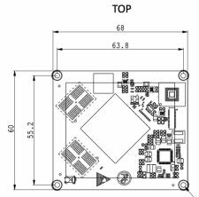
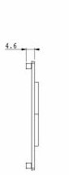
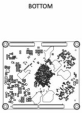

  

    

      
    

    

      Embrace Edge AI, Empower Industrial Digitalization
    

  

  

    

      EC3588-C AI System on Module
    

    

      

        
· RK3588 ARM SoC

        
· 4×A76+4×A55

      

      

        
· 6TOPS NPU

        
· 8K Video Codec

      

    

  

# 1. Product Overview

**EC3588-C system on module is developed based on the Rockchip RK3588 flagship ARM SoC, delivering powerful performance for high-end embedded applications.**

**Product Features:**
- **High-Performance CPU:** 8nm octa-core, 4×A76+4×A55 @ 2.4 GHz
- **Powerful AI NPU:** 6.0 TOPS triple-core, multi-format acceleration
- **Advanced Graphics:** Mali-G610 MP4, 8K@60fps codec, quad-screen output
- **Rich Interfaces:** PCIe 3.0, USB 3.1, SATA, GMAC, MIPI-CSI/DSI
- **High-End Media:** HDMI RX/TX, DP TX, multi-camera support

## Core Technical Specification

| Technical Indicator | Specification |
|---|---|
| OS | Linux |
| Industrial Protocol | Modbus RTU/TCP, EtherNet/IP, OPC UA, Mitsubishi MC |
| Remote Management | InHand DeviceLive, HTTPS, SSH |
| AI | 6.0 TOPS NPU |
| Video Codec | 8K@60 fps decode, 8K@30 fps encode |
| Cloud Platform | Cloud parameter config, container management, firmware management |
| CPU | 4×A76 @ 2.4 GHz + 4×A55 @ 1.8 GHz |
| Memory / Storage | 16 GB LPDDR4 / 64 GB eMMC |
| Display Interface | HDMI/eDP TX, DP TX, MIPI DSI, quad independent display |
| Connectivity | 2×GMAC, USB 3.1, PCIe 3.0, SATA, MIPI-CSI |
| Dimensions (W × D × H) | 68 × 60 × 4.6 mm |
| Operating Temperature | 0 °C ~ +80 °C |

# 2. Product Dimensions

  

    
    
Front View

  

  

    
    
Side View

  

  

    
    
Bottom View

  

  

    
Note:

1. All dimensions are in millimeters (mm).

2. All dimensions are approximate and for reference only.

3. Dimensioned drawings are not intended for machining.

4. Dimensions are subject to part and manufacturing tolerances.

5. Specifications may change without prior notice.

  

# 3. Hardware Specifications

| Category/Parameter | Specification |
|--------------------------|------|
| **Hardware Platform** | |
| CPU | 4 × ARM Cortex-A76 @ 2.4 GHz + 4 × ARM Cortex-A55 @ 1.8 GHz |
| NPU | 6.0 TOPS, triple core, supports int4/int8/int16/FP16/BF16/TF32 acceleration |
| GPU | ARM Mali-G610 MP4, OpenGLES 1.1/2.0/3.2, OpenCL 2.2, Vulkan 1.2 |
| VPU | Decode: H.265/VP9 up to 8K@60 fps, H.264 up to 8K@30 fps, AV1 up to 4K@60 fps; Encode: H.265/HEVC, H.264/AVC up to 8K@30 fps |
| RAM | 16 GB LPDDR4 |
| ROM | 64 GB eMMC |
| **Video Input** | |
| MIPI DCPHY | 2; Supports DPHY or CPHY; 4-lane MIPI DPHY V2.0 (4.5 Gbps/lane); 3-lane MIPI CPHY V1.1 (2.5 Gsps/lane); Supports multiple MIPI-CSI combos |
| MIPI CSI DPHY | 4; 2-lane MIPI DPHY V1.2 (2.5 Gsps/lane); Two 2-lane can be combined to 4-lane |
| DVP | 1; 8/10/12/16-bit standard DVP up to 150 MHz; Supports BT.601/BT.656/BT.1120 |
| HDMI RX | 1; Supports HDMI 2.0 (3.4 ~ 6 Gbps) and HDMI 1.4b (250Mbps ~ 3.4 Gbps); HDCP2.3 and HDCP1.4 |
| **Video Output** | |
| HDMI/eDP TX | ≤2; HDMI up to 7680 × 4320@60 Hz (3/6/8/10/12 Gbps), HDCP2.3; eDP up to 4K@60 Hz (1.62/2.7/5.4 Gbps), HDCP1.3 |
| DP TX | 2; DP TX 1.4a, available for USB3.1 Gen 1, supports 1/2/4 lanes; Up to 8192 × 4320@30 Hz; HDCP2.3, HDCP1.3 |
| MIPI DSI | 2; MIPI DPHY 2.0 or CPHY 1.1, up to 4K@60 Hz; Dual MIPI-DSI left/right mode, RGB/YUV up to 10-bit |
| BT.1120 | 1; RGB up to 8-bit up to 150 MHz; Up to 1920 × 1080@60 Hz |
| **Audio** | |
| I2S | ≤4; I2S0/I2S1: 8 lanes, TX/RX, 16-32 bits, up to 192 kHz; I2S2/I2S3: 2 lanes, TX/RX, 16~32 bits, up to 192 kHz |
| SPDIF | 2; 2× 16-bit data storing; Biphasic stereo output |
| PDM | 2; Up to 8 channels, 16~24 bits, up to 192 kHz; PDM primary receive mode |
| DSM PWM | 1; Convert PCM to bitstream digital 1-bit output |
| **Connectivity** | |
| Ethernet | 2 × GMAC by RGMII/RMII, 10/100/1000 Mbps |
| USB 3.1 Gen 1 | 3; Up to 5 Gbps; 2 × USB3.1 OTG (multiplexed with DP TX, supports USB Type-C and DP Alt); 1 × USB3.1 Host (multiplexed with PIPE PHY2) |
| USB 2.0 Host | 2 |
| PCIe 3.0 | 2; Supports RC and EP, up to 8 Gbps; Combinations: 1×4, 2×2, 4×1, 1×2+2×1 |
| PCIe 2.0 | ≤3; Each supports 1 lane, up to 5 Gbps |
| SATA | ≤3; 3 × SATA3.0 controllers, multiplexed by PCIe and USB_HOST2; Supports eSATA up to 6 Gbps |
| UART | ≤10; 2 × 64-bit FIFO for TX/RX; 5/6/7/8-bit serial, up to 4 Mbps; All 10 UARTs support auto flow control |
| SPI | ≤5; Each controller supports two chip select outputs; Master and slave mode configurable |
| I2C | ≤9; 7-bit and 10-bit address modes; Standard mode up to 100 kbps, high-speed mode up to 400 kbps |
| PWM | ≤16; Supports capturing mode |
| ADC | ≤8; 8 × 12-bit single-end input SAR-ADC, up to 1 MS/s |
| **Power** | |
| Input Power | DC 4V |
| **Mechanical** | |
| Dimensions (W × D × H) | 68 × 60 × 4.6 mm |
| Package | Board-to-board connector (4 × 100-pin, 0.4 mm pitch, combined height 1.5 mm) |
| Mounting Holes | 4 × φ2.5 mm |
| **Environment** | |
| Operating Temperature | 0 °C ~ +80 °C |

# 4. Software Specifications

| Category/Parameter | Specification |
|--------------------------|------|
| **Operating System** | |
| OS | Linux |
| OS Flashing Method | USB OTG |
| **Data Acquisition Protocol (DSA)** | |
| Industrial Protocol | Modbus RTU Master/Slave, Modbus TCP Master/Slave, EtherNet/IP, ISO on TCP, OPC UA Client/Server, Mitsubishi MC 3C/3E/3C OverTCP, Mitsubishi CPU Port, FINS UDP, Host Link, PPI |
| Electricity Protocol | DLT645-2007, IEC101/104, DNP3.0 |
| Other Protocol | BACnet, CNC |
| **Maintenance and Management** | |
| Upgrade Method | Supports patent upgrade mechanism, local or remote firmware upgrade |
| Log | Supports local system logs, remote logs, important log power-off preservation |
| Remote Management | InHand DeviceLive, HTTP, HTTPS, SSH, etc. |
| DeviceLive Cloud | Supports cloud-based parameter configuration, container management, application and firmware management |

# 5. Ordering Information

## Model Code

**Model code:** EC3588-C

## Product Model

| Model | CPU | CPU Clock Speed | RAM | ROM | Operating Temperature |
|---|---|---|---|---|---|
| EC3588-C | 4 × A76 + 4 × A55 | A76 @ 2.4 GHz, A55 @ 1.8 GHz | 16 GB | 64 GB | 0 °C ~ +80 °C |

# 6. Contact Us

- **Website:** [InHand Networks](https://www.inhand.com)
- **Copyright:** © InHand Networks. All rights reserved.
