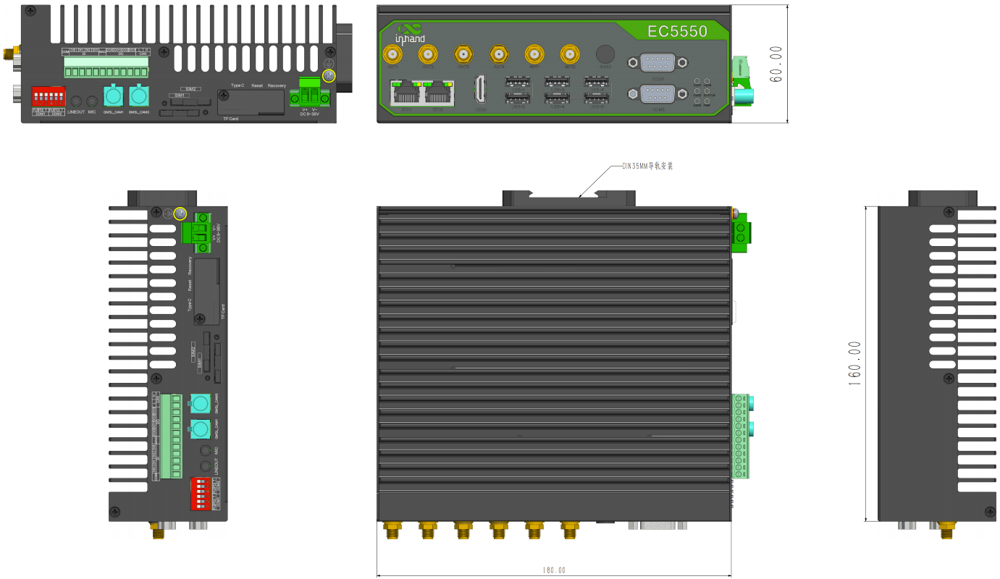
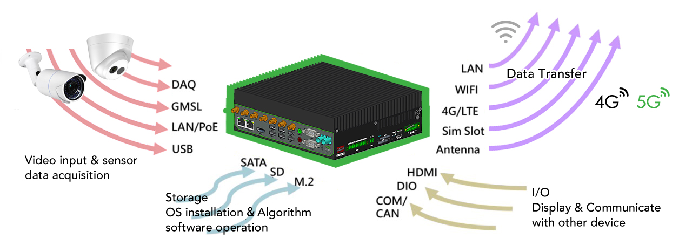

  

    

      
    

    

      Embrace Edge AI, Empower Industrial Digitalization
    

  

  

    

      EC5000 Series AI Edge Computer
    

    

      

        
· NVIDIA Jetson Orin Nano/NX

        
· High Security

      

      

        
· High Reliability

        
· Cloud-Managed

      

    

  

# 1. Product Overview

**EC5000 is a scalable AI edge computer with NVIDIA Jetson modules, built for industrial vision, real-time inference, and secure edge-cloud operations.**

**Key features:**
- **NVIDIA AI platform:** Supports Jetson Orin Nano 8GB and Orin NX 16GB modules
- **Rich industrial interfaces:** 2×GE, 2×serial, 6×USB3.2, HDMI, DI/DO, CAN FD, audio, GMSL2
- **Flexible expansion:** M.2 B/E/M key slots, dual SIM, Micro SD, NVMe storage
- **Reliable operation:** Fanless metal design, watchdog, link self-healing, wide-voltage input
- **Cloud-native operations:** DeviceLive remote management and DSA data integration

## Core Technical Specifications

| Technical Indicator | Specification |
|------|---------------|
| Cellular Network | 5G NR / LTE Cat6 (model-dependent) |
| Network Features | Dual SIM backup, multi-level link detection, auto-redial |
| Security | TPM2.0, Secure Boot |
| Cloud Management | DeviceLive cloud parameter, container, app, and firmware lifecycle management |
| Data Acquisition | Modbus RTU/TCP, EtherNet/IP, OPC UA, DNP3.0, IEC 61850-MMS, BACnet, CNC |
| Open Platform | Linux (JetPack 5.1 and above) |
| AI Module | Jetson Orin Nano 8GB / Orin NX 16GB |
| AI Performance | Up to 40 TOPS (EC5350) / 100 TOPS (EC5550) |
| Interfaces | 2×GE, 2×RS-232/485/422, DI/DO, CAN FD, USB3.2, HDMI, audio, GMSL2 |
| Storage | Built-in 128GB NVMe, Micro SD support |
| Power Input | 9~36V DC, polarity reversal protection |
| Protection Rating | IP30 |

# 2. Product Dimensions

  

    
    
Front View

  

  

    
    
Side View

  

  

    
    
Interface Diagram

  

  

    
Note:

1. All dimensions are in millimeters (mm).

2. All dimensions are approximate and for reference only.

3. Dimensioned drawings are not intended for machining.

4. Dimensions are subject to part and manufacturing tolerances.

5. Specifications may change without prior notice.

  

# 3. Hardware Specifications

| Category/Parameter | Specification |
|--------------------------|------|
| **Hardware Platform** |  |
| CPU | EC5350:  ARM Cortex-A78AE, 6 cores, TDP up to 15 W, 1.5 GHz;  EC5550: ARM Cortex-A78AE CPU, 8 cores, TDP up to 25 W, 2 GHz |
| GPU | 1024-core NVIDIA Ampere GPU with 32 Tensor Cores |
| NPU | AI acceleration up to 40 TOPS (EC5350) / 100 TOPS (EC5550) |
| RAM | 8GB (EC5350) / 16GB (EC5550) |
| FLASH |  1 x M.2 NVMe M-Key 2280 (128GB built-in) |
| **Connectivity & Interfaces** |  |
| Ethernet Ports | 2×10/100/1000Mbps, PoE PSE 15W per port |
| I/O Ports | 4×DI + 4×DO |
| Serial Ports | 2×RS-232/RS-485/RS-422 (DB9) |
| CAN | 1×CAN FD |
| Buttons | 1×Recovery Button, 1×Reset Button |
| SIM Card Holders | 2×standard SIM |
| LED Indicators | 1×Power, 1×Status, 4×User |
| USB | 6×USB3.2 Gen2 + 1×OTG Type-C |
| TF (Micro SD) | Micro SD support |
| MIC | 3.5 mm microphone audio jack |
| Audio | 3.5 mm type line-out |
| GMSL | 2-channel GMSL2.0 (FAKRA) |
| Expansion Interfaces | 1×M.2 B-Key (LTE/5G)  1×M.2 E-Key (Wi-Fi/BT) M.2 NVMe M-Key 2280 |
| HDMI | 1×HDMI2.0 (up to 3840×2160@60Hz) |
| WiFi | 802.11b/g/n/ac (RTL8822CE-CG) |
| Bluetooth | BLE5.0 |
| GPS | Supported (cellular module required) |
| **Power & Power Consumption** |  |
| Input Voltage | DC 9~36V |
| Power Interface | DC input with polarity reversal protection |
| Typical Value (OS Idle State) | 10W |
| Maximum Value (Full Load) | 60W |
| **Mechanical Specifications** |  |
| Product Dimensions | 180×160×60 mm |
| Mounting Method (Wall-mount Optional) | DIN-rail (default) / wall-mount |
| Protection Rating | IP30 |
| Enclosure & Heat Dissipation | Metal housing, fanless design |
| TPM | TPM2.0 |
| **Environment & Certifications** |  |
| Storage Temperature | -40~85℃ |
| Operating Temperature | -20~60℃ |
| Environmental Humidity | 5~95% RH (non-condensing) |
| Physical Characteristics | IEC60068-2-27 shock resistance IEC60068-2-6 vibration resistance IEC60068-2-32 drop resistance |
| EMC Standard | EN61000-4-2, level 3, Static EN61000-4-3, level 3, Radiation Electric Field EN61000-4-4, level 3, Pulsed Electric Field EN61000-4-5, level 3, Surge EN61000-4-6, level 3, Conducted Disturbance Immunity EN61000-4-8, Power Frequency Field Resistance, horizontal / vertical 400A/m (>level 2) EN61000-4-12, level 3, Shock Wave Resistance |

# 4. Software Specifications

| Category/Parameter | Specification |
|--------------------------|------|
| **Operating System** |  |
| Operating System | Linux (JetPack 5.1 and above) |
| **Network Features** |  |
| Network Access | 5G or LTE Cat6 (model-dependent), Ethernet |
| Network Standards | 5G, LTE Cat6 (different models for different networks) |
| **Security** |  |
| Secure Boot | Supported |
| **Reliability** |  |
| Link Detection | Multi-level link detection with auto-redial |
| Built-in Watchdog | Embedded watchdog self-recovery |
| Dual SIM Switchover | Supported |
| **Data Acquisition Protocols (DSA)** |  |
| Industrial Protocols | Modbus RTU Master/Slave, Modbus TCP Master/Slave, EtherNet/IP, ISO on TCP, OPC UA Client/Server, Mitsubishi MC 3C/3E/3C OverTCP, Mitsubishi CPU Port, FINSUDP, HostLink, PPI |
| Power Protocols | DLT645-2007, IEC101/104, DNP3.0, IEC 61850-MMS |
| Other Protocols | BACnet, CNC |
| **Network Management** |  |
| Upgrade Method | Supports patent upgrade mechanism, local or remote firmware upgrade |
| Log Functions | Local/remote logs with power-off preservation |
| Remote Management | DeviceLive / HTTP / HTTPS / SSH remote management |
| DeviceLive Cloud | Supports cloud-based parameter configuration, container management, application and firmware management |

# 5. Ordering Information

## Model Rule

**Model code:** EC5\<350/550\>-\<WMNN\>

\<350/550\>: NVIDIA module level (350=Orin Nano 8GB, 550=Orin NX 16GB)  
\<WMNN\>: Cellular Type & Frequency Band

## Model List

| Model | Region | NVIDIA Module | \<WMNN\>: Cellular Band | Memory/Storage | Ethernet/Serial | GPS |
|------|--------|---------------|------------------------------------|----------------|-----------------|-----|
| EC5550-NRQ3 | Global | Orin NX 16GB | 5G NR NSA/SA: n1/n2/n3/n5/n7/n8/n12/n20/n25/n28/n38/n40/n41/n48/n66/n71/n77/n78/n79 LTE FDD: B1/B2/B3/B5/B7/B8/B12(B17)/B13/B14/B18/B19/B20/B25/B26/B28/B29/B30/B32/B66/B71 LTE TDD: B34/B38/B39/B40/B41/B42/B48 LAA: B46 WCDMA: B1/B2/B3/B4/B5/B6/B8/B19 | 16GB/128GB | 2×1000Mbps; 2×RS232/RS485/RS422 configurable | YES |
| EC5350-NRQ3 | Global | Orin Nano 8GB | 5G NR NSA/SA: n1/n2/n3/n5/n7/n8/n12/n20/n25/n28/n38/n40/n41/n48/n66/n71/n77/n78/n79 LTE FDD: B1/B2/B3/B5/B7/B8/B12(B17)/B13/B14/B18/B19/B20/B25/B26/B28/B29/B30/B32/B66/B71 LTE TDD: B34/B38/B39/B40/B41/B42/B48 LAA: B46 WCDMA: B1/B2/B3/B4/B5/B6/B8/B19 | 8GB/128GB | 2×1000Mbps; 2×RS232/RS485/RS422 configurable | YES |
| EC5550-FQ09 | Global | Orin NX 16GB | 4G CAT6 LTE FDD: B1/B2/B3/B4/B5/B7/B8/B12/B13/B14/B17/B18/B19/B20/B25/B26/B28/B29/B30/B32/B66/B71 LTE TDD: B34/B38/B39/B40/B41/B42/B43/B46(LAA)/B48(CBRS) | 16GB/128GB | 2×1000Mbps; 2×RS232/RS485/RS422 configurable | YES |
| EC5350-FQ09 | Global | Orin Nano 8GB | 4G CAT6 LTE FDD: B1/B2/B3/B4/B5/B7/B8/B12/B13/B14/B17/B18/B19/B20/B25/B26/B28/B29/B30/B32/B66/B71 LTE TDD: B34/B38/B39/B40/B41/B42/B43/B46(LAA)/B48(CBRS) | 8GB/128GB | 2×1000Mbps; 2×RS232/RS485/RS422 configurable | YES |
| EC5550-EN00 | No Cellular | Orin NX 16GB | No Cellular | 16GB/128GB | 2×1000Mbps; 2×RS232/RS485/RS422 configurable | NO |
| EC5350-EN00 | No Cellular | Orin Nano 8GB | No Cellular | 8GB/128GB | 2×1000Mbps; 2×RS232/RS485/RS422 configurable | NO |

# 6. Contact Us

- **Website:** [InHand Networks](https://www.inhand.com)
- **Copyright:** © InHand Networks. All rights reserved.
