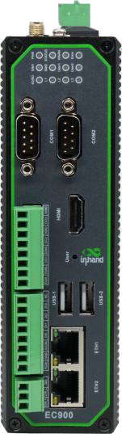

  

    

      
    

    

      Embrace Edge AI, Empower Industrial Digitalization
    

  

  

    

      EC942 Lite AI Edge Computer
    

    

      

        
· Strong Computing

        
· High Security

      

      

        
· High Reliability

        
· Cloud-Managed

      

    

  

# 1. Product Overview

**EC942 is a lightweight AI-accelerated industrial edge computer for data acquisition, edge processing, and cloud operations in IIoT scenarios.**

**Key features:**
- **Performance platform:** Quad-core Cortex-A55@2.0GHz with Mali-G52 and RKNN
- **Industrial security:** Secure Boot, TPM2.0, TrustZone, firewall and VPN
- **Rich interfaces:** Gigabit Ethernet, serial, CAN, USB, HDMI, mSATA, DI/DO
- **Reliable networking:** 5G/4G/Wi-Fi/GbE backup, dual SIM failover, watchdog
- **Cloud operations:** DeviceLive remote monitoring and edge app/container management

## Core Technical Specifications

| Technical Indicator | Specification |
|------|---------------|
| Cellular Network | 5G SA/NSA or LTE Cat4/Cat6 (model-dependent) |
| Network Features | APN/VPDN, CHAP/PAP, ARP/Ethernet, static IP/DHCP |
| Security (TPM2.0 Optional) | Secure Boot, TPM2.0, firewall, VPN |
| Cloud Management | DeviceLive, HTTP/HTTPS/SSH remote management |
| Data Acquisition | Modbus RTU/TCP, EtherNet/IP, OPC UA, DNP3.0, BACnet, CNC |
| Open Platform | Yocto/Linux and Debian 10, Debian package manager |
| CPU/GPU | Quad-core Cortex-A55@2.0GHz / Mali-G52 2EE |
| RAM/Storage | 4GB / 16GB eMMC |
| Interfaces | 2×GE, 2×RS-232/485/422, USB2.0, HDMI2.0, mSATA, MicroSD |
| Power Input | DC 12~48V (8W) |
| Dimensions (W × D × H) | 47.3 × 162.7 × 148.3 mm |
| Protection Rating | IP30 |

# 2. Product Dimensions

  

    
    
Front View

  

  

    
    
Side View

  

  

    
    
Interface Diagram

  

  

    
Note:

1. All dimensions are in millimeters (mm).

2. All dimensions are approximate and for reference only.

3. Dimensioned drawings are not intended for machining.

4. Dimensions are subject to part and manufacturing tolerances.

5. Specifications may change without prior notice.

  

  

# 3. Hardware Specifications

| Category/Parameter | Specification |
|--------------------------|------|
| **Hardware Platform** |  |
| CPU | Quad-core Cortex-A55@ 2.0GHz |
| GPU | Mali-G52 2EE |
| NPU | RKNN AI acceleration engine |
| RAM | 4GB |
| FLASH | 16GB eMMC |
| **Connectivity & Interfaces** |  |
| Ethernet Ports | 2×10/100/1000Mbps GE |
| I/O Ports (Optional) | 4×DI + 4×DO |
| Serial Ports | 2×RS-232/485/422 (DB9) |
| CAN (Optional) | CAN2.0A/B |
| Buttons | Pinhole reset button |
| SIM Card Holders | 2×MicroSIM |
| LED Indicators | 4G/5G, Signal Strength (L1, L2, L3), SIM1, SIM2, User1, User2, PWR, STATUS, WARN, ERR |
| USB | USB2.0 (2×Type-A + 1×Type-C) |
| TF | Supports MicroSD cards up to 32GB (recommended maximum 
capacity) |
| Expansion Interfaces |  1x mSATA, supports mSATA SSD |
| HDMI | HDMI2.0 |
| WiFi (Optional) |  STA, 802.11ac/a/b/g/n, 2.4G/5G dual band |
| Bluetooth (Optional) | BLE4.2 |
| GPS (Optional) | GPS/Beidou/GLONASS |
| **Power & Power Consumption** |  |
| Input Voltage | DC 12~48V |
| Power Interface | DC terminal input |
| Maximum Value (Full Load) | 8W |
| **Mechanical Specifications** |  |
| Product Dimensions | 47.3×162.7×148.3mm |
| Product Weight | 810g |
| Mounting Method | DIN-rail / wall mounting |
| Protection Rating | IP30 |
| Enclosure & Heat Dissipation | Metal housing, fanless design |
| TPM (Optional) | TPM2.0 |
| **Environment & Certifications** |  |
| Storage Temperature | -40~85℃ |
| Operating Temperature | -20~70℃ |
| Environmental Humidity | 5~95% RH (non-condensing) |
| Physical Characteristics | IEC60068-2-27 shock resistance IEC60068-2-6 vibration resistance IEC60068-2-32 drop resistance |
| EMC Standard | EN61000-4-2, level 3, Static EN61000-4-3, level 3, Radiation Electric Field EN61000-4-4, level 3, Pulsed Electric Field EN61000-4-5, level 3, Surge EN61000-4-6, level 3, Conducted Disturbance Immunity EN61000-4-8, Power Frequency Field Resistance, horizontal / vertical 400A/m (>level 2) EN61000-4-12, level 3, Shock Wave Resistance |
| Certifications | CE, FCC, PTCRB, Verizon, AT&T, T-Mobile |

# 4. Software Specifications

| Category/Parameter | Specification |
|--------------------------|------|
| **Operating System** |  |
| Operating System | Yocto/Linux, Debian 10 (Kernel 4.19) |
| File System | Debian core root filesystem |
| Package Manager | Debian package manager |
| **Network Features** |  |
| Network Access | 5G / LTE Cat4 / LTE Cat6 (model-dependent), Ethernet |
| Access Authentication | APN, VPDN, CHAP/PAP |
| WAN Protocols | static IP, DHCP |
| LAN Protocols | ARP, Ethernet  |
| **Security** |  |
| Secure Boot | Supported |
| Trust Zone | Supported |
| **Reliability** |  |
| Link Detection | Multi-level link detection and auto-redial |
| Built-in Watchdog | Embedded watchdog |
| Backup Mechanism | Dual SIM backup |
| Dual SIM Switchover | Supported |
| **Data Acquisition Protocols (DSA)** |  |
| Industrial Protocols | Modbus RTU Master/Slave, Modbus TCP Master/Slave, EtherNet/IP, ISO on TCP, OPC UA, Mitsubishi family, FINSUDP, HostLink, PPI |
| Electricity Protocols | DLT645-2007, IEC101/104, DNP3.0 |
| Other Protocols | BACnet, CNC |
| **Network Management** |  |
| Upgrade Method | Local/remote firmware upgrade |
| Log Functions | Local/remote logs with power-off persistence |
| Remote Management | DeviceLive / HTTP / HTTPS / SSH remote management |
| DeviceLive Cloud | Supports cloud-based parameter configuration, container management, application and firmware management |

# 5. Ordering Information

## Model Rule

**Model code:** EC942-\<B/H\>-\<WMNN\>-B-[X]

\<B/H\>: Hardware option — **B** = without Wi-Fi/GPS/CAN/TPM & I/O · **H** = with Wi-Fi/GPS/CAN/TPM & I/O  
\<WMNN\>: Cellular Type & Frequency Band  
[X]: OS option (Optional)

## Model List

<table style="width:100%; table-layout:fixed;">
  <colgroup>
    <col style="width:27%;">
    <col style="width:21%;">
    <col style="width:52%;">
  </colgroup>
  <tr><th>Model</th><th>Region</th><th>Cellular Type & Frequency Band</th></tr>
  <tr><td>EC942-B-LQA8-B</td><td>China</td><td>LTE CAT4 LTE-FDD B1/B3/B5/B8; LTE-TDD B34/B38/B39/B40/B41; WCDMA B1/B8; TD-SCDMA B34/B39; CDMA BC0; GSM 900/1800MHz</td></tr>
  <tr><td>EC942-H-LQA8-B</td><td>China</td><td>LTE CAT4 LTE-FDD B1/B3/B5/B8; LTE-TDD B34/B38/B39/B40/B41; WCDMA B1/B8; TD-SCDMA B34/B39; CDMA BC0; GSM 900/1800MHz</td></tr>
  <tr><td>EC942-B-NRQ1-B</td><td>China</td><td>5G NR NSA n78/n79; SA n1/n3/n5/n8/n28/n41/n77/n78/n79; LTE-FDD B1/B3/B5/B8; LTE-TDD B34/B38/B39/B40/B41; WCDMA B1/B8</td></tr>
  <tr><td>EC942-H-NRQ1-B</td><td>China</td><td>5G NR NSA n78/n79; SA n1/n3/n5/n8/n28/n41/n77/n78/n79; LTE-FDD B1/B3/B5/B8; LTE-TDD B34/B38/B39/B40/B41; WCDMA B1/B8</td></tr>
  <tr><td>EC942-B-NRQ3-B</td><td>Global (excluding China)</td><td>5G NR NSA/SA n1/n2/n3/n5/n7/n8/n12/n20/n25/n28/n38/n40/n41/n48/n66/n71/n77/n78/n79; LTE FDD B1/B2/B3/B5/B7/B8/B12(B17)/B13/B14/B18/B19/B20/B25/B26/B28/B29/B30/B32/B66/B71; LTE TDD B34/B38/B39/B40/B41/B42/B48; LAA B46; WCDMA B1/B2/B3/B4/B5/B6/B8/B19</td></tr>
  <tr><td>EC942-H-NRQ3-B</td><td>Global (excluding China)</td><td>5G NR NSA/SA n1/n2/n3/n5/n7/n8/n12/n20/n25/n28/n38/n40/n41/n48/n66/n71/n77/n78/n79; LTE FDD B1/B2/B3/B5/B7/B8/B12(B17)/B13/B14/B18/B19/B20/B25/B26/B28/B29/B30/B32/B66/B71; LTE TDD B34/B38/B39/B40/B41/B42/B48; LAA B46; WCDMA B1/B2/B3/B4/B5/B6/B8/B19</td></tr>
  <tr><td>EC942-B-FQ58-B</td><td>EMEA</td><td>LTE CAT4 LTE-FDD B1/B3/B7/B8/B20/B28A; LTE-TDD B38/B40/B41; WCDMA B1/B8; GSM B3/B8</td></tr>
  <tr><td>EC942-H-FQ58-B</td><td>EMEA</td><td>LTE CAT4 LTE-FDD B1/B3/B7/B8/B20/B28A; LTE-TDD B38/B40/B41; WCDMA B1/B8; GSM B3/B8</td></tr>
  <tr><td>EC942-B-FQ38-B</td><td>North America</td><td>LTE CAT4 LTE-FDD B2/B4/B5/B12/B13/B14/B66/B71; WCDMA B2/B4/B5</td></tr>
  <tr><td>EC942-H-FQ38-B</td><td>North America</td><td>LTE CAT4 LTE-FDD B2/B4/B5/B12/B13/B14/B66/B71; WCDMA B2/B4/B5</td></tr>
  <tr><td>EC942-B-FQ78-B</td><td>Australia & Latin America</td><td>LTE CAT4 LTE-FDD B1/B2/B3/B4/B5/B7/B8/B28; LTE-TDD B40; UMTS B1/B2/B5/B8; EDGE/GPRS/GSM 850/900/1800/1900MHz</td></tr>
  <tr><td>EC942-H-FQ78-B</td><td>Australia & Latin America</td><td>LTE CAT4 LTE-FDD B1/B2/B3/B4/B5/B7/B8/B28; LTE-TDD B40; UMTS B1/B2/B5/B8; EDGE/GPRS/GSM 850/900/1800/1900MHz</td></tr>
  <tr><td>EC942-B-EN00-B</td><td>Global</td><td>No Cellular</td></tr>
  <tr><td>EC942-H-EN00-B</td><td>Global</td><td>No Cellular</td></tr>
</table>

## OS Option (Optional)

| [X] P/N Code | Feature |
|--------------|---------|
| — | IEOS (default) |
| D | Debian Linux OS |

# 6. Contact Us

- **Website:** [InHand Networks](https://www.inhand.com)
- **Copyright:** © InHand Networks. All rights reserved.
