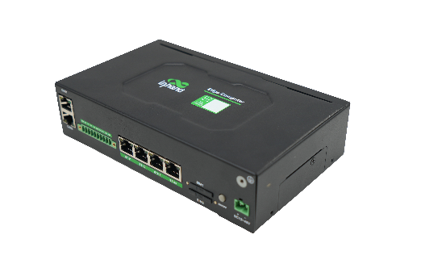
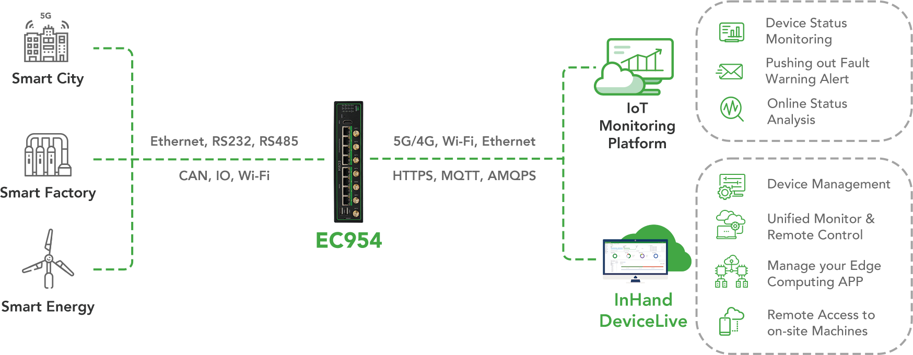

  

    

      
    

    

      Embrace Edge AI, Empower Industrial Digitalization
    

  

  

    

      EC954 Series High-Performance AI Edge Computer
    

    

      

        
· Scalable AI Power

        
· High Security

      

      

        
· Rich Interfaces

        
· Cloud-Managed

      

    

  

# 1. Product Overview

**EC954 is a high-performance multi-interface edge AI computer designed for industrial scenarios requiring edge intelligence, high reliability, and secure cloud integration.**

**Key features:**
- **Scalable AI performance:** RKNN 1.0 TOPS, expandable up to 26 TOPS with Hailo-8 module
- **Rich industrial interfaces:** 4×GE, 12 serial channels, CAN, DI/DO, HDMI, USB, mSATA
- **Reliable connectivity:** Wired/cellular/Wi-Fi backup with dual SIM failover
- **Security architecture:** Secure Boot, TPM2.0, TrustZone, firewall, VPN
- **Cloud operations:** DeviceLive remote monitoring and edge app/container management

## Core Technical Specifications

| Technical Indicator | Specification |
|------|---------------|
| Cellular Network | LTE Cat4 / 5G (model-dependent) |
| Network Features | APN/VPDN, CHAP/PAP, ARP/Ethernet, static IP/DHCP |
| Security | Secure Boot, TPM2.0, TrustZone, firewall, VPN |
| Cloud Management | DeviceLive, HTTP/HTTPS/SSH remote management |
| Data Acquisition | Modbus RTU/TCP, EtherNet/IP, OPC UA, DNP3.0, BACnet, CNC |
| Open Platform | Yocto/Linux with Debian 11 core root filesystem |
| CPU/GPU | Quad-core Cortex-A55 @ 2.0GHz / Mali-G52 2EE |
| NPU | RKNN 1.0 TOPS (up to 26 TOPS with Hailo-8) |
| Memory/Storage | 4GB / 16GB eMMC |
| Interfaces | 4×GE, 4×RS232/485/422 + 8×RS485, CAN, DI/DO, USB, HDMI, mSATA |
| Power Input | DC 12~48V (4W typical / 8W max) |
| Dimensions (W × D × H) | 203 × 122 × 49 mm |

# 2. Product Dimensions

  

    
    
Front View

  

  

    
    
Side View

  

  

    
    
Interface Diagram

  

  

    
Note:

1. All dimensions are in millimeters (mm).

2. All dimensions are approximate and for reference only.

3. Dimensioned drawings are not intended for machining.

4. Dimensions are subject to part and manufacturing tolerances.

5. Specifications may change without prior notice.

  

# 3. Hardware Specifications

| Category/Parameter | Specification |
|--------------------------|------|
| **Hardware Platform** |  |
| CPU | Quad-core Cortex-A55 @ 2.0GHz |
| GPU | Mali-G52 2EE |
| NPU | RKNN 1.0 TOPS (up to 26 TOPS with Hailo-8 module) |
| RAM | 4GB |
| FLASH | 16GB eMMC |
| **Connectivity & Interfaces** |  |
| Ethernet Ports | 4×10/100/1000Mbps GE |
| I/O Ports | 4×DI + 4×DO |
| Serial Ports | 4×RS232/485/422 + 8×RS485 |
| CAN | 2×CAN2.0A/B |
| Buttons | Pinhole reset button |
| SIM Card Holders | Dual SIM |
| LED Indicators | 4G, SignalStrength (L1, L2, L3), SIM1, SIM2, User1, User2, PWR, STATUS, WARN, ERR |
| USB | USB2.0 (2×Type-A + 1×Type-C) |
| TF | Supports Micro SD |
| Expansion Interfaces | 1×mSATA, B-Key 3042 (Hailo AI module) |
| HDMI | HDMI2.0 |
| WiFi | STA, 802.11ac/a/b/g/n, 2.4G/5G dual band |
| Bluetooth | BLE 5.0 |
| GPS | GPS/Beidou/GLONASS |
| **Power & Power Consumption** |  |
| Input Voltage | DC 12~48V |
| Power Interface | DC terminal input |
| Typical Value (OS Idle State) | 4W |
| Maximum Value (Full Load) | 8W |
| **Mechanical Specifications** |  |
| Product Dimensions | 203×122×49mm |
| Mounting Method | DIN-rail / wall mounting |
| Protection Rating | IP30 |
| Enclosure & Heat Dissipation | Metal housing, fanless design |
| TPM | TPM 2.0 |
| **Environment & Certifications** |  |
| Storage Temperature | -40~85℃ |
| Operating Temperature | -20~70℃ |
| Environmental Humidity | 5~95% RH (non-condensing) |
| Physical Characteristics | IEC60068-2-27 shock resistance IEC60068-2-6 vibration resistance IEC60068-2-32 drop resistance |
| EMC Standard | EN61000-4-2, level 3, Static EN61000-4-3, level 3, Radiation Electric Field EN61000-4-4, level 3, Pulsed Electric Field EN61000-4-5, level 3, Surge EN61000-4-6, level 3, Conducted Disturbance Immunity EN61000-4-12, level 3, Shock Wave Resistance |
| Certifications | CE, FCC, PTCRB, Verizon, AT&T |

# 4. Software Specifications

| Category/Parameter | Specification |
|--------------------------|------|
| **Operating System** |  |
| Operating System | Yocto/Linux (Debian 11, Kernel 5.10) |
| File System | Debian core root filesystem |
| Package Manager | Debian package manager |
| **Network Features** |  |
| Network Tpye | LTE Cat4 (5G by model) |
| Network Access | APN, VPDN |
| Access Authentication | CHAP/PAP |
| WAN Protocols | Static IP, DHCP |
| LAN Protocols | ARP, Ethernet |
| **Security** |  |
| Secure Boot | Supported |
| Trust Zone | Supported |
| Network Security | Firewall |
| Data Security | VPN |
| **Reliability** |  |
| Link Detection | Multi-level link detection, auto-redial |
| Built-in Watchdog | Device self-diagnosing, auto-recovers from operation faults |
| Backup Mechanism | Dual SIM backup |
| Dual SIM Switchover | Supported |
| **Data Acquisition Protocols (DSA)** |  |
| Industrial Protocols | Modbus RTU Master/Slave, Modbus TCP Master/Slave, EtherNet/IP, ISO on TCP, OPC UA Client/Server, Mitsubishi MC 3C/3E/3C OverTCP, Mitsubishi CPU Port, FINSUDP, HostLink, PPI |
| Electricity Protocols | DLT645-2007, IEC101/104, DNP3.0 |
| Other Protocols | BACnet, CNC |
| **Network Management** |  |
| Upgrade Method | Supports patent upgrade mechanism, local or remote firmware upgrade |
| Configuration Method | WEB configuration |
| Log Functions | Support local system logs, remote logs, and important log power-off preservation |
| Remote Management | DeviceLive / HTTP / HTTPS / SSH remote access |
| DeviceLive Cloud | Supports cloud-based parameter configuration, container management, application and firmware management |

# 5. Ordering Information

## Model Rule

**Model code:** EC954-\<WMNN\>-B-[XY]-[Z]

\<WMNN\>: Cellular Type & Frequency Band (mandatory)  
**Standard configuration (all models):** Memory/Storage 4GB/16GB · Ethernet/Serial 4×1000Mbps; 4×RS232/485/422 + 4×RS485 · Wi-Fi/BT/GPS/CAN/TPM & I/O included  
[XY] (Optional): AI Expansion Module  
[Z] (Optional): OS option

## Model List

<table style="width:100%; table-layout:fixed;">
  <colgroup>
    <col style="width:27%;">
    <col style="width:21%;">
    <col style="width:52%;">
  </colgroup>
  <tr><th>Model</th><th>Region</th><th>Cellular Type & Frequency Band</th></tr>
  <tr><td>EC954-LQA8-B</td><td>China</td><td>LTE CAT4 LTE-FDD B1/B3/B5/B8; LTE-TDD B34/B38/B39/B40/B41; WCDMA B1/B8; TD-SCDMA B34/B39; CDMA BC0; GSM 900/1800MHz</td></tr>
  <tr><td>EC954-NRQ1-B</td><td>China</td><td>5G NR NSA n78/n79; SA n1/n3/n5/n8/n28/n41/n77/n78/n79; LTE-FDD B1/B3/B5/B8; LTE-TDD B34/B38/B39/B40/B41; WCDMA B1/B8</td></tr>
  <tr><td>EC954-FQ58-B</td><td>EMEA</td><td>LTE CAT4 LTE-FDD B1/B3/B7/B8/B20/B28A; LTE-TDD B38/B40/B41; WCDMA B1/B8; GSM B3/B8</td></tr>
  <tr><td>EC954-FQ38-B</td><td>North America</td><td>LTE CAT4 LTE-FDD B2/B4/B5/B12/B13/B14/B66/B71; WCDMA B2/B4/B5</td></tr>
  <tr><td>EC954-EN00-B</td><td>Global</td><td>No Cellular</td></tr>
</table>

## AI Expansion Module (Optional)

| [XY] P/N Code | Feature |
|---------------|---------|
| — | None |
| H8 | Hailo-8, M.2 Key B+M 2280 |

## OS Option (Optional)

| [Z] P/N Code | Feature |
|--------------|---------|
| — | IEOS (default) |
| D | Debian Linux OS |

# 6. Contact Us

- **Website:** [InHand Networks](https://www.inhand.com)
- **Copyright:** © InHand Networks. All rights reserved.
