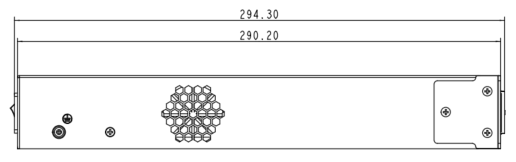
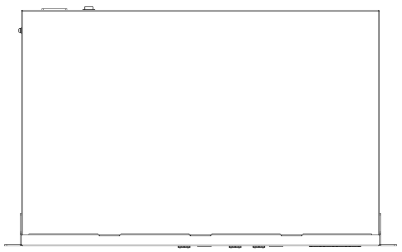
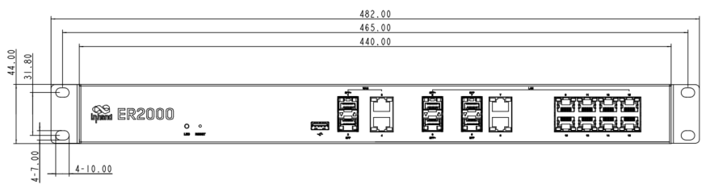

  

    

      
    

    

      Speed · Security · Stability · Simplicity
    

  

  

    

      ER2000 Enterprise SD-WAN Router
    

    

      

        
· Enterprise

        
· High Performance

      

      

        
· Cloud-Managed

        
· SD-WAN

      

    

  

# 1. Product Overview

**ER2000 is a cloud-managed SD-WAN enterprise-grade router designed for business branches and enterprise offices. Serving as the cornerstone of enterprise digitization, the ER2000 features high-performance data processing capabilities and supports large-scale data transmission and stable operation in complex network environments, offering reliable and convenient central-end network access for enterprise business interconnections.**

**Features and Advantages:** 
- **SD-WAN:** Combined with InCloud Manager, quickly builds SD-WAN networking for branch interconnection with flexibility and cost efficiency
- **Centralized Management:** Zero-touch deployment, visualized monitoring, configuration deployment
- **Comprehensive Security:** Firewalls, threat identification, intrusion detection for encrypted traffic insights
- **Outstanding Reliability:** Automatic failover and load balancing, dynamic traffic redistribution for continuous connectivity
- **Enterprise Level:** 6 Gbps throughput, 500+ branch site connections, 1000+ client connections

## Core Technical Specifications

|Technical Item|Specification|
| --- | --- |
| SD-WAN | Hub mode; branch interconnect; 500+ branch sites |
| Cloud Management | InCloud Manager |
| VPN | IPsec, L2TP, VXLAN, GRE*, OpenVPN*; 500+ entries |
| Network| IPv4/IPv6|
| Throughput / Scale | 6 Gbps; IPsec 1 Gbps; 1000+ clients |
| WAN Access | Multiple wired links; PPPoE; real-time link detection |
| Ethernet | WAN: 1 × 10G SFP+ + 1 × GbE SFP + 2 × GbE RJ45 (PoE); LAN: 2 × 10G SFP+ + 2 × GbE Combo + 8 × GbE RJ45 (PoE); 1 × USB 3.0 |
| PoE | 10 × PoE output, 802.3at, 150 W |
| Power | 100–240 V AC, 50/60 Hz, 2 A; peak ≤200 W |
| Dimensions / Install | 440 × 290 × 44 mm; rack-mounted |
| Environment | -10 °C ~ +50 °C op.; -40 °C ~ +85 °C stg.; 5–95% RH; IP20 |
| EMC / Certification | EMC Level 2; CE, FCC, IC (under plan) |

# 2. Product Dimensions

  

    
    
Front View

  

  

    
    
Interface

  

  

    
    
Side View

  

  

    
Note:

    
1. All dimensions are in millimeters (mm).

    
2. Dimensions (L × W × H): 440 × 290 × 44 mm.

    
3. All dimensions are approximate, for reference only.

    
4. Dimensions shown shall not be used for production.

  

# 3. Hardware Specifications

| Category/Parameter | Specification |
| --- | --- |
| **Performance Metrics** | |
| Model | ER2000 |
| Throughput | 6 Gbps |
| IPsec VPN Throughput | 1 Gbps |
| Recommended Users | 1000+ |
| RAM | 4 GB DDR4 |
| Flash | 8 GB eMMC |
| **Interfaces** | |
| WAN | 1 × 10G SFP+, 1 × GbE SFP, 2 × GbE RJ45 (PoE) |
| LAN | 2 × 10G SFP+, 2 × GbE Combo, 8 × GbE RJ45 (PoE) |
| PoE | 10 × PoE output, 802.3at, 150 W |
| USB | 1 × USB 3.0 |
| Reset | Pinhole reset button |
| LED | Power, Network |
| **Power** | |
| Input | 100–240 V AC, 50/60 Hz, 2 A |
| Peak Power | ≤ 200 W |
| **Mechanical** | |
| Dimensions | 440 × 290 × 44 mm |
| Installation | Rack-mounted |
| Protection | IP20 |
| **Environment** | |
| Operating Temperature | -10 °C ~ +50 °C |
| Storage Temperature | -40 °C ~ +85 °C |
| Humidity | 5–95 % RH (non-condensing) |
| **Certification** | |
| Certification | Under plan: CE, FCC, IC |
| EMC | EMC level 2 |

# 4. Software Specifications

| Category/Parameter | Specification |
| --- | --- |
| **Cloud Management** | |
| Platform | InCloud Manager |
| Features | Unified device access, zero-touch remote deployment, bulk remote upgrades, configuration deployment, SD-WAN networking, Connector remote maintenance, two-factor authentication |
| Dashboard | Device connectivity status, network topology, traffic statistics, interface status, client statistics and analysis, uplink management |
| **Network Features** | |
| Access | Multiple wired link connections |
| Dialing | PPPoE |
| Intelligent Links | Real-time link detection |
| IP Protocols | IPv4, IPv6 |
| Protocols | VLAN, DHCP (Server/Client), DNS, DDNS, Fixed Address, IP Passthrough, STP, ARP, ICMP |
| VPN | IPSec VPN, L2TP VPN, VXLAN, GRE*, OpenVPN* |
| SD-WAN | SD-WAN networking |
| Routing | Static routing |
| **Security** | |
| Firewall | 3L inbound/outbound rules, port forwarding, SNAT, DNAT |
| Remote access control | Supported |
| Access Control | Black/white list filtering, domain filtering, 802.1X* |
| **Reliability** | |
| Traffic Shaping | QoS by link, IP, and protocol |
| Upgrades | Scheduled upgrades |
| Logs | Runtime logs, diagnostic logs |
| Events | User logins, connection disconnects, device reboots |
| Alarms | Local email; platform SMS and email |
| **Diagnostic** | |
| Tools | ICMP, packet capture, tracert |

**Note:** Features marked with * are under development.

# 5. Ordering Information

## Model Code

**Model code:** ER2000-\u003cWMNN\u003e

\u003cWMNN\u003e: Hardware Specifications

## Product Models

<table style="width:100%; table-layout:fixed;">
  <colgroup>
    <col style="width:32%;">
    <col style="width:12%;">
    <col style="width:56%;">
  </colgroup>
  <tr><th>Model</th><th>Region</th><th>Specification</th></tr>
  <tr><td style="white-space: nowrap;">ER2000-PLUS</td><td>Global</td><td>Throughput: 6 Gbps;  VPN throughput: 1 Gbps;  500+ branch site connections, 1000+ client connections;  WAN: 1 × 10G SFP+ + 1 × GbE SFP + 2 × GbE RJ45 (PoE);  LAN: 2 × 10G SFP+ + 2 × GbE Combo + 8 × GbE RJ45 (PoE)</td></tr>
</table>

# 6. Contact Us

- **Website:** [InHand Networks](https://www.inhand.com.cn)
- **Copyright:** © InHand Networks. All rights reserved.
