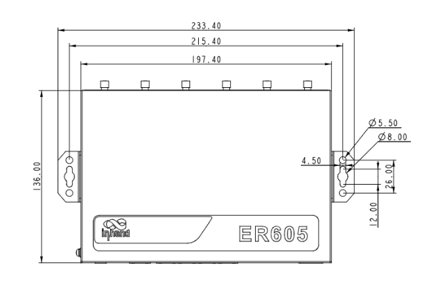
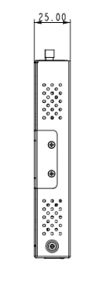
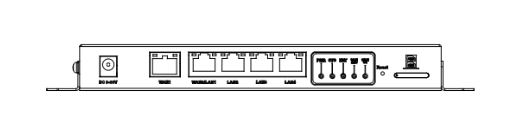

  

    

      
    

    

      Speed · Security · Stability · Simplicity
    

  

  

    

      ER605 Edge Router
    

    

      

        
· 5G

        
· SD-WAN

      

      

        
· Cloud-Managed

        
· Gigabit Ethernet

      

    

  

# 1. Product Overview

**The InHand ER605 is a versatile edge access router that connects stores and offices to the network through 5G/4G cellular or wired broadband to ensure uninterrupted operations and productivity. Equipped with gigabit Ethernet and gigabit Wi-Fi LAN access, the ER605 supports network access for various digital terminals with excellent performance and high availability.**

**Features and Advantages:** 
- **SD-WAN:** Combined with InCloud Manager, quickly builds SD-WAN networking for branch interconnection with flexibility and cost efficiency
- **Flexible Connectivity:** Wired broadband, 4G/5G, and Wi-Fi with link backup and load balancing
- **Centralized Management:** InCloud Manager for zero-touch deployment, remote upgrades, and visualized monitoring
- **Gigabit Access:** 5 × GbE with WAN/LAN switching and dual WAN; Wi-Fi 802.11 ac, up to 1200 Mbps
- **Cost-Effective:** All-in-one solution for retail, office, and branch networking

## Core Technical Specifications

|Technical Item|Specification|
| --- | --- |
| Cellular | 5G/4G; 5G DL up to 2 Gbps (Sub-6) |
| Cloud Management | InCloud Manager |
| SD-WAN / VPN | SD-WAN (Spoke); IPsec, L2TP, VXLAN, GRE, SSL VPN |
| Network & Security | IPv4/IPv6; VLAN, DHCP, routing (static/OSPF/BGP/RIP); NAT; 3L firewall; PPPoE; dual-SIM |
| Wi-Fi | 802.11ac dual-band (2.4/5 GHz), 1200 Mbps; multi-SSID, VLAN, guest, portal |
| Throughput / Users | 500 Mbps; IPsec 30–50 Mbps; 50–100 users |
| SIM | Dual Nano SIM |
| Ethernet | 5 × GbE (WAN/LAN, dual WAN) |
| Antennas | 4G: SMA ×2; 5G: SMA ×4; Wi-Fi: RP-SMA ×2; ≤5 dBi |
| Power | 12 V / 2 A; peak ≤24 W |
| Dimensions / Environment | 198 × 137 × 25 mm; 848 g; bracket / wall; -10 °C ~ +50 °C op.; -40 °C ~ +85 °C stg.; 5–95% RH; IP30 |
| EMC / Certification | EMC Level 2; CE, T-Mobile, Verizon, AT&T |

# 2. Product Dimensions

  

    
    
Front View

  

  

    
    
Side View

  

    

    
    
Interface

  

  

    
Note:

    
1. All dimensions are in millimeters (mm).

    
2. Dimensions (L × W × H): 198 × 137 × 25 mm.

    
3. All dimensions are approximate, for reference only.

    
4. Dimensions shown shall not be used for production.

  

# 3. Hardware Specifications

| Category/Parameter | Specification |
| --- | --- |
| **Performance Metrics** | |
| Throughput | 500 Mbps |
| IPsec VPN Throughput | 30–50 Mbps |
| Recommended Users | 50–100 |
| RAM | 256 MB |
| Flash | 128 MB |
| **Interfaces** | |
| Cellular | 5G, downlink 2 Gbps, Sub-6 (450 MHz–6 GHz); 4G |
| Ethernet | 5 × 10/100/1000 Mbps, WAN/LAN switching, dual WAN |
| SIM Card | Dual Nano SIM |
| Reset | Pinhole reset button |
| Antenna | 4G: SMA × 2, Wi-Fi: RP-SMA × 2; 5G: SMA × 4, Wi-Fi: RP-SMA × 2 |
| **Wi-Fi** | |
| Standard | 802.11 a/b/g/n/ac |
| Max Rate | 1200 Mbps |
| TX Power | 2.4 GHz: 18 dBm; 5 GHz: 17 dBm |
| Antenna Gain | ≤ 5 dBi |
| **Power** | |
| Input | 12 V / 2 A |
| Peak Power | ≤ 24 W |
| **LEDs** | |
| LED | Power, Network, Signal, Wi-Fi |
| **Mechanical** | |
| Dimensions | 198 × 137 × 25 mm |
| Weight | 848 g |
| Installation | Bracket mount, wall mount |
| Protection | IP30 |
| **Environment** | |
| Operating Temperature | -10 °C ~ +50 °C |
| Storage Temperature | -40 °C ~ +85 °C |
| Humidity | 5–95 % RH (non-condensing) |
| **EMC** | |
| EMC | Level 2 |
| **Certification** | |
| Certification | CE, T-Mobile, Verizon, AT&T |

# 4. Software Specifications

| Category/Parameter | Specification |
| --- | --- |
| **Cloud Management** | |
| Platform | InCloud Manager |
| Features | Unified device access, centralized configuration, zero-touch remote deployment, bulk upgrades, remote configuration deployment, SD-WAN networking, connector remote maintenance, two-factor authentication |
| Dashboard | WAN/access/application visibility, traffic statistics, cellular signal, interface status, client analysis |
| **Network Features** | |
| Access | 5G/4G, wired, Wi-Fi |
| Dialing | PPPoE, cellular auto redial, dual SIM switching, APN configuration |
| Intelligent Links | Real-time link detection |
| IP Protocols | IPv4, IPv6 |
| Protocols | VLAN, DHCP (Server/Client), DHCP Snooping, DNS, URL Filtering, DDNS, Fixed Address allocation, IP Passthrough, STP, ARP, ICMP, SNMP |
| VPN | IPSec VPN, L2TP VPN, VXLAN, GRE, SSL VPN |
| SD-WAN | SD-WAN (Spoke) |
| Routing | Static routing, OSPF, BGP, RIP |
| **Wi-Fi** | |
| Features | Multi-SSID, SSID VLAN, SSID hidden, guest mode, custom splash portal |
| Encryption | WPA, WPA2, WPA-PSK, WPA2-PSK |
| **Security** | |
| Firewall | 3L inbound/outbound rules, port forwarding, SNAT, DNAT |
| Access Control | Black/white list, domain filtering |
| Authentication | Portal authentication, 802.1X |
| **Reliability** | |
| Traffic Shaping | QoS based on link, IP, and protocol |
| Upgrades | Scheduled upgrades |
| Logs | Runtime logs, diagnostic logs |
| Events | User logins, connection disconnects, device reboots |
| Alarms | Local email; platform SMS and email |
| **Diagnostic** | |
| Tools | ICMP, packet capture, traceroute |

# 5. Ordering Information

## Model Code

**Model code:** ER605-\u003cWMNN\u003e-\u003cWLAN/NA\u003e

\u003cWMNN\u003e: Cellular Type & Module

\u003cWLAN/NA\u003e: WLAN = Wi-Fi; NA = no Wi-Fi

## Product Models

<table style="width:100%; table-layout:fixed;">
  <colgroup>
    <col style="width:30%;">
    <col style="width:12%;">
    <col style="width:13%;">
    <col style="width:45%;">
  </colgroup>
  <tr><th>Model</th><th>Region</th><th>Cellular</th><th>Specification</th></tr>
  <tr><td>ER605-NRF2-&lt;WLAN/NA&gt;</td><td>China</td><td>5G</td><td>5G NR n1/n3/n5/n8/n28/n41/n78/n79;  LTE-FDD B1/B3/B5/B7*/B8;  LTE-TDD B34/B38/B39/B40/B41;  WCDMA B1/B5/B8</td></tr>
  <tr><td>ER605-NRQ2-&lt;WLAN/NA&gt;</td><td>China</td><td>5G</td><td>5G NR n1/n3/n5/n8/n28/n41/n77/n78/n79;  LTE-FDD B1/B3/B5/B8;  LTE-TDD B34/B38/B39/B40/B41;  WCDMA B1/B5/B8</td></tr>
  <tr><td>ER605-NRF4-&lt;WLAN/NA&gt;</td><td>EU &amp; APAC</td><td>5G</td><td>5G NR n1/3/5/7/8/20/28/n38/40/41/66/71/77/78;  LTE-FDD B1/3/5/7/8/20/28/66/71;  LTE-TDD B38/40/41;  WCDMA B1/B3/B5/B8</td></tr>
  <tr><td>ER605-LQ20-&lt;WLAN/NA&gt;</td><td>China</td><td>CAT4</td><td>LTE-FDD B1/B3/B5/B8;  LTE-TDD B34/B38/B39/B40/B41;  WCDMA B1/B5/B8;  GSM/EDGE B3/B8</td></tr>
  <tr><td>ER605-FF39-&lt;WLAN/NA&gt;</td><td>North America</td><td>CAT6</td><td>LTE-FDD B2/B4/B5/B7/B12/B13/B25/B26/B29/B30/B66;  WCDMA B2/B4/B5</td></tr>
  <tr><td>ER605-FQ58-&lt;WLAN/NA&gt;</td><td>EU &amp; APAC</td><td>CAT4</td><td>LTE-FDD B1/B3/B5/B7/B8/B20/B28;  LTE-TDD B38/B40/B41;  WCDMA B1/B5/B8;  GSM/EDGE B3/B8</td></tr>
  <tr><td>ER605-FQ59-&lt;WLAN/NA&gt;</td><td>EU &amp; APAC</td><td>CAT6</td><td>LTE-FDD B1/B3/B5/B7/B8/B20/B28/B32;  LTE-TDD B38/B40/B41/B42/B43;  WCDMA B1/B3/B5/B8</td></tr>
  <tr><td>ER605-EN00-&lt;WLAN/NA&gt;</td><td>—</td><td>No Module</td><td>No cellular module</td></tr>
</table>

# 6. Contact Us

- **Website:** [InHand Networks](https://www.inhand.com.cn)
- **Copyright:** © InHand Networks. All rights reserved.
