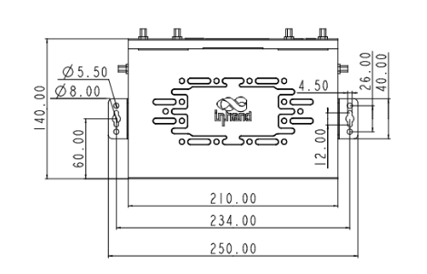
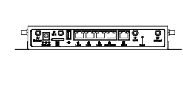
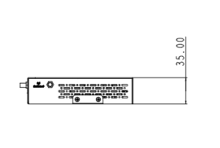

  

    

      
    

    

      Speed · Security · Stability · Simplicity
    

  

  

    

      ER805 Edge Router
    

    

      

        
· 5G

        
· SD-WAN

      

      

        
· Cloud-Managed

        
· Gigabit Ethernet

      

    

  

# 1. Product Overview

**The InHand ER805 is a versatile networking solution that connects stores and offices to the network through 5G/4G cellular or wired broadband to ensure uninterrupted operations and productivity. Equipped with gigabit Ethernet and gigabit Wi-Fi LAN access, the ER805 supports network access for various digital terminals with excellent performance and high availability. Organizations can rely on the ER805 to deliver secure interconnectivity between branches with SD-WAN technology.**

**Features and Advantages:** 
- **Convenient Cellular Access with High-speed 5G:** Global operator 5G access, SA and NSA modes, 2 Gbps downlink for high bandwidth and low latency
- **Plug & Play:** Wired, cellular, and Wi-Fi networking with multiple link-switching strategies
- **SD-WAN:** Combined with InCloud Manager for branch interconnection with flexibility and cost efficiency
- **Centralized Management:** Zero-touch deployment, remote upgrades, visualized monitoring
- **Comprehensive Security:** Firewall, threat identification, and multiple security policies

## Core Technical Specifications

|Technical Item|Specification|
| --- | --- |
| Cellular | 5G/4G; SA/NSA Sub-6 & LTE (up to 5.0 Gbps DL NSA / 4.2 Gbps DL SA; LTE up to 2.0 Gbps DL) |
| Cloud Management | InCloud Manager |
| SD-WAN / VPN | SD-WAN; IPsec, L2TP, VXLAN, GRE*, OpenVPN* |
| Network & Security | IPv4/IPv6; VLAN, DHCP, static routing; NAT |
| Wi-Fi | 802.11ac dual-band (2.4/5 GHz), 1200 Mbps; multi-SSID |
| Throughput / Users | 600 Mbps; IPsec 100 Mbps; 100–150 users |
| SIM | Dual Nano SIM |
| Ethernet / USB | 5 × GbE (WAN/LAN, dual WAN); USB 3.0 (debug) |
| Antennas | 4G: SMA ×2; 5G: SMA ×4; Wi-Fi: RP-SMA ×2; ≤5 dBi |
| Power | 9–36 V DC (2 A @ 12 V); peak ≤24 W |
| Dimensions / Environment | 210 × 140 × 35 mm; 1.06 kg; bracket / wall; -20 °C ~ +70 °C op.; -40 °C ~ +85 °C stg.; 5–95% RH; IP30 |
| EMC / Certification | EMC Level 2; CE, FCC, IC, PTCRB, AT&T, Verizon, T-Mobile |

# 2. Product Dimensions

  

    
    
Front View

  

  

    
    
Interface Dimensions

  

  

    
    
Side View

  

  

    
Note:

    
1. All dimensions are in millimeters (mm).

    
2. Dimensions (L × W × H): 210 × 140 × 35 mm.

    
3. All dimensions are approximate, for reference only.

    
4. Dimensions shown shall not be used for production.

  

# 3. Hardware Specifications

| Category/Parameter | Specification |
| --- | --- |
| **Performance Metrics** | |
| Throughput | 600 Mbps |
| IPsec VPN Throughput | 100 Mbps |
| Recommended Users | 100–150 |
| RAM | 512 MB |
| Flash | 8 GB |
| **Interfaces** | |
| Cellular | 5G SA: Sub-6 DL 4.2 Gbps / UL 450 Mbps; 5G NSA: Sub-6 DL 5.0 Gbps / UL 650 Mbps; LTE DL 2.0 Gbps / UL 200 Mbps |
| Ethernet | 5 × 10/100/1000 Mbps, WAN/LAN switching, dual WAN |
| SIM Card | Dual Nano SIM |
| USB | USB 3.0 (debug) |
| Reset | Pinhole reset button |
| Antenna | 4G: SMA × 2, Wi-Fi: RP-SMA × 2; 5G: SMA × 4, Wi-Fi: RP-SMA × 2 |
| **Wi-Fi** | |
| Standard | 802.11 a/b/g/n/ac |
| Max Rate | 1200 Mbps |
| TX Power | 2.4 GHz: 17 dBm; 5 GHz: 17 dBm |
| Antenna Gain | ≤ 5 dBi |
| **Power** | |
| Input | 9–36 V DC (2 A @ 12 V) |
| Peak Power | ≤ 24 W |
| **LEDs** | |
| LED | Power, Network, Signal, Wi-Fi |
| **Mechanical** | |
| Dimensions | 210 × 140 × 35 mm |
| Weight | 1.06 kg |
| Installation | Bracket mount, wall mount |
| Protection | IP30 |
| **Environment** | |
| Operating Temperature | -20 °C ~ +70 °C |
| Storage Temperature | -40 °C ~ +85 °C |
| Humidity | 5–95 % RH (non-condensing) |
| **Certification** | |
| Certification | CE, FCC, IC, PTCRB, AT&T, Verizon, T-Mobile |
| EMC | EMC level 2 |

# 4. Software Specifications

| Category/Parameter | Specification |
| --- | --- |
| **Cloud Management** | |
| Platform | InCloud Manager |
| Features | Unified device access, zero-touch deployment, bulk remote upgrades, configuration deployment, SD-WAN networking, Connector remote maintenance, two-factor authentication |
| Dashboard | Device connectivity, traffic statistics, cellular signal, interface status, client analysis, uplink management |
| **Network Features** | |
| Access | 5G/4G, wired, Wi-Fi |
| Dialing | PPPoE, cellular auto redial, dual SIM switching, APN configuration |
| Intelligent Links | Real-time link detection |
| IP Protocols | IPv4, IPv6 |
| Protocols | VLAN, DHCP (Server/Client), DHCP Snooping, DNS, URL Filtering, DDNS, Fixed Address, IP Passthrough, STP, ARP, ICMP |
| VPN | IPSec VPN, L2TP VPN, VXLAN, GRE*, OpenVPN* |
| SD-WAN | SD-WAN networking |
| Routing | Static routing |
| **Wi-Fi** | |
| Features | Multi-SSID, SSID VLAN, SSID hidden, guest mode, custom splash portal |
| Encryption | WPA, WPA2, WPA-PSK, WPA2-PSK |
| **Security** | |
| Firewall | 3L inbound/outbound rules, port forwarding, SNAT, DNAT |
| Access Control | Black/white list, domain filtering, Portal authentication, 802.1X |
| Authentication | Wi-Fi Portal |
| **Reliability** | |
| Traffic Shaping | QoS by link, IP, and protocol |
| Upgrades | Scheduled upgrades |
| Logs | Runtime logs, diagnostic logs |
| Events | User logins, connection disconnects, device reboots |
| Alarms | Local email; platform SMS and email |
| **Diagnostic** | |
| Tools | ICMP, packet capture, traceroute, Iperf |

# 5. Ordering Information

## Model Code

**Model code:** ER805-\u003cWMNN\u003e-\u003cWLAN/NA\u003e

\u003cWMNN\u003e: Cellular Type & Module

\u003cWLAN/NA\u003e: WLAN = Wi-Fi; NA = no Wi-Fi

## Product Models

<table style="width:100%; table-layout:fixed;">
  <colgroup>
    <col style="width:35%;">
    <col style="width:15%;">
    <col style="width:12%;">
    <col style="width:38%;">
  </colgroup>
  <tr><th>Model</th><th>Region</th><th>Cellular</th><th>Specification</th></tr>
  <tr><td style="white-space: nowrap;">ER805-NRQ2-&lt;WLAN/NA&gt;</td><td>China</td><td>5G</td><td>5G NR SA n1/n28*/n41/n77/n78/n79;  NSA n41/n78/n79;  LTE-FDD B1/B2/B3/B5/B7/B8/B20/B28;  LTE-TDD B34/B38/B39/B40/B41;  WCDMA B1/B2/B5/B8</td></tr>
  <tr><td style="white-space: nowrap;">ER805-NRQ3-&lt;WLAN/NA&gt;</td><td>Global</td><td>5G</td><td>5G NR n1/n2/n3/n5/n7/n8/n12/n20/n25/n28/n38/n40/n41/n48*/n66/n71/n77/n78/n79;  LTE-FDD B1/B2/B3/B4/B5/B7/B8/B12(B17)/B13/B14/B18/B19/B20/B25/B26/B28/B29/B30/B32/B66/B71;  LTE-TDD B34/B38/B39/B40/B41/B42/B43/B48;  WCDMA B1/B2/B3/B4/B5/B6/B8/B19</td></tr>
  <tr><td style="white-space: nowrap;">ER805-LQ20-&lt;WLAN/NA&gt;</td><td>China</td><td>CAT4</td><td>LTE-FDD B1/B3/B5/B8;  LTE-TDD B34/B38/B39/B40/B41;  TD-SCDMA B34/B39;  WCDMA B1/B8;  CDMA BC0;  GSM 900/1800 MHz</td></tr>
  <tr><td style="white-space: nowrap;">ER805-FQ39-&lt;WLAN/NA&gt;</td><td>North America</td><td>CAT6</td><td>LTE-FDD B2/B4/B5/B7/B12/B13/B25/B26/B29/B30/B66;  WCDMA B2/B4/B5</td></tr>
  <tr><td style="white-space: nowrap;">ER805-FQ58-&lt;WLAN/NA&gt;</td><td>EU &amp; APAC</td><td>CAT4</td><td>LTE-FDD B1/B3/B7/B8/B20/B28A;  LTE-TDD B38/B40/B41;  WCDMA B1/B8</td></tr>
  <tr><td style="white-space: nowrap;">ER805-FQ78-&lt;WLAN/NA&gt;</td><td>Australia</td><td>CAT4</td><td>LTE-FDD B1/B3/B7/B8/B20/B28A;  LTE-TDD B38/B40/B41;  WCDMA B1/B8</td></tr>
  <tr><td style="white-space: nowrap;">ER805-EN00-&lt;WLAN/NA&gt;</td><td>—</td><td>No Module</td><td>No cellular module</td></tr>
</table>

# 6. Contact Us

- **Website:** [InHand Networks](https://www.inhand.com.cn)
- **Copyright:** © InHand Networks. All rights reserved.
