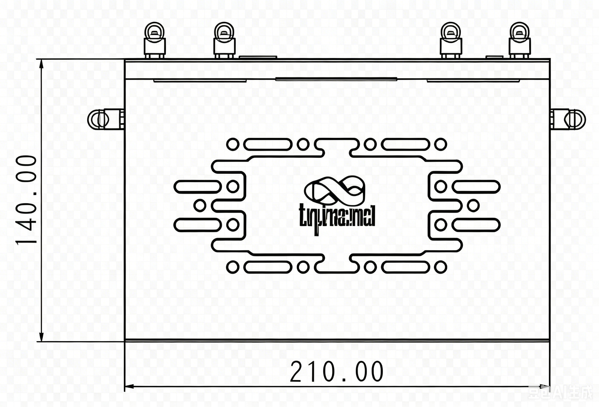
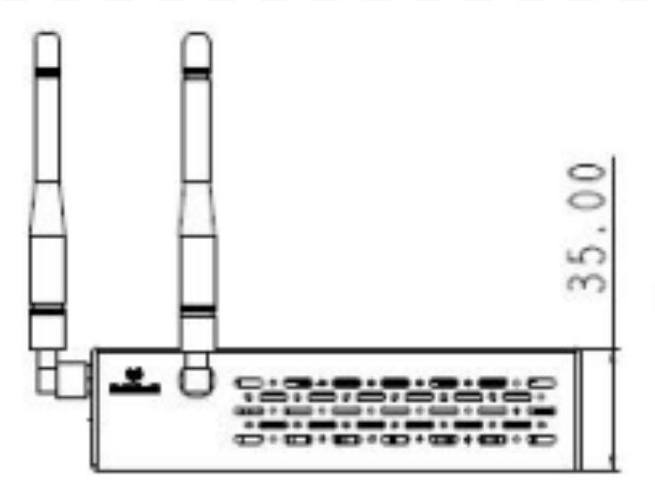
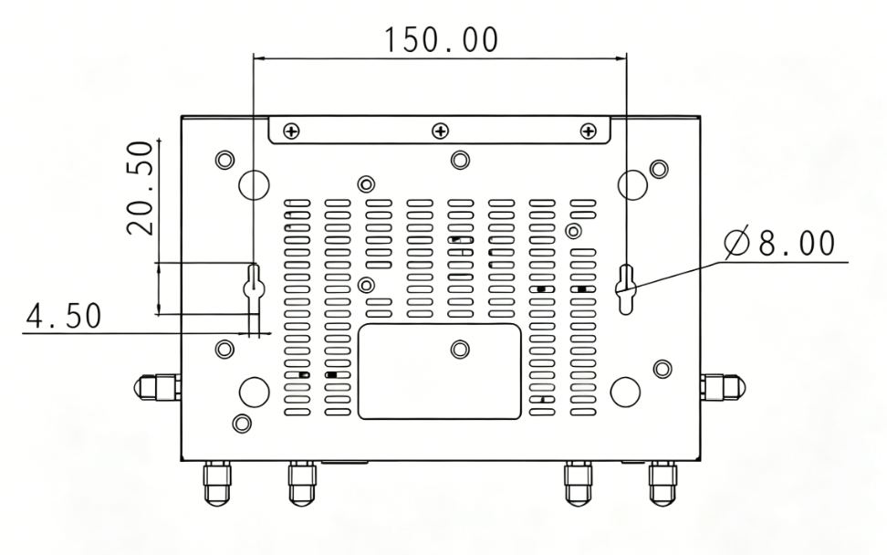

  

    

      
    

    

      Advanced 5G Cellular Router
    

  

  

    

      ER815 Edge Router
    

    

      

        
· 5G

        
· Wi-Fi 6

      

      

        
· Cloud-Managed

        
· SD-WAN

      

    

  

# 1. Product Overview

**The InHand ER815 is a versatile networking solution that connects stores and offices to the network through 5G/4G cellular or wired broadband, ensuring uninterrupted operations and productivity. Equipped with 2.5GbE port and 3000 Mbps Wi-Fi 6 LAN access, the ER815 supports network access for a wide range of digital terminals with excellent performance and high availability. Organizations can rely on the ER815 to achieve SD-WAN cross-branch access and remote maintenance of terminal devices.**

**Features and Advantages:** 
- **Convenient Cellular Access with High-speed 5G:** 5G module DL 2.4 Gbps / UL 900 Mbps for high-bandwidth, low-latency solutions
- **Plug & Play:** Wired, cellular, and Wi-Fi networking with multiple link-switching strategies
- **SD-WAN:** Combined with InCloud Manager for branch interconnection with flexibility and cost efficiency
- **High-speed Wi-Fi 6:** Dual-band Wi-Fi 6 (2.4/5 GHz), up to 3000 Mbps, multiple SSIDs and encryption settings
- **Outstanding Reliability:** Automatic failover and load balancing

## Core Technical Specifications

|Technical Item|Specification|
| --- | --- |
| Cellular | 5G/4G; SA up to 2.4 Gbps DL / 900 Mbps UL; NSA up to 3.4 Gbps DL / 550 Mbps UL; LTE up to 1.6 Gbps DL / 200 Mbps UL |
| SD-WAN / VPN | SD-WAN; IPsec, L2TP, VXLAN, GRE, OpenVPN* |
| Network | IPv4/IPv6 |
| Wi-Fi | Wi-Fi 6 (802.11ax), 2.4/5 GHz, 3000 Mbps; multi-SSID |
| Throughput / Users | 1 Gbps; IPsec 300 Mbps; 150–200 users |
| SIM | Dual Nano SIM; eSIM optional |
| Ethernet | WAN: 1 × 2.5G or 1 × 2.5G + 1 × GbE; LAN: 4 × GbE or 3 × GbE |
| Antennas | 4G: SMA ×2; 5G: SMA ×4; Wi-Fi: RP-SMA ×2; ≤5 dBi |
| Power | 12 V / 3 A; peak ≤18 W |
| Dimensions | 210 × 140 × 35 mm; 1.25 kg; |
| EMC| EMC Level 2 |

# 2. Product Dimensions

  

    
    
Front View

  

  

    
    
Interface Dimensions

  

  

    
    
Black View

  

  

    
Note:

    
1. All dimensions are in millimeters (mm).

    
2. Dimensions (L × W × H): 210 × 140 × 35 mm.

    
3. All dimensions are approximate, for reference only.

    
4. Dimensions shown shall not be used for production.

  

# 3. Hardware Specifications

| Category/Parameter | Specification |
| --- | --- |
| **Performance Metrics** | |
| Throughput | 1 Gbps |
| IPsec VPN Throughput | 300 Mbps |
| Recommended Users | 150–200 |
| RAM | 512 MB |
| Flash | 8 GB |
| **Interfaces** | |
| Cellular | 5G SA: 2.4 Gbps DL / 900 Mbps UL; 5G NSA: 3.4 Gbps DL / 550 Mbps UL; LTE: 1.6 Gbps DL / 200 Mbps UL |
| Ethernet | WAN: 1 × 2.5G or 1 × 2.5G + 1 × GbE; LAN: 4 × GbE or 3 × GbE; WAN/LAN switching, dual WAN |
| SIM Card | Dual Nano SIM (eSIM optional) |
| Reset | Pinhole reset button |
| Antenna | 4G: SMA × 2, Wi-Fi: RP-SMA × 2; 5G: SMA × 4, Wi-Fi: RP-SMA × 2 |
| **Wi-Fi** | |
| Standard | 802.11 a/b/g/n/ac/ax |
| Max Rate | 3000 Mbps |
| TX Power | 2.4 GHz: 21 dBm; 5 GHz: 21 dBm |
| Antenna Gain | ≤ 5 dBi |
| **Power** | |
| Input | 12 V / 3 A |
| Peak Power | ≤ 18 W |
| **LEDs** | |
| LED | Power, Network, 5G Wi-Fi, 2.4G Wi-Fi |
| **Mechanical** | |
| Dimensions | 210 × 140 × 35 mm |
| Weight | 1.25 kg |
| Installation | Bracket mount, wall mount |
| Protection | IP20 |
| **Environment** | |
| Operating Temperature | -10 °C ~ +50 °C |
| Storage Temperature | -40 °C ~ +85 °C |
| Humidity | 5–95 % RH (non-condensing) |
| **Certification** | |
| Certification | In Plan*: CE, FCC, IC, PTCRB, AT&T, Verizon, T-Mobile |
| EMC | EMC level 2 |

# 4. Software Specifications

| Category/Parameter | Specification |
| --- | --- |
| **Cloud Management** | |
| Platform | InCloud Manager |
| Features | Unified device access, zero-touch remote deployment, bulk remote upgrades, configuration deployment, SD-WAN networking, Connector remote maintenance, two-factor authentication |
| Dashboard | Device connectivity status, traffic statistics, cellular signal statistics, interface status, client statistics and analysis, uplink management |
| **Network Features** | |
| Access | 5G/4G, wired, Wi-Fi |
| Dialing | PPPoE, cellular auto redial, dual SIM switching, APN configuration |
| Intelligent Links | Real-time link detection |
| IP Protocols | IPv4, IPv6 |
| Protocols | VLAN, DHCP (Server/Client), DHCP Snooping, DNS, URL Filtering, DDNS, Fixed Address, IP Passthrough, STP, ARP, ICMP |
| VPN | IPSec VPN, L2TP VPN, VXLAN, GRE, OpenVPN* |
| SD-WAN | SD-WAN networking |
| Routing | Static routing |
| **Wi-Fi** | |
| Features | Multi-SSID, SSID VLAN, SSID hidden, guest mode, custom splash portal |
| Encryption | WPA, WPA2, WPA-PSK, WPA2-PSK |
| **Security** | |
| Firewall | 3L inbound/outbound rules, port forwarding, SNAT, DNAT |
| Remote access control | Supported |
| Access Control | Black/white list filtering, domain filtering, Portal authentication, 802.1X |
| **Reliability** | |
| Traffic Shaping | QoS by link, IP, and protocol |
| Upgrades | Scheduled upgrades |
| Logs | Runtime logs, diagnostic logs |
| Events | User logins, connection disconnects, device reboots |
| Alarms | Local email; platform SMS and email |
| **Diagnostic** | |
| Tools | ICMP, packet capture, tracert |

# 5. Ordering Information

## Model Code

**Model code:** ER815-\u003cWMNN\u003e-\u003cWLAN/NA\u003e

\u003cWMNN\u003e: Cellular Type & Module

\u003cWLAN/NA\u003e: WLAN = Wi-Fi; NA = no Wi-Fi

## Product Models

<table style="width:100%; table-layout:fixed;">
  <colgroup>
    <col style="width:35%;">
    <col style="width:15%;">
    <col style="width:12%;">
    <col style="width:38%;">
  </colgroup>
  <tr><th>Model</th><th>Region</th><th>Cellular</th><th>Specification</th></tr>
  <tr><td style="white-space: nowrap;">ER815-NRQ2-&lt;WLAN/NA&gt;</td><td>China</td><td>5G</td><td>5G NR n1/n3/n5/n8/n28A/n41/n77/n78/n79;  LTE-FDD B1/B3/B5/B8;  LTE-TDD B34/B38/B39/B40/B41;  WCDMA B1/B5/B8</td></tr>
  <tr><td style="white-space: nowrap;">ER815-NRQ3-&lt;WLAN/NA&gt;</td><td>Global</td><td>5G</td><td>5G NR n1/n2/n3/n5/n7/n8/n12/n13/n14/n18/n20/n25/n26/n28/n29/n30/n38/n40/n41/n48/n66/n70/n71/n75/n76/n77/n78/n79;  LTE-FDD B1/B2/B3/B4/B5/B7/B8/B12/B13/B14/B17/B18/B19/B20/B25/B26/B28/B29/B30/B32/B66/B71;  LTE-TDD B34/B38/B39/B40/B41/B42/B43/B48;  WCDMA B1/B2/B4/B5/B8/B19</td></tr>
  <tr><td style="white-space: nowrap;">ER815-NRQ4-&lt;WLAN/NA&gt;</td><td>EU &amp; APAC</td><td>5G</td><td>5G NR n1/n3/n5/n7/n8/n20/n28/n38/n40/n41/n66/n77/n78;  LTE-FDD B1/B3/B5/B7/B8/B20/B28/B66;  LTE-TDD B38/B40/B41;  WCDMA B1/B2/B5/B8</td></tr>
  <tr><td style="white-space: nowrap;">ER815-LQ20-&lt;WLAN/NA&gt;</td><td>China</td><td>CAT4</td><td>LTE-FDD B1/B3/B5/B8;  LTE-TDD B34/B38/B39/B40/B41;  WCDMA B1/B5/B8;  GSM B3/B8</td></tr>
  <tr><td style="white-space: nowrap;">ER815-FQ58-&lt;WLAN/NA&gt;</td><td>EU &amp; APAC</td><td>CAT4</td><td>LTE-FDD B1/B3/B5/B7/B8/B20/B28;  LTE-TDD B38/B40/B41;  WCDMA B1/B5/B8</td></tr>
  <tr><td style="white-space: nowrap;">ER815-EN00-&lt;WLAN/NA&gt;</td><td>—</td><td>No Module</td><td>No cellular module</td></tr>
</table>

# 6. Contact Us

- **Website:** [InHand Networks](https://www.inhand.com.cn)
- **Copyright:** © InHand Networks. All rights reserved.
