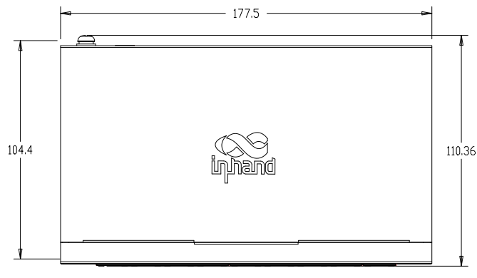
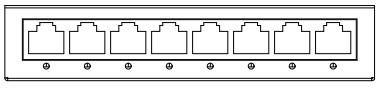
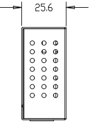

  

    

      
    

    

      Compact and Agile, Easy to Deploy
    

  

  

    

      ES220 Economical Switch
    

    

      

        
· Plug and Play

        
· Unmanaged

      

      

        
· PoE

        
· 5/8 GbE Ports

      

    

  

# 1. Product Overview

**The ES220 series is specifically designed for chain branches and small to medium-sized business network scenarios, offering a cost-effective unmanaged switch solution. This series provides 5-port and 9-port models, supporting up to 8 PoE output ports to flexibly meet the LAN device access needs of retail stores and small office environments.**

**Features and Advantages:** 
- **Plug and Play:** Unmanaged design, no configuration required
- **PoE Power Supply:** Some models support PoE, transmitting power and data through a single cable
- **Multiple Device Connections:** Store-and-forward mode, up to 18 Gbps switching capacity, Auto MDI/MDIX, half-duplex and full-duplex auto negotiation
- **One-Click VLAN:** ES220-4P-1T supports one-click VLAN for LAN isolation and broadcast storm prevention
- **Compact and Lightweight:** Flexible installation, desktop or wall-mounted

## Core Technical Specifications

|Technical Item|Specification|
| --- | --- |
| Type | Unmanaged Layer 2; plug-and-play |
| Switching Capacity | 10 Gbps (5-port) / 16 Gbps (8/9-port) |
| Forwarding / MAC | Store-and-forward; 2K |
| PoE | ES220-4P-1T: 52 W; ES220-8P-1T: 120 W (802.3 af/at); ES220-5T / 8T: no PoE |
| One-Click VLAN | ES220-4P-1T: ports 1–4 isolated, uplink to port 5 |
| Gigabit Ethernet | 5 / 8 / 9 × 10/100/1000 Mbps; Auto MDI/MDIX |
| Power | Non-PoE: 5 V / 1 A DC; PoE: 55 V DC (Icc per model) |
| Mechanical / Install | Metal; fanless; desktop / wall; 84 × 47.8 × 25.6 mm ~ 178 × 104 × 26 mm |
| Environment | Op. 0 °C ~ +40 °C; stg. -10 °C ~ +70 °C; 10–90% RH |
| Compliance | CE, FCC; 1-year warranty |

# 2. Product Dimensions

  

    

      
    

    
Front View

  

  

    

      

        
      

      
Interface Dimensions

    

  

  

    

      
    

    
Side View

  

  

    
Note:

    
1. All dimensions are in millimeters (mm).

    
2. Dimensions vary by model; see product specifications.

    
3. All dimensions are approximate, for reference only.

    
4. Dimensions shown shall not be used for production.

  

# 3. Hardware Specifications

| Category/Parameter | ES220-5T | ES220-4P-1T | ES220-8T | ES220-8P-1T |
| --- | --- | --- | --- | --- |
| **Performance Metrics** | | | | |
| Switching Capacity | 10 Gbps | 10 Gbps | 16 Gbps | 16 Gbps |
| MAC Address Table | 2K | 2K | 2K | 2K |
| Forwarding Mode | Store-and-forward | Store-and-forward | Store-and-forward | Store-and-forward |
| **Interfaces** | | | | |
| Ethernet | 5 × 10/100/1000 Mbps | 5 × 10/100/1000 Mbps | 8 × 10/100/1000 Mbps | 9 × 10/100/1000 Mbps |
| PoE | No | Ports 1–4, 802.3 af/at, 52 W | No | Ports 1–8, 802.3 af/at, 120 W |
| Polarity Reversal | Auto MDI/MDIX | Auto MDI/MDIX | Auto MDI/MDIX | Auto MDI/MDIX |
| Duplex | Auto negotiation, half-duplex and full-duplex | Auto negotiation, half-duplex and full-duplex | Auto negotiation, half-duplex and full-duplex | Auto negotiation, half-duplex and full-duplex |
| One-Click VLAN | — | Ports 1–4 isolated, connected to port 5 | — | — |
| **Power** | | | | |
| Input | 5 V / 1 A DC | 55 V / 1.3 A DC | 5 V / 1 A DC | 55 V / 2.55 A DC |
| **LEDs** | | | | |
| LED | Power, network port | Power, network port, PoE | Power, network port | Power, network port, PoE |
| **Mechanical** | | | | |
| Housing | Metal | Metal | Metal | Metal |
| Cooling | Fanless | Fanless | Fanless | Fanless |
| Dimensions (mm) | 84 × 47.8 × 25.6 | 100 × 99.4 × 26 | 126 × 53 × 25.6 | 178 × 104 × 26 |
| Installation | Desktop, wall-mounted | Desktop, wall-mounted | Desktop, wall-mounted | Desktop, wall-mounted |
| **Environment** | | | | |
| Operating Temperature | 0 °C ~ +40 °C | 0 °C ~ +40 °C | 0 °C ~ +40 °C | 0 °C ~ +40 °C |
| Storage Temperature | -10 °C ~ +70 °C | -10 °C ~ +70 °C | -10 °C ~ +70 °C | -10 °C ~ +70 °C |
| Humidity | 10–90 % | 10–90 % | 10–90 % | 10–90 % |
| **Certification** | | | | |
| Certification | CE, FCC | CE, FCC | CE, FCC | CE, FCC |
| Warranty | 1 year | 1 year | 1 year | 1 year |

# 4. Software Specifications

| Category/Parameter | Specification |
| --- | --- |
| **Operating Mode** | |
| Management | Unmanaged Layer 2 switch; plug-and-play; no configuration required |
| **Model-Specific** | |
| One-Click VLAN | ES220-4P-1T only: quick LAN isolation; ports 1–4 isolated from each other and connected to port 5 |

# 5. Ordering Information

## Model Code

**Model code:** ES220-\u003cWMNN\u003e\u003cT\u003e: Gigabit Ethernet; \u003cP\u003e: PoE

## Product Models

<table style="width:100%; table-layout:fixed;">
  <colgroup>
    <col style="width:25%;">
    <col style="width:20%;">
    <col style="width:55%;">
  </colgroup>
  <tr><th>Model</th><th>Region</th><th>Specification</th></tr>
  <tr><td style="white-space: nowrap;">ES220-5T</td><td>Global</td><td>Unmanaged Layer 2 switch, 5 × GbE ports</td></tr>
  <tr><td style="white-space: nowrap;">ES220-4P-1T</td><td>Global</td><td>Unmanaged Layer 2 switch, 5 × GbE ports, ports 1–4 PoE, max 52 W</td></tr>
  <tr><td style="white-space: nowrap;">ES220-8T</td><td>Global</td><td>Unmanaged Layer 2 switch, 8 × GbE ports</td></tr>
  <tr><td style="white-space: nowrap;">ES220-8P-1T</td><td>Global</td><td>Unmanaged Layer 2 switch, 9 × GbE ports, ports 1–8 PoE, max 120 W</td></tr>
</table>

# 6. Contact Us

- **Website:** [InHand Networks](https://www.inhand.com.cn)
- **Copyright:** © InHand Networks. All rights reserved.

