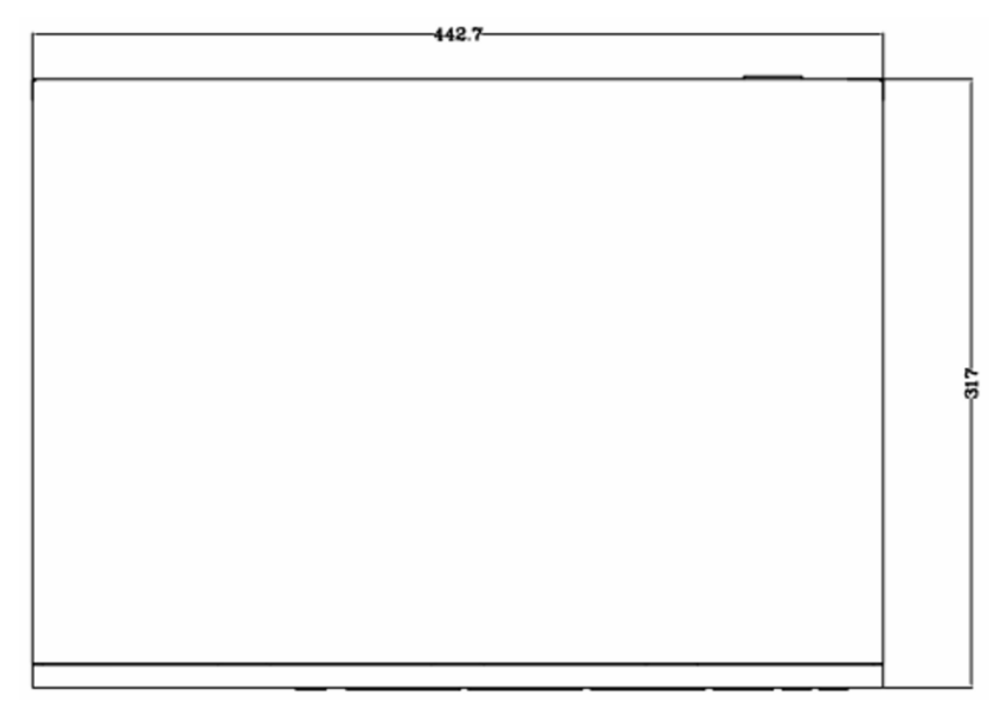
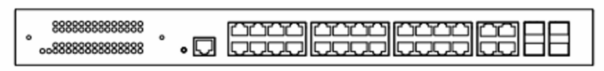
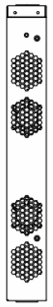

  

    

      
    

    

      Powerful Connectivity, Convenient Management
    

  

  

    

      ES620 Enterprise Switch
    

    

      

        
· 28×GbE

        
· High Performance

      

      

        
· Cloud-Managed

        
· PoE

      

    

  

# 1. Product Overview

**The ES620 switch features 24 gigabit ports and 4 combo ports, supporting PoE on all 24 ports. It offers exceptional data handling capabilities, ensuring stable performance in large-scale data transfer and complex network environments, making it a reliable and convenient solution for enterprise networking. Its extensive access capacity and powerful PoE capability make it ideal for hotels, campuses, and dormitories. Additionally, the device is managed through the InCloud Manager platform, providing a comprehensive visual interface for easy network monitoring, simplified configuration, and enhanced management, helping businesses reduce costs and improve efficiency.**

**Features and Advantages:** 
- **28 Gigabit Ethernet Ports:** 24 × GbE RJ45 + 4 × Combo ports for robust network connectivity
- **Smart PoE:** 24 ports support simultaneous PoE, 30 W per port, 450 W total output
- **Simple Configuration:** Graphical user interface, intuitive configuration without professional IT skills
- **Centralized Management:** InCloud Manager for unified management of routers, switches, and wireless products
- **Multidimensional Visual Monitoring:** Online history, network status, interface status, device alerts, and events

## Function List

# Core Technical Specifications

| Technical Item | Specification |
| --- | --- |
| Cloud Management | InCloud Manager: unified device access, zero-touch remote deployment |
| Dashboard | Device statistics, connectivity status|
| Maintenance | Scheduled upgrades |
| Performance | Switching capacity 56 Gbps; packet forwarding 41 Mpps; RAM 128 MB; Flash 32 MB |
| Interfaces & PoE | 28 × GbE RJ45; 24 × 802.3 af/at PoE; 1 × Console; 1 × Reset |
| Cooling  | 4 × built-in fans |
| Power | 100–240 V AC, 50–60 Hz; 400 W total consumption (370 W PoE) |
| Mechanical | 440 × 315 × 44 mm; metal; 1U rack; IP20 |
| Environment | Operating 0 °C ~ +45 °C; storage -40 °C ~ +70 °C; humidity 95 % RH @ 40 °C |
| Compliance | In planning: CE, FCC, IC; EMC Level 2 |

# 2. Product Dimensions

  

    

      
    

    
Front View

  

  

    

      

        
      

      
Interface

    

  

  

    

      
    

    
Side View

  

  

    
Note:

    
1. All dimensions are in millimeters (mm).

    
2. Dimensions (L × W × H): 440 × 315 × 44 mm.

    
3. All dimensions are approximate, for reference only.

    
4. Dimensions shown shall not be used for production.

  

# 3. Hardware Specifications

| Category/Parameter | Specification |
| --- | --- |
| **Performance Metrics** | |
| Model | ES620 |
| Switching Capacity | 56 Gbps |
| Packet Forwarding Rate | 41 Mpps |
| RAM | 128 MB |
| Flash | 32 MB |
| MAC Address Table | 8K |
| **Interfaces** | |
| Ethernet | 28 × GbE RJ45 |
| PoE | 24 × 802.3 af/at |
| Console | 1 × Console |
| Reset | 1 × Reset button |
| **LEDs** | |
| LED | 1 × Power, 1 × System, 24 × PoE status, 28 × Link status |
| **Cooling** | |
| Fan | 4 × Built-in fans |
| **Power** | |
| Input | 100–240 V AC, 50–60 Hz |
| Power Consumption | 400 W total (370 W PoE) |
| **Mechanical** | |
| Dimensions | 440 × 315 × 44 mm |
| Material | Metal |
| Installation | 1U Rack |
| Protection | IP20 |
| **Environment** | |
| Operating Temperature | 0 °C ~ +45 °C |
| Storage Temperature | -40 °C ~ +70 °C |
| Humidity | 95 % RH @ 40 °C |
| **Certification** | |
| Certification | In planning: CE, FCC, IC |
| EMC | EMC Level 2 |

# 4. Software Specifications

| Category/Parameter | Specification |
| --- | --- |
| **Cloud Management** | |
| Platform | InCloud Manager |
| Features | Unified device access, zero-touch remote deployment, batch upgrades and configuration deployment, cloud-connected remote maintenance, two-factor authentication |
| Dashboard | Device statistics, connectivity status, connection quality analysis (latency, packet loss, throughput); traffic statistics, interface status, client statistics analysis |
| **Network Features** | |
| IP Protocol | IPv4 |
| Protocols | VLAN, STP, RSTP, port management, traffic control, 802.1X*, PoE management, link aggregation*, loop detection*, broadcast storm* |
| **Maintenance** | |
| Upgrades | Scheduled upgrades |
| Logs | Operation logs and diagnostic logs |
| Events | User login, connection/disconnection, device restart, and other operational events |
| Alerts | SMS and email alerts |
| Diagnostic | ICMP, Tracert, Tcpdump |

*Features marked with an asterisk (*) are under development.*

# 5. Ordering Information

## Model Code

**Model code:** ES620-\u003cWMNN\u003e\u003cWMNN\u003e: Hardware Specifications

## Product Models

<table style="width:100%; table-layout:fixed;">
  <colgroup>
    <col style="width:32%;">
    <col style="width:12%;">
    <col style="width:56%;">
  </colgroup>
  <tr><th>Model</th><th>Region</th><th>Specification</th></tr>
  <tr><td style="white-space: nowrap;">ES620-24P-4F</td><td>Global</td><td>Layer 2 cloud-managed switch;  56 Gbps switching capacity, 41 Mpps packet forwarding rate;  24 × GbE RJ45 (802.3 af/at PoE);  4 × Combo ports</td></tr>
</table>

# 6. Contact Us

- **Website:** [InHand Networks](https://www.inhand.com.cn)
- **Copyright:** © InHand Networks. All rights reserved.
