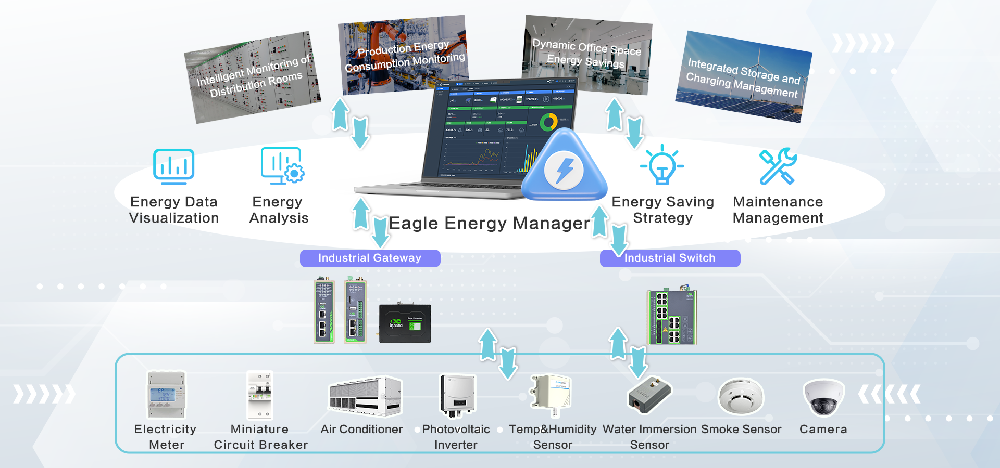
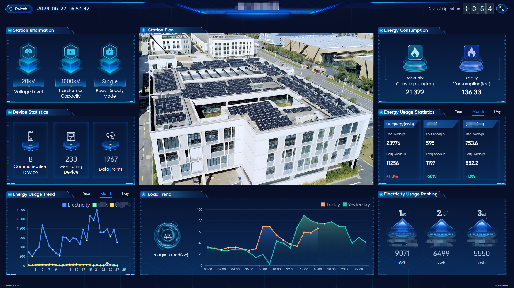
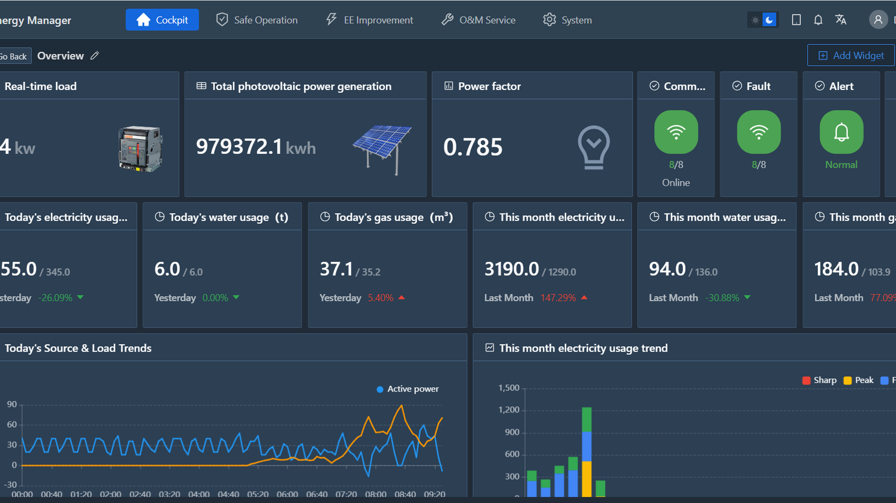
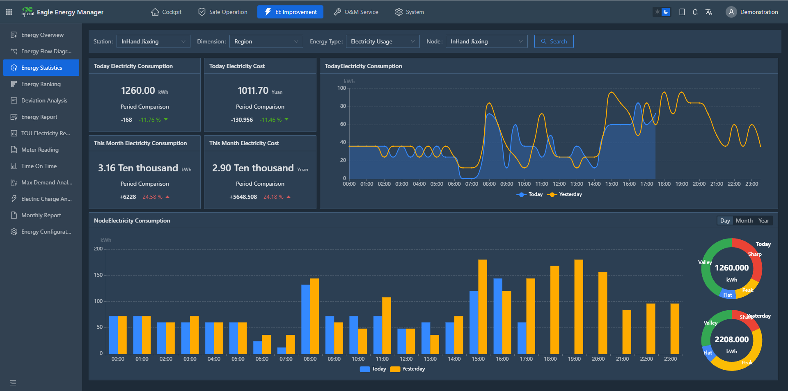
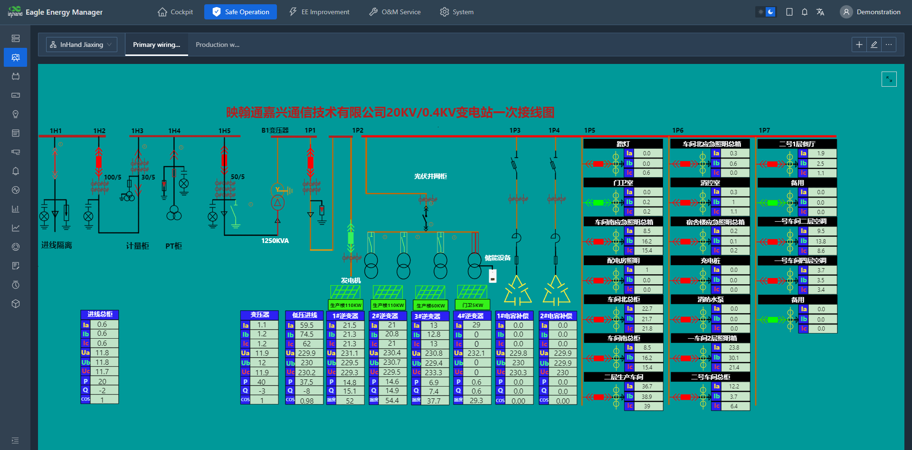

  

    

      
    

    

      Monitor · Analyze · Save · Reduce Emissions
    

  

  

    

      xEnergy Platform
    

    

      

        
· Real-time Monitoring

        
· Energy Analysis

      

      

        
· Cloud Platform

        
· Carbon Reduction

      

    

  

# 1. Product Overview

## Introduction

Energy supply faces various challenges worldwide. With climate change and environmental pollution worsening, energy conservation and carbon reduction have become a global consensus. To effectively address these challenges, there is an urgent need for efficient energy-saving and carbon-reducing solutions.

**xEnergy** offers a comprehensive cloud-to-terminal solution, enabling businesses to swiftly monitor and analyze energy, support conservation efforts, reduce emissions, and ensure equipment operates safely and reliably.

## Solution Architecture (Eagle Energy Manager)

The architecture spans (top → bottom):

- **Application scenarios**: Intelligent Monitoring of Distribution Rooms · Production Energy Consumption Monitoring · Dynamic Office Space Energy Savings · Integrated Storage and Charging Management
- **Eagle Energy Manager (cloud platform)**: Energy Data Visualization · Energy Analysis · Energy Saving Strategy · Maintenance Management
- **Edge layer**: Industrial Gateway · Industrial Switch
- **Field devices**: Electricity Meter · Miniature Circuit Breaker · Air Conditioner · Photovoltaic Inverter · Temp & Humidity Sensor · Water Immersion Sensor · Smoke Sensor · Camera

### Solution Value

<table style="width:100%; table-layout:fixed;">
  <colgroup>
    <col style="width:5%;">
    <col style="width:28%;">
    <col style="width:67%;">
  </colgroup>
  <tr><th></th><th>Value</th><th>Description</th></tr>
  <tr><td>1</td><td><strong>Real-time Monitoring</strong></td><td>Intuitively track equipment operation and promptly respond to fault alerts.</td></tr>
  <tr><td>2</td><td><strong>Energy Consumption Analysis</strong></td><td>Comprehensive understanding of utilities usage helps optimize energy usage, and reduce energy costs.</td></tr>
  <tr><td>3</td><td><strong>Operational Analysis</strong></td><td>Quickly understand operational conditions and improve efficiency.</td></tr>
  <tr><td>4</td><td><strong>Energy Saving</strong></td><td>Optimize energy use and reduce carbon emissions through energy-saving strategies.</td></tr>
  <tr><td>5</td><td><strong>Online Maintenance</strong></td><td>Improve operational efficiency, standardizing operational procedures and enhancing transparency in processes.</td></tr>
  <tr><td>6</td><td><strong>Electricity Safety Monitoring</strong></td><td>Multi-dimensional analysis of electrical quality ensures safety of equipment and employees.</td></tr>
</table>

# 2. Solution Features

## Software Features

**Real-time Monitoring**
- Unified equipment status monitoring
- Web-based visualization of equipment status
- Equipment alert notifications
- Equipment operation trends
- Video monitoring

**Energy Analysis and Optimization**
- Energy cost tracking
- Energy consumption reports
- Monthly analysis reports
- Customized analytical dashboards
- Customizable energy-saving strategies

**Maintenance Management**
- Online meter reading
- Equipment inspection plan management
- Maintenance work order management

## Hardware Features

**Rich Hardware Interfaces** — Multiple networking options including cellular, Ethernet, and WiFi. Various interfaces such as serial port, LoRa, and IO, allowing flexible expansion.

**Rich Product Selection** — Diverse selection of energy gateways, switches, smart meters, and sensor devices to effortlessly meet various requirements.

**Multi-protocol Support** — Support multiple industrial protocols, suitable for data collection needs in different scenarios.

## Platform Screenshots

  

    

      
    

    
Station / PV big screen

  

  

    

      
    

    
Eagle Energy Manager cockpit

  

  

    

      
    

    
Energy statistics analysis

  

  

    

      
    

    
Custom Web SCADA

  

# 3. Detailed Feature List

<table style="width:100%; table-layout:fixed;">
  <colgroup>
    <col style="width:22%;">
    <col style="width:26%;">
    <col style="width:52%;">
  </colgroup>
  <tr><th>Category</th><th>Feature</th><th>Description</th></tr>
  <tr><td><strong>Big screen &amp; dashboard</strong></td><td>Station/PV big screen</td><td>Provides a highly technological site energy consumption and solar power generation dashboard.</td></tr>
  <tr><td></td><td>Customized dashboard</td><td>Customize key data visualization display according to the actual situation of the enterprise.</td></tr>
  <tr><td><strong>Real-time Monitoring</strong></td><td>Equipment status monitoring</td><td>Support real-time data, historical data, and alert status monitoring for various equipments.</td></tr>
  <tr><td></td><td>Custom Web SCADA</td><td>Intuitive customize Web-based visualization.</td></tr>
  <tr><td></td><td>Energy-saving strategies</td><td>Implement energy-saving strategies for AC and lighting based on enterprise schedules, environmental temperatures, etc.</td></tr>
  <tr><td></td><td>Alarm Management</td><td>Supports custom alarm trigger conditions and offers multiple alert delivery methods via web, SMS, and mobile app etc.</td></tr>
  <tr><td></td><td>Timed Control</td><td>Enables unified scheduled control of devices based on business needs.</td></tr>
  <tr><td><strong>Energy Efficiency Analysis</strong></td><td>Energy flow diagram</td><td>Visually display the energy distribution path, identify potential energy waste points, and optimize energy utilization efficiency.</td></tr>
  <tr><td></td><td>Energy Statistics</td><td>Supports statistical analysis of energy consumption and cost, and identification of abnormal energy consumption.</td></tr>
  <tr><td></td><td>YoY &amp; PoP</td><td>Supports comparison of data from adjacent periods or different years in the same period.</td></tr>
  <tr><td></td><td>Custom Report</td><td>Support users to configure relevant report data that meets business needs according to actual needs.</td></tr>
  <tr><td></td><td>Deviation Analysis</td><td>Compare actual energy consumption data with baseline or expected values to identify energy consumption anomalies.</td></tr>
  <tr><td></td><td>Usage ranking</td><td>Support ranking analysis based on different management dimensions and various types of energy sources.</td></tr>
  <tr><td></td><td>Energy consumption report</td><td>Provide daily/monthly/yearly reports on energy consumption and costs, facilitating the analysis of enterprise operations.</td></tr>
  <tr><td></td><td>TOU Electricity Report</td><td>Analyze enterprise electricity usage patterns to optimize equipment scheduling and reduce costs.</td></tr>
  <tr><td></td><td>Meter Reading</td><td>Support online meter reading function.</td></tr>
  <tr><td></td><td>Monthly Report</td><td>Accurately assess equipment health and electricity usage rationality. Provide practical cost-saving suggestions and ensure reliable equipment operation.</td></tr>
  <tr><td><strong>Maintenance</strong></td><td>Maintenance Management</td><td>Address key challenges with online management: standardize content and enhance process transparency.</td></tr>
  <tr><td><strong>System Management</strong></td><td>Organizational management</td><td>Allowing flexible allocation of data permissions based on organizational structure.</td></tr>
  <tr><td></td><td>Role management</td><td>Customize user function permissions, finely control page access, easily meeting diverse authorization requirements.</td></tr>
  <tr><td><strong>Mobile APP</strong></td><td>Equipment status monitoring</td><td>Monitor equipment status and historical trends on mobile.</td></tr>
  <tr><td></td><td>Alarm notification</td><td>Receive real-time alerts on mobile devices and promptly respond to operational anomalies.</td></tr>
  <tr><td></td><td>Maintenance Management</td><td>Manage maintenance work orders directly from mobile.</td></tr>
</table>

> Platform link: [xenergy.inhandcloud.com](https://xenergy.inhandcloud.com)

# 4. Application Scenarios

  

    
Intelligent monitoring of distribution rooms

    

      
    

    
Real-time monitoring of power equipment and environmental conditions in distribution rooms to ensure safe and efficient power system operation and energy utilization.

  

  

    
Production energy consumption monitoring

    

      
    

    
Assist enterprises in understanding energy consumption on the production line, optimizing energy utilization, and enhancing production efficiency.

  

  

    
Dynamic office space energy savings

    

      
    

    
Assist managers in understanding energy usage and provide data support for setting energy-saving targets. Implement automated energy-saving measures to enhance energy utilization efficiency and reduce energy costs.

  

  

    
Integrated storage and charging management

    

      
    

    
Monitor and manage photovoltaic power generation systems, energy storage equipments, and charging equipment to achieve power storage, scheduling, and charging management, thereby enhancing energy utilization efficiency and system stability.

  

## 5. About Us

InHand Networks is a leading IoT solutions provider founded in 2001, dedicated to driving digital transformation across industries and empowering customers to unlock their full potential and achieve accelerated growth.

We specialize in delivering industrial-grade connectivity solutions for diverse sectors, such as enterprise networks, industrial and building IoT, digital energy, smart commerce, and mobility. Our comprehensive product portfolio and services cater to various applications worldwide, including smart factory automation, smart grid, intelligent transportation, smart cities, etc. With a global footprint spanning over 60 countries, we serve customers in China, the United States, France, Germany, the United Kingdom, Italy, and beyond.

**Headquarters**
43671 Trade Center Place, Suite 100, Dulles, VA 20166, USA
Tel: +1 (703) 348‑2988
E: info@inhand.com
W: [www.inhand.com](https://www.inhand.com)

