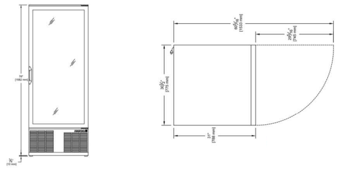

  

    

      
    

    

      Share happiness with your friends
    

  

  

    

      FV680 AI Vending Machine
    

    

      

        
· 24/7 Operation

        
· AI Recognition

      

      

        
· Grab & Go

        
· Remote Management

      

    

  

# 1. Product Overview

**FV680 AI vending machine for Grab & Go smart retail with cloud remote management.**

**Key features:**
- **24/7 Operation:** Fully automated; cuts labor cost
- **AI Recognition:** Proprietary algo; boosts conversion
- **Grab & Go:** Card swipe open; auto-checkout on close
- **Remote Management:** Cloud monitor, price, promotions
- **HealthLock:** Auto door-lock; keeps items fresh

## Core Technical Specifications

| Specification Item | Value |
|---|---|
| AI Recognition | Proprietary algorithm; boosts sales conversion |
| Privacy | Face blurring for compliance and privacy |
| Grab & Go | Card swipe to open; auto-checkout on door close |
| Remote Management | Cloud monitoring, pricing, and promotions |
| Cellular Connectivity | LTE module (FQ09 variant, model dependent) |
| Analytics | Sales trends, customer behavior |
| Dimensions | 775 × 788 × 1982 mm |
| Capacity | 680 L (24 cu.ft); 6 open shelves |
| Power Supply | 115 V AC, 60 Hz, 10 A; NEMA 5-15P |
| Compressor | 1/3 HP|
| Door Glass | Double-pane low-e tempered |
| Ship Weight | 164 kg (362 lbs) |

# 2. Product Dimensions

  

    
    
Front Elevation and Plan View (door swing)

  

  

    
Note:

    
1. All dimensions are in millimeters (mm); imperial units shown on drawing for reference.

    
2. Body dimensions (W × D × H): 775 × 788 × 1982 mm.

    
3. Door width: 745 mm; depth with door open 90°: 1533 mm.

    
4. Base clearance: 10 mm (3/8″).

    
5. All dimensions are approximate, for reference only.

    
6. Dimensions shown shall not be used for production.

    
7. Dimensions are subject to part and manufacturing tolerances.

    
8. Specifications may change without prior notice.

  

# 3. Hardware Specifications

| Category/Parameter | Specification |
|---|---|
| **Cabinet & Insulation** | |
| Insulation | Foamed-in-place polyurethane |
| Door Glass | Double-pane low-e tempered glass, argon filled |
| Shelving | 6 shelves; open shelves with flexible placement |
| Capacity | 680 L (24 cu.ft); ~2× traditional machine volume |
| **Refrigeration** | |
| Compressor | 1/3 HP |
| Ventilation | Directed airflow ventilation |
| **Smart Interface** | |
| POS | Integrated POS with screen (Grab & Go) |
| Door Access | Swipe card to open door; auto-checkout upon door closing |
| Payment Method | POS (per model configuration) |
| **Connectivity** | |
| Cellular | LTE module (FQ09 variant, model dependent) |
| **Electrical** | |
| Voltage | 115 V AC, 60 Hz |
| Current | 10 A |
| NEMA Configuration | 5-15P |
| **Mechanical** | |
| Dimensions (W × D × H) | 775 × 788 × 1982 mm |
| Door Width | 745 mm |
| Depth (door open 90°) | 1533 mm |
| Ship Weight | 164 kg (362 lbs) |
| Ship Cube | 1.39 m³ (49 cu.ft) |
| Base Clearance | 10 mm |

# 4. Software Specifications

| Category/Parameter | Specification |
|---|---|
| **AI Vending Machine Management System** | |
| AI Recognition | Proprietary recognition algorithm to boost sales conversion |
| Privacy | Face blurring for compliance and privacy protection |
| Checkout | Grab & Go: swipe card to open; auto-checkout on door close |
| **Operations & Monitoring** | |
| Remote Management | Real-time cloud monitoring and control |
| Remote Configuration | Adjust settings, pricing, and promotions remotely |
| Machine Monitoring | Real-time monitoring for continuous operation |
| Workflow | Intuitive interface; simplified operational workflow |
| **Analytics** | |
| Reporting | Sales trends and customer behavior reports |
| Decision Support | Data-driven decisions for smarter retail operations |

# 5. Ordering Information

## Model Rule

**Model code:** FV680-PS02-\<WMNN\>

\<WMNN\>: Cellular Type & Module (remote connectivity)

Configurable options per ordering guide:

- **\<BBB\>:** Capacity
- **\<XXX\>:** Payment Method
- **\<C\>\<E\>:** Other options

## Model List

| Model | Region | \<WMNN\>: Cellular Type & Module | Capacity | Payment Method | Other |
|---|---|---|:---:|:---:|:---:|
| FV680-PS02-FQ09 | Global | FQ09 | 680 L (24 cu.ft) | POS | — |

# 6. Contact Us

- **Website:** [InHand Networks](https://www.inhand.com)
- **Copyright:** © InHand Networks. All rights reserved.
