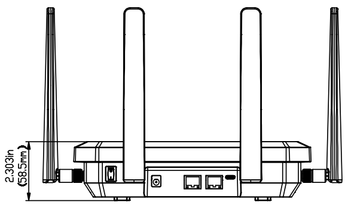
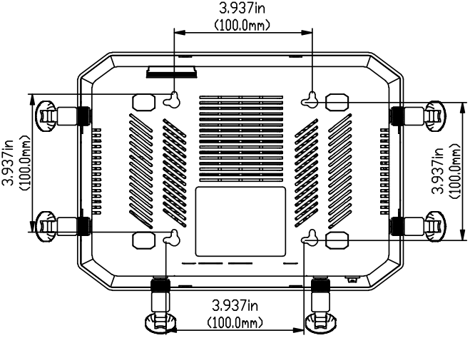
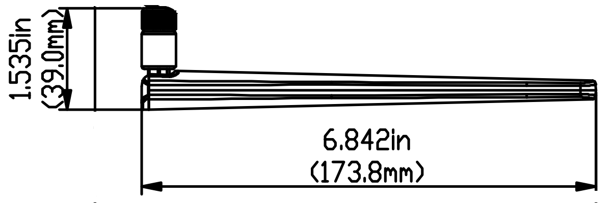

  

    

      
    

    

      Transform Connectivity, Unlock Possibilities
    

  

  

    

      FWA12 5G Router
    

    

      

        
· 5G

        
· Wi-Fi 7

      

      

        
· AI-Powered Management

        
· Enterprise Security

      

    

  

# 1. Product Overview

**The FWA12 5G router delivers ultra-fast connectivity with up to 7.01 Gbps downlink and 2.5 Gbps uplink. Supporting Wi-Fi 7 speeds up to 5000 Mbps and 128 device connections, it ensures seamless performance for business networks with enterprise-grade firewall, VPN security, and AI-powered cloud management.**

**Features and Advantages:** 
- **High-Performance 5G:** Quad-core A55, 5G R16 (NSA/SA), 7.01 Gbps DL / 2.5 Gbps UL, 4 DL CA + 2 UL CA, 300 MHz bandwidth
- **Next-Gen Wi-Fi 7:** Dual-band 2.4 / 5.8 GHz, 5000 Mbps peak rate, 128 concurrent connections, enhanced MU-MIMO
- **Enterprise Security:** IPSec and L2TP VPN, advanced firewall, traffic management, security logs, anomaly detection
- **AI-Driven Cloud Management:** InCloud Manager with zero-touch provisioning, AI assistant with 7×24 support
- **Built for Enterprise Agility:** Abundant features, flexible configuration, high network resilience

## Core Technical Specifications

|Technical Item|Specification|
| --- | --- |
| Cellular | 5G SA/NSA + LTE Cat19; up to 7.01 Gbps DL / 2.5 Gbps UL (5G) |
| Cloud Management | InCloud Manager; AI assistant (7×24) |
| VPN | IPsec, L2TP |
| Network | IPv4/IPv6 |
| Wi-Fi | Wi-Fi 7 (802.11be), 2.4/5.8 GHz, 5000 Mbps |
| Throughput / Users | Stateful firewall 2 Gbps; up to 220 users (128 Wi-Fi) |
| SIM | 1 × eSIM + 2 × Nano SIM (hot-swap) |
| Ethernet / USB | 2 × 2.5 GbE (WAN/LAN, dual-LAN); USB-C 2.0 |
| Antennas | 6 × external + 2 × internal cellular; 3 × internal Wi-Fi |
| Power | 12 V / 3 A; ≤24 W |
| Dimensions | 236 × 172.5 × 58.5 mm |
| Certification | FCC, IC, PTCRB, Verizon, T-Mobile, AT&T |

# 2. Product Dimensions

  

    
    
Front View

  

  

    
    
Black View

  

  

    
    
Side View

  

  

    
Note:

    
1. All dimensions are in millimeters (mm).

    
2. Dimensions (L × W × H): 236 × 172.5 × 58.5 mm (9.29 × 6.79 × 2.3 in).

    
3. All dimensions are approximate, for reference only.

    
4. Dimensions shown shall not be used for production.

  

# 3. Hardware Specifications

| Category/Parameter | Specification |
| --- | --- |
| **Performance Metrics** | |
| Stateful Firewall Throughput | 2 Gbps |
| Recommended Users | 220 (128 Wi-Fi devices) |
| **Interfaces** | |
| Ethernet | 2 × 2.5 GbE RJ45, WAN/LAN switchable, dual-LAN |
| USB | 1 × Type-C 2.0, HOST and SLAVE modes |
| SIM | 1 × eSIM; 2 × Nano SIM, hot plug |
| Reset | Reset button |
| Power Switch | 1 × button |
| LED | System, Cellular, Signal, WAN, LAN, Wi-Fi |
| Antenna | 6 × external + 2 × built-in antenna; 3 × built-in Wi-Fi antenna |
| **Cellular** | |
| Data Rate | 5G SA/NSA: 7.01 Gbps DL / 2.5 Gbps UL; 4G CAT19: 1.6 Gbps DL / 200 Mbps UL |
| Antenna Freq. | 617–5925 MHz |
| Antenna Gain | 617–894 MHz: 2 dBi; 1700–5000 MHz: 4.11 dBi |
| **Wi-Fi** | |
| Frequency | 2.4 GHz, 5.8 GHz |
| Max Bandwidth | 5000 Mbps |
| Protocol | 802.11 be/ax/ac/b/g/n, Wi-Fi 7 |
| Antenna Freq. | 2400–2500 MHz; 5000–5800 MHz |
| Antenna Gain | 2400–2500 MHz: 4.17 dBi; 5000–5800 MHz: 4.56 dBi |
| **Power** | |
| Input | Circular interface, 12 V / 3 A |
| Power Consumption | ≤ 24 W |
| **Mechanical** | |
| Dimensions | 236 × 172.5 × 58.5 mm |
| Weight | 2.2 lbs |
| Installation | Wall mounting, desktop mounting |
| **Environment** | |
| Operating Temperature | -10 °C ~ +50 °C |
| Storage Temperature | -40 °C ~ +85 °C |
| Humidity | 5–95 % RH (non-condensing) |
| Protection | IP20 |
| **Physical** | |
| Shock | IEC 60068-2-27 |
| Vibration | IEC 60068-2-6 |
| Free Fall | IEC 60068-2-32 |
| **Certification** | |
| Certification | FCC, IC, PTCRB, Verizon, T-Mobile, AT&T |
| Warranty | 3 years |

# 4. Software Specifications

| Category/Parameter | Specification |
| --- | --- |
| **Cloud Management** | |
| Platform | InCloud Manager |
| Features | Zero-touch provisioning, centralized management, visualized monitoring |
| AI Assistant | 7×24 support, context-aware problem solving |
| **Network Features** | |
| Access | 5G/4G cellular, Ethernet |
| Dialing | PPPoE, cellular auto redial, dual SIM switching, APN configuration |
| Link Backup | Packet-by-packet load balancing, link priority adjustment |
| Link Monitoring | Real-time delay, jitter, packet loss, throughput monitoring |
| IP Protocol | IPv4 / IPv6 |
| Applications | VLAN, DHCP Server/Client, DNS, DDNS, Fixed Address, IP Passthrough |
| Interface | Duplex mode, link negotiation, interface enable |
| **Security** | |
| VPN | IPSec VPN, L2TP VPN |
| Firewall | Access control, port mapping, port forwarding, MAC/IP/port/protocol filtering |
| **Monitoring** | |
| Dashboard | Device info, interface status, traffic analysis |
| Cellular Signal | Real-time RSSI, RSRP, RSRQ, SINR, etc. |
| Logs | System logs, diagnostic logs, device events, email alerts |
| **Wi-Fi** | |
| Mode | 802.11 be/ax/ac/b/g/n, Wi-Fi 7, AP mode |
| **Policy** | |
| Policy | Policy routing, traffic shaping |
| **Self Recovery** | |
| Watchdog | Software and hardware watchdog, self-healing |
| **Remote Maintenance** | |
| Access | Web UI, CLI remote access and control |
| Cloud | Remote maintenance of PCs, monitoring equipment, servers, etc. |
| Diagnostics | Ping, Traceroute, packet capture, diagnostic logs |
| Config | Configuration import and export |

# 5. Ordering Information

## Model Code

**Model code:** FWA12-\u003cWMNN\u003e

\u003cWMNN\u003e: Type & Module

## Product Models

<table style="width:100%; table-layout:fixed;">
  <colgroup>
    <col style="width:24%;">
    <col style="width:20%;">
    <col style="width:56%;">
  </colgroup>
  <tr><th>Model</th><th>Region</th><th>Specification</th></tr>
  <tr><td style="white-space: nowrap;">FWA12-NANR</td><td>North America</td><td>5G Sub-6: n2/5/7/12/13/14/25/26/29/30/38/41/48/66/70/71/77/78;  LTE-FDD B2/4/5/7/12/13/14/17/25/26/29/30/66/71;  LTE-TDD B38/41/42/43/48</td></tr>
</table>

# 6. Contact Us

- **Website:** [InHand Networks](https://www.inhand.com.cn)
- **Copyright:** © InHand Networks. All rights reserved.
