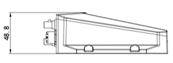

  

    

      
    

    

      Compact Edge Gateway, Reliable Connectivity, Industrial Design
    

  

  

    

      IG101 Edge Gateway
    

    

      

        
· LTE Cat1

        
· Modbus to MQTT

      

      

        
· Edge Computing

        
· Device Manager

      

    

  

# 1. Product Overview

**IG101 is a compact industrial edge gateway for IIoT applications, delivering cost-effective LTE connectivity and flexible edge data processing for large-scale device networking.**

**Product Highlights:**
- **Reliable Cellular Access:** LTE Cat1 connectivity for always-on remote access
- **Edge Data Processing:** Supports customized edge computing and data preprocessing
- **Industrial Reliability:** Metal housing, watchdog, and multi-level link detection
- **Cloud Integration:** Supports MQTT and fast integration with third-party cloud platforms
- **Scalable O&M:** Supports InHand Device Manager for large-scale deployment and management

## Core Technical Specifications

| Item | Specification |
|---|---|
| Cellular Network | LTE Cat1 |
| Network Access and Authentication | APN, VPDN; CHAP/PAP |
| Industrial Protocol | Modbus RTU |
| Cloud Connectivity | Standard MQTT protocol, connects to third-party cloud platforms |
| Remote Management | InHand Device Manager Platform |
| CPU | ARM Cortex-A5 |
| Memory and Flash | 4 MB RAM + 8 MB Flash |
| Interface Set | 1 x RS-485, 1 x RS-232, 1 x SIM, 7-PIN terminal |
| Power and Consumption | DC 7-38V; standby 150 mA @ 12V, working 280 mA @ 12V, peak 340 mA @ 12V |
| Operating Temperature | -20 ~ 70 ℃ |
| Dimensions and Protection | 76 x 108 x 37.5 mm, IP30 |

# 2. Product Dimensions & Terminal Definition

  

    
    
Top View

  

  

    
    
Interface Side

  

    

    
    
Side View

  

  

    
Notes:

    
1. All dimensions are in millimeters (mm).

    
2. All dimensions are approximate and for reference only.

    
3. Drawing dimensions are not intended for manufacturing.

    
4. Dimensions are subject to part and process tolerances.

    
5. Specifications are subject to change without notice.

  

## 7 PIN Definition

<table style="width:78%;">
  <colgroup>
    <col style="width:15%;">
    <col style="width:23%;">
    <col style="width:62%;">
  </colgroup>
  <tr><th align="center">PIN</th><th align="center">Definition</th><th align="left">Description</th></tr>
  <tr><td align="center">1</td><td align="center">V+</td><td>Positive electrode</td></tr>
  <tr><td align="center">2</td><td align="center">V-</td><td>Negative electrode</td></tr>
  <tr><td align="center">3</td><td align="center">B</td><td>RS-485- of serial 1</td></tr>
  <tr><td align="center">4</td><td align="center">A</td><td>RS-485+ of serial 1</td></tr>
  <tr><td align="center">5</td><td align="center">GND</td><td>Signal ground</td></tr>
  <tr><td align="center">6</td><td align="center">TXD</td><td>Serial RS232 send</td></tr>
  <tr><td align="center">7</td><td align="center">RXD</td><td>Serial RS232 receive</td></tr>
</table>

# 3. Hardware Specifications

| Category/Parameter | Specification |
|--------------------|---------------|
| **CPU and Storage** | |
| CPU | ARM Cortex-A5 |
| RAM | 4 MB |
| Flash | 8 MB |
| **Connectivity and Interfaces** | |
| Serial Ports | 1 x RS-485, 1 x RS-232, industrial terminal block |
| SIM Card Slot | 1 x SIM, 1.8V/3V |
| Reset Button | Pinhole reset button |
| LED Indicators | PWR, NET, STATUS, WARN, Signal Strength (3) |
| TF Card Slot (Micro SD) | Micro SD, up to 32 GB |
| **Power and Power Consumption** | |
| Power Input | DC 7-38V, reverse polarity protection |
| Power Interface | Industrial terminal block |
| Standby Power | 150 mA @ 12V |
| Working Power | 280 mA @ 12V |
| Peak Power | 340 mA @ 12V |
| **Mechanical Specifications** | |
| Dimensions (L x W x H) | 76 x 108 x 37.5 mm |
| Mounting Method | DIN-rail, wall mounting |
| Protection Rating | IP30 |
| Housin | Metal housing |
| Hardware Watchdog | Device self-diagnosis and auto-recovery (fuzzy-mapped from Embedded Watchdog) |
| **Environment and Certifications** | |
| Storage Temperature | -40 ~ 85 C |
| Operating Temperature | -20 ~ 70 C |
| Ambient Humidity | 5 ~ 95% (non-condensing) |
| Physical Characteristics | IEC60068-2-27 shock resistance; IEC60068-2-6 vibration resistance; IEC60068-2-32 drop resistance |
| EMC Standard | EN61000-4-2, level 3, Static EN61000-4-3, level 3, Radiation Electric Field EN61000-4-4, level 3, Pulsed Electric Field EN61000-4-5, level 3, Surge EN61000-4-6, level 3, Conducted Distubance Immunity EN61000-4-8, Power Frequency Field Resistance, horizontal / vertical 400A/m (>level 3) EN61000-4-12, level 3, Shock Wave Resistance |

# 4. Software Specifications

| Category/Parameter | Specification |
|--------------------|---------------|
| **Operating System** | |
| OS | FreeRTOS |
| **Network Features** | |
| Network Access | APN, VPDN |
| Access Authentication | CHAP/PAP |
| Network Types/Standards | LTE Cat1 |
| IP Applications | ICMP, DNS, TCP/UDP, TCP Server |
| **Security** | |
| User Management | Multi-level user authorization |
| AAA (Authentication, Authorization, Accounting) | CHAP/PAP |
| **Reliability** | |
| Link Detection/Probing | Heartbeat packet detection, auto-redial after disconnection |
| Embedded Watchdog | Device self-diagnosis and auto-recovery |
| **Open Platform and Data Acquisition Protocols (DSA)** | |
| Python Secondary Development | Customization development platform |
| DSA Protocol Engine | Standard MQTT protocol, connects to third-party cloud platforms |
| Industrial Protocols | Modbus RTU |
| **Network Management** | |
| Configuration Methods | Local/remote configuration tools |
| Upgrade Methods | Local or remote firmware upgrade |
| Log Function | Local logs, remote logs, important log power-off preservation |
| Configuration Backup | Import/export configuration files |
| Remote Management | InHand Device Manager Platform |
| Network Management Functions | InHand Device Manager Platform |
| Network Diagnostics | Ping |

# 5. Ordering Information

## Model Rule

**Model code:** IG101-\<WMNN\>-\<IO/NA\>

\<WMNN\>: WLAN & MODULE

## Model List

| Model | Region | \<WMNN\>: WLAN & MODULE | \<IO/NA\> |
|------|--------|--------------------------|-----------|
| IG101-LQA3-STD | China | LTE-FDD: B1/B3/B5/B8 LTE-TDD: B34/B38/B39/B40/B41 GSM: B3/B5/B8 | 1 x RS485 + 1 x RS232, no I/O |
| IG101-FQ53-STD | EMEA | LTE-FDD: B1/B3/B5/B7/B8/B20/B28 LTE-TDD: B38/B40/B41 GSM: B2/B3/B5/B8 | 1 x RS485 + 1 x RS232, no I/O |

# 6. Contact Us

- **Website:** [InHand Networks](https://www.inhand.com)
- **Copyright:** © InHand Networks. All rights reserved.

