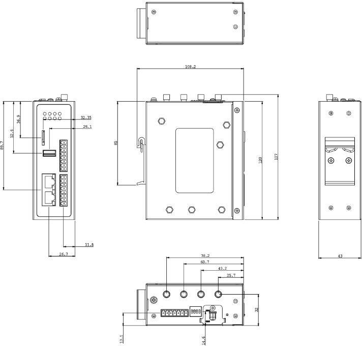
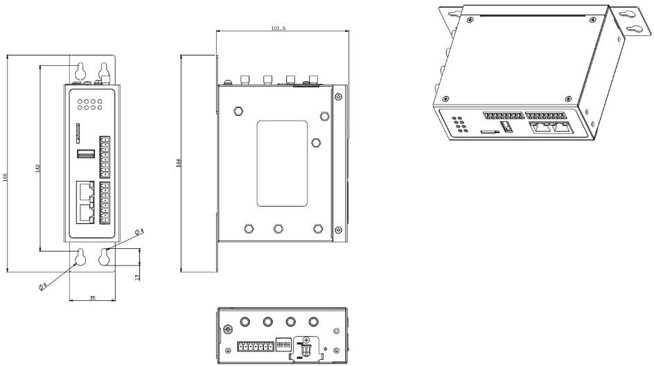
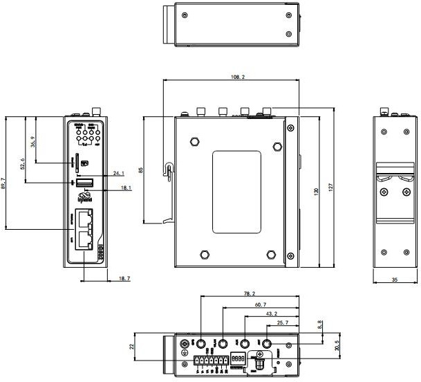

  

    

      
    

    

      Embrace edge computing to empower industrial digitization
    

  

  

    

      IG502 Series Cost-effective Edge Gateway
    

    

      

        
· Multiple Access

        
· Rich Interfaces

      

      

        
· Built-in DSA

        
· Cloud Management

      

    

  

# 1. Product Overview

**IG502 is a compact and cost-effective industrial edge gateway for global cellular connectivity, protocol conversion, and cloud-managed remote operations.**

**Key features:**
- **Flexible connectivity:** Supports cellular, Ethernet, Wi-Fi backup, and dual SIM failover
- **Industrial interfaces:** 2×FE, serial, USB, MicroSD, optional DI/DO and GPS/Wi-Fi/BLE
- **Edge intelligence:** Python secondary development with built-in DSA service
- **Reliable design:** Hardware/software watchdog and multi-level link self-healing
- **Cloud operations:** DeviceLive remote access, batch management, and DSA lifecycle control

## Core Technical Specifications

| Specification Item | Value |
|---|---|
| Cellular Network | 5G SA/NSA (China models) and LTE Cat1/Cat4 (model dependent) |
| Network Features | APN, VPDN, CHAP/PAP; Static IP/DHCP; ICMP, DNS, TCP/UDP, TCP Server, static routing |
| Security | Multi-level user permissions, firewall, OpenVPN, IPSec VPN |
| Cloud Management | DeviceLive remote access, batch operations, and remote upgrades |
| Secondary Development | Python development environment |
| Industrial Protocols | Modbus RTU/TCP, OPC UA, EtherNet/IP, IEC101/104, DNP3.0, etc. |
| Dimensions (W × D × H) | 110 × 127 × 35 mm |
| Weight | 420 g |
| Ethernet Ports | 2 × 10/100Mbps |
| Serial Interfaces | 1 × RS232 + 1 × RS485, or 2 × RS485 (model dependent) |
| Power Supply | 12~48V DC, industrial terminal block |
| Operating Temperature & Protection | -20~70℃, IP30 |

# 2. Product Dimensions & Terminal Definition

  

    
    
Front View

  

  

    
    
Side View

  

  

    
    
Interface Diagram

  

  

    
Note:

1. All dimensions are in millimeters (mm).

2. All dimensions are approximate and for reference only.

3. Dimensioned drawings are not intended for machining.

4. Dimensions are subject to part and manufacturing tolerances.

5. Specifications may change without prior notice.

  

## 7 PIN Definition

<table style="width:78%;">
  <colgroup>
    <col style="width:15%;">
    <col style="width:23%;">
    <col style="width:62%;">
  </colgroup>
  <tr><th align="center">PIN</th><th align="center">Definition</th><th align="left">Description</th></tr>
  <tr><td align="center">1</td><td align="center">V+</td><td>Positive electrode</td></tr>
  <tr><td align="center">2</td><td align="center">V-</td><td>Negative electrode</td></tr>
  <tr><td align="center">3</td><td align="center">TXD or 1A</td><td>Serial RS232 send or RS485+</td></tr>
  <tr><td align="center">4</td><td align="center">RXD or 1B</td><td>Serial RS232 receive or RS485-</td></tr>
  <tr><td align="center">5</td><td align="center">GND</td><td>Serial RS232 signal ground</td></tr>
  <tr><td align="center">6</td><td align="center">A or 2A</td><td>Serial RS485+</td></tr>
  <tr><td align="center">7</td><td align="center">B or 2B</td><td>Serial RS485-</td></tr>
</table>

## I/O Definition

<table style="width:78%;">
  <colgroup>
    <col style="width:15%;">
    <col style="width:23%;">
    <col style="width:62%;">
  </colgroup>
  <tr><th align="center">PIN</th><th align="center">Definition</th><th align="left">Description</th></tr>
  <tr><td align="center">1</td><td align="center">PCOM</td><td>Dry contact access point</td></tr>
  <tr><td align="center">2</td><td align="center">DGND</td><td>Dry contact ground point</td></tr>
  <tr><td align="center">3</td><td align="center">DICOM</td><td>Digital input common port</td></tr>
  <tr><td align="center">4</td><td align="center">DI0</td><td>Digital/pulse input port 0</td></tr>
  <tr><td align="center">5</td><td align="center">DI1</td><td>Digital/pulse input port 1</td></tr>
  <tr><td align="center">6</td><td align="center">DI2</td><td>Digital/pulse input port 2</td></tr>
  <tr><td align="center">7</td><td align="center">DI3</td><td>Digital/pulse input port 3</td></tr>
  <tr><td align="center">8</td><td align="center">NC</td><td>None</td></tr>
  <tr><td align="center">9</td><td align="center">DO0</td><td>Digital/pulse output port 0</td></tr>
  <tr><td align="center">10</td><td align="center">DGND</td><td>Digital ground</td></tr>
  <tr><td align="center">11</td><td align="center">DO1</td><td>Digital/pulse output port 1</td></tr>
  <tr><td align="center">12</td><td align="center">DGND</td><td>Digital ground</td></tr>
  <tr><td align="center">13</td><td align="center">DO2</td><td>Digital/pulse output port 2</td></tr>
  <tr><td align="center">14</td><td align="center">DGND</td><td>Digital ground</td></tr>
  <tr><td align="center">15</td><td align="center">DO3</td><td>Digital/pulse output port 3</td></tr>
  <tr><td align="center">16</td><td align="center">DGND</td><td>Digital ground</td></tr>
</table>

**DI input specs:**
- 4x  Digital/pulse input DI,
- 2x  Dry contact control port,
- 1x  Common port,  1x  Idle,
- Dry contact status "1": closed
- Dry contact status "0": disconnected
- Wet contact status "1": +10 ~ +30V/-30 ~ - 10VDC
- Wet contact status "0": 0 ~ +3V/-3 ~ 0V
- Isolation 3000VDC
- Pulse signal counter supported
- Supports up to  100Hz pulse signal (32-bit counter +1-bit overflow mark)

**DO output specs:**
- 3x Digital/pulse output DO
- 1x Digital output
- 4x Digital ground
- Isolation: 3000VDC

# 3. Hardware Specifications

| Category/Parameter | Specification |
|--------------------------|------|
| **CPU and Storage** | |
| CPU | ARM Cortex-A8 @600MHz |
| RAM | 512MB |
| Flash | 8GB eMMC |
| **Connectivity and Interfaces** | |
| Ethernet Ports | 2×10/100Mbps Ethernet |
| I/O Ports | Up to 4×DI + 4×DO (optional) |
| Serial Ports | 1×RS232 + 1×RS485, or 2×RS485, industrial terminal block, ordering guide for details |
| SIM Card Slot | Dual Micro SIM |
| Antenna Connectors | LTE：SMA x 1, Wi-Fi：SMA x 1, GNSS：SMA x 1,  Note: North America models: 2 x SMA 4G antenna connectors. |
| USB | USB2.0 Type-A |
| TF | MicroSD up to 32GB |
| Wi-Fi(optional) | Wi-Fi STA 802.11 b/g/n 2.4G |
| Bluetooth(optional) | BLE4.2 (optional) |
| GNSS(optional) | Satellite location GPS |
| **Power and Power Consumption** | |
| Input Voltage | 12~48V DC input |
| Power Interface | Industrial terminal block |
| Power | 250mA@12V |
| **Mechanical Specifications** | |
| Product Dimensions | 110×127×35mm |
| Product Weight | 420g |
| Mounting Method | Panel, DIN-rail mounting |
| Protection Rating | IP30 |
| Housing and Cooling | Fanless metal housing |
| RTC | Support (button battery backup) |
| Hardware Watchdog | support |
| **Environment and Certifications** | |
| Storage Temperature | -40~85℃ |
| Operating Temperature | -20~70℃ |
| Ambient Humidity | 5~95% RH non-condensing |
| Physical Characteristics | IEC60068-2-27 shock resistance IEC60068-2-6 vibration resistance IEC60068-2-32 drop resistance |
| EMC Standard | EN61000-4-2, level 3, Static EN61000-4-3, level 3, Radiation Electric Field EN61000-4-4, level 3, Pulsed Electric Field EN61000-4-5, level 3, Surge EN61000-4-6, level 3, Conducted Distubance Immunity EN61000-4-8, Power Frequency Field Resistance, horizontal / vertical 400A/m (>level 2) EN61000-4-12, level 3, Shock Wave Resistance |
| Certifications | CE, UKCA, FCC, PTCRB, UL, C1D2 (Class1 Division 2), MIC&JATE, VerizonWireless, AT&T, IC, RCM, NBTC, ANATEL, IEC62443-4-2, IEC61850-3 |

# 4. Software Specifications

| Category/Parameter | Specification |
|--------------------------|------|
| **Operating System** | Custom Linux |
| **Network Features** | |
| Network Access | APN, VPDN |
| Access Authentication | CHAP/PAP |
| Network Types/Standards | 5G SA/NSA and LTE Cat1/Cat4 by model |
| WAN Protocols | Static IP, DHCP |
| LAN Protocols | ARP, Ethernet |
| IP Applications | ICMP, DNS, TCP/UDP, TCP Server, DHCP |
| IP Routing | Static routing |
| **Security** | |
| User Management | Multi-level user permissions |
| Network Security | Firewall |
| Data Security | OpenVPN, IPSec VPN |
| **Reliability** | |
| Link Detection | Sends heartbeat packets to detect, auto redials when disconnected |
| Embedded Watchdog | Embedded watchdog auto-recovery |
| Dual-SIM Switching | Dual SIM failover |
| **Open Platform and Data Acquisition Protocols (DSA)** | |
| Development Environment| Python development environment |
| Cloud Integration | AWS, Azure, AliCloud and other cloud platforms |
| Industrial Protocols | Modbus RTU/TCP, EtherNet/IP, ISO on TCP, OPC UA, Mitsubishi MC/CPU Port, FINSUDP, HostLink, PPI |
| Electricity Protocol | DLT645-2007, IEC101/104, DNP3.0, IEC61850-MMS |
| Other Protocols | BACnet, CNC |
| **Network Management** | |
| Configuration | Web/Telnet/SSH configuration |
| Upgrade | Web/DeviceLive upgrade |
| Log | Support local system logs, remote logs, and important log power-off preservation |
| Configuration Backup | Config import/export |
| Remote Management | DeviceLive/HTTP/HTTPS/SSH remote management |

# 5. Ordering Information

## Model Rule

**Model code:** IG502-\<WMNN\>-\<S\>-\<IO/NA\>-\<W/NA\>-\<G/NA\>[-TH]

\<WMNN\>: Cellular Type & Frequency Band (or EN00 for no cellular)  
\<S\>: Serial option (`S`=RS232×1+RS485×1, `D485`=RS485×2)  
\<IO/NA\>: DI/DO option (`IO`=4DI+4DO)  
\<W/NA\>: WLAN & BLE option  
\<G/NA\>: GPS option  
[-TH]: Thailand regional variant (for specific FQ58 models)

## Model List

| Model | Region | \<WMNN\>: Cellular Type & Frequency Band | \<S\> | \<IO/NA\> | \<W/NA\> | \<G/NA\> |
|------|--------|-------------------------------------------|------|-----------|----------|----------|
| IG502-LQA3 | China | CAT1; LTE-FDD B1/B3/B5/B8; LTE-TDD B34/B38/B39/B40/B41; GSM 900/1800 | S | NA | NA | NA |
| IG502-LQA3-IO | China | CAT1; LTE-FDD B1/B3/B5/B8; LTE-TDD B34/B38/B39/B40/B41; GSM 900/1800 | S | IO | NA | NA |
| IG502-LQA3-W-G | China | CAT1; LTE-FDD B1/B3/B5/B8; LTE-TDD B34/B38/B39/B40/B41; GSM 900/1800 | S | NA | W | G |
| IG502-LQA3-IO-W-G | China | CAT1; LTE-FDD B1/B3/B5/B8; LTE-TDD B34/B38/B39/B40/B41; GSM 900/1800 | S | IO | W | G |
| IG502-LQA3-D485 | China | CAT1; LTE-FDD B1/B3/B5/B8; LTE-TDD B34/B38/B39/B40/B41; GSM 900/1800 | D485 | NA | NA | NA |
| IG502-LQA3-D485-IO | China | CAT1; LTE-FDD B1/B3/B5/B8; LTE-TDD B34/B38/B39/B40/B41; GSM 900/1800 | D485 | IO | NA | NA |
| IG502-LQA3-D485-W-G | China | CAT1; LTE-FDD B1/B3/B5/B8; LTE-TDD B34/B38/B39/B40/B41; GSM 900/1800 | D485 | NA | W | G |
| IG502-LQA3-D485-IO-W-G | China | CAT1; LTE-FDD B1/B3/B5/B8; LTE-TDD B34/B38/B39/B40/B41; GSM 900/1800 | D485 | IO | W | G |
| IG502-NRQ1 | China | 5G NR NSA n41/n78/n79; SA n1/n28/n41/n77/n78/n79; LTE-FDD B1/B3/B5/B8; LTE-TDD B34/B38/B39/B40/B41; WCDMA B1/B5/B8 | S | NA | NA | NA |
| IG502-NRQ1-D485 | China | 5G NR NSA n41/n78/n79; SA n1/n28/n41/n77/n78/n79; LTE-FDD B1/B3/B5/B8; LTE-TDD B34/B38/B39/B40/B41; WCDMA B1/B5/B8 | D485 | NA | NA | NA |
| IG502-FQ33 | North America | CAT1; LTE-FDD B2/B4/B5/B12/B13/B25/B26; WCDMA B2/B4/B5 | S | NA | NA | NA |
| IG502-FQ33-IO | North America | CAT1; LTE-FDD B2/B4/B5/B12/B13/B25/B26; WCDMA B2/B4/B5 | S | IO | NA | NA |
| IG502-FQ33-W-G | North America | CAT1; LTE-FDD B2/B4/B5/B12/B13/B25/B26; WCDMA B2/B4/B5 | S | NA | W | G |
| IG502-FQ33-IO-W-G | North America | CAT1; LTE-FDD B2/B4/B5/B12/B13/B25/B26; WCDMA B2/B4/B5 | S | IO | W | G |
| IG502-FQ33-D485-IO-W-G | North America | CAT1; LTE-FDD B2/B4/B5/B12/B13/B25/B26; WCDMA B2/B4/B5 | D485 | IO | W | G |
| IG502-FF53 | EMEA | CAT1; LTE-FDD B1/B3/B7/B8/B20/B28; GSM/GPRS/EDGE B3/B8 | S | NA | NA | NA |
| IG502-FF53-IO | EMEA | CAT1; LTE-FDD B1/B3/B7/B8/B20/B28; GSM/GPRS/EDGE B3/B8 | S | IO | NA | NA |
| IG502-FF53-W-G | EMEA | CAT1; LTE-FDD B1/B3/B7/B8/B20/B28; GSM/GPRS/EDGE B3/B8 | S | NA | W | G |
| IG502-FF53-IO-W-G | EMEA | CAT1; LTE-FDD B1/B3/B7/B8/B20/B28; GSM/GPRS/EDGE B3/B8 | S | IO | W | G |
| IG502-FF53-D485-IO-W-G | EMEA | CAT1; LTE-FDD B1/B3/B7/B8/B20/B28; GSM/GPRS/EDGE B3/B8 | D485 | IO | W | G |
| IG502-FQ58 | EMEA | CAT4; LTE-FDD B1/B3/B7/B8/B20/B28A; WCDMA B1/B8; GSM B3/B8 | S | NA | NA | NA |
| IG502-FQ58-IO | EMEA | CAT4; LTE-FDD B1/B3/B7/B8/B20/B28A; WCDMA B1/B8; GSM B3/B8 | S | IO | NA | NA |
| IG502-FQ58-W-G | EMEA | CAT4; LTE-FDD B1/B3/B7/B8/B20/B28A; WCDMA B1/B8; GSM B3/B8 | S | NA | W | G |
| IG502-FQ58-IO-W-G | EMEA | CAT4; LTE-FDD B1/B3/B7/B8/B20/B28A; WCDMA B1/B8; GSM B3/B8 | S | IO | W | G |
| IG502-FQ58-D485-IO-W-G | EMEA | CAT4; LTE-FDD B1/B3/B7/B8/B20/B28A; WCDMA B1/B8; GSM B3/B8 | D485 | IO | W | G |
| IG502-FQ58-TH | Thailand | CAT4; LTE-FDD B1/B3/B7/B8/B20; WCDMA B1/B8; GSM B3/B8 | S | NA | NA | NA |
| IG502-FQ58-IO-TH | Thailand | CAT4; LTE-FDD B1/B3/B7/B8/B20; WCDMA B1/B8; GSM B3/B8 | S | IO | NA | NA |
| IG502-FQ58-W-G-TH | Thailand | CAT4; LTE-FDD B1/B3/B7/B8/B20; WCDMA B1/B8; GSM B3/B8 | S | NA | W | G |
| IG502-FQ58-IO-W-G-TH | Thailand | CAT4; LTE-FDD B1/B3/B7/B8/B20; WCDMA B1/B8; GSM B3/B8 | S | IO | W | G |
| IG502-FQ58-D485-IO-W-G-TH | Thailand | CAT4; LTE-FDD B1/B3/B7/B8/B20; WCDMA B1/B8; GSM B3/B8 | D485 | IO | W | G |
| IG502-FQ78 | Australia & Latin America | CAT4; LTE-FDD B1/B2/B3/B4/B5/B7/B8/B28; LTE-TDD B40; UMTS B1/B2/B5/B8; GSM 850/900/1800/1900 | S | NA | NA | NA |
| IG502-FQ78-IO | Australia & Latin America | CAT4; LTE-FDD B1/B2/B3/B4/B5/B7/B8/B28; LTE-TDD B40; UMTS B1/B2/B5/B8; GSM 850/900/1800/1900 | S | IO | NA | NA |
| IG502-FQ78-W-G | Australia & Latin America | CAT4; LTE-FDD B1/B2/B3/B4/B5/B7/B8/B28; LTE-TDD B40; UMTS B1/B2/B5/B8; GSM 850/900/1800/1900 | S | NA | W | G |
| IG502-FQ78-IO-W-G | Australia & Latin America | CAT4; LTE-FDD B1/B2/B3/B4/B5/B7/B8/B28; LTE-TDD B40; UMTS B1/B2/B5/B8; GSM 850/900/1800/1900 | S | IO | W | G |
| IG502-FQ78-D485-IO-W-G | Australia & Latin America | CAT4; LTE-FDD B1/B2/B3/B4/B5/B7/B8/B28; LTE-TDD B40; UMTS B1/B2/B5/B8; GSM 850/900/1800/1900 | D485 | IO | W | G |
| IG502-EN00 | Global (No Cellular) | No cellular | S | NA | NA | NA |
| IG502-EN00-IO | Global (No Cellular) | No cellular | S | IO | NA | NA |
| IG502-EN00-W-G | Global (No Cellular) | No cellular | S | NA | W | G |
| IG502-EN00-IO-W-G | Global (No Cellular) | No cellular | S | IO | W | G |
| IG502-EN00-D485-IO-W-G | Global (No Cellular) | No cellular | D485 | IO | W | G |

# 6. Contact Us

- **Website:** [InHand Networks](https://www.inhand.com)
- **Copyright:** © InHand Networks. All rights reserved.
