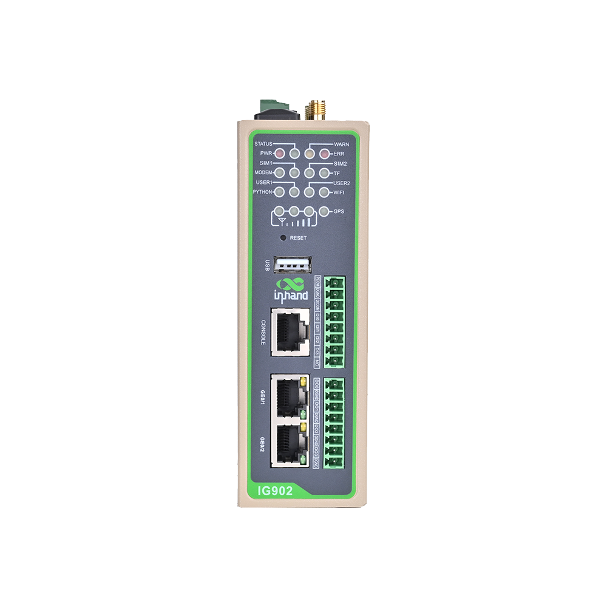
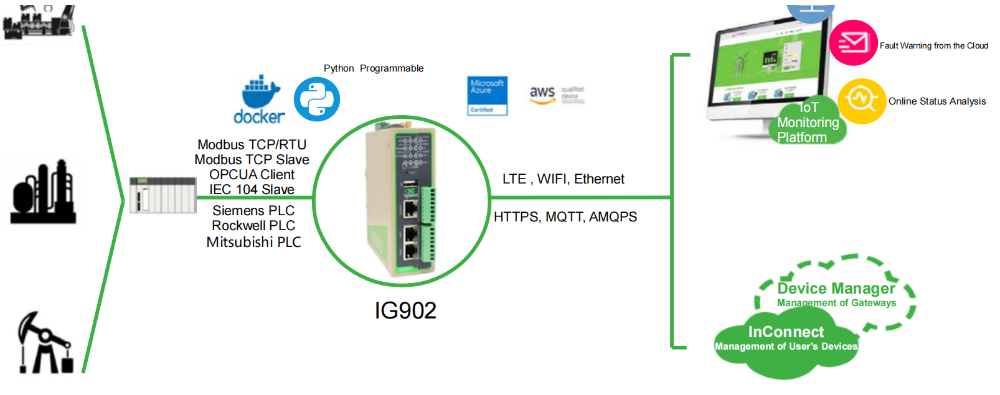

  

    

      
    

    

      Break down protocol barriers and make industrial digitization more convenient and efficient
    

  

  

    

      IG902 Series High-performance Edge Computer
    

    

      

        
· Multiple Access

        
· Rich Interfaces

      

      

        
· Built-in DSA

        
· Cloud Management

      

    

  

# 1. Product Overview

**IG902 is a high-performance industrial edge gateway that combines rich interfaces, protocol interoperability, and cloud-ready edge computing for IIoT deployments.**

**Key features:**
- **High-performance edge compute:** ARM Cortex-A8 1GHz with 1GB DDR3 and 8GB eMMC
- **Rich industrial interfaces:** GE ports, serial, optional DI/DO/relay, USB, MicroSD, optional Wi-Fi/GPS
- **Reliable industrial networking:** Wired/cellular/Wi-Fi backup, dual SIM failover, watchdog, link self-healing
- **Open development:** Python and Docker-based secondary development platform
- **Cloud O&M readiness:** DeviceLive + DSA for remote management and low-code data integration

## Core Technical Specifications

| Specification Item | Value |
|---|---|
| Cellular Network | LTE Cat4/Cat6 (model dependent) |
| Network Features | APN, VPDN, CHAP/PAP/MS-CHAP/MS-CHAPV2; DHCP Server/Relay/Client; DNS Relay; DDNS; static routing |
| Security | SPI firewall, ACL, NAT/PAT/DMZ, AAA (Local/Radius/Tacacs+/LDAP), IPSec/GRE/L2TP/OpenVPN/CA |
| Cloud Management | DeviceLive remote configuration, upgrades, and operations |
| Secondary Development | Python and Docker secondary development |
| Data Acquisition Protocols | Modbus RTU/TCP, EtherNet/IP, OPC UA, IEC101/104, DNP3.0, BACnet, CNC |
| Processor and Memory | ARM Cortex-A8 @1GHz, 1GB DDR3 |
| Storage | 8GB eMMC, MicroSD up to 32GB |
| Ethernet Ports | 2 × 10/100/1000Mbps |
| Serial and I/O | 1×RS232/RS485 + 1×RS485 (2×RS485 on some models); optional 4DI+4DO or 4DI+3DO+1 relay |
| Power Supply | 12~48V DC, reverse polarity and overcurrent protection |
| Operating Temperature and Protection | -25~70℃, IP30 |

# 2. Product Dimensions & PIN Definition

  

    
    
Front View

  

  

    
    
Side View

  

  

    
    
Interface Diagram

  

  

    
Note:

1. All dimensions are in millimeters (mm).

2. All dimensions are approximate and for reference only.

3. Dimensioned drawings are not intended for machining.

4. Dimensions are subject to part and manufacturing tolerances.

5. Specifications may change without prior notice.

  

## 7 PIN Definition

<table style="width:78%;">
  <colgroup>
    <col style="width:15%;">
    <col style="width:23%;">
    <col style="width:62%;">
  </colgroup>
  <tr><th align="center">PIN</th><th align="center">Definition</th><th align="left">Description</th></tr>
  <tr><td align="center">1</td><td align="center">V+</td><td>Positive electrode</td></tr>
  <tr><td align="center">2</td><td align="center">V-</td><td>Negative electrode</td></tr>
  <tr><td align="center">3</td><td align="center">TXD/A</td><td>Serial RS232 send / Serial RS485+</td></tr>
  <tr><td align="center">4</td><td align="center">RXD/B</td><td>Serial RS232 receive / Serial RS485-</td></tr>
  <tr><td align="center">5</td><td align="center">GND</td><td>Serial RS232 signal ground</td></tr>
  <tr><td align="center">6</td><td align="center">A</td><td>Serial RS485+</td></tr>
  <tr><td align="center">7</td><td align="center">B</td><td>Serial RS485-</td></tr>
</table>

## I/O Definition

<table style="width:78%;">
  <colgroup>
    <col style="width:15%;">
    <col style="width:23%;">
    <col style="width:62%;">
  </colgroup>
  <tr><th align="center">PIN</th><th align="center">Definition</th><th align="left">Description</th></tr>
  <tr><td align="center">1</td><td align="center">PCOM</td><td>Dry contact access point</td></tr>
  <tr><td align="center">2</td><td align="center">DGND</td><td>Dry contact ground point</td></tr>
  <tr><td align="center">3</td><td align="center">DICOM</td><td>Input common port</td></tr>
  <tr><td align="center">4</td><td align="center">DI0</td><td>Digital/pulse input port 0</td></tr>
  <tr><td align="center">5</td><td align="center">DI1</td><td>Digital/pulse input port 1</td></tr>
  <tr><td align="center">6</td><td align="center">DI2</td><td>Digital/pulse input port 2</td></tr>
  <tr><td align="center">7</td><td align="center">DI3</td><td>Digital/pulse input port 3</td></tr>
  <tr><td align="center">8</td><td align="center">NC</td><td>None</td></tr>
  <tr><td align="center">9</td><td align="center">DO0</td><td>Digital/pulse output port 0</td></tr>
  <tr><td align="center">10</td><td align="center">DGND</td><td>Ground</td></tr>
  <tr><td align="center">11</td><td align="center">DO1</td><td>Digital/pulse output port 1</td></tr>
  <tr><td align="center">12</td><td align="center">DGND</td><td>Ground</td></tr>
  <tr><td align="center">13</td><td align="center">DO2</td><td>Digital/pulse output port 2</td></tr>
  <tr><td align="center">14</td><td align="center">DGND</td><td>Ground</td></tr>
  <tr><td align="center">15</td><td align="center">DO3/Relay Output</td><td>DO3: Digital/pulse output port 3; Relay output: 1A 250VAC / 30VDC</td></tr>
  <tr><td align="center">16</td><td align="center">DGND</td><td>Ground</td></tr>
</table>

**Notes:**

**DI input specification:**
- Dry-contact status "1": closed
- Dry-contact status "0": disconnected
- Wet-contact status "1": +10 ~ +30V / -30 ~ -10VDC
- Wet-contact status "0": 0 ~ +3V / -3 ~ 0V
- Isolation: 3000VDC
- Pulse signal counter supported, up to 100Hz pulse signal

**DO output specification:**
- Isolation: 3000VDC

# 3. Hardware Specifications

| Category/Parameter | Specification |
|--------------------------|------|
| **CPU and Storage** | |
| CPU | ARM Cortex-A8 @1GHz |
| RAM | IG902-B: 512MB DDR3  IG902-H: 1GB DDR3 RAM |
| Flash | 8GB eMMC |
| **Connectivity and Interfaces** | |
| Ethernet Ports | 2×10/100/1000Mbps Ethernet ports (WAN/LAN or 2×LAN) |
| I/O Ports | None / 4×DI + 3×DO + 1×Relay output DO or digital/pulse output DO |
| Serial Ports | 1×RS232/RS485 + 1×RS485 |
| SIM Card Slot | 1.8V/3V, 2×drawer-type slot |
| LED Indicators | POWER, STATUS, WARN, ERROR, MODEM, SIM1, SIM2, TF, PYTHON, USER1, USER2, WIFI, GPS, SIGNAL |
| Console Port | 1×console RS232 (RJ45) |
| USB Port | 1×USB 2.0 port |
| TF | MicroSD expansion up to 32GB |
| Wi-Fi(optional) | 2.4G/5G Wi-Fi (802.11 ac/a/b/g/n) |
| GNSS(optional) | GPS and BeiDou |
| Reset Button | Pinhole button |
| **Power and Power Consumption** | |
| Power Input | 12~48V DC input |
| Power Terminal | Unpluggable industrial terminal |
| Reverse Polarity/Overcurrent Protection | Supported |
| **Mechanical Specifications** | |
| Mounting Method | DIN-rail/wall mounting |
| Protection Rating | IP30 |
| Housing and Cooling | Metal housing, fanless |
| RTC (Optional) | Embedded RTC powered by super capacitor |
| **Environment and Certifications** | |
| Storage Temperature | -40~85℃ |
| Operating Temperature | -25~70℃ |
| Ambient Humidity | 5~95% RH non-condensing |
| Physical Characteristics | IEC60068-2-27 shock resistance IEC60068-2-6 vibration resistance IEC60068-2-32 drop resistance |
| EMC Standard | EN61000-4-2, level 3, Static EN61000-4-3, level 3, Radiation Electric Field EN61000-4-4, level 3, Pulsed Electric Field EN61000-4-5, level 3, Surge EN61000-4-6, level 3, Conducted Distubance Immunity EN61000-4-8, Power Frequency Field Resistance, horizontal / vertical 400A/m (>level 3) EN61000-4-12, level 3, Shock Wave Resistance |
| Certifications | CE,FCC, PTCRB, RCM, IC, IMDA, AT&T, MIC&JATE, MSIP, EAC,ANATEL, UKCA |

# 4. Software Specifications

| Category/Parameter | Specification |
|--------------------------|------|
| **Operating System** | Custom Linux |
| **Network Features** | |
| Network Access | APN, VPDN |
| Access Authentication | CHAP/PAP/MS-CHAP/MS-CHAPV2 |
| Network Type | LTE, WCDMA(HSPA+), EDGE, GPRS, CDMA |
| LAN Protocols | ARP, EtherNet |
| IP Applications | Ping, Traceroute, DHCP Server/Relay/Client, DNS Relay, DDNS, Telnet, SSH, HTTP, HTTPS, TFTP, FTP, SFTP |
| IP Routing | Static routing |
| **Security** | |
| User Management | Multi-level users |
| Network Security | SPI firewall, anti-DoS attack, multicast/ping filter, ACL, NAT, PAT, DMZ, port mapping, virtual server |
| Data Security | IPSec VPN, GRE, L2TP, OpenVPN, CA |
| CA Certificates | Supported (may auto apply) |
| AAA (Authentication, Authorization, Accounting) | Local/Radius/Tacacs+/LDAP |
| **Reliability** | |
| Link Detection | Heartbeat packet detection, auto-recovery of disconnection |
| Embedded Watchdog | Device self-diagnosis, auto-recovery from operation faults |
| Backup Mechanism | VRRP, interface backup |
| Dual-SIM Switching | Dual-SIM backup |
| **WLAN (Optional)** | |
| WLAN Standard | IEEE 802.11 ac/a/b/g/n |
| WLAN Security | Open System, Shared Key, WPA/WPA2, WEP/TKIP/AES encryption |
| WLAN Mode | AP, Client modes |
| **Open Platform and Data Acquisition Protocols (DSA)** | |
| Python Secondary Development | Secondary development platform with Python and Docker |
| IoT Platform | Microsoft Azure, Amazon AWS, Alibaba Cloud, etc. |
| Industrial Protocols | Modbus RTU Master/Slave, Modbus TCP Master/Slave, EtherNet/IP, ISO on TCP, OPC UA Client/Server, Mitsubishi MC 3C/3E/3C OverTCP, Mitsubishi CPU Port, FINSUDP, HostLink, PPI |
| Electricity Protocols | DLT645-2007, IEC101/104, DNP3.0 |
| Other Protocols | BACnet, CNC |
| **Network Management** | |
| Configuration Methods | Local/remote HTTP/HTTPS/Telnet/SSH config |
| Upgrade Methods | WEB/DeviceLive/TFTP/FTP/SFTP upgrades |
| Log |  Local or remote log export, power-down log saving |
| Remote Management | DeviceLive-based remote access and remote batch device management |
| Network Diagnostics | Ping, Traceroute, Sniffer (network packet capture tool) |

# 5. Ordering Information

## Model Rule

**Model code:** IG902-\<B/H\>-\<WMNN\>-\<IO/RIO/NA\>-\<DW/NA\>-\<G/NA\>

\<B/H\>: Product version (H shown in this release)  
\<WMNN\>: Cellular Type & Frequency Band  
\<IO/RIO/NA\>: I/O option (`IO`=4DI+4DO, `RIO`=4DI+3DO+Relay, `NA`=No extended I/O)  
\<DW/NA\>: Wi-Fi option (`DW`=Wi-Fi enabled)  
\<G/NA\>: GPS option

## Model List

| Model | Version | Region | \<WMNN\>: Cellular Type & Band | Serial Port | \<IO/RIO/NA\> | \<DW/NA\> | \<G/NA\> |
|------|---------|--------|-------------------------------------------|-------------|---------------|-----------|----------|
| IG902-H-LQA8 | High-config | China | LTE CAT4; LTE-FDD B1/B3/B5/B8; LTE-TDD B34/B38/B39/B40/B41; TD-SCDMA B34/B39; WCDMA B1/B8; CDMA BC0; GSM 900/1800MHz | RS232×1 + RS485×1 | IO | NA | NA |
| IG902-H-LQA8-IO-DW-G | High-config | China | LTE CAT4; LTE-FDD B1/B3/B5/B8; LTE-TDD B34/B38/B39/B40/B41; TD-SCDMA B34/B39; WCDMA B1/B8; CDMA BC0; GSM 900/1800MHz | RS232×1 + RS485×1 | IO | DW | G |
| IG902-H-FQ58 | High-config | Europe & APAC | LTE CAT4; LTE-FDD B1/B2/B3/B5/B7/B8/B20; LTE-TDD B38/B40/B41; UMTS B1/B5/B8; GSM B3/B8 | RS232×1 + RS485×1 | IO | NA | NA |
| IG902-H-FQ58-IO-DW-G | High-config | Europe & APAC | LTE CAT4; LTE-FDD B1/B2/B3/B5/B7/B8/B20; LTE-TDD B38/B40/B41; UMTS B1/B5/B8; GSM B3/B8 | RS232×1 + RS485×1 | IO | DW | G |
| IG902-H-FQ58-D485-RIO-DW-G | High-config | Europe & APAC | LTE CAT4; LTE-FDD B1/B2/B3/B5/B7/B8/B20; LTE-TDD B38/B40/B41; UMTS B1/B5/B8; GSM B3/B8 | RS485×2 | RIO | DW | G |
| IG902-H-FS39-IO | High-config | North America | LTE CAT6; LTE-FDD B2/B4/B5/B13/B17; UMTS B2/B5 | RS232×1 + RS485×1 | IO | NA | NA |
| IG902-H-FS39-IO-DW-G | High-config | North America | LTE CAT6; LTE-FDD B2/B4/B5/B13/B17; UMTS B2/B5 | RS232×1 + RS485×1 | IO | DW | G |
| IG902-H-FQ78 | High-config | Australia & South America | LTE CAT4; LTE-FDD B1/B2/B3/B4/B5/B7/B8/B28; LTE-TDD B40; UMTS B1/B2/B5/B8; EDGE/GPRS/GSM 850/900/1800/1900MHz | RS232×1 + RS485×1 | NA | NA | NA |
| IG902-H-FQ78-IO-DW-G | High-config | Australia & South America | LTE CAT4; LTE-FDD B1/B2/B3/B4/B5/B7/B8/B28; LTE-TDD B40; UMTS B1/B2/B5/B8; EDGE/GPRS/GSM 850/900/1800/1900MHz | RS232×1 + RS485×1 | IO | DW | G |
| IG902-H-FQ88 | High-config | Japan | LTE CAT4; LTE-FDD B1/B3/B8/B18/B19/B26; LTE-TDD B41; WCDMA B1/B6/B8/B19 | RS232×1 + RS485×1 | IO | NA | NA |
| IG902-H-FQ88-IO-DW-G | High-config | Japan | LTE CAT4; LTE-FDD B1/B3/B8/B18/B19/B26; LTE-TDD B41; WCDMA B1/B6/B8/B19 | RS232×1 + RS485×1 | IO | DW | G |
| IG902-H-FQ98 | High-config | South Korea | LTE CAT4; LTE-FDD B1/B3/B5/B7/B8/B20; LTE-TDD B38/B40/B41; WCDMA B1/B5/B8; EDGE/GSM B3/B8 | RS232×1 + RS485×1 | IO | NA | NA |
| IG902-H-FQ98-IO-DW-G | High-config | South Korea | LTE CAT4; LTE-FDD B1/B3/B5/B7/B8/B20; LTE-TDD B38/B40/B41; WCDMA B1/B5/B8; EDGE/GSM B3/B8 | RS232×1 + RS485×1 | IO | DW | G |
| IG902-H-EN00 | High-config | Global (No Cellular) | No 3G/4G module | RS232×1 + RS485×1 | IO | NA | NA |
| IG902-H-EN00-IO-DW-G | High-config | Global (No Cellular) | No 3G/4G module | RS232×1 + RS485×1 | IO | DW | G |

# 6. Contact Us

- **Website:** [InHand Networks](https://www.inhand.com)
- **Copyright:** © InHand Networks. All rights reserved.
