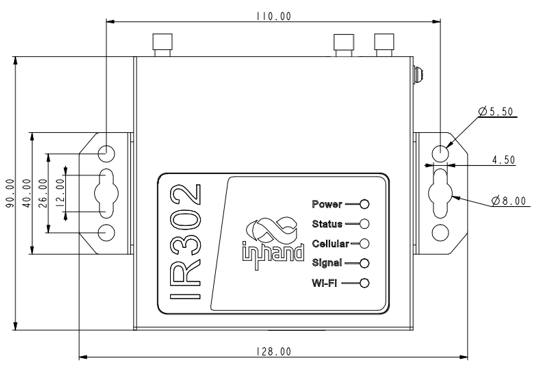
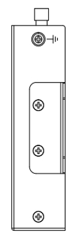
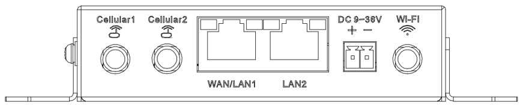

  

    

      
    

    

      Compact Industrial LTE Router
    

  

  

    

      InRouter302 Industrial Cellular Router
    

    

      

        
· 4G

        
· Wi-Fi

      

      

        
· Security

        
· Cloud-Managed

      

    

  

# 1. Product Overview

**InRouter302 is a compact industrial cellular router that integrates 4G LTE, Wi-Fi, VPN, and cloud management for unattended remote sites.**

**Positioning:** Cost-effective industrial router for secure connectivity, resilient networking, and remote O&M.

**Key features:**
- **Flexible access:** Cellular, wired, and Wi-Fi uplink options for diverse deployment scenarios
- **Reliable connectivity:** 4G/wired/Wi-Fi backup, dual SIM switching, VRRP, and multi-layer link detection
- **Security by design:** Firewall policies, ACL, VPN, encryption, and Wi-Fi security
- **Industrial-grade build:** Wide voltage input (9~36V DC) and -35~70°C normal operation (-40~75°C extended) for harsh environments
- **Cloud operations:** Device Manager platform for large-scale remote fleet management

## Core Technical Specifications

| Technical Item | Specification |
|------|---------------|
| Cellular Network | LTE Cat4/Cat1 (model-dependent), GSM/GPRS/EDGE, UMTS/HSPA+/EVDO/TD-SCDMA, TDD/FDD LTE |
| VPN & Data Security | PPTP/L2TP/GRE/IPSec/OpenVPN/WireGuard/ZeroTier, CA certificate support |
| Wi-Fi (Optional) | 2.4GHz, IEEE 802.11 b/g/n, up to 150Mbps, AP/Client |
| Firewall & Access Control | SPI firewall, anti-DoS, ACL, URL filter, port mapping, virtual IP mapping, IP-MAC binding |
| Reliability | VRRP, heartbeat detection with auto-redial, dual SIM failover, embedded watchdog |
| Management | Telnet/Web/SSH/Console, Device Manager update, SNMP v1/v2c/v3 with TRAP |
| CPU / Memory / Flash | 580MHz CPU, 128MB DDR2 RAM, 32MB SPI flash |
| Ethernet Interface | 2×10/100Mbps RJ45 (WAN/LAN switchable) |
| Optional Interface | 1×RS232 or 2×I/O (DI/DO configurable) |
| Power Input | DC 9~36V, over-current and reverse polarity protection |
| Operating Temperature | Normal: -35°C to +70°C Extended:-40°C to +75°C |
| Protection Level | IP30 |

# 2. Product Dimensions

  

    
    
Front View

  

  

    
    
Side View

  

  

    
    
Interface Diagram

  

  

    
Note:

1. All dimensions are in millimeters (mm).

2. All dimensions are approximate and for reference only.

3. Dimensioned drawings are not intended for machining.

4. Dimensions are subject to part and manufacturing tolerances.

5. Specifications may change without prior notice.

  

# 3. Hardware Specifications

| Category/Parameter | Specification |
|--------------------------|------|
| **CPU and Storage** | |
| CPU | 580 MHz |
| RAM | 128 MB DDR2 |
| Flash | 32 MB SPI |
| **Connectivity and Interfaces** | |
| Ethernet Ports | 2 × 10/100 Mbps RJ45 (WAN/LAN switchable) |
| Power Interface | DC 9~36 V input, over-current and reverse-polarity protection, 2-pin industrial terminal |
| I/O Port | Optional 2 × I/O (DI/DO configurable) |
| Serial Port | Optional 1 × RS232 |
| Reset Button | Pinhole reset button |
| SIM Slot | Dual SIM drawer slots |
| Antenna Connectors | 4G: 1 × SMA (NA models: 2 × SMA); Wi-Fi: 1 × RP-SMA (optional) |
| **Wi-Fi** | |
| Radio Frequency | 2.4 GHz (optional) |
| Max Transmission Bandwidth | Up to 150 Mbps |
| Transfer Protocol | IEEE 802.11 b/g/n |
| Transmit Power | 802.11b:16dBm +/-2dBm(11Mbps)  802.11g:16dBm +/-2dBm(54Mbps) 802.11n @ 2.4GHz:16dBm +/-2dBm(HT20 MCS7) 802.11n @ 2.4GHz:16dBm +/-2dBm(HT40 MCS7) |
| Transmission Distance | 50 meters by line of sight (Actual transmission distance depends on environment of the site.) |
| **Power Rate** | |
| Standby Power |  80mA-90mA@12V |
| Working Power |  100mA-120mA@12V |
| Peak Power | 190mA@12V |
| **Mechanical Specifications** | |
| Product Dimensions | 98.3 × 92 × 24 mm |
| Product Weight | 259 g |
| Mounting Method | Panel or DIN-rail mounting |
| Protection Rating | IP30 |
| **Environment and Compliance** | |
| Storage Temperature | -40°C to +85°C |
| Operating Temperature | Normal: -35°C to +70°C Extended:-40°C to +75°C |
| Ambient Humidity | 5% to 95% RH (non-condensing) |
| Physical Characteristics | IEC60068-2-27, shockproof IEC60068-2-6, Vibration Resistance  IEC60068-2-32, Free Fall |
| EMC Standard | EN61000-4-2, level 2, Static  EN61000-4-3, level 2, Radiation Electric Field EN61000-4-4, level 2, Pulsed Electric Field  EN61000-4-5, level 2, Surge EN61000-4-6, level 2, Conducted Distubance Immunity Power Frequency EN61000-4-8, Magnetic Field Resistance, horizontal / vertical  400A/m (>level 2) Shock Wave Resistance, EN61000-4-12,level 2|
| Certifications | CE, CB, UKCA, E-MARK, FCC, IC, PTCRB, AT&T, Verizon, T-Mobile, RCM, CCC, EAC&FAC, UL, ANATEL, MIC&JATE, IEC62443, NOM, IFETEL |

# 4. Software Specifications

| Category/Parameter | Specification |
|--------------------------|------|
| **Network Features** | |
| Network Access | APN, VPDN |
| Access Authentication | CHAP, PAP |
| Network Type | GSM/GPRS/EDGE, UMTS/HSPA+/EVDO/TD-SCDMA, TDD LTE/FDD LTE (model dependent) |
| LAN protocol | ARP, Ethernet |
| WAN protocol |  Static IP, DHCP, PPPoE |
| IP Applications | IPv4, Ping, Trace, DHCP Server/Relay/Client, DNS relay, DDNS, Telnet, IP passthrough |
| IP Routing | Static routing |
| NAT Functions | NAT |
| **Security** | |
| Network Security | SPI firewall, anti-DoS, ACL, URL filtering, port mapping, virtual IP mapping, IP-MAC binding |
| Data Security | PPTP, L2TP, GRE, IPSec, OpenVPN, WireGuard, ZeroTier |
| CA Certificates | Supported |
| **Reliability** | |
| Link Detection |  Sends heartbeat packets to detect, auto redials when disconnected |
| Embedded Watchdog | Device runs self-detection, auto recovers from malfunctions |
| Hot Backup Mechanism | VRRP |
| Dual-SIM Switching | Supported |
| **WLAN(Optional)** | |
| Operating Mode | AP, Client (optional) |
| Security Features | WPA/WPA2, WEP/TKIP/AES |
| **Intelligence** | |
| DTU Function | TCP/UDP transparent transmission, TCP server mode, AT command support |
| Bridge | Modbus RTU to Modbus TCP |
| **Network Management** | |
| QoS Management | Traffic management |
| Configuration Methods | Telnet, Web, SSH, Console |
| Upgrade Methods | Web and Device Manager updates |
| Log | Local/remote logs with power-down retention |
| SMS Function | Status query, restart |
| Dial-on-demand |  Dial-on-demand, data / SMS activation |
| Network Management Function | Device Manager, batch management |
| SNMP Function | SNMP v1/v2c/v3 with TRAP |
| Traffic Management | Supports data traffic threshold, traffic statistics and traffic alarm |
| Alarm |  System restart alarm, LAN port online/offline alarm, data traffic alarm, SIM card failure alarm ,etc. |
| Maintenance Tools | Ping, route tracking, network speed test |
| Status Query | System status, modem status, network connection status, and routing status |

# 5. Ordering Information

## Model Rule

**Model code:** IR302-\<WMNN\>-\<WLAN/NA\>-\<IO/S/NA\>

\<WMNN\>: Cellular Type & Module  
\<WLAN/NA\>: Wi-Fi option  
\<IO/S/NA\>: Interface option (`IO`=2×IO, `S`=1×RS232, `NA`=no optional interface)

## Model List

<table style="width:100%; table-layout:fixed; font-size:8px;">
  <colgroup>
    <col style="width:26%;">
    <col style="width:14%;">
    <col style="width:12%;">
    <col style="width:28%;">
    <col style="width:10%;">
    <col style="width:10%;">
  </colgroup>
  <tr>
    <th>Model Pattern</th>
    <th>Region</th>
    <th>Network Type</th>
    <th>&lt;WMNN&gt;: Cellular Type &amp; Module</th>
    <th>&lt;WLAN/NA&gt;</th>
    <th>&lt;IO/S/NA&gt;</th>
  </tr>
  <tr>
    <td style="white-space:nowrap;">IR302-FQ58-&lt;WLAN/NA&gt;-&lt;IO/S/NA&gt;</td>
    <td>Europe &amp; APAC</td>
    <td>LTE CAT4</td>
    <td>FDD B1/B3/B7/B8/B20/B28A; WCDMA B1/B8; GSM B3/B8</td>
    <td>WLAN or NA</td>
    <td>IO / S / NA</td>
  </tr>
  <tr>
    <td style="white-space:nowrap;">IR302-FQ58-&lt;WLAN/NA&gt;-&lt;IO/S/NA&gt;-L</td>
    <td>Europe, APAC, Australia</td>
    <td>LTE CAT4</td>
    <td>FDD B1/B3/B5/B7/B8/B20/B28; TDD B38/B40/B41; WCDMA B1/B5/B8; GSM/EDGE B3/B8</td>
    <td>WLAN or NA</td>
    <td>IO / S / NA</td>
  </tr>
  <tr>
    <td style="white-space:nowrap;">IR302-FQ53-&lt;WLAN/NA&gt;-&lt;IO/S/NA&gt;</td>
    <td>EMEA</td>
    <td>LTE CAT1</td>
    <td>FDD B1/B3/B7/B8/B20/B28; WCDMA B1/B8; GSM/EDGE B3/B8</td>
    <td>WLAN or NA</td>
    <td>IO / S / NA</td>
  </tr>
  <tr>
    <td style="white-space:nowrap;">IR302-FQ38-&lt;WLAN/NA&gt;-&lt;IO/S&gt;</td>
    <td>North America (AT&amp;T/Verizon)</td>
    <td>LTE CAT4</td>
    <td>FDD B2/B4/B5/B12/B13/B14/B66/B71; WCDMA B2/B4/B5</td>
    <td>WLAN or NA</td>
    <td>IO / S</td>
  </tr>
  <tr>
    <td style="white-space:nowrap;">IR302-FQ33-&lt;WLAN/NA&gt;-&lt;IO/S&gt;</td>
    <td>North America (AT&amp;T/Verizon)</td>
    <td>LTE CAT1</td>
    <td>FDD B2/B4/B5/B12/B13/B25/B26; WCDMA B2/B4/B5</td>
    <td>WLAN or NA</td>
    <td>IO / S</td>
  </tr>
  <tr>
    <td style="white-space:nowrap;">IR302-FQ68-&lt;WLAN/NA&gt;-&lt;IO/S&gt;</td>
    <td>Latin America</td>
    <td>LTE CAT4</td>
    <td>FDD B1/B2/B3/B4/B5/B7/B8/B28/B66; TDD B40; WCDMA B1/B2/B4/B5/B8; GSM B2/B3/B5/B8</td>
    <td>WLAN or NA</td>
    <td>IO / S</td>
  </tr>
  <tr>
    <td style="white-space:nowrap;">IR302-FQ88-&lt;WLAN/NA&gt;-S</td>
    <td>Japan</td>
    <td>LTE CAT4</td>
    <td>FDD B1/B3/B8/B18/B19/B26; TDD B41; WCDMA B1/B6/B8/B19</td>
    <td>WLAN or NA</td>
    <td>S</td>
  </tr>
  <tr>
    <td style="white-space:nowrap;">IR302-EN00-WLAN</td>
    <td>Global</td>
    <td>NA</td>
    <td>No cellular module</td>
    <td>WLAN</td>
    <td>NA</td>
  </tr>
  <tr>
    <td style="white-space:nowrap;">IR302-LQ28-&lt;WLAN/NA&gt;-&lt;S/NA&gt;</td>
    <td>China</td>
    <td>LTE CAT4</td>
    <td>FDD B1/B3/B5/B8; TDD B34/B38/B39/B40/B41; WCDMA B1/B8; TD-SCDMA B34/B39; EVDO/CDMA BC0; GSM B3/B8</td>
    <td>WLAN or NA</td>
    <td>S / NA</td>
  </tr>
  <tr>
    <td style="white-space:nowrap;">IR302-LQ28-&lt;WLAN/NA&gt;-&lt;S/NA&gt;-L</td>
    <td>China</td>
    <td>LTE CAT4</td>
    <td>FDD B1/B3/B5/B8; TDD B34/B38/B39/B40/B41; WCDMA B1/B5/B8; GSM/EDGE B3/B8</td>
    <td>WLAN or NA</td>
    <td>S / NA</td>
  </tr>
</table>

# 6. Contact Us

- **Website:** [InHand Networks](https://www.inhand.com)
- **Copyright:** © InHand Networks. All rights reserved.
