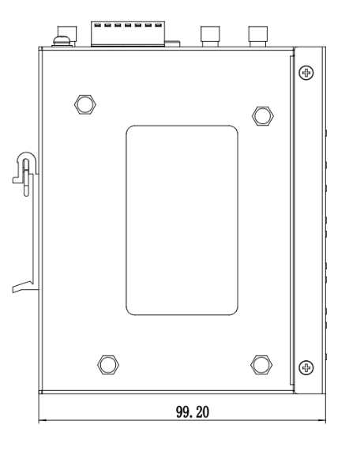
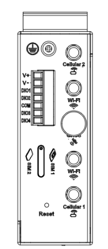
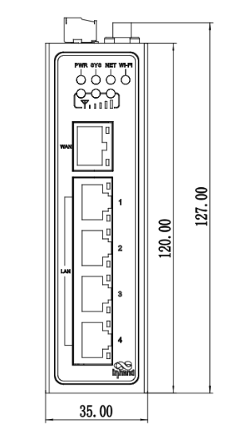

  

    

      
    

    

      Compact Industrial LTE Router
    

  

  

    

      InRouter315 Industrial Cellular Router
    

    

      

        
· 5G/4G

        
· Wi-Fi

      

      

        
· Security

        
· Cloud-Managed

      

    

  

# 1. Product Overview

**InRouter315 is a compact industrial cellular router that combines 5G/4G, Wi-Fi, and VPN capabilities for secure, resilient, and scalable IoT networking.**

**Positioning:** Industrial multi-access router for secure data links and cloud-managed distributed deployments.

**Key features:**
- **Multi-network access:** Cellular, wired, and Wi-Fi access options for complex field scenarios
- **Always-on reliability:** Multi-link backup, dual SIM switching, VRRP, and layered link detection
- **Industrial interfaces:** 5×FE, optional serial/IO, optional GNSS, dual Nano-SIM
- **Enterprise-grade security:** Firewall, ACL, VPN suite, 802.1X, and certificate support
- **Cloud O&M at scale:** Device Manager for remote monitoring, batch management, and diagnostics

## Core Technical Specifications

| Technical Item | Specification |
|------|---------------|
| Cellular Network | 5G NR (by SKU), LTE Cat6/Cat4/Cat1, dual SIM failover |
| VPN | PPTP, L2TP, GRE, IPSec, OpenVPN, DMVPN, WireGuard, ZeroTier |
| Wi-Fi | IEEE 802.11b/g/n, 2.4 GHz, up to 300 Mbps, AP/Client mode |
| Security | SPI firewall, DoS defense, ACL, URL filtering, 802.1X, CA certificates |
| Reliability | VRRP, heartbeat link detection, embedded watchdog |
| Cloud Management | Device Manager, SNMP v1/v2c/v3 + TRAP |
| Dimensions (W x D x H) | 127 x 108.2 x 35 mm |
| Weight | 454 g |
| Ethernet Ports | 5 x 10/100Mbps FE RJ45 (WAN/LAN/VLAN), 1.5kV isolation |
| Serial/IO Interfaces | 1 x RS232 + 1 x RS485 or 4 x IO (model-dependent) |
| Power Input | 9-36V DC, industrial terminal, over-current and anti-reverse protection |
| Operating Temperature | Normal: -35°C to +70°C Extended:-40°C to +75°C |

# 2. Product Dimensions

  

  

    
    
Front View

  

  

    
    
Side View

  

  

    
    
Interface Diagram

  

  

    
Note:

1. All dimensions are in millimeters (mm).

2. All dimensions are approximate and for reference only.

3. Dimensioned drawings are not intended for machining.

4. Dimensions are subject to part and manufacturing tolerances.

5. Specifications may change without prior notice.

  

# 3. Hardware Specifications

| Category/Parameter | Specification |
|--------------------------|------|
| **CPU and Storage** |  |
| CPU | 580MHz |
| RAM | 128MB |
| Flash | 64MB SPI flash |
| **Connectivity and Interfaces** |  |
| Ethernet Ports | 5 x 10/100Mbps FE RJ45 (WAN/LAN/VLAN), 1.5kV isolation |
| Power Interface | DC 9~36V, 2-pin industrial terminal, over-current and anti-reverse protection |
| I/O Port | Optional 4 x IO (model-dependent) |
| Serial Port | Optional 1 x RS232 + 1 x RS485 (model-dependent) |
| Reset Button | Supported |
| SIM Slot | 1 x drawer dual-Nano SIM slot |
| Antenna Connectors | 2 x SMA (LTE), 2 x RP-SMA (Wi-Fi), 1 x SMA (GNSS, optional) |
| **Wi-Fi** |  |
| Radio Frequency | 2.4GHz |
| Max Transmission Bandwidth | Up to 300Mbps |
| Transfer Protocol | IEEE 802.11b/g/n |
| Transmission Distance | Up to 80m line-of-sight (Actual transmission distance depends on environment of the site.) |
| **Power Rate** |  |
| Standby Power | 120mA-200mA@12V |
| Working Power |  150mA-320mA@12V |
| Peak Power | 320mA@12V |
| **Mechanical Specifications** |  |
| Product Dimensions | 127 x 108.2 x 35 mm |
| Product Weight | 454g |
| Mounting Method | DIN-rail and wall mounting |
| Protection Rating | IP30 |
| Housing and Cooling | Fanless metal housing |
| **Environment and Compliance** |  |
| Storage Temperature | -40~85℃ |
| Operating Temperature | Normal: -35°C to +70°C Extended:-40°C to +75°C |
| Ambient Humidity | 5~95% RH, non-condensing |
| Physical Characteristics | IEC60068-2-27 shock resistance; IEC60068-2-6 vibration resistance; IEC60068-2-32 drop resistance |
| EMC Standard | EN61000-4-2, level 3, Static EN61000-4-3, level 3, Radiation Electric Field EN61000-4-4, level 3, Pulsed Electric Field EN61000-4-5, level 3, Surge EN61000-4-6, level 3, Conducted Distubance Immunity EN61000-4-8, Power Frequency Field Resistance, horizontal / vertical 400A/m (>level 2) EN61000-4-12, level 3, Shock Wave Resistance |
| Certifications | CE/E-MARK/IMDA/RCM/FCC/IC/PTCRB/Verizon/AT&T/T-Mobile/MIC&JATE/UL/C1D2/IEC62443-4-2/EN18031 |

# 4. Software Specifications

| Category/Parameter | Specification |
|--------------------------|------|
| **Network Features** |  |
| Network Access | APN, VPDN |
| Access Authentication | CHAP/PAP |
| Network Type | GSM/GPRS/EDGE, UMTS/HSPA+/EVDO/TD-SCDMA, TDD/FDD LTE, 5G SA (by SKU) |
| LAN protocol | Ethernet |
| WAN protocol | PPP, static IP, DHCP, PPPoE |
| IP Applications | IPv4, Ping, Trace, DHCP server/relay/client, DNS relay, DDNS, Telnet, IP passthrough |
| IP Routing | Static routing and OSPF dynamic routing |
| NAT Functions | NAT |
| **Security** |  |
| Security | SPI firewall, DoS defense, ACL, URL filter, port/virtual IP mapping, IP-MAC binding, 802.1X |
| Data Security | PPTP/L2TP/GRE/IPSec/OpenVPN client/server/DMVPN/WireGuard/ZeroTier |
| CA Certificates | Supported |
| **Reliability** |  |
| Link Detection | Heartbeat detection with auto-redial |
| Embedded Watchdog | Supported |
| Hot Backup Mechanism | VRRP hot backup |
| Dual-SIM Switching | Dual SIM failover |
| **WLAN** |  |
| Operating Mode | AP/Client mode |
| Security Features | WPA/WPA2, WEP/TKIP/AES |
| **Intelligence** |  |
| DTU Function | TCP/UDP transparent mode, TCP server mode, DCUDP/DCTCP, DTU status monitoring |
| Bridge | Modbus RTU-to-TCP bridge |
| **Network Management** |  |
| QoS Management | Bandwidth limit, IP speed limit |
| Configuration Methods | Telnet/Web/SSH/Console |
| Upgrade Methods | Web/Device Manager updates |
| Log |  Local system log, remote log, and serial export of log.Power down saving of important logs. |
| SMS Function | Status query, restart |
| Dial-on-demand | Dial-on-demand, data / SMS activation |
| Network Management Function | Device Manager, batch management |
| SNMP Function | SNMP v1/v2c/v3 + TRAP |
| Traffic Management | Traffic threshold, Traffic statistics management |
| Alarm |  System restart alarm, LAN port online/offline alarm, data traffic alarm, SIM card failure alarm ,etc. |
| Maintenance Tools | Ping, route tracking, network speed test |
| Status Query | System status, modem status, network connection status, and routing status |

# 5. Ordering Information

## Model Rule

**Model code:** IR315-\<WMNN\>-\<WLAN/NA\>-\<S/NA\>-\<G/NA\>

\<WMNN\>: Cellular Type & Module  
\<WLAN/NA\>: Wi-Fi option  
\<S/NA\>: Optional interface (`S`=1×RS232+1×RS485, `NA`=4×IO)  
\<G/NA\>: GNSS option

## Model List

| Model Pattern | Region | \<WMNN\>: Cellular Type & Module | \<WLAN/NA\> | \<S/NA\> | \<G/NA\> |
|---------------|--------|-----------------------------------|-------------|----------|----------|
| IR315-FQ58-\<WLAN/NA\>-\<S/NA\> | Europe/APAC/Australia/NZ (CAT4) | FDD B1/B3/B5/B7/B8/B20/B28; TDD B38/B40/B41; WCDMA B1/B5/B8; GSM B3/B8 | WLAN or NA | S or NA | NA |
| IR315-FQ58-WLAN-\<S/NA\>-G | Europe & APAC (CAT4) | FDD B1/B3/B7/B8/B20/B28A; TDD B38/B40/B41; WCDMA B1/B8; GSM B3/B8 | WLAN | S or NA | G |
| IR315-FQ68-\<WLAN/NA\>-S | Latin America (CAT4) | FDD B1/B2/B3/B4/B5/B7/B8/B28/B66; TDD B40; WCDMA B1/B2/B4/B5/B8; GSM B2/B3/B5/B8 | WLAN or NA | S | NA |
| IR315-FQ78-\<WLAN/NA\>-\<S/NA\> | Australia & Latin America (CAT4) | FDD B1/B2/B3/B4/B5/B7/B8/B28; TDD B40; WCDMA B1/B2/B5/B8; GSM B2/B3/B5/B8 | WLAN or NA | S or NA | NA |
| IR315-FQ78-WLAN-G | Australia & Latin America (CAT4) | FDD B1/B2/B3/B4/B5/B7/B8/B28; TDD B40; WCDMA B1/B2/B5/B8; GSM B2/B3/B5/B8 | WLAN | NA | G |
| IR315-FF39-\<WLAN/NA\>-\<S/NA\> | North America (CAT6) | LTE FDD B2/B4/B5/B7/B12/B13/B14/B17/B25/B26/B29/B30/B66/B71; LTE TDD B41/B42/B43/B46/B48; WCDMA B2/B4/B5 | WLAN or NA | S or NA | NA |
| IR315-FF39-WLAN-S-G | North America (CAT6) | LTE FDD B2/B4/B5/B7/B12/B13/B14/B17/B25/B26/B29/B30/B66/B71; LTE TDD B41/B42/B43/B46/B48; WCDMA B2/B4/B5 | WLAN | S | G |
| IR315-FQ38-\<WLAN/NA\>-\<S/NA\> | North America (CAT4) | LTE FDD B2/B4/B5/B12/B13/B17/B66/B71; WCDMA B2/B4/B5 | WLAN or NA | S or NA | NA |
| IR315-FQ88-\<WLAN/NA\>-S | Japan (CAT4) | LTE FDD B1/B3/B8/B18/B19/B26; LTE TDD B41; WCDMA B1/B6/B8/B19 | WLAN or NA | S | NA |
| IR315-EN00-\<WLAN/NA\>-S | Global (No Cellular) | No cellular module | WLAN or NA | S | NA |
| IR315-LQ20-\<WLAN/NA\>-S | China (CAT4) | FDD B1/B3/B5/B8; TDD B34/B38/B39/B40/B41; WCDMA B1/B5/B8; GSM B3/B8 | WLAN or NA | S | NA |

# 6. Contact Us

- **Website:** [InHand Networks](https://www.inhand.com)
- **Copyright:** © InHand Networks. All rights reserved.
