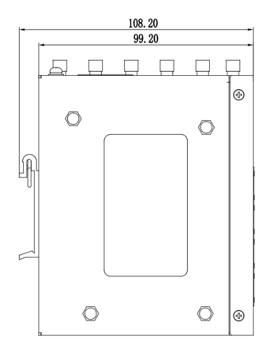
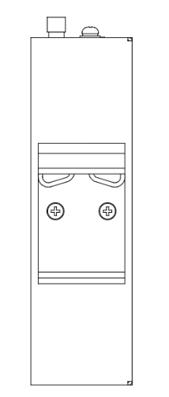
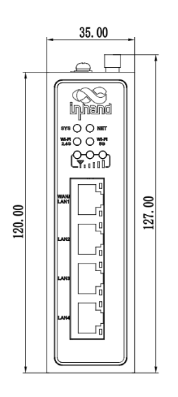

  

    

      
    

    

      Embrace 5G, Co-Create the Digital Era
    

  

  

    

      InRouter624 Series Industrial Router
    

    

      

        
· 5G

        
· Wi-Fi 5

      

      

        
· Security

        
· Cloud-Managed

      

    

  

# 1. Product Overview

**InRouter624 is a high-performance industrial router series integrating 5G/4G, Wi-Fi, and VPN for secure, resilient, and cloud-managed IoT connectivity.**

**Positioning:** Industrial 5G edge router for high-bandwidth, low-latency connectivity and centralized fleet operations.

**Key features:**
- **5G-ready connectivity:** Up to 3.4Gbps downlink with backward compatibility to 4G/3G
- **Always-on communication:** Link backup, dual SIM failover, watchdog, and multi-level link detection
- **Enterprise security stack:** Multi-layer VPN, firewall, policy routing, and 802.1X access security
- **Cloud-native management:** DeviceLive enables remote monitoring, diagnostics, and maintenance
- **Industrial robustness:** Wide voltage, fanless metal design, and industrial compliance for unattended sites

## Core Technical Specifications

| Technical Item | Specification |
|------|---------------|
| Cellular Network | 5G NR SA/NSA or LTE fallback (model-dependent), with dual SIM support |
| Wi-Fi (Optional) | Dual-band 2.4G/5G, IEEE 802.11 ac/a/b/g/n Wave2 MU-MIMO, up to 300/867 Mbps |
| Security Stack | Firewall, policy-based routing, 802.1X access control, IPSec VPN, L2TP VPN |
| Reliability | Interface backup, dual SIM failover, heartbeat link detection, embedded watchdog |
| Cloud Management | DeviceLive platform for batch management and remote O&M |
| DTU and Data Interoperability | TCP/UDP transparent mode, Modbus RTU-to-TCP bridge |
| Ethernet Interfaces | 4×10/100/1000 Mbps Ethernet, WAN/LAN/VLAN, 1.5kV isolation protection |
| Serial Interfaces | 1×RS232 + 1×RS485 |
| CPU / Memory / Flash | 880MHz CPU, 256MB RAM, 128MB Flash |
| Power Input | DC 9~48V, with over-current and reverse-polarity protection |
| Operating Temperature | Normal: -35°C to +70°C Extended:-40°C to +75°C |
| Protection Rating | IP30 |

# 2. Product Dimensions

  

  

    
    
Front View

  

  

    
    
Side View

  

  

    
    
Interface Diagram

  

  

    
Note:

1. All dimensions are in millimeters (mm).

2. All dimensions are approximate and for reference only.

3. Dimensioned drawings are not intended for machining.

4. Dimensions are subject to part and manufacturing tolerances.

5. Specifications may change without prior notice.

  

# 3. Hardware Specifications

| Category/Parameter | Specification |
|--------------------------|------|
| **CPU and Storage** |  |
| CPU | 880MHz |
| RAM | 256MB |
| Flash | 128MB |
| **Connectivity and Interfaces** |  |
| Ethernet Ports | 4 x 10/100/1000Mbps Ethernet (WAN/LAN/VLAN), 1.5kV isolation |
| Power Interface | DC 9~48V with over-current and reverse-polarity protection |
| Serial Port |  1 x RS232 and 1 x RS485 ESD protection: 15KV |
| Reset Button | Supported |
| SIM Slot | Dual Nano-SIM drawer slot (1.8V/3V), optional eSIM |
| Antenna Connectors |  4 x SMA for 5G or 2 x SMA for 4G , 2 x RP-SMA for Wi-Fi |
| **Wi-Fi** |  |
| Radio Frequency | 2.4GHz / 5GHz |
| Max Transmission Bandwidth | Up to 300Mbps (2.4G) / 867Mbps (5G) |
| Transfer Protocol | IEEE 802.11 ac/a/b/g/n Wave2 MU-MIMO |
| Transmit Power | 5G:17dBm 2.4G:17dBm |
| Transmission Distance | 50 meters by line of sight(Actual transmission distance depends on environment of the site.) |
| **Power Rate** |  |
| Standby Power |  370-480mA@12V |
| Working Power | 415-530mA@12V |
| Peak Power |  530mA@12V |
| **Mechanical Specifications** |  |
| Product Dimensions | 127 x 108.2 x 35 mm |
| Product Weight | 544g |
| Mounting Method | DIN-rail mounting |
| Protection Rating | IP30 |
| Housing and Cooling | Fanless metal housing |
| **Environment and Compliance** |  |
| Storage Temperature | -40~85℃ |
| Operating Temperature | Normal: -35°C to +70°C Extended:-40°C to +75°C |
| Ambient Humidity | 5~95% RH, non-condensing |
| Physical Characteristics | IEC60068-2-27 Shockproof; IEC60068-2-6 Vibration Resistance; IEC60068-2-32 Free Fall |
| EMC Standard | EN61000-4-2, level 3, Static EN61000-4-3, level 3, Radiation Electric Field EN61000-4-4, level 3, Pulsed Electric Field EN61000-4-5, level 3, Surge EN61000-4-6, level 3, Conducted Distubance Immunity EN61000-4-8, Power Frequency Field Resistance, horizontal / vertical 400A/m (>level 2) EN61000-4-12, level 3, Shock Wave Resistance |
| Certifications | CE, E-MARK, ECE R118, FCC, IC, PTCRB, AT&T, T-Mobile, Verizon(NSA) |

# 4. Software Specifications

| Category/Parameter | Specification |
|--------------------------|------|
| **Network Features** |  |
| Network Access | APN/VPDN |
| Access Authentication | CHAP/PAP |
| Network Type | WCDMA/TDD LTE/FDD LTE/5G NR (SA/NSA) |
| LAN protocol | ARP, Ethernet |
| WAN protocol | Static IP, DHCP, PPPoE |
| IP Applications | TCP/UDP/IPv4/IPv6/ICMP/NTP/DNS/HTTP/HTTPS/SSL/TLS/VRRP/PPP/PPPoE/SSH, DHCP server/relay/client, DDNS, Telnet, IP passthrough |
| IP Routing | Static routing, BGP |
| NAT Functions | NAT, port mapping |
| **Security** |  |
| Network Security | Access control, firewall filtering (MAC/IP/port/protocol), policy-based routing, 802.1X |
| Data Security | IPsec VPN, L2TP VPN |
| CA Certificates | Not specified |
| **Reliability** |  |
| Link Detection | Heartbeat link detection with auto-redial |
| Embedded Watchdog | Supported |
| Backup | Interface backup |
| Dual-SIM Switching | Dual SIM failover |
| **WLAN** |  |
| Operating Mode | AP/Client modes |
| Security Features | WPA/WPA2, WEP/TKIP/AES, Wi-Fi Portal support |
| **Intelligence** |  |
| DTU Function | TCP/UDP transparent mode |
| Bridge | Modbus RTU-to-TCP bridge |
| **Network Management** |  |
| QoS Management | QoS traffic shaping |
| Configuration Methods | Web/CLI remote access, config import/export |
| Log & Alarm | System logs, diagnostic logs, device events |
| Network Management Function | DeviceLive batch management and equipment monitoring |
| Maintenance Tools |  Support Ping, Traceroute and network packet capture tools |
| Monitoring | Dashboard-Device information, interface status, and refined traffic statistics link monitoring- Link delay, jitter, packet loss, and throughput |

# 5. Ordering Information

## Model Rule

**Model code:** IR624-\<WMNN\>-\<WLAN/NA\>-S

\<WMNN\>: Cellular Type & Module  
\<WLAN/NA\>: Wi-Fi option  
`S`: 1×RS232 + 1×RS485

## Model List

| Model Pattern | Region | \<WMNN\>: Cellular Type & Module / Bands | \<WLAN/NA\> | Serial |
|---------------|--------|-------------------------------------------|-------------|--------|
| IR624-NRQ3-\<WLAN/NA\>-S | North America (5G) | 5G NR NSA n1/2/3/5/7/8/12/13/14/18/20/25/26/28/29/30/38/40/41/48/66/70/71/75/76/77/78/79; SA same set; LTE FDD B1/2/3/4/5/7/8/12/13/14/17/18/19/20/25/26/28/29/30/32/66/71; LTE TDD B34/38/39/40/41/42/43/48; LAA B46; WCDMA B1/2/4/5/8/19 | WLAN or NA | S |
| IR624-NRF4-\<WLAN/NA\>-S | Europe & APAC (5G) | 5G NR n1/3/5/7/8/20/28/38/40/41/71/77/78/66; LTE FDD B1/3/5/7/8/20/28/71/66; LTE TDD B38/40/41; WCDMA B1/3/5/8 | WLAN or NA | S |
| IR624-FQ58-\<WLAN/NA\>-S | Europe & APAC (4G CAT4) | LTE-FDD B1/3/5/7/8/20/28; LTE-TDD B34/38/39/40/41; WCDMA B1/5/8; GSM B3/8 | WLAN or NA | S |
| IR624-EN00-\<WLAN/NA\>-S | Global (No Cellular) | No cellular module | WLAN or NA | S |
| IR624-NRF2-\<WLAN/NA\>-S | China (5G) | 5G NR n1/3*/5/8/28/41/78/79; LTE FDD B1/3/5/7*/8; LTE TDD B34/38/39/40/41; WCDMA B1/5/8 | WLAN or NA | S |
| IR624-LQ20-\<WLAN/NA\>-S | China (4G CAT4) | FDD B1/3/5/8; TDD B34/38/39/40/41; WCDMA B1/5/8; GSM/EDGE B3/8 | WLAN or NA | S |

# 6. Contact Us

- **Website:** [InHand Networks](https://www.inhand.com)
- **Copyright:** © InHand Networks. All rights reserved.
