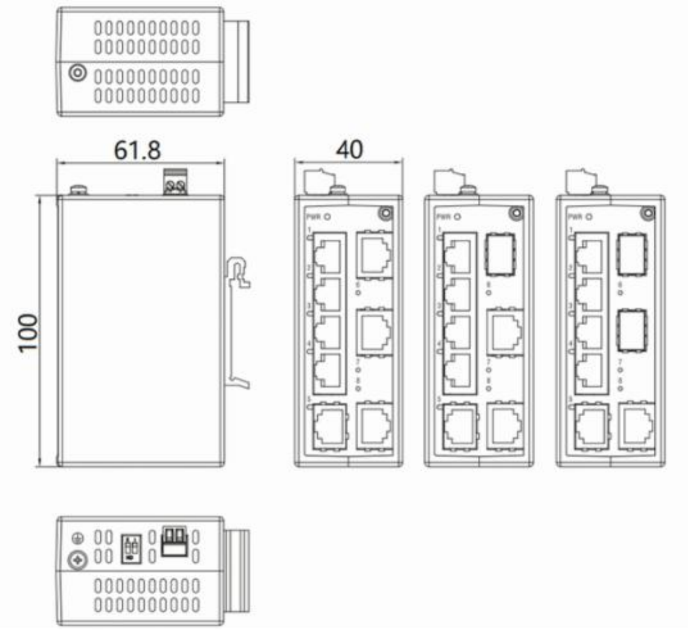

  

    

      
    

    

      Simple, highly reliable network communication system
    

  

  

    

      ISE2008D Unmanaged Industrial Ethernet Switch
    

    

      

        
· Plug-and-play

        
· DIN-rail

      

      

        
· Fanless

        
· IP30

      

    

  

# 1. Product Overview

**The ISE2008D is designed for power, transportation, industrial control, and demanding industrial environments.**

**Product Features:**

- **Robust Design:** Fully enclosed seamless metal casing, fanless design, IP30 protection rating.
- **Wide Adaptability:** Wide-temperature (-40 \~ +75℃) and wide-voltage (9.6-60VDC & 18-30VAC) design.
- **International Standard:** Complies with FCC, CE, ROHS, and UL standards with excellent EMC.
- **Smart Switching:** QoS and Broadcast Storm Protection (BSP), configurable via DIP switch.
- **Easy Deployment:** Plug-and-play, DIN rail mountable, compact size for quick deployment.

## Key Technical Specifications

| Parameter | Specification |
|-----------|---------------|
| Type | Unmanaged Industrial Ethernet Switch, Layer 2, Store-and-Forward |
| Ports | 8 x 10/100 BaseT (or 2 x 100BaseX SFP + 6 x 10/100 BaseT) |
| Switching Performance | 16 Gbps backplane bandwidth, 4K MAC, 1.5 Mbit buffer, <10 us latency |
| Dimensions / Weight | 40 x 100 x 61.8 mm / 0.23 kg |
| Power | 9.6-60 VDC & 18-30 VAC, 5 W |
| Environment | -40 to +75 C operating, IP30, fanless |
| EMC | IEC 61000-4-2/3/4/5/6/8/18, Class 3-5 |
| Certifications | CE, FCC, UL |

# 2. Product Dimensions

  

    
    
ISE2008D

  

  

    
Note:

    
1. All dimensions are in millimeters (mm).

    
2. All dimensions are approximate and for reference only.

    
3. The dimensions shown in the figure shall not be used for production or processing.

    
4. Dimensions must comply with part and manufacturing tolerance requirements.

    
5. Dimensions are subject to change without notice.

  

# 3. Hardware Specifications

| Category/Parameter | Specification |
|----------------------|---------------|
| **Physical Performance** | |
| Enclosure | Fully enclosed seamless metal enclosure |
| Dimensions (W × D × H) | 40 mm × 100 mm × 61.8 mm |
| Weight | 0.23 kg |
| Mounting Method | DIN-rail mounting |
| Cooling Method | Fanless cooling |
| Ingress Protection | IP30 |
| Storage Temperature | -40 °C \~ +85 °C |
| Operating Temperature | -40 °C \~ +75 °C |
| Humidity | 5 \~ 95% (non-condensing) |
| **Hardware Performance** | |
| Backplane Bandwidth | 16 Gbps |
| Processing Type | Store-and-Forward |
| MAC Table Size | 4K |
| Packet Buffer Size | 1.5 Mbits |
| Switching Delay | <10 μs |
| DIP Switch | Quality of Service (QoS), Broadcast Storm Protection (BSP) |
| **Power Parameters** | |
| Operating Voltage | 9.6–60 VDC & 18–30 VAC |
| Power Consumption | 5 W |
| Overcurrent Protection | Supported |
| Reverse Polarity Protection | Supported |
| **Electromagnetic Characteristics** | |
| EMS | IEC(EN)61000-4-2, Class 3; IEC(EN)61000-4-3, Class 3   IEC(EN)61000-4-4, Class 3; IEC(EN)61000-4-5, Class 3   IEC(EN)61000-4-6, Class 3; IEC(EN)61000-4-8, Class 5   IEC(EN)61000-4-18, Class 3 |
| **Certifications** | |
| Certifications | CE, FCC, UL |
| **Quality Assurance** | |
| Warranty Period | 5 years |
| MTBF | 35 years |

## DIP Switch Settings

Users can use the DIP switch on the device panel to enable/disable Quality of Service (QoS) and Broadcast Storm Protection (BSP) functions. Fast Ethernet ports support 10/100 Mbps auto-negotiation.

| Category/Parameter | Specification |
|----------------------|---------------|
| Quality of Service (QoS) – On | Enables the QoS function, processes packet priorities in 2 WRR queues. Priority 7,6,5,4 → Queue 1 (WRR Weight 16); Priority 3,2,1,0 → Queue 0 (WRR Weight 1) |
| Quality of Service (QoS) – Off | Disables the QoS function |
| Broadcast Storm Protection (BSP) – On | Enables broadcast storm protection for all ports (allows max 200 broadcast packets per second) |
| Broadcast Storm Protection (BSP) – Off | Disables the broadcast storm protection function |

# 4. Ordering Guide

| Model | Description |
|-------|-------------|
| ISE2008D-P-8T-24 | 8-port Layer 2 unmanaged Industrial Ethernet Switch. 8 × 10/100 BaseT Ports. IP30 Protection Class, Operating Temperature from -40°C to +75°C. Single power input: 12/24/48 VDC (9.6\~60VDC) or 24 VAC (18\~30 VAC) (Only connect to class 2 power supply). |
| ISE2008D-P-2SFP-6T-24 | 8-port Layer 2 unmanaged Industrial Ethernet Switch. 2 × 100BaseX SFP Port (SFP module not included), and 6 × 10/100 BaseT Ports. IP30 Protection Class, Operating Temperature from -40°C to +75°C. Single power input: 12/24/48 VDC (9.6\~60VDC) or 24 VAC (18\~30 VAC) (Only connect to class 2 power supply). |

# 5. Contact Us

- **Website：** [InHand Networks](https://www.inhandnetworks.com)
- **Copyright：** ©InHand Networks All rights reserved
