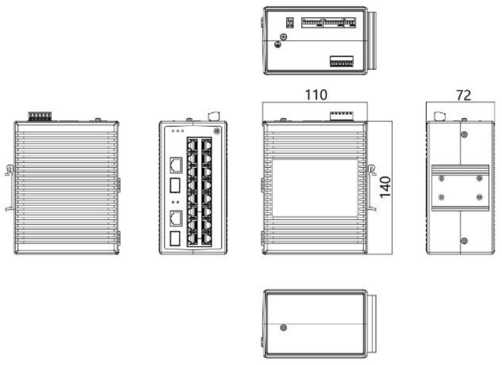

  

    

      
    

    

      Simple, Highly Reliable Industrial Network Communication
    

  

  

    

      ISE3018D Unmanaged Industrial Ethernet Switch
    

    

      

        
· 18 Ports

        
· Gigabit Combo

      

      

        
· IP30

        
· Wide Temperature

      

    

  

# 1. Product Overview

**ISE3018D is an 18-port unmanaged industrial Ethernet switch built for power, transportation, and industrial control environments.**

**Product Features:**

- **Industrial Reliability:** Robust metal casing, fanless design, IP30 protection, wide-temperature operation.
- **Excellent EMC:** Outstanding electromagnetic compatibility and radiation performance.
- **Redundant Power:** Dual input power design (9.6–60 VDC & 18–30 VAC) for high availability.
- **QoS & BSP:** DIP switch-enabled Quality of Service and Broadcast Storm Protection.
- **Easy Deployment:** Plug-and-play, DIN rail mountable, compact size for quick deployment.

## Key Technical Specifications

| Parameter | Specification |
|-----------|---------------|
| Type | Unmanaged Industrial Ethernet Switch, Layer 2, Store-and-Forward |
| Ports | 16 x 10/100 BaseT + 2 x 100/1000Base(X/T) Gigabit Combo (SFP not included) |
| Switching Performance | 8.8 Gbps backplane bandwidth, 8K MAC, 4 Mbit buffer, <10 us latency |
| Dimensions / Weight | 72 x 140 x 110 mm / 1.2 kg |
| Power | 9.6-60 VDC & 18-30 VAC, redundant dual inputs, 10 W |
| Environment | -40 to +75 C operating, IP30, fanless |
| EMC | IEC 61000-4-2/3/4/5/6/8/18, Class 3-5 |
| Certifications | CE, FCC, UL |

# 2. Product Dimensions

  

    
    
Dimension Diagram

  

  

    
Note:

    
1. All dimensions are in millimeters (mm).

    
2. All dimensions are approximate and for reference only.

    
3. The dimensions shown in the figure shall not be used for production or processing.

    
4. Dimensions must comply with part and manufacturing tolerance requirements.

    
5. Dimensions are subject to change without notice.

  

# 3. Hardware Specifications

| Category/Parameter | Specification |
|----------------------|---------------|
| **Physical Performance** | |
| Enclosure | Fully enclosed seamless metal enclosure |
| Dimensions (W × D × H) | 72 mm × 140 mm × 110 mm |
| Weight | 1.2 kg |
| Mounting Method | DIN-rail mounting |
| Cooling Method | Fanless cooling |
| Protection Grade | IP30 |
| Storage Temperature | -40 °C \~ +85 °C |
| Operating Temperature | -40 °C \~ +75 °C |
| Humidity | 5 \~ 95% (non-condensing) |
| **Hardware Performance** | |
| Backplane Bandwidth | 8.8 Gbps |
| MAC Table Size | 8K |
| Packet Buffer Size | 4 Mbits |
| Processing Type | Store-and-Forward |
| Switching Delay | <10 μs |
| **Power Parameters** | |
| Operating Voltage | 9.6–60 VDC & 18–30 VAC, Redundant dual input |
| Power Consumption | 10 W |
| Protection | Overload Current Protection, Reverse Polarity Protection |
| **Electromagnetic Characteristics** | |
| EMS | IEC(EN)61000-4-2, Class 3; IEC(EN)61000-4-3, Class 3   IEC(EN)61000-4-4, Class 3; IEC(EN)61000-4-5, Class 3   IEC(EN)61000-4-6, Class 3; IEC(EN)61000-4-8, Class 5   IEC(EN)61000-4-18, Class 3 |
| **Certifications** | |
| Certifications | CE, FCC, UL |
| **Warranty** | |
| Warranty Period | 5 years |
| MTBF | 35 years |

# 4. Ordering Guide

| Model | Description |
|-------|--------|
| ISE3018D-P-2GC-16T-24 | 18-port Layer 2 unmanaged Industrial Switch. 16 × 10/100BaseT Ports + 2 × 100/1000Base(X/T) Combo Ports (SFP not included). DIP-enabled Sound & Light Alarm Output & 1 Alarm Relay port (1A@24VDC). IP30 Protection Class, Operating Temperature from -40°C to +75°C. Dual 12/24/48 VDC (9.6–60 VDC) & 24VAC (18–30 VAC) Power Input (Only connect to class 2 power supply). |

# 5. Contact Us

- **Website：** [InHand Networks](https://www.inhandnetworks.com)
- **Copyright：** ©InHand Networks All rights reserved
