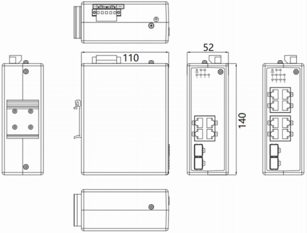
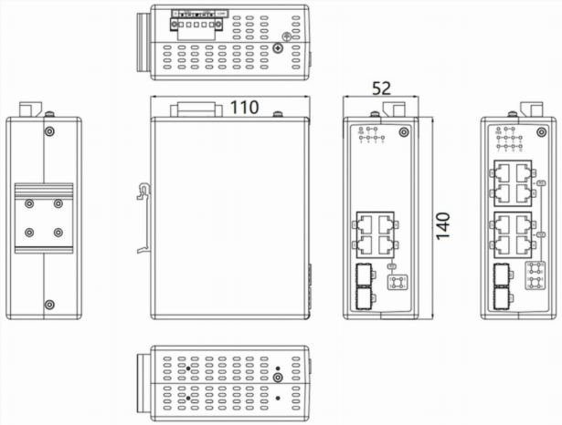

  

    

      
    

    

      Simple, highly reliable network communication system
    

  

  

    

      ISE5X06D Unmanaged Industrial Ethernet Switch
    

    

      

        
· Public Utility

        
· Smart Manufacturing

      

      

        
· Smart City

        
· Smart Energy

      

    

  

# 1. Product Overview

**The ISE5X06D is designed for power, transportation, industrial control, and demanding environments.**

**Product Features:**

- **Robust Design:** Fanless, wide-temperature and wide-voltage, protected industrial circuits.
- **Easy Deployment:** Plug-and-play function, DIN rail mountable, compact size.
- **PoE Support:** IEEE 802.3af/at PSE, up to 30W output power per port (ISE5306D).
- **High Reliability:** Redundant dual input power design, excellent EMC compatibility.
- **Certifications:** Complies with FCC, CE, ROHS standards for diverse industries.

## Key Technical Specifications

| Parameter | Specification |
|-----------|---------------|
| Type | Layer 2 unmanaged, plug-and-play |
| Ports | 2×SFP + 4×Gigabit RJ45 (ISE5306D: IEEE 802.3af/at PoE, up to 30 W per port) |
| Switching | Store-and-forward, 20 Gbps backplane, 4K MAC |
| Dimensions / Weight | 52 × 140 × 110 mm (W × D × H), 0.7 kg |
| Power | Redundant dual inputs: ISE5006D 18–60 VDC / ISE5306D 48–54 VDC |
| Environment | −40 °C \~ +75 °C; ISE5006D IP40 / ISE5306D IP30 |
| EMC | IEC 61000-4-x, Class 3–5 |
| Certifications | CE, FCC; MTBF 35 years; 5-year warranty |

# 2. Product Dimensions

  

    
    
ISE5006D

  

  

    
    
ISE5306D

  

  

    
Note:

    
1. All dimensions are in millimeters (mm).

    
2. All dimensions are approximate and for reference only.

    
3. The dimensions shown in the figure shall not be used for production or processing.

    
4. Dimensions must comply with part and manufacturing tolerance requirements.

    
5. Dimensions are subject to change without notice.

  

# 3. Hardware Specifications

| Category/Parameter | Specification |
|----------------------|---------------|
| **PoE (ISE5306D)** | |
| PoE 10/100/1000 BaseT Ports| 4 ports |
| Maximum Power | 15.4W (IEEE 802.3af) / 30W (IEEE 802.3at) |
| **Physical Performance** | |
| Enclosure | Fully enclosed seamless metal enclosure |
| Dimensions (W × D × H) | 52 mm × 140 mm × 110 mm |
| Weight | 0.7 kg |
| Mounting Method | DIN-rail mounting |
| Protection Grade | IP40 (ISE5006D) / IP30 (ISE5306D) |
| Cooling Method | Fanless cooling |
| Storage Temperature | -40 °C \~ +85 °C |
| Operating Temperature | -40 °C \~ +75 °C |
| Humidity | 5 \~ 95% (non-condensing) |
| **Hardware Performance** | |
| Backplane Bandwidth| 20 Gbps |
| Processing Type | Store-and-Forward |
| MAC Table Size | 4K |
| Packet Buffer Size | 1.5 Mbits |
| Exchange Rate | 148,800 pps / 100M ports; 1,488,000 pps / 1000M ports |
| **Power Parameters** | |
| Operating Voltage | 18-60 VDC, Redundant dual inputs (ISE5006D)   48-54 VDC, Redundant dual inputs (ISE5306D) |
| Protection | Overload Current Protection, Reverse Polarity Protection |
| **Electromagnetic Characteristics** | |
| EMS | IEC(EN)61000-4-2, Class 4; IEC(EN)61000-4-3, Class 3   IEC(EN)61000-4-4, Class 4; IEC(EN)61000-4-5, Class 4   IEC(EN)61000-4-6, Class 3; IEC(EN)61000-4-9, Class 5 |
| **Certifications** | |
| Certifications | CE, FCC |
| **Quality Assurance** | |
| Warranty Period | 5 years |
| MTBF | 35 years |

# 4. Ordering Guide

| Model | Description |
|-------|--------|
| ISE5006D-P-2GSFP-4GT-24 | Layer 2 unmanaged Industrial Switch. 2 *100/ 1000BaseX SFP Ports (SFP module not included), 4* 10/ 100/ 1000 BaseT Ports. IP40 Protection Class, Operating Temperature from -40°C to +75°C. Isolated Dual 18-60VDC Power Inputs.|
| ISE5306D-P-2GSFP-4GT-48 | Layer 2 unmanaged Industrial Switch. 2 *100/ 1000BaseX SFP Ports (SFP module not included), 4* 802.3af/at PoE 10/100/1000 BaseT Ports. IP30 Protection Class, Operating Temperature from -40°C to +75°C. Isolated Dual 48-54VDC Power Inputs.|

# 5. Contact Us

- **Website：** [InHand Networks](https://www.inhandnetworks.com)
- **Copyright：** ©InHand Networks All rights reserved
