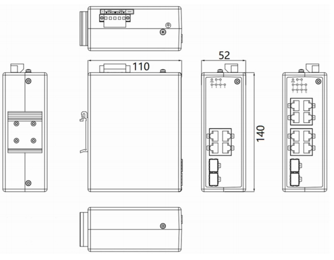
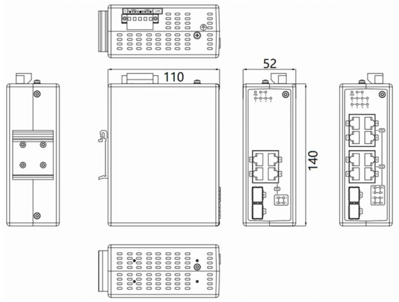

  

    

      
    

    

      Simple, highly reliable network communication system
    

  

  

    

      ISE5X10D Industrial Switch
    

    

      

        
· Plug-and-play

        
· DIN-rail

      

      

        
· Fanless

        
· IP30/IP40

      

    

  

# 1. Product Overview

**ISE5X10D is designed specifically for power, transportation, industrial control, and other demanding industrial environments.**

**Features:**

- **Robust design:** Robust metal casing, fanless design, and industrial-grade power supply design.
- **Wide adaptability:** Wide-temperature (-40 \~ +75℃) and wide-voltage design (18-60VDC / 48-54VDC).
- **International standard:** Complies with FCC, CE, ROHS standards and Excellent EMC.
- **PoE support:** Supports IEEE 802.3af/at PSE, up to 30W output power per port (ISE5310D).
- **Easy deployment:** Plug-and-play, DIN rail mountable, compact size for quick deployment.

## Key Technical Specifications

| Parameter | Specification |
|-----------|---------------|
| Type | Layer 2 Unmanaged Industrial Ethernet Switch |
| Ports | 2 x 100/1000BaseX SFP + 8 x 10/100/1000BaseT (8 x PoE on ISE5310D) |
| Switching Performance | 20 Gbps backplane, Store-and-Forward, 4K MAC |
| Dimensions / Weight | 52 x 140 x 110 mm / 0.7 kg |
| Power | ISE5010D: 18-60 VDC; ISE5310D: 48-54 VDC; Redundant dual inputs |
| Environment | -40 to +75 C operating; ISE5010D: IP40 / ISE5310D: IP30 |
| EMC | IEC 61000-4-2/3/4/5/6 Class 3-4, IEC 61000-4-9 Class 5 |
| Certifications | CE, FCC |

# 2. Product Dimensions

  

    
    
ISE5010D

  

  

    
    
ISE5310D

  

  

    
Note:

    
1. All dimensions are in millimeters (mm).

    
2. All dimensions are approximate and for reference only.

    
3. The dimensions shown in the figure shall not be used for production or processing.

    
4. Dimensions must comply with part and manufacturing tolerance requirements.

    
5. Dimensions are subject to change without notice.

  

# 3. Hardware Specifications

| Category/Parameter | Specification |
|----------------------|---------------|
| **PoE (ISE5310D)** | |
| PoE 10/100/1000 BaseT Ports| 8 ports |
| Maximum Power | 15.4W (IEEE 802.3af) / 30W (IEEE 802.3at) |
| **Physical Performance** | |
| Enclosure | Fully enclosed seamless metal enclosure |
| Dimensions (W × D × H) | 52 mm × 140 mm × 110 mm |
| Weight | 0.7 kg |
| Mounting Method | DIN-rail mounting |
| Cooling Method | Fanless cooling |
| Protection Grade | IP40 (ISE5010D) / IP30 (ISE5310D) |
| Storage Temperature | -40 °C \~ +85 °C |
| Operating Temperature | -40 °C \~ +75 °C |
| Humidity | 5 \~ 95% (non-condensing) |
| **Hardware Performance** | |
| Backplane Bandwidth| 20 Gbps |
| Processing Type | Store-and-Forward |
| MAC Table Size | 4K |
| Packet Buffer Size | 1.5 Mbits |
| Exchange Rate | 148,800 pps / 100M ports; 1,488,000 pps / 1000M ports |
| **Power Parameters** | |
| Operating Voltage | 18-60 VDC, Redundant dual inputs (ISE5010D)   48-54 VDC, Redundant dual inputs (ISE5310D) |
| Protection | Overload Current Protection, Reverse Polarity Protection |
| **Electromagnetic Characteristics** | |
| EMS | IEC(EN)61000-4-2, Class 4; IEC(EN)61000-4-3, Class 3   IEC(EN)61000-4-4, Class 4; IEC(EN)61000-4-5, Class 4   IEC(EN)61000-4-6, Class 3; IEC(EN)61000-4-9, Class 5 |
| **Certifications** | |
| Certifications | CE, FCC |
| **Quality Assurance** | |
| Warranty Period | 5 years |
| MTBF | 35 years |

# 4. Ordering Guide

| Model | Description |
|-------|--------|
| ISE5010D-P-2GSFP-8GT-24 | Layer 2 unmanaged Industrial Switch. 2 *100/ 1000BaseX SFP Ports (SFP module not included), 8* 10/ 100/ 1000 BaseT Ports. IP40 Protection Class, Operating Temperature from -40°C to +75°C. Isolated Dual 18-60VDC Power Inputs.|
| ISE5310D-P-2GSFP-8GT-48 | Layer 2 unmanaged Industrial Switch. 2 *100/ 1000BaseX SFP Ports (SFP module not included), 8* 802.3af/at PoE 10/100/1000 BaseT Ports. IP30 Protection Class, Operating Temperature from -40°C to +75°C. Isolated Dual 48-54VDC Power Inputs.|

# 5. Contact Us

- **Website：** [InHand Networks](https://www.inhandnetworks.com)
- **Copyright：** ©InHand Networks All rights reserved
