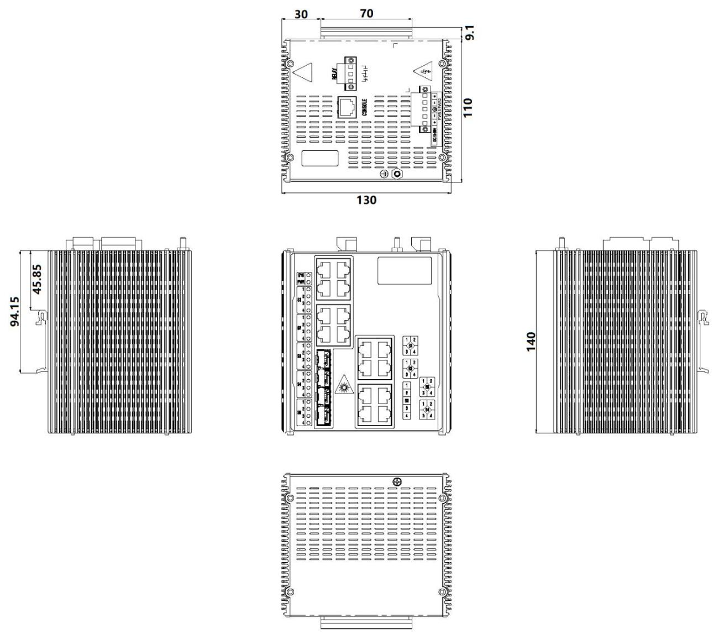

  

    

      
    

    

      Build advanced and highly reliable industrial Ethernet communication system
    

  

  

    

      ISM5020D Managed Industrial Ethernet Switch
    

    

      

        
· Public Utility

        
· Smart Manufacturing

      

      

        
· Smart City

        
· Smart Energy

      

    

  

# 1. Product Overview

**The ISM series Managed Industrial Ethernet Switch has been purpose-built to cater to the rigorous demands of industrial settings, including power, transportation, and industrial control applications.**

**Product Features:**

- **Reliability & Resilience:** Fanless design, IP40 protection rating, rugged metal casing, dust and dirt resistance, and wide temperature operation (-40°C to +85°C). Industrial-grade redundant wide-voltage power supply.
- **Redundancy Protocols:** Supports RSTP / MSTP / ERPS / MRP ring redundancy protocols (recovery time ≤50ms).
- **Network Management:** Supports SNMP v2c/v3 for integrated network management and RMON for effective network monitoring. Allows graphical representation of traffic, device temperature, CPU usage, and neighbor devices.
- **Enhanced Security:** Dynamic ARP Inspection, DHCP Snooping, L2/L3/L4 ACLs, IP Source Guard, overvoltage protection, IGMP Snooping, and VLAN segmentation.
- **Advanced Control:** Dying gasp power-down reporting, WEB/CLI factory reset scripts, 8 ToS/DSCP QoS queues, sFlow protocol, and static routing.

## Key Technical Specifications

| Parameter | Specification |
|-----------|---------------|
| Type | Layer 3 Managed Industrial Ethernet Switch |
| Ports | 16 x 10/100/1000BaseT + 4 x 100/1000/2500BaseX SFP |
| Switching Performance | 68 Gbps backplane bandwidth; 16K MAC table; 1G RAM |
| Dimensions / Weight | 130 mm x 140 mm x 110 mm; 1.3 kg |
| Power | 18\~60 VDC redundant dual input |
| Environment | -40 to +85 °C operating; IP40 |
| EMC | FCC Part 15 Class A; IEC 61000-4-2/3/4/5/6/8/11/12 |
| Management | Web, CLI, SNMPv1/v2c/v3, RMON; ERPS/MRP/RSTP/MSTP, IGMP, VLAN, QoS 8 queues |
| Certifications | CE, FCC, IEC61850-3 |

# 2. Product Dimensions

  

    
    
ISM5020D

  

  

    
Note:

    
1. All dimensions are in millimeters (mm).

    
2. All dimensions are approximate and for reference only.

    
3. The dimensions shown in the figure shall not be used for production or processing.

    
4. Dimensions must comply with part and manufacturing tolerance requirements.

    
5. Dimensions are subject to change without notice.

  

# 3. Technical Specifications

## 3.1 Protocol Compliance List

| Category/Parameter | Specification |
|----------------------|---------------|
| **IEEE Standards** | |
| IEEE 802.3 | CSMA/CD method and physical Layer specifications |
| IEEE 802.1p | Class of Service |
| IEEE 802.1q | VLAN tagging |
| IEEE 802.1d | Spanning Tree Algorithm |
| IEEE 802.1w | Rapid Spanning Tree |
| IEEE 802.1s | Multiple Spanning Tree |
| IEEE 802.3ac | VLAN Tagging |
| IEEE 802.1x | Authentication |
| IEEE 802.3ad | Link Aggregation |
| IEEE 802.3x | Flow Control |
| IEEE 802.3 | Ethernet |
| IEEE 802.3u | Fast Ethernet |
| IEEE 802.3z | Gigabit Ethernet |
| IEEE 802.1ab | Link Layer Discovery Protocol |
| **RFC Standards** | |
| RFC 768 | UDP |
| RFC 791 | IP |
| RFC 792 | ICMP |
| RFC 793 | TCP |
| RFC 826 | ARP |
| RFC 854 | Telnet Client & Server |
| RFC 862 | Echo Protocol |
| RFC 863 | Discard Protocol |
| RFC 904 | Exterior Gateway Protocol Formal Specification |
| RFC 1027 | Using ARP to Implement Transparent Subnet Gateways |
| RFC 1058 | RIP |
| RFC 1059, 1119 | NTPv1/2 |
| RFC 1112 | IGMP |
| RFC 1191 | Path MTU Discovery |
| RFC 1256 | ICMP Router discovery protocol |
| RFC 1267 | A Border Gateway Protocol 3 (BGP-3) |
| RFC 1388 | RIP Version 2 Carrying Additional Information |
| RFC 1403 | BGP OSPF Interaction |
| RFC 1519 | CIDR (Classless Inter-domain Routing) |
| RFC 1587 | OSPF NSSA |
| RFC 1812 | Requirements for IP Version 4 Routers |
| RFC 1994 | PPP Challenge Handshake Authentication Protocol (CHAP) |
| RFC 2068 | HTTP |
| RFC 213 | DHCP Server |
| RFC 2138 | RADIUS |
| RFC 2139 | RADIUS Accounting |
| RFC 2236 | IGMPv2 |
| RFC 2328 | OSPF V2 |
| RFC 2338 | VRRP |
| RFC 2370 | The OSPF Opaque LSA Option |
| RFC 2474 | DiffServ Precedence |
| RFC 2475 | DiffServ Core and Edge Router Functions |
| RFC 2597 | DiffServ Assured Forwarding |
| RFC 2598 | DiffServ Expedited Forwarding |
| RFC 2644 | Directed Broadcasts |
| RFC 2865 | Remote Authentication Dial User Service (RADIUS) |
| RFC 3046 | DHCP Relay Agent Information Option |
| RFC 3222 | Forwarding Information Base (FIB) |
| **Other Protocols** | |
| GMRP | GARP |
| GVRP | GARP |
| SSH2 | Secure Shell 2 |
| IGMP | Snooping |
| SNMPv3 | Supported |

## 3.2 Hardware Specifications

| Category/Parameter | Specification |
|----------------------|---------------|
| **Physical Performance** | |
| Enclosure | Fully enclosed seamless metal enclosure |
| Dimensions (W × D × H) | 130 mm × 140 mm × 110 mm |
| Weight | 1.3 kg |
| Mounting Method | DIN-rail mounting |
| Cooling Method | Fanless cooling |
| Ingress Protection | IP40 |
| Storage Temperature | -40 °C \~ +85 °C |
| Operating Temperature | -40 °C \~ +85 °C |
| Humidity | 5 \~ 95% (non-condensing) |
| **Hardware Performance** | |
| Backplane Bandwidth | 68 Gbps |
| Transmission Mode | Parallel Storage Forwarding |
| RAM | 1G |
| Flash | 32M |
| MAC Table Size | 16K |
| Packet Buffer Size | 4 Mbits |
| Exchange Rate | 148,800 pps/100M ports; 1,488,000 pps/1000M ports |
| **Power Parameters** | |
| Input Voltage | 18-60 VDC Redundant dual input |
| Overload Current Protection | Supported |
| Reverse Polarity Protection | Supported |
| **Electromagnetic Characteristics** | |
| EMI | FCC 47 CFR Part 15 Class A; EN55022 Class A |
| EMS | IEC(EN)61000-4-2, Class 4   IEC(EN)61000-4-3, Class 3   IEC(EN)61000-4-4, Class 3   IEC(EN)61000-4-5, Class 4   IEC(EN)61000-4-6, Class 3   IEC(EN)61000-4-8, Class 5   IEC(EN)61000-4-11, Class 4   IEC(EN)61000-4-12, Class 3 |
| **Mechanical Characteristics** | |
| Shock | IEC60068-2-27 |
| Freefall | IEC60068-2-31 |
| Vibration | IEC60068-2-6 |
| **Certifications** | |
| Certifications | CE, FCC, IEC61850-3 |
| **Quality Assurance** | |
| Warranty Period | 5 years |
| MTBF | 35 years |

# 4. Software Specifications

| Software Functions | Specification |
|----------------------|---------------|
| Redundancy | ERPS, MRP, RSTP, MSTP, Port Trunking |
| Management Mode | Web, serial port, STD-17 MIB-II, STD-58 SMIv2, STD-59 RMON, STD-62 SNMPv3, SNMPv2c, SNMPv1, RFC2925 Ping MIB |
| Time Synchronization | SNTP |
| Diagnostic Mode | Indicator light, journal file, relay, RMON, port mirroring, TRAP |
| Others | 4K VLANS ID, 256 Active VLANS, IPv4/IPv6 multicast, storm control, MC/BC protection, support Jumbo Frame, HTTPS, SSHv2, and SFTP, supports QoS 8 queues |

# 5. Ordering Guide

| Model | Description |
|-------|-------------|
| ISM5020D-P-4GSFP-16GT-24 | 20-port Layer 3 managed Industrial Switch. 16 *10/100/1000Base-T/TX RJ45 Autosense MDI/MDI-X Port + 4* 100/1000/2500BaseX SFP slots. Isolated Dual 18-60VDC Power Inputs. 1 Management Serial CLI port, 1 Alarm Relay port. |

# 6. Contact Us

- **Website：** [InHand Networks](https://www.inhandnetworks.com)
- **Copyright：** ©InHand Networks All rights reserved
