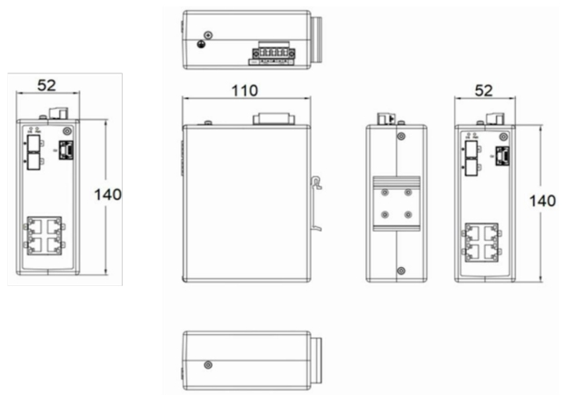
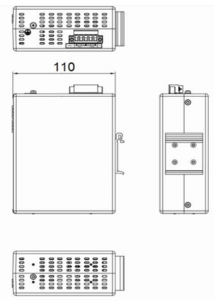

  

    

      
    

    

      Build advanced and highly reliable industrial Ethernet communication system
    

  

  

    

      ISM5X06D Managed Industrial Ethernet Switch
    

    

      

        
· Public Utility

        
· Smart Manufacturing

      

      

        
· Smart City

        
· Smart Energy

      

    

  

# 1. Product Overview

**The ISM series of managed industrial Ethernet switches is specifically designed to meet the demands of harsh industrial environments such as power, transportation, and industrial control applications.**

**Product Features:**

- **Reliability & Resilience:** Fanless design, IP30/IP40 protection rating, dust and dirt resistance, and wide temperature operation.
- **Redundancy Protocols:** Supports STP/RSTP/MSTP ring redundancy protocols, offering flexible choices for intricate industrial networks.
- **Network Management:** Supports SNMP for integrated network management and RMON for effective network monitoring and fault prediction.
- **Enhanced Security & Control:** Port-based VLAN, IEEE 802.1Q VLAN, GVRP, IGMP Snooping, and QoS to process critical data.
- **PoE Capabilities:** Supports IEEE 802.3af/at PSE, providing up to 30W output power per port (ISM5306D).

## Key Technical Specifications

| Parameter | Specification |
|-----------|---------------|
| Type | Managed Industrial Ethernet Switch |
| Ports | 2 x 100/1000/2500BaseX SFP + 4 x 10/100/1000BaseT; PoE on ISM5306D (4 ports, 30 W max/port) |
| Switching Performance | 44 Gbps backplane, 8K MAC, 128 MB RAM |
| Dimensions / Weight | 52 x 140 x 110 mm / 0.7 kg |
| Power | ISM5006D: 18-60 VDC / ISM5306D: 48-57 VDC, dual redundant input, 10 W |
| Environment | -40 to +75 °C operating; ISM5006D: IP40 / ISM5306D: IP30 |
| Management | Web, CLI, SNMPv1/v2c/v3, RMON, RSTP/MSTP, VLAN, IGMP Snooping, 802.1X |
| Certifications | CE, FCC |

# 2. Product Dimensions

  

    
    
ISM5006D

  

  

    
    
ISM5306D

  

  

    
Note:

    
1. All dimensions are in millimeters (mm).

    
2. All dimensions are approximate and for reference only.

    
3. The dimensions shown in the figure shall not be used for production or processing.

    
4. Dimensions must comply with part and manufacturing tolerance requirements.

    
5. Dimensions are subject to change without notice.

  

# 3. Technical Specifications

## 3.1 Protocol Compliance List

| Category/Parameter | Specification |
|----------------------|---------------|
| **IEEE Standards** | |
| IEEE 802.3 | CSMA/CD method and physical Layer specifications |
| IEEE 802.1p | Priority Queuing |
| IEEE 802.1q | VLAN tagging |
| IEEE 802.1d | Spanning Tree Algorithm |
| IEEE 802.1w | Rapid Spanning Tree |
| IEEE 802.1s | Multiple Spanning Tree |
| IEEE 802.3ac | VLAN Tagging |
| IEEE 802.1x | Authentication |
| IEEE 802.3ad | Link Aggregation |
| IEEE 802.3x | Flow Control |
| IEEE 802.3 | Ethernet |
| IEEE 802.3u | Fast Ethernet |
| IEEE 802.3z | Gigabit Ethernet |
| IEEE 802 | Networks |
| **RFC Standards** | |
| RFC 768 | UDP |
| RFC 791 | IP |
| RFC 792 | ICMP |
| RFC 793 | TCP |
| RFC 826 | ARP |
| RFC 854 | Telnet Client & Server |
| RFC 862 | Echo Protocol |
| RFC 863 | Discard Protocol |
| RFC 867 | Daytime Protocol |
| RFC 868 | Time Protocol |
| RFC 1059, 1119 | NTPv1/2 |
| RFC 1191 | Path MTU Discovery |
| RFC 1403 | BGP OSPF Interaction |
| RFC 1542 | Bootstrap Extensions & DHCP |
| RFC 1994 | PPP Challenge Handshake Authentication Protocol |
| RFC 2068 | HTTP |
| RFC 213 | DHCP Server |
| RFC 2138 | RADIUS |
| RFC 2139 | RADIUS Accounting |
| RFC 2236 | IGMPv2 |
| RFC 2474 | DiffServ Precedence |
| RFC 2597 | DiffServ Assured Forwarding |
| RFC 2598 | DiffServ Expedited Forwarding |
| RFC 2865 | Remote Authentication Dial In User Service (RADIUS) |
| RFC 3046 | DHCP Relay Agent Information Option |
| RFC 3222 | Forwarding Information Base (FIB) |
| **Other Protocols** | |
| GMRP | GARP |
| GVRP | GARP |
| SSH2 | Secure Shell 2 |
| IGMP | Snooping |
| SNMPv3 | Supported |

## 3.2 Hardware Specifications

| Category/Parameter | Specification |
|----------------------|---------------|
| **Physical Performance** | |
| Enclosure | Fully enclosed seamless metal enclosure |
| Dimensions (W × D × H) | 52 mm × 140 mm × 110 mm |
| Weight | 0.7 kg |
| Mounting Method | DIN-rail mounting |
| Cooling Method | Fanless cooling |
| Ingress Protection | IP40 / IP30 |
| Storage Temperature | -40 °C \~ +85 °C |
| Operating Temperature | -40 °C \~ +75 °C |
| Humidity | 5 \~ 95% (non-condensing) |
| **Hardware Performance** | |
| Backplane Bandwidth | 44 Gbps |
| Transmission Mode | Parallel Storage Forwarding |
| MAC Table Size | 8K |
| RAM | 128 MB |
| Packet Buffer Size | 1.5 Mbits |
| Exchange Rate | 148,800 pps/100M ports; 1,488,000 pps/1000M ports |
| **Power Parameters** | |
| Input Voltage | 18\~60 VDC dual redundant input (ISM5006D)   48\~57 VDC dual redundant input (ISM5306D) |
| Power Consumption | 10 W (ISM5006D) |
| Overcurrent Protection | Supported |
| Reverse Polarity Protection | Supported |
| **PoE (ISM5306D)** | |
| PoE 10/100/1000 BaseT Ports | 4 ports |
| Maximum Power | 15.4W (IEEE 802.3af); 30W (IEEE 802.3at) |
| **Electromagnetic Characteristics** | |
| EMI | FCC 47 CFR Part 15 Class A; EN55022 Class A |
| EMS | IEC(EN)61000-4-2, Class 4   IEC(EN)61000-4-4, Class 4   IEC(EN)61000-4-5, Class 4   IEC(EN)61000-4-11, Class 4   IEC(EN)61000-4-12, Class 4 |
| **Mechanical Characteristics** | |
| Shock | IEC60068-2-27 |
| Freefall | IEC60068-2-31 |
| Vibration | IEC60068-2-6 |
| **Certifications** | |
| Certifications | CE, FCC |
| **Quality Assurance** | |
| Warranty Period | 5 years |
| MTBF | 35 years |

# 4. Software Specifications

| Category/Parameter | Specification |
|----------------------|---------------|
| **Software Functions** | |
| Redundancy | STP, MSTP, RSTP, Port Trunking |
| Management Mode | Browser, Serial Port, STD-17 MIB-II, STD-58 SMIv2, STD-59 RMON, STD-62 SNMPv3, SNMPv2c, SNMPv1 |
| Time Synchronization | NTP |
| Diagnostic Mode | Indicator light, Journal File, RMON, Port Mirroring, TRAP |

# 5. Ordering Guide

| Model | Description |
|-------|-------------|
| ISM5006D-P-2GSFP-4GT-24 | 6-port Layer2 managed Industrial Switch. 2 *100/1000/2500BaseX SFP Ports (SFP module not included), 4* 10/100/1000BaseT Ports. 1 Management Serial CLI Port, IP40 Protection Class, Operating Temperature from -40°C to +75°C. Isolated Dual 18-60VDC Power Inputs. |
| ISM5306D-P-2GSFP-4GT-48 | 6-port Layer2 managed Industrial Switch. 2 *100/1000/2500BaseX SFP Ports (SFP module not included), 4* 802.3af/at PoE 10/100/1000BaseT Ports. 1 Management Serial CLI Port, IP30 Protection Class, Operating Temperature from -40°C to +75°C. Dual 48-57VDC Power Inputs. |

# 6. Contact Us

- **Website：** [InHand Networks](https://www.inhandnetworks.com)
- **Copyright：** ©InHand Networks All rights reserved
