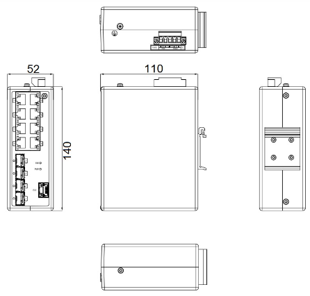

  

    

      
    

    

      Build Advanced and Highly Reliable Industrial Ethernet Communication Systems
    

  

  

    

      ISM7012D-P Managed Industrial Ethernet Switch
    

    

      

        
· L2+ Managed

        
· 4×SFP + 8×GT

      

      

        
· Ring Redundancy

        
· IP40

      

    

  

# 1. Product Overview

**The ISM series of managed industrial Ethernet switches is purpose-built for harsh environments in power, transportation, and industrial control, delivering reliable operation under extreme temperatures.**

**Product Positioning:** Build advanced and highly reliable industrial Ethernet communication systems

**Product Highlights:**
- **Robust Industrial Design:** Rugged metal casing with protective coating, fanless, IP40, wide-temperature operation
- **Redundant Power Supply:** Dual input power design with wide voltage input for stable communication
- **Ring Redundancy:** STP / RSTP / MSTP ring redundancy protocols for flexible network topologies
- **Easy Management:** SNMPv1/v2c/v3 and RMON management, plug-and-play, quick DIN-rail deployment
- **High Reliability:** MTBF over 35 years for long-term mission-critical operation

## Key Technical Specifications

| Item | Specification |
|------|---------------|
| Dimensions (W × D × H) | 52 × 140 × 110 mm |
| Weight | 0.7 kg |
| Mounting | DIN-rail mounting |
| Ports | 4 × 1000Base-X SFP + 8 × 10/100/1000Base-T |
| Switching Capacity | 68 Gbps backplane bandwidth |
| Power Supply | 18–60 V DC, redundant dual input |
| Operating Temperature | -40 °C \~ +75 °C |
| Ingress Protection | IP40 |

# 2. Product Dimensions

  

    
    
ISM7012D-P (52 × 140 × 110 mm)

  

  

    
Note:

    
1. All dimensions are in millimeters (mm).

    
2. All dimensions are approximate and for reference only.

    
3. The dimensions shown in the figure shall not be used for production or processing.

    
4. Dimensions must comply with part and manufacturing tolerance requirements.

    
5. Dimensions are subject to change without notice.

  

# 3. Hardware Specifications

| Category / Parameter | Specification |
|--------------------------|------|
| **Hardware Performance** | |
| Backplane Bandwidth | 68 Gbps |
| Forwarding Mode | Store-and-Forward |
| MAC Address Table | 16K |
| Packet Buffer | 4 Mbits |
| Forwarding Rate | 148,800 pps @ 100M ports; 1,488,000 pps @ 1000M ports |
| **Interfaces** | |
| SFP Port | 4 × 1000Base-X SFP (SFP module not included) |
| Ethernet Port | 8 × 10/100/1000Base-T RJ45 |
| Console Port | 1 × Management Serial CLI Port |
| **Power** | |
| Input Voltage | 18–60 V DC, redundant dual input |
| Overcurrent Protection | Supported |
| Reverse Polarity Protection | Supported |
| Power Consumption | 10 W |
| **Mechanical** | |
| Dimensions (W × D × H) | 52 × 140 × 110 mm |
| Weight | 0.7 kg |
| Enclosure | Fully enclosed seamless metal enclosure |
| Ingress Protection | IP40 |
| Cooling Method | Fanless |
| Mounting | DIN-rail mounting |
| **Environmental** | |
| Operating Temperature | -40 °C \~ +75 °C |
| Storage Temperature | -40 °C \~ +85 °C |
| Humidity | 5 \~ 95 % RH (non-condensing) |
| **EMC** | |
| EMI | FCC 47 CFR Part 15 Class A; EN55022 Class A; EN55035 Class A |
| ESD Immunity | IEC (EN) 61000-4-2, Level 4 |
| Radiated Electric Field | IEC (EN) 61000-4-3, Level 3 |
| Electrical Fast Transient/Burst Immunity | IEC (EN) 61000-4-4, Level 4 |
| Surge | IEC (EN) 61000-4-5, Level 4 |
| Conducted Immunity | IEC (EN) 61000-4-6, Level 3 |
| Power Frequency Magnetic Field | IEC (EN) 61000-4-8, Level 5 |
| **Shock and Vibration** | |
| Shock Resistance | IEC 60068-2-27 |
| Drop | IEC 60068-2-31 |
| Vibration Resistance | IEC 60068-2-6 |
| **Quality Assurance** | |
| Warranty Period | 5 years |
| MTBF | 35 years |

# 4. Software Specifications

| Category / Parameter | Specification |
|--------------------------|------|
| **Redundancy** | |
| Ring Protocols | STP, RSTP, MSTP |
| Link Aggregation | Port Trunking (IEEE 802.3ad) |
| Flow Control | IEEE 802.3x |
| **VLAN** | |
| VLAN | Port-based VLAN, IEEE 802.1Q VLAN, GVRP |
| **QoS** | |
| Priority & Queuing | IEEE 802.1P/1Q, TOS/DiffServ |
| **Multicast** | |
| Multicast Filtering | IGMP Snooping, GMRP/GARP |
| **Routing** | |
| IP Routing | Static routing, RIP v2, OSPFv2, BGP, VRRP |
| **Network Security** | |
| Authentication | IEEE 802.1x, RADIUS, SSH2 |
| **Network Management** | |
| Management Mode | Browser (Web), Serial Port (CLI), Telnet |
| SNMP | SNMPv1, SNMPv2c, SNMPv3, MIB-II, SMIv2, RMON, Ping MIB (RFC 2925) |
| Time Synchronization | SNTP, NTP |
| **Diagnostics** | |
| Diagnostic Mode | Indicator light, Journal File (Syslog), RMON, Port Mirroring, TRAP |

# 5. Ordering Information

## Model Code

**Model code:** ISM7012D-P-\<SFP\>-\<GT\>-\<Temp\>

\<SFP\>: Number and type of SFP fiber ports

\<GT\>: Number and type of Gigabit RJ45 ports

\<Temp\>: Operating temperature grade

## Product Models

| Model | Region | Description |
|-------|--------|-------------|
| ISM7012D-P-4GSFP-8GT-24 | Global | 12-Port Layer 2+ Managed Industrial Switch. 4 × 1000Base-X SFP Ports (SFP module not included), 8 × 10/100/1000Base-T Ports, 1 × Management Serial CLI Port. IP40 Protection Class, Operating Temperature -40 °C \~ +75 °C, Isolated Dual 18–60 V DC Power Inputs. |

# 6. Contact Us

- **Website:** [InHand Networks](https://www.inhand.com)
- **Copyright:** ©InHand Networks. All rights reserved.
