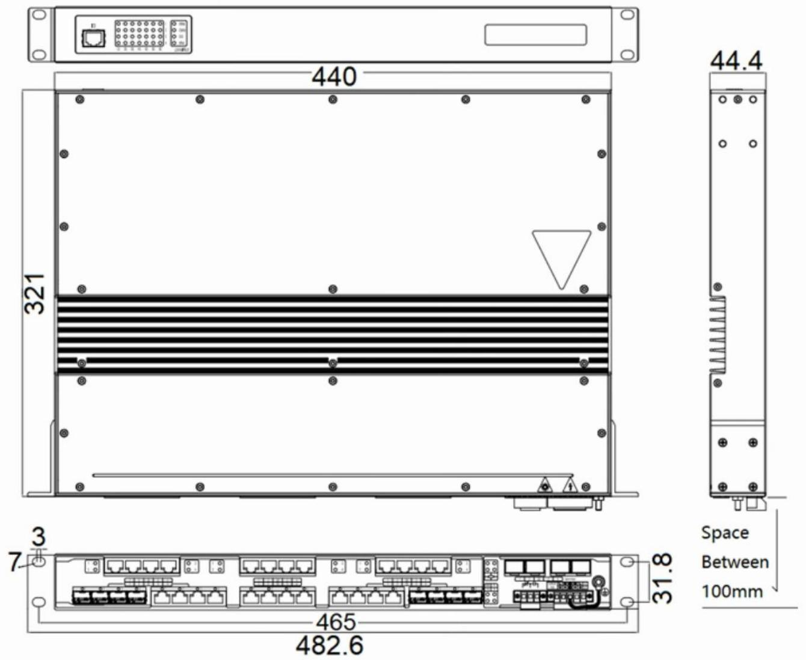

  

    

      
    

    

      Build advanced and highly reliable industrial Ethernet communication system
    

  

  

    

      ISM7028U-P Managed Industrial Ethernet Switch
    

    

      

        
· Public Utility

        
· Smart Manufacturing

      

      

        
· Smart City

        
· Smart Energy

      

    

  

# 1. Product Overview

**The ISM series of managed industrial Ethernet switches is specifically designed to meet the demands of harsh industrial environments such as power, transportation, and industrial control applications. The rugged casing design and protected circuits among other industrial-grade features perform its remarkable adaption to rough environments.**

**Product Features:**

- **Reliability & Resilience:** Fanless design, IP40 protection rating, robust metal casing, dust and dirt resistance, and wide temperature operation (-40°C to +85°C). Industrial-grade dual redundant high-voltage power supply design.
- **Redundancy Protocols:** Supports STP/RSTP/MSTP ring redundancy protocols offering flexible choices for constructing intricate communication systems. Any two ports can establish an independent self-recovery ring.
- **Network Management:** Supports SNMP for integrated network management and RMON for effective monitoring. Allows unified and quick deployment in rack mount formats.
- **Enhanced Security & Control:** Comprehensive linear industrial switch functions, offering high performance, data packet dropout protection, and intelligent features such as VLAN network segmentation and advanced multicast protection mechanisms.

## Key Technical Specifications

| Parameter | Specification |
|-----------|---------------|
| Type | Layer 3 Managed Industrial Ethernet Switch |
| Ports | 16x 10/100/1000BaseT + 8x 100/1000Base(X/T) COMBO + 4x 1000/2500BaseX SFP |
| Switching Performance | 144 Gbps backplane bandwidth; 16K MAC table; 1.5 Mbit buffer |
| Dimensions / Weight | 440 x 321 x 44.4 mm / 4.1 kg |
| Power | 100-240V AC dual-isolated inputs |
| Environment | -40 to +85 °C operating; IP40; fanless |
| Management | Web, CLI, SNMPv1/v2c/v3, RMON |
| Protocols | STP/RSTP/MSTP, IGMP Snooping, OSPF, VRRP, PIM-SM/DM, BGP, Port Trunking |
| EMC / Certifications | FCC Part 15 Class A; EN55022 Class A; IEC 61000-4 series; IEC61850-3 |

# 2. Product Dimensions

  

    
    
ISM7028U

  

  

    
Note:

    
1. All dimensions are in millimeters (mm).

    
2. All dimensions are approximate and for reference only.

    
3. The dimensions shown in the figure shall not be used for production or processing.

    
4. Dimensions must comply with part and manufacturing tolerance requirements.

    
5. Dimensions are subject to change without notice.

  

# 3. Technical Specifications

## 3.1 Protocol Compliance List

| Category/Parameter | Specification |
|----------------------|---------------|
| **IEEE Standards** | |
| IEEE 802.3 | CSMA/CD method and physical Layer specifications |
| IEEE 802.1p | Priority Queuing |
| IEEE 802.1q | VLAN tagging |
| IEEE 802.1d | Spanning Tree Algorithm |
| IEEE 802.1w | Rapid Spanning Tree |
| IEEE 802.1s | Multiple Spanning Tree |
| IEEE 802.3ac | VLAN Tagging |
| IEEE 802.1x | Authentication |
| IEEE 802.3ad | Link Aggregation |
| IEEE 802.3x | Flow Control |
| IEEE 802.3 | Ethernet |
| IEEE 802.3u | Fast Ethernet |
| IEEE 802.3z | Gigabit Ethernet |
| IEEE 802 | Networks |
| **RFC Standards** | |
| RFC 213 | DHCP Server |
| RFC 768 | UDP |
| RFC 791 | IP |
| RFC 792 | ICMP |
| RFC 793 | TCP |
| RFC 826 | ARP |
| RFC 854 | Telnet Client & Server |
| RFC 904 | Exterior Gateway Protocol Formal Specification |
| RFC 1027 | Using ARP to Implement Transparent Subnet Gateways |
| RFC 1058 | RIP |
| RFC 1059, 1119 | NTPv1/2 |
| RFC 1112 | IGMP |
| RFC 1191 | Path MTU Discovery |
| RFC 1256 | ICMP Router discovery protocol |
| RFC 1267 | A Border Gateway Protocol 3 (BGP-3) |
| RFC 1388 | RIP Version 2 Carrying Additional Information |
| RFC 1403 | BGP OSPF Interaction |
| RFC 1519 | CIDR (Classless Inter-domain Routing) |
| RFC 1587 | OSPF NSSA |
| RFC 1765 | OSPF Database Overflow |
| RFC 1812 | Requirements for IP Version 4 Routers |
| RFC 1994 | PPP Challenge Handshake Authentication Protocol (CHAP) |
| RFC 2068 | HTTP |
| RFC 2138 | RADIUS |
| RFC 2139 | RADIUS Accounting |
| RFC 2236 | IGMPv2 |
| RFC 2328 | OSPF V2 |
| RFC 2338 | VRRP |
| RFC 2362 | PIM-SM/DM |
| RFC 2370 | The OSPF Opaque LSA Option |
| RFC 2474 | DiffServ Precedence |
| RFC 2475 | DiffServ Core and Edge Router Functions |
| RFC 2597 | DiffServ Assured Forwarding |
| RFC 2598 | DiffServ Expedited Forwarding |
| RFC 2644 | Directed Broadcasts |
| RFC 2865 | Remote Authentication Dial In User Service (RADIUS) |
| RFC 3046 | DHCP Relay Agent Information Option |
| RFC 3222 | Forwarding Information Base (FIB) |
| **Other Protocols** | |
| GMRP | GARP |
| GVRP | GARP |
| SSH2 | Secure Shell 2 |
| IGMP | Snooping |
| SNMPv3 | Supported |

## 3.2 Hardware Specifications

| Category/Parameter | Specification |
|----------------------|---------------|
| **Physical Performance** | |
| Enclosure | Fully enclosed seamless metal enclosure |
| Dimensions (W × D × H) | 440 mm × 321 mm × 44.4 mm |
| Weight | 4.1 kg |
| Mounting Method | Rack mounting |
| Cooling Method | Fanless cooling |
| Ingress Protection | IP40 |
| Storage Temperature | -40 °C \~ +85 °C |
| Operating Temperature | -40 °C \~ +85 °C |
| Humidity | 5 \~ 95% (non-condensing) |
| **Hardware Performance** | |
| Backplane Bandwidth | 144 Gbps |
| Transmission Mode | Parallel Storage Forwarding |
| MAC Table Size | 16K |
| Packet Buffer Size | 1.5 Mbits |
| Exchange Rate | 148,800 pps/100M ports; 1,488,000 pps/1000M ports |
| **Power Parameters** | |
| Input Voltage | 100-240V dual-isolated power inputs |
| **Electromagnetic Characteristics** | |
| EMI | FCC 47 CFR Part 15 Class A; EN55022 Class A |
| EMS | IEC(EN)61000-4-2, Class 4   IEC(EN)61000-4-3, Class 3   IEC(EN)61000-4-4, Class 4   IEC(EN)61000-4-5, Class 4   IEC(EN)61000-4-6, Class 3   IEC(EN)61000-4-9, Class 5 |
| **Mechanical Characteristics** | |
| Shock | IEC60068-2-27 |
| Freefall | IEC60068-2-31 |
| Vibration | IEC60068-2-6 |
| **Certifications** | |
| Certifications | IEC61850-3 |
| **Quality Assurance** | |
| Warranty Period | 5 years |
| MTBF | 35 years |

# 4. Software Specifications

| Software Functions | Specification |
|----------------------|---------------|
| Redundancy | STP, MSTP, RSTP, Port Trunking |
| Management Mode | Browser, Serial Port, STD-17 MIB-II, STD-58 SMIv2, STD-59 RMON, STD-62 SNMPv3, SNMPv2c, SNMPv1 |
| Time Synchronization | NTP |
| Diagnostic Mode | Indicator light, Journal File, RMON, Port Mirroring, TRAP |
| Others | IPv4/IPv6 multicast, storm control, MC/BC protection, support Jumbo Frame |

# 5. Ordering Guide

| Model | Description |
|-------|-------------|
| ISM7028U-P-8GC-4GSFP-16GT-HV-HV | 28-port Layer 3 managed Industrial Switch. 16 *10/100/1000BaseT Ports, 8* 100/1000Base(X/T) COMBO Ports, and 4 * 1000/2500BaseX SFP Ports (SFP module not included), dual isolated 100-240V power inputs. |

# 6. Contact Us

- **Website：** [InHand Networks](https://www.inhandnetworks.com)
- **Copyright：** ©InHand Networks All rights reserved
