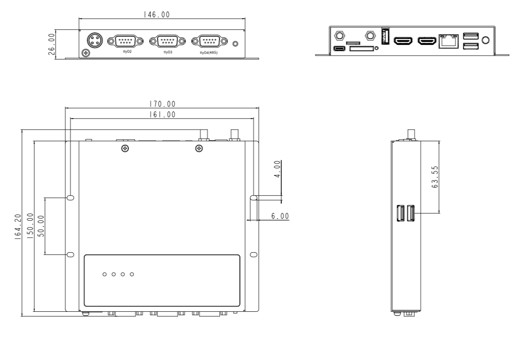

  

    

      
    

    

      High-Performance, Stable, ARM Industrial Computer
    

  

  

    

      InBOX712 Industrial Computer
    

    

      

        
· Dual HDMI

        
· Gigabit ETH

      

      

        
· 4K Display

        
· Android 7.1

      

    

  

# 1. Product Overview

**InBOX712 is a 4G ARM industrial computer with dual HDMI extended display and Gigabit Ethernet for multimedia-rich industrial applications.**

**Key Features:**

- **Dual HDMI Display:** Two HDMI ports for dual-screen extended display, HDMI1 with audio, supports up to 4K decoding
- **High Performance:** RK3399 six-core processor at 1.8 GHz, 2 GB RAM / 16 GB storage
- **Rich Interfaces:** 4 × USB 2.0, 1 × USB 3.0, RS232, RS485, Gigabit Ethernet, Bluetooth 4.1
- **Industrial Reliability:** Metal housing, IP40, fanless, -20~70°C wide temperature, EMC Level 3
- **Android Optimized:** Deeply optimized Android 7.1, stable long-term operation for digital signage and kiosks

## Core Specifications

| Specification       | Details                       |
| ------------------- | ----------------------------- |
| CPU                 | RK3399, 6-Core, 1.8 GHz       |
| OS                  | Android 7.1                   |
| RAM / Storage       | 2 GB / 16 GB eMMC             |
| Wi-Fi               | 802.11b/g/n, Client/AP Mode   |
| Bluetooth           | Bluetooth 4.1                 |
| Display             | Dual HDMI (up to 4K)          |
| Ethernet            | 1 × 10/100/1000 Mbps          |
| Serial              | 2 × RS-232, 1 × RS-232/RS-485 |
| USB                 | 4 × USB 2.0, 1 × USB 3.0      |
| Power Input         | 12 V DC                       |
| Working Temperature | -20 ~ 70°C                    |
| Dimensions          | 170 × 150 × 26 mm             |

# 2. Product Dimensions

  

    
Note:

    
1. All dimensions are in millimeters (mm).

    
2. All dimensions are approximate, for reference only.

    
3. Illustrated dimensions must not be used for production processing.

    
4. Dimensions must comply with component and manufacturing tolerances.

    
5. Dimensions are subject to change without notice.

# 3. Hardware Specifications

| Category / Parameter                                 | Specification                                                                                       |
| ---------------------------------------------------- | --------------------------------------------------------------------------------------------------- |
| **Processor**     |                                                                                                     |
| CPU                                                  | RK3399, 6-Core, 1.8 GHz                                                                             |
| RAM                                                  | 2 GB                                                                                                |
| FLASH                                                | 16 GB eMMC                                                                                          |
| **Interfaces**    |                                                                                                     |
| Ethernet                                             | 1 × 10/100/1000 Mbps, LAN/WAN                                                                       |
| Serial                                               | 2 × RS-232 (DB9); 1 × RS-232/RS-485 (DB9)                                                           |
| USB                                                  | 4 × USB 2.0; 1 × USB 3.0                                                                            |
| HDMI                                                 | HDMI1: Default 1366 × 768, resolution modifiable, with audio HDMI2: Fixed 1920 × 1080, no audio |
| Debug                                                | 1 × Type-C                                                                                          |
| SIM                                                  | 1 × Drawer-type SIM card holder                                                                     |
| SD                                                   | 1 × Drawer-type SD card holder                                                                      |
| Antenna                                              | 1 × SMA (3G/4G); 1 × RP-SMA (Wi-Fi)                                                                 |
| Buttons                                              | 1 × Power Button; 1 × Mode Key                                                                      |
| **Connectivity**  |                                                                                                     |
| Cellular                                             | 4G LTE                                                                                              |
| Wi-Fi                                                | 802.11b/g/n, Client/AP Mode                                                                         |
| Bluetooth                                            | Bluetooth 4.1                                                                                       |
| **Power**         |                                                                                                     |
| Power Input                                          | 12 V DC (self-lock four-core circular interface)                                                    |
| Power Consumption                                    | < 10 W (without peripherals)                                                                        |
| **Mechanical**    |                                                                                                     |
| Dimensions (W × D × H)                               | 170 × 150 × 26 mm (Including installation parts)                                                    |
| Installation                                         | Wall Mounting                                                                                       |
| Protection Rating                                    | IP40                                                                                                |
| Housing                                              | Metal                                                                                               |
| Cooling                                              | Fanless                                                                                             |
| **Environmental** |                                                                                                     |
| Working Temperature                                  | -20 ~ 70°C                                                                                          |
| Storage Temperature                                  | -40 ~ 85°C                                                                                          |
| Humidity                                             | 5 ~ 95% (non-condensing)                                                                            |
| **Reliability**   |                                                                                                     |
| RTC                                                  | Embedded RTC with button battery                                                                    |
| **EMC**           |                                                                                                     |
| ESD                                                  | Level 3                                                                                             |
| EFT                                                  | Level 3                                                                                             |
| Surge                                                | Level 3                                                                                             |
| **Indicators**    |                                                                                                     |
| Power LED                                            | Always on after power on                                                                            |
| Status LED                                           | Flashing during normal operation                                                                    |
| Wi-Fi LED                                            | Always on when connected normally                                                                   |
| 3G/4G LED                                            | Always on when connected normally                                                                   |
| **Certification** |                                                                                                     |
| Certification                                        | CCC, CE, FCC, IC                                                                                    |

# 4. Software Specifications

| Category / Parameter                                            | Specification                                                                                   |
| --------------------------------------------------------------- | ----------------------------------------------------------------------------------------------- |
| **Operating System**         |                                                                                                 |
| OS                                                              | Android 7.1                                                                                     |
| **Network**                  |                                                                                                 |
| Network                                                         | 4G                                                                                              |
| Wi-Fi                                                           | 802.11b/g/n, Client/AP Mode                                                                     |
| Bluetooth                                                       | Bluetooth 4.1                                                                                   |
| **Graphics Processing**      |                                                                                                 |
| Processing Power                                                | Dual ISP up to 800 MPix/s, supports dual camera data input, 3D and depth information extraction |
| Video Codec                                                     | H.265/H.264/VP9 4K@60fps HD video decoding                                                      |
| Image Processing                                                | BMP, JPG, PNG, GIF                                                                              |
| **Configuration Management** |                                                                                                 |
| Timer Switch                                                    | Supported                                                                                       |
| Upgrade                                                         | Local USB upgrade                                                                               |

# 5. Ordering Information

## Model Code

**Model code:** InBOX712-\<WMNN\>-\<STD/PLAT/L\>-\<A\>-\<S\>

\<WMNN\>: Cellular Networks

\<STD/PLAT/L\>: OS (STD = Android)

\<A\>: Reserved

\<S\>: Serial Port Type (485 = RS-485 included)

## Product Models

| Model                 | Region        | \<WMNN\>: Cellular Networks                                                                                                                | \<STD/PLAT/L\>: OS | \<S\>: Serial Port Type |
| --------------------- | ------------- | ------------------------------------------------------------------------------------------------------------------------------------------ | ------------------ | ----------------------- |
| InBOX712-DQ20-STD     | China         | LTE-FDD: B1/B3/B5/B8 LTE-TDD: B34/B38/B39/B40/B41 WCDMA: B1/B8 TD-SCDMA: B34/B39 CDMA/EVDO: BC0 GSM/EDGE: 900/1800 MHz | STD: Android       | —                       |
| InBOX712-DQ20-STD-485 | China         | LTE-FDD: B1/B3/B5/B8 LTE-TDD: B34/B38/B39/B40/B41 WCDMA: B1/B8 TD-SCDMA: B34/B39 CDMA/EVDO: BC0 GSM/EDGE: 900/1800 MHz | STD: Android       | RS-485 × 1              |
| InBOX712-FQ58-STD-485 | EMEA          | LTE-FDD: B1/B3/B7/B8/B20/B28A WCDMA: B1/B8 GSM/EDGE: B3/B8                                                                         | STD: Android       | RS-485 × 1              |
| InBOX712-FQ39-STD     | North America | LTE-FDD: B2/B4/B5/B7/B12/B13/B25/B26/B29/B30/B66 WCDMA: B2/B4/B5                                                                       | STD: Android       | —                       |
| InBOX712-EN00-STD     | Global        | —                                                                                                                                          | STD: Android       | —                       |

# 6. Contact Us

- **Website:** [InHand Networks](https://www.inhand.com)
- **Copyright:** ©InHand Networks. All Rights Reserved.
