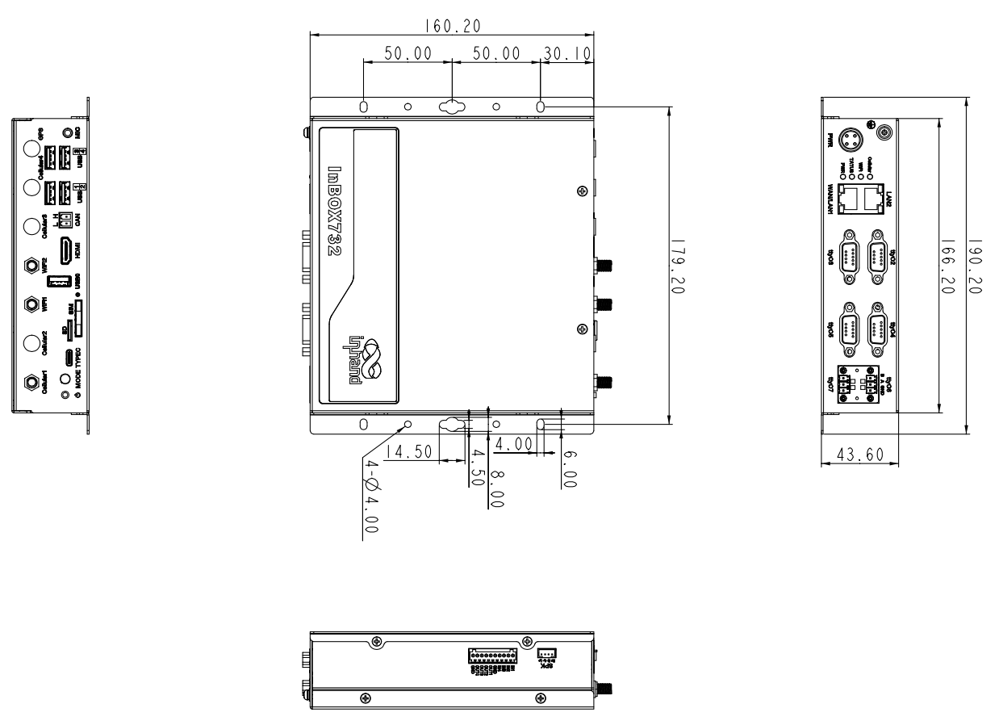

  

    

      
    

    

      High-Performance, Stable, and Interface-Rich ARM Industrial PC
    

  

  

    

      InBOX732 Industrial Computer
    

    

      

        
· 4G/WiFi/Bluetooth

        
· Hexa-Core Processor

      

      

        
· Rich Interfaces

        
· Industrial Design

      

    

  

# 1. Product Overview

**The InBOX732 Series ARM Industrial PC is designed for commercial and industrial applications, delivering powerful configuration and rich interfaces for data integration, processing, and device networking.**

**Product Features:**

- **Powerful Configuration:** Hexa-core processor, 2GB/16GB storage, 4K output, rich interfaces
- **Multi-OS Support:** Optional Android/Linux systems, deeply optimized for long-term stability
- **Seamless Networking:** Supports 4G/WiFi/Wired connections to ensure uninterrupted device communication
- **Industrial Design:** Metal chassis IP40, Level 3 EMC, -20°C~70°C wide temperature range
- **Rich Interfaces:** 4×RS232, 2×RS485, 5×USB, HDMI, dual Ethernet ports, etc.

## Key Technical Specifications

| Item             | Specification                                         |
| ---------------- | ----------------------------------------------------- |
| Cellular Network | 4G Full Netcom                                        |
| Wi-Fi            | 802.11a/b/g/n, Client / AP Mode                       |
| Bluetooth        | Bluetooth 5.0                                         |
| Operating System | Linux(Debian9) / Android10                            |
| Video Output     | HDMI2.0, supports 4K@60fps                            |
| Network Access   | 4G / WiFi / Wired                                     |
| Dimensions (W × D × H) | 190.2 × 160.2 × 43.6 mm                       |
| Mounting         | Wall Mount                                            |
| Interfaces       | 4×RS232, 2×RS485, 5×USB, 2×Gigabit Ethernet, HDMI, CAN, GPIO |
| Power Supply     | 9–24 V DC                                             |
| Operating Temperature | -20 °C ~ +70 °C                                  |
| Protection Level | IP40                                                  |

# 2. Product Dimensions

  

    
1. All dimensions are in millimeters (mm).

    
2. All dimensions are approximate values, for reference only.

    
3. The dimensions shown shall not be used for production or processing.

    
4. Dimensions must meet part and manufacturing tolerance requirements.

    
5. Dimensions are subject to change without notice.

# 3. Hardware Specifications

| Category/Parameter                                | Specification                                         |
| ------------------------------------------------- | ----------------------------------------------------- |
| **Processor** |                                                       |
| CPU                                               | Rockchip Hexa-Core Processor, max frequency 1.8 GHz   |
| Memory                                            | 2 GB                                                  |
| Storage                                           | 16 GB eMMC                                            |
| **Connectivity & Networking** |                                           |
| Cellular Network                                  | 4G Full Netcom                                        |
| SIM Card Specification                            | 1.8 V / 3 V, Drawer-type card slot × 1                |
| SD Card Slot                                      | SD card slot × 1                                      |
| Antenna Interface                                 | 3G/4G: SMA × 1; Wi-Fi: RP-SMA × 2                     |
| **Interfaces** |                                                       |
| Ethernet                                          | 2 × 10/100/1000 Mbps, LAN/WAN                         |
| Serial Ports                                      | 4 × RS232 (DB9 Male); 2 × RS485 (3-pin Terminal)      |
| USB                                               | 4 × USB 2.0; 1 × USB 3.0                              |
| HDMI                                              | HDMI 2.0 × 1, supports 4K@60fps                       |
| CAN                                               | CAN × 1                                               |
| GPIO                                              | 10-pin green terminal × 1 (IN1 ~ 4, GND, OUT1 ~ 4, GND) |
| Audio                                             | MIC 3.5 mm × 1; SPK dual-channel 4 Ω 3 W × 1          |
| Debug Interface                                   | Type-C × 1                                            |
| Buttons                                           | Power button × 1; Mode button × 1                     |
| **Wireless**  |                                                       |
| Wi-Fi                                             | 802.11a/b/g/n, Client / AP Mode                       |
| Bluetooth                                         | Bluetooth 5.0                                         |
| **LED Indicators** |                                                   |
| LED Indicators                                    | Power, Status, Wi-Fi, 3G/4G                           |
| **Power**     |                                                       |
| Input Power                                       | 9–24 V DC                                             |
| Power Consumption                                 | Total < 12 W (without peripherals)                    |
| **Mechanical** |                                                       |
| Dimensions (W × D × H)                            | 190.2 × 160.2 × 43.6 mm (including mounting bracket)  |
| Mounting Method                                   | Wall Mount                                            |
| Protection Level                                  | IP40                                                  |
| Cooling                                           | Fanless Cooling                                       |
| Chassis Material                                  | Metal                                                 |
| **Environmental** |                                                     |
| Operating Temperature                             | -20 °C ~ +70 °C                                       |
| Storage Temperature                               | -40 °C ~ +85 °C                                       |
| Humidity                                          | 5 ~ 95 % RH (non-condensing)                          |
| **EMC**      |                                                       |
| EMC Specifications                                | ESD Level 3; EFT Level 3; Surge Level 3               |

# 4. Software Specifications

| Category/Parameter                               | Specification                                         |
| ------------------------------------------------ | ----------------------------------------------------- |
| **Operating System** |                                                |
| Operating System                                 | Linux(Debian9) / Android10                            |
| **Network Features** |                                                  |
| Network Standard                                 | 4G Full Netcom                                        |
| Wi-Fi                                            | 802.11a/b/g/n, supports Client / AP Mode              |
| Bluetooth                                        | Bluetooth 5.0                                         |
| **Multimedia** |                                                      |
| Graphics Processing                              | Dual ISP 800 MPix/s, supports dual cameras, 3D, depth info extraction |
| Video Codec                                      | H.265/H.264/VP9 4K@60fps HD decoding                  |
| Image Formats                                    | BMP, JPG, PNG, GIF                                    |
| **Configuration Management** |                                          |
| Scheduled Power On/Off                           | Supported                                             |
| System Upgrade                                   | Local USB Upgrade                                     |

# 5. Ordering Information

## Model Code Rule

**Model code:** InBOX732-\<WMNN\>-\<STD/PLAT/L\>-\<A\>-\<S\>
\<WMNN\>: Cellular Type & Module
\<STD/PLAT/L\>: OS
\<A\>: —
\<S\>: Serial port type

## Product Models

| Model              | Region | \<WMNN\>: Cellular Networks                                                                                                                                                                                            | \<STD/PLAT/L\>: OS | \<A\> | \<S\>: Serial port type |
| ------------------ | ------ | ---------------------------------------------------------------------------------------------------------------------------------------------------------------------------------------------------------------------- | ------------------- |:-----:|:-----------------------:|
| InBOX732-DQ20-L    | China  | LTE-FDD: B1/B3/B5/B8 LTE-TDD: B34/B38/B39/B40/B41 WCDMA: B1/B8 TD-SCDMA: B34/B39 CDMA/EVDO: BC0 GSM/EDGE: 900/1800 MHz                                                                           | Debian              | —     | —                       |
| InBOX732-FQ58-L    | EMEA   | LTE-FDD: B1/B3/B7/B8/B20/B28A WCDMA: B1/B8 GSM/EDGE: B3/B8                                                                                                                                                    | Debian              | —     | —                       |
| InBOX732-FQ39-L    | North America | LTE-FDD: B2/B4/B5/B7/B12/B13/B25/B26/B29/B30/B66 2×CA B2+B2/B5/B12/B13/B29; B4+B4/B5/B12/B13/B29; B7+B5/B7/B12/B26; B25+B5/B12/B25/B26; B30+B5/B12/B29; B66+B5/B12/B13/B29/B66 WCDMA: B2/B4/B5 | Debian              | —     | —                       |
| InBOX732-EN00-L    | —      | —                                                                                                                                                                                                                      | Debian              | —     | —                       |

# 6. Contact Us

- **Official Website:** [InHand Networks](https://www.inhand.com.cn)
- **Copyright Notice:** © InHand Networks. All rights reserved.
