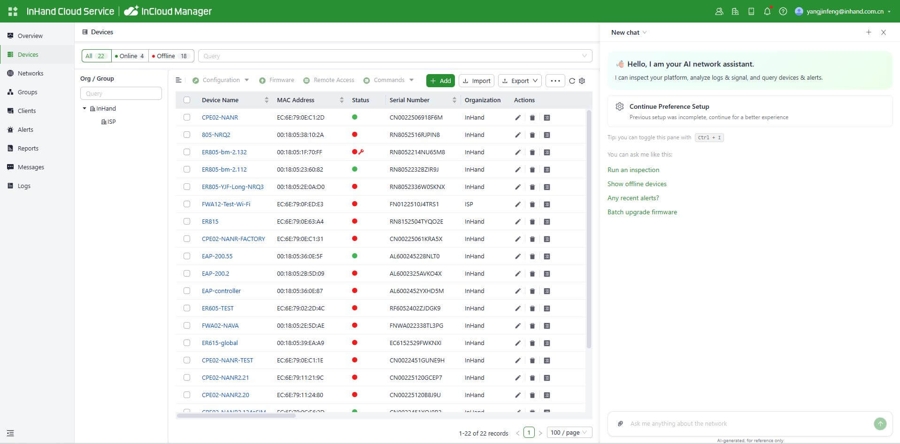
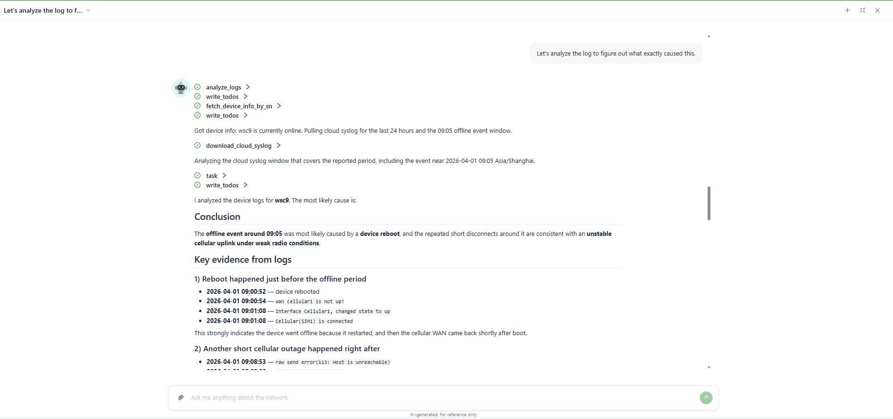
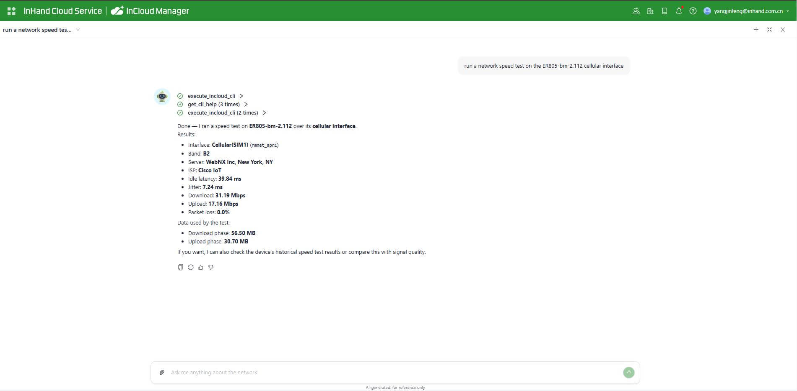
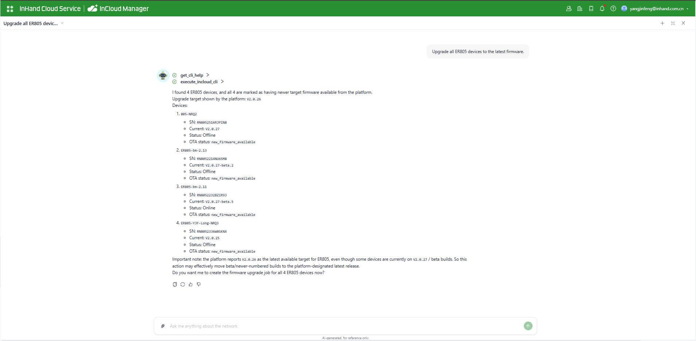

  

    

      
    

    

      Intelligent Management. Seamless Connectivity.
    

  

  

    

      InCloud Manager
    

    

      

        
· AI Network Assistant

        
· Zero-Touch Cloud Management

      

      

        
· Cloud-Native Management

        
· Remote Deployment

      

    

  

# 1. Cloud Platform Overview

**Intelligent Management. Seamless Connectivity.**

 **AI Network Assistant · Zero-Touch Cloud Management**

InHand Networks InCloud Manager is an enterprise network management platform designed for retail stores and SMB offices. Combined with InHand edge routers, APs, and switches, it delivers a simplified, cloud-native network management solution. InCloud Manager enables businesses to move device and network operations to the cloud, supporting one-stop remote deployment and centralized management of network and communication devices across any scenario.

The newly launched **AI Network Assistant** brings network operations into the natural language era — issue plain-language instructions to complete device inspections, fault diagnosis, and batch configurations, dramatically improving operational efficiency. It helps businesses grow effectively, reduce management costs, and strengthen their competitive advantage in digital operations.

# 2. AI Network Assistant

 Simply type a natural language instruction in the AI Network Assistant dialog to manage the full device lifecycle — no page-by-page navigation required, no professional network engineering background needed.

# 3. The O&M Challenge: Staffing Constraints and Efficiency Bottlenecks

Common pain points in traditional network management:

| Channel Partners                                                                         | End Customers                                                                             |
| ---------------------------------------------------------------------------------------- | ----------------------------------------------------------------------------------------- |
| One person can only manage a limited number of devices — scaling up means falling behind | Routine inspection of dozens of devices requires hours of clicking through Web UIs        |
| Experienced network engineers are scarce and costly                                      | Troubleshooting an offline device means jumping through multiple pages — slow and tedious |
| Customers are geographically dispersed, making on-site visits expensive                  | Signal quality requires manual lookup and comparison against standards                    |
|                                                                                          | Batch operations are done entirely by hand, device by device                              |

# 4. 9 AI Capabilities Covering the Full Device Lifecycle

## Device Monitoring

Get real-time visibility into every device's operational status — no manual page browsing required.

- Query online / offline status with filtering by name, location, or group
- View online history to track recent device stability trends
- Real-time traffic statistics to detect abnormal bandwidth consumption
- View connected client count and details

**Example:**

> User: Show me all offline devices
> 
> Assistant:
> | Device Name | SN | Offline Since |
> |---|---|---|
> | Router A | SN001 | 5 minutes ago |
> | Router B | SN002 | 5 minutes ago |

## Fault Diagnosis

More than a simple query — the AI automatically runs a multi-step diagnostic chain and delivers a complete analysis with actionable recommendations.

Example: **Device Offline Diagnosis** — AI executes 5 automated steps:

| Step                     | AI Action                          | Finding                                                                                         |
| ------------------------ | ---------------------------------- | ----------------------------------------------------------------------------------------------- |
| 1. Check device status   | Confirm offline timestamp          | Last online at 10:23                                                                            |
| 2. Review online history | Analyze recent disconnect patterns | 3 dropouts in the past week, mostly at night                                                    |
| 3. Check signal records  | Analyze RSRP trend                 | Dropped from −95 to −112 dBm (weak signal range)                                                |
| 4. Review system logs    | Search for key events              | Modem reset events found                                                                        |
| 5. Conclusion            | —                                  | **"Persistent signal degradation causing frequent disconnects — recommend inspecting antenna"** |

**Example:**

> User: Why did the first device go offline?
> 
> Assistant: Auto-checked signal → reviewed logs → Conclusion: Signal degradation (RSRP −112 dBm). Recommend checking the antenna.

---

## Signal Analysis

No need to manually look up standards or compare raw values — the AI evaluates cellular signal quality and delivers a clear, direct verdict.

| Signal Level | RSRP Range      | Description                             |
| ------------ | --------------- | --------------------------------------- |
| Excellent    | > −85 dBm       | Strong signal, stable operations        |
| Good         | −85 ~ −100 dBm  | Normal operation                        |
| Fair         | −100 ~ −110 dBm | Potential risk, recommend monitoring    |
| Poor         | < −110 dBm      | High risk, immediate action recommended |

- Automatically flags devices that fall below professional thresholds
- View historical signal trends to detect degradation before it causes issues
- Cross-device signal quality comparison to quickly identify underperforming sites

**Example:**

> User: Which devices have poor signal quality?
> 
> Assistant: 3 devices currently have poor signal quality:
> | Device | RSRP | Level | Recommendation |
> |---|---|---|---|
> | Store A – Router | −118 dBm | Poor | Check antenna or adjust mounting position |
> | Store C – Router | −113 dBm | Poor | Check antenna |
> | Warehouse B – Router | −106 dBm | Fair | Continue monitoring |

---

## Remote Diagnostics

Run diagnostic commands directly without logging into the device Web UI — results returned instantly.

- **Ping**: Test network connectivity and latency
- **Traceroute**: Trace path and locate breakpoints
- **Packet Capture**: Capture packets for protocol analysis
- **Speed Test**: Measure actual bandwidth and verify link quality

**Example:**

> User: Run a speed test on Store A's router cellular interface
> 
> Assistant: Speed test complete. Results:
> 
> - Download: 48.3 Mbps
> - Upload: 12.1 Mbps
> - Latency: 34 ms / Packet Loss: 0%
> - Conclusion: Network is operating normally — current link meets business requirements

---

## Configuration Management

Read, modify, and copy device configurations with full traceability and rollback support at every step.

- **Read / Modify**: Query or update device configuration items directly, without opening the Web UI
- **Copy Config**: Quickly replicate one device's configuration to other devices
- **Snapshot Backup**: Automatically save a configuration snapshot before any change
- **Rollback**: Restore to any previous configuration version in one click

**Example:**

> User: Use Device-xxx's config as the standard template and push it to all other ER805 devices
> 
> Assistant: Current config comparison → Diff review → Confirm changes → **Awaiting confirmation before execution**

---

## Firmware Upgrade

AI manages the entire process from version selection to upgrade completion, significantly reducing the risk of manual errors.

- **Compatibility Check**: Automatically verify firmware compatibility with device model before upgrading
- **Staged Rollout**: Support group-based or time-window-based batch upgrades to minimize business risk
- **Progress Monitoring**: Track upgrade status for every device in real time with automatic alerts on failure
- **Rollback Protection**: Instantly revert to the previous firmware version if an upgrade fails

**Example:**

> User: Upgrade all ER805 devices to the latest firmware
> 
> Assistant: Detected 23 ER805 devices. Current version: V2.0.18. Latest version: V2.0.27.
> Compatibility check: All passed.
> Recommended: 3 batches of ~8 devices each, with 10-minute intervals. Estimated total time: 35 minutes.
> Confirm to proceed?

## Alert Management

Centralized view and management of all network alerts — no anomaly goes unnoticed.

- View current unacknowledged alert list, sorted by severity
- Acknowledge / close alerts with action logging
- Manage alert rules: add, modify, enable or disable alert policies
- Correlated analysis of alerts and device status

**Example:**

> User: What unacknowledged alerts are there recently?
> 
> Assistant: 5 unacknowledged alerts currently:
> | Device | Alert Type | Time | Severity |
> |---|---|---|---|
> | Store G – Router | Device Offline | Today 09:15 | Critical |
> | Warehouse B – Router | Cellular Data Overrun | Yesterday 23:40 | Warning |
> | Store D – Router | High CPU Utilization | Yesterday 18:22 | Warning |
> | Store B – Router | Link Status Abnormal | Yesterday 14:05 | Info |
> | Store F – Router | Signal Quality Degraded | Yesterday 11:30 | Info |
> Would you like to handle them one by one, or prioritize a specific device?
> 
> ---

## Remote Terminal

For advanced operations, launch the device control interface directly — no manual navigation required.

- **Open Device Web UI**: Jump directly to the target device's management page
- **Open Command Line**: Access the device CLI directly for advanced operations
- All operations are authenticated by user account; activity logs are fully auditable

**Example:**

> User: Open the management interface for Store A's router
> 
> Assistant: Remote connection established. Store A (SN: ER805-001) Web UI is now open in a new window. This session has been recorded in the activity log.

---

## Batch Operations

Issue instructions to multiple devices simultaneously — no repetitive manual device-by-device execution.

- **Batch Inspection**: Run a health check on all devices at once and generate a consolidated report
- **Batch Config Push**: Push a configuration template to a specified device group
- **Batch Firmware Upgrade**: Initiate bulk firmware upgrades with unified progress tracking
- **Batch License Management**: View license status, renew, or assign licenses in bulk

**Example:**

> User: Run a monthly inspection on all retail store devices
> 
> Assistant: Inspecting 60 devices… Complete. Report:
> 
> - Online and healthy: 42 devices
> - Weak signal (attention needed): 3 devices (Store A, C, F)
> - Offline: 18 device
> 
>     ...
> 
> - I can continue with one of these:
>   
>   1. **Inspect the 18 offline devices**
>   2. **Check which device has config error / pending config**
>   3. **Review firmware candidates for upgrade**
>   4. **Focus on a specific device from the list**
>   
>   If you want, I can start by drilling into the **offline devices** first.

---

# 5. AI-Powered O&M: Across-the-Board Efficiency Gains

| Task                           | Traditional Approach                                        | With AI Network Assistant                                          |
| ------------------------------ | ----------------------------------------------------------- | ------------------------------------------------------------------ |
| Monthly device inspection      | Log into each device's Web UI individually — takes days     | Natural language instruction — complete report in minutes          |
| Offline device troubleshooting | Browse multiple pages manually, make your own judgment      | AI auto-runs full diagnostic flow, delivers complete conclusion    |
| Batch config deployment        | Manual filtering, device-by-device execution                | Issue one instruction, batch execution runs automatically          |
| Bulk firmware upgrade          | Manual device-by-device operation, manual progress tracking | Unified initiation, staged execution, automatic progress reporting |
| Signal quality audit           | Manually look up data and compare against standards         | AI auto-evaluates signal quality and delivers direct conclusions   |

**Reduce Labor Costs**: Team members don't need deep network expertise — AI effectively closes the experience gap. New staff get up to speed quickly, significantly shortening training time.

**Reduce Travel Costs**: Most issues can be identified and resolved remotely. On-site visits are reserved for scenarios where physical presence is truly necessary.

**Generate Additional Revenue** (for MSPs / System Integrators): Inspection reports can be delivered directly as client service deliverables, forming a standardized, billable value-added service.

# 6. Transparent and Controllable — Every Step Visible

Every AI operation is fully transparent. Not a black box — a visible, accountable assistant.

| Safety Mechanism                        | Description                                                                                                      |
| --------------------------------------- | ---------------------------------------------------------------------------------------------------------------- |
| ✅ Read-only operations unrestricted     | Query status, view alerts, analyze signal — zero risk, use anytime                                               |
| ✅ Write operations require confirmation | Modify config, upgrade firmware, reboot — changes displayed in full before execution, awaiting user confirmation |
| ✅ Operations tied to user account       | Every action is logged with the operator's identity; complete activity audit trail                               |
| ✅ Standardized execution flow           | Each operation follows the same process every time, regardless of who performs it — reducing human error risk    |

---

# 7. Industry Applications

Applicable wherever distributed devices need centralized management.

| Industry                    | Typical Scenario                               | Core Value                                                                           |
| --------------------------- | ---------------------------------------------- | ------------------------------------------------------------------------------------ |
| **Retail Chain**            | Convenience stores, cafes, pharmacies          | Network downtime directly impacts sales — fast recovery minimizes revenue loss       |
| **ATM / Financial**         | Bank branches, payment terminals               | Strict compliance requirements and SLA commitments                                   |
| **Industrial / Energy**     | Production lines, power stations, mining sites | Remote O&M reduces downtime and ensures production continuity                        |
| **Traffic Monitoring**      | Highways, urban traffic systems                | Centralized batch management of hundreds or thousands of devices                     |
| **MSP / System Integrator** | Multi-customer managed services                | Manage multiple clients with one person; inspection reports become billable services |

**Case Study: Retail Chain Store Network Operations** *(Each store's router handles POS + surveillance + digital price tags + HQ connectivity)*

| Scenario                                                    | Traditional Approach                              | With AI Network Assistant                                                                  |
| ----------------------------------------------------------- | ------------------------------------------------- | ------------------------------------------------------------------------------------------ |
| Store outage — manager reports network down                 | Remote page-by-page investigation, time-consuming | AI locates root cause in minutes → **Significantly reduces business downtime**             |
| Monthly inspection — days of device-by-device review        | Manual device-by-device audit                     | AI generates complete report in minutes → **Problem stores automatically flagged**         |
| Pre-event network check — ahead of major promotion          | Manual monitoring, ad hoc                         | Real-time monitoring during event period → **O&M team has full visibility and confidence** |
| New store rollout — push standard config to all new devices | Manual device-by-device configuration             | Natural language batch instruction → **Dramatically reduces labor investment**             |
