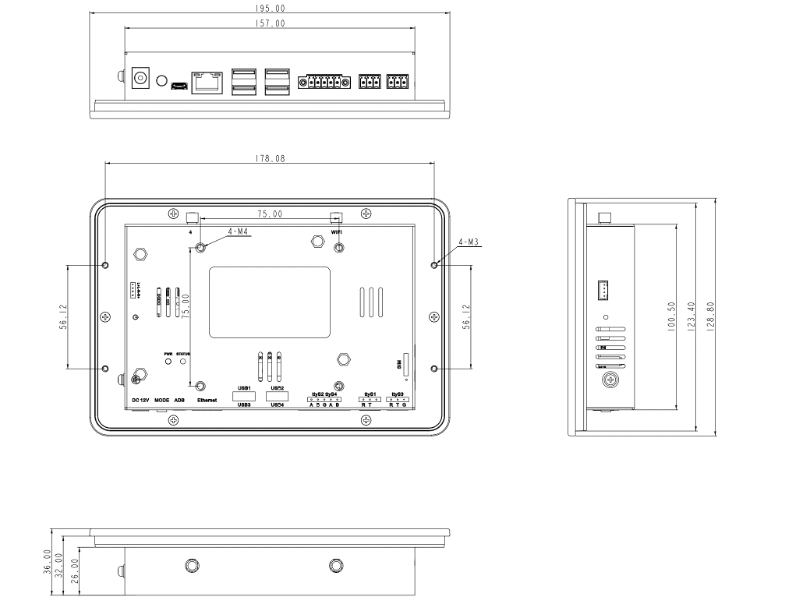

  

    

      
    

    

      7'' All-in-One Android Tablet
    

  

  

    

      InPAD070S Industrial Tablet
    

    

      

        
· 7" Touch Screen

        
· IP65 Front

      

      

        
· Android 7/12

        
· 4G/Wi-Fi/BT

      

    

  

# 1. Product Overview

**InPAD070S is a 7-inch all-in-one Android industrial tablet with high-brightness capacitive touch screen and rich interfaces for human-machine interaction in industrial and commercial settings.**

**Key Features:**

- **7" Industrial Display:** High-brightness 450 cd/m² capacitive touch screen, 1024 × 600 resolution, full viewing angle, IP65 front panel
- **Flexible OS:** Supports Android 7.1 and Android 12, deeply optimized for long-term application stability
- **Rich Interfaces:** 2 × RS-232, 2 × RS-485, 4 × USB 2.0, Ethernet, audio output for peripheral expansion
- **Industrial Reliability:** Metal housing, fanless, -10~60°C, EMC protection, watchdog, auto-start on power
- **Seamless Connectivity:** 4G, Wi-Fi 802.11b/g/n, Bluetooth 4.2 for flexible network access

## Core Specifications

| Specification       | Details                                    |
| ------------------- | ------------------------------------------ |
| CPU                 | RK3288 Quad-Core Cortex-A17, 1.6 GHz       |
| OS                  | Android 7.1 / Android 12                   |
| RAM / Storage       | 2 GB / 8 GB                                |
| Display             | 7" 1024 × 600, 450 cd/m², Capacitive Touch |
| Wi-Fi               | 802.11b/g/n, Client/AP Mode                |
| Bluetooth           | Bluetooth 4.2                              |
| Ethernet            | 1 × 10/100 Mbps                            |
| Serial              | 2 × RS-232, 2 × RS-485                     |
| USB                 | 4 × USB 2.0                                |
| Front Protection    | IP65                                       |
| Working Temperature | -10 ~ 60°C                                 |
| Dimensions          | 195.0 × 128.8 × 36.0 mm                    |

# 2. Product Dimensions

  

    
Note:

    
1. All dimensions are in millimeters (mm).

    
2. All dimensions are approximate, for reference only.

    
3. Illustrated dimensions must not be used for production processing.

    
4. Dimensions must comply with component and manufacturing tolerances.

    
5. Dimensions are subject to change without notice.

# 3. Hardware Specifications

| Category / Parameter                                 | Specification                                                                                                                           |
| ---------------------------------------------------- | --------------------------------------------------------------------------------------------------------------------------------------- |
| **Processor**     |                                                                                                                                         |
| CPU                                                  | RK3288 Quad-Core Cortex-A17, 1.6 GHz                                                                                                    |
| RAM                                                  | 2 GB                                                                                                                                    |
| FLASH                                                | 8 GB                                                                                                                                    |
| **Display**       |                                                                                                                                         |
| Size                                                 | 7"                                                                                                                                      |
| Resolution                                           | 1024 × 600                                                                                                                              |
| Brightness                                           | 450 cd/m² (typ.)                                                                                                                        |
| Contrast                                             | 800:1                                                                                                                                   |
| Viewing Angle                                        | Full viewing angle                                                                                                                      |
| Touch Screen                                         | Capacitive touch screen                                                                                                                 |
| **Interfaces**    |                                                                                                                                         |
| Ethernet                                             | 1 × 10/100 Mbps, WAN/LAN                                                                                                                |
| Serial                                               | 2 × RS-232 (3-pin terminal, 3.5mm pitch, no flange, ttyS1/ttyS3) 2 × RS-485 (5-pin terminal, 3.5mm pitch, with flange, ttyS2/ttyS4) |
| USB                                                  | 4 × USB 2.0                                                                                                                             |
| SIM                                                  | 1 × Standard SIM                                                                                                                        |
| Antenna                                              | 1 × SMA (4G); 1 × RP-SMA (Wi-Fi)                                                                                                        |
| Audio                                                | 1 × SPK, 2-channel 8-ohm 5W speaker output (2.0mm 4Pin)                                                                                 |
| Debug                                                | 1 × ADB                                                                                                                                 |
| Buttons                                              | 1 × Power Button (long press restart, short press reboot UI); 1 × Mode Key                                                              |
| **Connectivity**  |                                                                                                                                         |
| Cellular                                             | 4G LTE                                                                                                                                  |
| Wi-Fi                                                | 802.11b/g/n, Client/AP Mode                                                                                                             |
| Bluetooth                                            | Bluetooth 4.2                                                                                                                           |
| **Power**         |                                                                                                                                         |
| Power Input                                          | 12 V DC (circular interface), auto-start on power                                                                                       |
| Power Consumption                                    | < 10 W                                                                                                                                  |
| **Mechanical**    |                                                                                                                                         |
| Dimensions (W × D × H)                               | 195.0 × 128.8 × 36.0 mm                                                                                                                 |
| Installation                                         | Wall Mounting                                                                                                                           |
| Protection Rating                                    | IP65 (front screen)                                                                                                                     |
| Housing                                              | Metal                                                                                                                                   |
| Cooling                                              | Fanless                                                                                                                                 |
| **Environmental** |                                                                                                                                         |
| Working Temperature                                  | -10 ~ 60°C                                                                                                                              |
| Storage Temperature                                  | -40 ~ 85°C                                                                                                                              |
| Humidity                                             | 5 ~ 95% (non-condensing)                                                                                                                |
| **Reliability**   |                                                                                                                                         |
| RTC                                                  | Built-in Real Time Clock (RTC)                                                                                                          |
| Watchdog                                             | Supported                                                                                                                               |
| **EMC**           |                                                                                                                                         |
| ESD                                                  | Level 2                                                                                                                                 |
| EFT                                                  | Level 2                                                                                                                                 |
| Surge                                                | Level 2                                                                                                                                 |
| **Indicators**    |                                                                                                                                         |
| Power LED                                            | Always on after power on                                                                                                                |
| Status LED                                           | Blinking during normal operation                                                                                                        |
| **Certification** |                                                                                                                                         |
| Certification                                        | CE                                                                                                                                      |

# 4. Software Specifications

| Category / Parameter                                            | Specification                                                                                                                                                                                                 |
| --------------------------------------------------------------- | ------------------------------------------------------------------------------------------------------------------------------------------------------------------------------------------------------------- |
| **Operating System**         |                                                                                                                                                                                                               |
| OS                                                              | Android 7.1 / Android 12                                                                                                                                                                                      |
| **Network**                  |                                                                                                                                                                                                               |
| Network                                                         | 4G                                                                                                                                                                                                            |
| Wi-Fi                                                           | 802.11b/g/n, Client/AP Mode                                                                                                                                                                                   |
| Bluetooth                                                       | Bluetooth 4.2                                                                                                                                                                                                 |
| **Graphics Processing**      |                                                                                                                                                                                                               |
| Multimedia                                                      | 4K 10-bit H.265/H.264 video decoding; 1080P multi-format decoding (VC-1, MPEG-1/2/4, VP8); 1080P video encoding (H.264, VP8); Video post processor: de-interlacing, denoising, edge/detail/color optimization |
| **Applications**             |                                                                                                                                                                                                               |
| Application Software                                            | Compatible with Android OS applications                                                                                                                                                                       |
| **Configuration Management** |                                                                                                                                                                                                               |
| Upgrade                                                         | Local USB upgrade                                                                                                                                                                                             |

# 5. Ordering Information

## Model Code

**Model code:** InPAD070S-\<WMNN\>-\<STD/PLAT/L\>-\<A\>-\<S\>

\<WMNN\>: Cellular Networks

\<STD/PLAT/L\>: OS (STD = Android 7.1/12)

\<A\>: Reserved

\<S\>: Serial Port Type

## Product Models

| Model              | Region                             | \<WMNN\>: Cellular Networks                                          | \<STD/PLAT/L\>: OS  | \<S\>: Serial Port Type |
| ------------------ | ---------------------------------- | -------------------------------------------------------------------- | ------------------- | ----------------------- |
| InPAD070S-FQ58-STD | EMEA, South Korea, Thailand, India | LTE-FDD: B1/B3/B7/B8/B20/B28A WCDMA: B1/B8 GSM/EDGE: B3/B8   | STD: Android 7.1/12 | —                       |
| InPAD070S-FQ39-STD | North America                      | LTE-FDD: B2/B4/B5/B7/B12/B13/B25/B26/B29/B30/B66 WCDMA: B2/B4/B5 | STD: Android 7.1/12 | —                       |
| InPAD070S-EN00-STD | Global                             | —                                                                    | STD: Android 7.1/12 | —                       |

# 6. Contact Us

- **Website:** [InHand Networks](https://www.inhand.com)
- **Copyright:** ©InHand Networks. All Rights Reserved.
