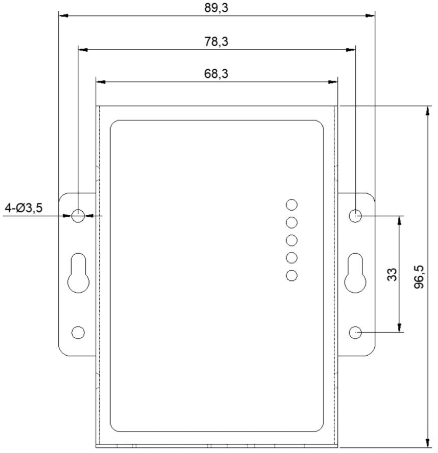
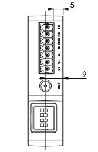

  

    

      
    

    

      Industrial LoRaWAN DTU for robust serial data connectivity
    

  

  

    

      LT312 Series LoRaWAN Terminal Node
    

    

      

        
· LoRaWAN 1.0.3

        
· RS232/RS485

      

      

        
· Modbus-RTU

        
· Industrial DTU

      

    

  

# 1. Product Overview

**LT312 is a versatile industrial LoRaWAN DTU for serial data acquisition and transparent transmission across building, campus, and factory scenarios.**

**Key Features:**
- **Industrial serial robustness:** Isolated RS232/RS485 with built-in 15 kV ESD protection
- **Flexible LoRaWAN operation:** LoRaWAN 1.0.3, Class A/C, OTAA/ABP, ADR or fixed SF
- **Strong RF coverage:** Up to 22 dBm Tx power and -135 dBm sensitivity at SF12/BW125 kHz
- **Multi-region deployment:** EU433/CN470/CN779/EU868/AS923/AU915/KR920 coverage
- **Task orchestration:** Script editing, heartbeat customization, polling and watchdog support

## Core Technical Specifications

| Technical Indicator | Specification |
|---|---|
| Device Operating Modes | Class A/C, supports OTAA and ABP |
| Adaptive | Supports ADR and fixed SF switching |
| Serial Data Services | Transparent transmission |
| Automation | Supports script editing |
| Cloud Integration Capability | End-to-cloud data forwarding through LoRaWAN gateways/platforms |
| Frequency Bands | EU433/CN470/CN779/EU868/AS923/AU915/KR920 |
| Transmit Power | Up to 22 dBm transmit power, -135 dBm sensitivity @ SF12/BW125kHz |
| Serial Interfaces | 1 x RS232 (DB9) + 1 x RS485 (3.81 mm 2-pin) |
| Power Input | DC12V/1A |
| Power Consumption  | Average power consumption <= 0.5 W |
| Humidity | 5 to 95% RH (non-condensing) |

# 2. Product Dimensions

  

    
    
Device View

  

  

    
    
Port Side View

  

  

    
Notes:

    
1. All dimensions are in millimeters (mm).

    
2. All dimensions are approximate and for reference only.

    
3. Drawings must not be used for manufacturing.

    
4. Dimensions are subject to part and manufacturing tolerances.

    
5. Specifications may change without prior notice.

  

# 3. Hardware Specifications

| Category / Parameter | Specification |
|---|---|
| **LoRaWAN RF** | |
| Protocol | LoRaWAN 1.0.3 |
| Frequency bands | EU433, CN470, CN779, EU868, AS923, AU915, KR920 |
| Transmit power | 22 dBm |
| Receiver sensitivity | -135 dBm @ SF12 BW125kHz |
| Join/operation modes | OTAA/ABP, Class A/C |
| Spreading factor | SF7-SF12, 6 levels adjustable |
| Data rate (typical) | 5.5 / 3.1 / 1.8 / 1.0 / 0.6 / 0.3 kbps |
| **Serial Interfaces** | |
| RS485 quantity/type | 1 x 3.81 mm 2-pin terminal |
| RS485 baud rate | 2400-115200 bps, default 9600 bps, 8N1 |
| RS485 protection | Fully isolated, built-in 15 kV ESD |
| RS232 quantity/type | 1 x DB9 |
| RS232 baud rate | 2400-115200 bps, default 115200 bps, 8N1 |
| RS232 protection | Fully isolated, built-in 15 kV ESD |
| **Power** | |
| Input | DC12V, 1A |
| Connector type | Port 1: 3.81 mm 2-pin terminal; Port 2: DC 5.5 x 2.1 mm |
| Power consumption | Average <= 0.5 W |
| **Mechanical & Environment** | |
| Storage temperature | -40 to 85 C |
| Operating temperature | -20 to 70 C |
| Ambient humidity | 5 to 95% (non-condensing) |
| **Indicators** | |
| POWER indicator | On: normal power; Off: undervoltage or fault |
| RUN indicator | Blinks: normal operation; steady on/off: fault |
| LoRa indicator | On: LoRa data transmitting; Off: idle |
| RS232 indicator | Blinks: RS232 data received; Off: idle |
| RS485 indicator | Blinks: RS485 data received; Off: idle |

# 4. Software Specifications

| Category / Parameter | Specification |
|---|---|
| **Network Features** | |
| Protocol stack | LoRaWAN 1.0.3 |
| Device class | Class A/C |
| Join method | OTAA / ABP |
| Link adaptation | ADR and fixed SF switching |
| Channel/power control | Adjustable channel and transmit power |
| **Serial Data Services** | |
| Data mode | Transparent transmission |
| Protocol compatibility | Modbus-RTU compatible polling/commands |
| Serial configuration | Flexible serial settings for diverse devices |
| Task scheduling | Scheduled tasks and active polling |
| **Automation & Reliability** | |
| Script support | Script editing and task orchestration |
| Heartbeat | Customizable LoRaWAN heartbeat |
| I/O output control | Configurable output behavior |
| Watchdog | Built-in reliability watchdog |
| **Deployment & Integration** | |
| Typical scenarios | Buildings, campuses, factories |
| Device integration | Meters, PLCs, and serial devices |
| Cloud path | End-to-cloud data forwarding via LoRaWAN gateway/platform |

# 5. Ordering Information

## Model Rule

**Model code:** LT312-\<REGION\>

\<REGION\>: Frequency band / regional variant

## Product Models

<table style="width:100%; table-layout:fixed;">
  <colgroup>
    <col style="width:20%;">
    <col style="width:20%;">
    <col style="width:35%;">
    <col style="width:25%;">
  </colgroup>
  <tr><th>Model</th><th>Region</th><th>&lt;REGION&gt;</th><th>Serial Port</th></tr>
  <tr><td>LT312-US915</td><td>North America</td><td>US915, Tx power: 22 dBm</td><td>1 x RS232 + 1 x RS485</td></tr>
  <tr><td>LT312-EU868</td><td>Europe</td><td>EU868, Tx power: 22 dBm</td><td>1 x RS232 + 1 x RS485</td></tr>
  <tr><td>LT312-CN470</td><td>China</td><td>CN470, Tx power: 22 dBm</td><td>1 x RS232 + 1 x RS485</td></tr>
  <tr><td>LT312-AS923</td><td>Asia-Pacific (except KR/IN)</td><td>AS923, Tx power: 22 dBm</td><td>1 x RS232 + 1 x RS485</td></tr>
</table>

# 6. Contact Us

- **Website:** [InHand Networks](https://www.inhand.com)
- **Copyright:** © InHand Networks. All rights reserved.
