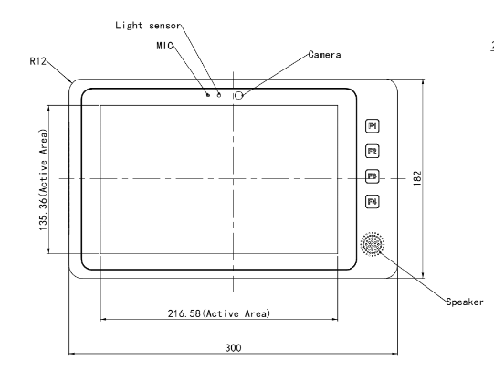
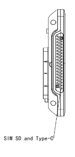
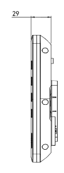

  

    

      
    

    

      Vehicle HMI &amp; Edge AI · 5G &amp; Wi-Fi 6 Connectivity
    

  

  

    

      MDT600 Mobile Data Terminal
    

    

      

        
· ITxPT

        
· 6 TOPS NPU

      

      

        
· 5G &amp; Wi-Fi 6

        
· IP65

      

    

  

# 1. Product Overview

**The InHand MDT600 is a rugged, ITxPT-compliant multi-application driver terminal for connected public transport and commercial vehicles—central HMI for ITS and fleet systems.**

**Features and Advantages:**
- **Multi-application fusion:** Dispatch, ticketing, navigation, and fleet apps on one device
- **Edge intelligence:** 6 TOPS NPU for ADAS, DMS, and multi-camera analytics
- **High-speed connectivity:** 5G/4G (optional), Wi-Fi 6, Bluetooth 5.0, multi-constellation GNSS
- **Vehicle-grade design:** 10.1″ display, IP65 &amp; IK08, 9–48 VDC, −30 °C ~ +70 °C
- **Open platform:** Android 14 or Linux; ITxPT-aligned for integrators

## Core Technical Specifications

|Technical Item|Specification|
| --- | --- |
| Cellular | 5G/4G or non-cellular (per SKU) |
| Wireless / Positioning | Wi-Fi 6 (AP/STA); Bluetooth 5.0; multi-constellation GNSS |
| Network & Security | IPv4/IPv6; NAT; IPSec/L2TP, OpenVPN |
| System / Standards | Android 14 / Linux; ITxPT-aligned |
| AI / Display | 6 TOPS NPU; 10.1″ 1280×800 G+G touch |
| CPU / Storage | A72+A53 up to 2.0 GHz; 8 GB LPDDR4; 256 GB UFS (default) |
| Interfaces | M12 GbE; CAN/RS232/485, DI/DO; USB-C; up to 8×AHD |
| SIM | 2 × Nano-SIM; eSIM optional |
| Power | 9–48 VDC |
| Dimensions / Mount | 300 × 182 × 38 mm; VESA 75 × 75 mm |
| Environment / Protection | −30 °C ~ +70 °C op.; −40 °C ~ +85 °C stg.; IP65, IK08 |
| Certification | CE, E-Mark, UKCA, FCC (*in progress) |

# 2. Product Dimensions

  

    

      
      
Front view

    

    

      
      
Interface Dimensions

    

    

      
      
Side view

    

  

  

    
Note:

    
1. All dimensions are in millimeters (mm).

    
2. All dimensions are approximate, for reference only.

    
3. Drawings shall not be used for production without released engineering data.

    
4. Subject to manufacturing tolerances.

    
5. Subject to change without notice.

  

# 3. Hardware Specifications

| Category/Parameter | Specification |
| --- | --- |
| **Processing Platform** | |
| CPU | Quad-Core Cortex-A72 + Quad-Core Cortex-A53, up to 2.0 GHz |
| GPU &amp; NPU | ARM Mali-G52 MC3 GPU; 6 TOPS INT8 NPU |
| RAM | 8 GB LPDDR4 |
| Storage | 256 GB UFS (default) |
| **Connectivity &amp; Wireless** | |
| Cellular | 5G/4G or non-cellular SKUs |
| Wi-Fi | Wi-Fi 6, AP/STA |
| Bluetooth | Bluetooth 5.0 |
| GNSS | GPS L1 C/A / L5; Galileo E1 / E5a; BDS B1I / B2a; GLONASS L1 |
| IMU | 6-axis gyroscope |
| **Display &amp; Interaction** | |
| Resolution | 1280 × 800 (16:9), 262K colors, ambient light sensor |
| Viewing angle | 30°–150° (V/H) |
| Display size | 10.1″, 60 Hz refresh |
| Touch | G+G multi-touch |
| Speaker | Built-in 8 Ω / 1 W (waterproof) |
| Microphone | Built-in |
| **Interfaces &amp; Expansion** | |
| Ethernet | 1 × M12 X-coded 1000 Mbps |
| SIM | 2 × 4FF Nano-SIM |
| Buttons | 4 × backlit |
| NFC | ISO14443A/B, ISO15693; NFC Forum T1T/T2T/T4T/T5T |
| Fingerprint | Capacitive module |
| USB | 1 × USB Type-C |
| Cameras | 1 × built-in 5 MP; 8 × external AHD via 26-pin interface |
| Expansion | 1 × M.2 SATA SSD (up to 4 TB) |
| SD | 1 × Micro SD (up to 256 GB) |
| Audio / Mic | L, R, GND, Mic-in on 26-pin multi-function interface |
| CAN | 1 × CAN 2.0 on 26-pin multi-function interface |
| I/O &amp; Serial | 1 × RS232/RS485, 5 × DI, 4 × DO on 26-pin multi-function interface |
| **Mechanical &amp; Environment** | |
| Mounting | VESA 75 × 75 mm |
| Dimensions (W × D × H) | 300 × 182 × 38 mm |
| Operating temperature | −30 °C ~ +70 °C |
| Storage temperature | −40 °C ~ +85 °C |
| Humidity | 95% RH @ 60 °C (non-condensing) |
| Protection | IP65 |
| Impact | IK08 |
| **Power &amp; Compliance** | |
| Input | 9–48 VDC wide-range |
| Connector | VIN+, VIN−, IGT on 26-pin multi-function interface |
| Automotive / transport | EN 61373; EN 45545-2; ISO 16750-1/2; ECE R10; ECE R118 |
| Certification* | CE, E-Mark, UKCA, FCC (*in progress) |

# 4. Software Specifications

| Category/Parameter | Specification |
| --- | --- |
| **Operating System** | |
| Platform | Android 14 or Linux |
| **Network Features** | |
| IP protocols | IPv4 / IPv6 |
| Network services | NAT, routing, IPSec/L2TP VPN, OpenVPN, etc. |
| Cellular | 5G/4G (per SKU) |
| Wi-Fi | Wi-Fi 6, AP/STA |
| Bluetooth | Bluetooth 5.0 |
| Positioning | Multi-constellation GNSS |
| **Intelligent Edge** | |
| ADAS / DMS | ADAS and driver-monitoring applications |
| Video analytics | Real-time multi-camera analytics |
| Multi-app | Dispatch, ticketing, navigation, fleet management |
| **Platform** | |
| Standards | ITxPT-aligned |
| Openness | Third-party apps and custom integration |

# 5. Ordering Information

## Model Code

**Model code:** MDT600-\<W\>-\<M\>

\<W\>: Type &amp; Module (cellular variant)

\<M\>: Storage tier (256 GB / 512 GB / 1 TB)

## Product Models

<table style="width:100%; table-layout:fixed;">
  <colgroup>
    <col style="width:30%;">
    <col style="width:12%;">
    <col style="width:28%;">
    <col style="width:30%;">
  </colgroup>
  <tr><th>Model</th><th>Region</th><th>&lt;W&gt;: Type &amp; Module</th><th>&lt;M&gt;: Storage</th></tr>
  <tr><td>MDT600-NRQ5-&lt;M&gt;</td><td>Global</td><td>Cellular 5G</td><td>Optional 256GB / 512GB / 1TB</td></tr>
  <tr><td>MDT600-FQ09-&lt;M&gt;</td><td>Global</td><td>Cellular CAT6</td><td>Optional 256GB / 512GB / 1TB</td></tr>
  <tr><td>MDT600-EN00-&lt;M&gt;</td><td>Global</td><td>No cellular</td><td>Optional 256GB / 512GB / 1TB</td></tr>
</table>

**Example:** `MDT600-FQ09-512GB` — 256 GB UFS by default, plus up to 512 GB M.2 SSD when configured.

## Accessories

<table style="width:100%; table-layout:fixed;">
  <colgroup>
    <col style="width:26%;">
    <col style="width:74%;">
  </colgroup>
  <tr><th>Order Code</th><th>Description</th></tr>
  <tr><td>AANT040013</td><td>GNSS FAKRA antenna — GPS L1 1575.42 MHz &amp; BDS 1561.098 MHz &amp; GLONASS 1602 MHz; 2000 mm cable</td></tr>
  <tr><td>AETH050002</td><td>M12 X-coded to RJ45 cable, 1000 mm</td></tr>
  <tr><td>SCAB000601</td><td>MDT600 multi-function cable — 26-pin waterproof, audio, pull cord, 1000 mm</td></tr>
  <tr><td>SCAB000600</td><td>MDT600 camera test cable — 26-pin waterproof, pull cord, 1000 mm</td></tr>
  <tr><td>SMDM060045</td><td>DSM camera — AHD 1080P PAL, 1920×1080, IR, M12, DC 12 V, −30~70 °C (see datasheet for full spec)</td></tr>
  <tr><td>SMDM060044</td><td>ADAS camera — AHD 1080P PAL, 1920×1080, M12, DC 12 V, −20~70 °C</td></tr>
  <tr><td>SMDM060043</td><td>Panoramic camera IN-813-A200H — AHD 1080P PAL, 360°, M12, DC 12 V, −20~70 °C</td></tr>
</table>

# 6. Contact Us

- **Website:** [InHand Networks](https://www.inhand.com.cn)
- **Copyright:** © InHand Networks. All rights reserved.

**Note:** Features marked * are in progress or subject to certification/regional approval.
