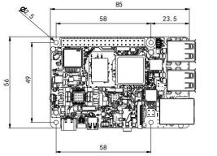
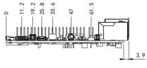
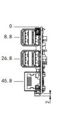

  

    

      
    

    

      Edge AI Computing, Open SDK, Debian Linux, HAT-Compatible
    

  

  

    

      MO 62A AI Single Board Computer
    

    

      

        
· Open SDK

        
· Linux Distribution

      

      

        
· HAT Expansion

        
· Edge AI

      

    

  

# 1. Product Overview

**The MO-62A is a 2 TOPS edge AI single-board computer based on the TI AM62A74 SoC, designed for AI vision boxes, intelligent cameras, and edge AI inference terminals.**

**Product Features:**
- **Edge AI Acceleration:** 2 TOPS on-device AI inference with C7x DSP and deep-learning accelerator
- **Open Ecosystem:** Debian Linux, open SDK, Python/C/C++ development with Docker support
- **Rich Interfaces:** Gigabit Ethernet, 4 × USB 2.0, micro HDMI, 4-lane MIPI CSI-2, 40-pin HAT connector
- **Wireless Connectivity:** Wi-Fi 5 dual-band and BLE for flexible deployment
- **HAT Compatible:** Standard SBC form factor, mechanically compatible with mainstream enclosures and accessories

## Core Technical Specifications

| Technical Indicator | Specification |
|---|---|
| OS | Debian 13 (Embedded Linux) |
| AI Accelerator | C7x DSP + Deep Learning Accelerator, 2 TOPS |
| AI Runtime | TI TIDL, supports TFLite / ONNX |
| Wi-Fi | Wi-Fi 5 (802.11ac), dual-band 2.4 / 5 GHz |
| Bluetooth | BLE 4.2 |
| Security | Secure Boot, TrustZone, OP-TEE, Hardware AES-256 |
| CPU | 4 × Cortex-A53 @ 1.4 GHz |
| RAM | LPDDR4 4 GB (default) / 2 GB / 8 GB |
| Interface | 1 × GbE, 4 × USB 2.0, micro HDMI, MIPI CSI-2, 40-pin HAT |
| Power | USB Type-C 5 V / 5 A DC; ≤ 25 W |
| Dimensions (W × D × H) | 85 × 56 mm |
| Operating Temperature | 0 °C ~ +50 °C |

# 2. Product Dimensions

  

    
    
Front View

  

  

    
    
Side View

  

    

    
    
Interface View

  

  

    
Note:

    
1. All dimensions are in millimeters (mm).

    
2. All dimensions are approximate values for reference only.

    
3. The dimensions shown shall not be used for production or processing.

    
4. Dimensions shall comply with part and manufacturing tolerance requirements.

    
5. Dimensions are subject to change without notice.

  

# 3. Hardware Specifications

| Category / Parameter | Specification |
|--------------------------|------|
| **Hardware Platform** | |
| CPU | TI AM62A74, 4 × Cortex-A53 @ 1.4 GHz |
| AI Accelerator | C7x DSP + Deep Learning Accelerator, 2 TOPS |
| ISP / Vision | On-chip ISP + VPAC (RGB-IR, WDR, LDC) |
| RAM | LPDDR4 4 GB (default) / 2 GB / 8 GB |
| **Interface** | |
| Ethernet | 1 × Gigabit Ethernet |
| USB | 4 × USB 2.0 Type-A |
| Display | 1 × micro HDMI |
| Camera | 1 × 4-lane MIPI CSI-2 |
| Audio | 3.5 mm jack + PCM via 40-pin connector |
| 40-pin Connector | GPIO / I²C / SPI / UART / PCM, HAT-compatible |
| Fan Connector | 1 × 4-pin fan connector |
| Button | 1 × Reset button |
| Storage | Micro SD |
| Debug UART | 1 × TTL UART |
| LED | PWR, USER |
| **Wireless** | |
| Wi-Fi | Wi-Fi 5 (802.11ac), dual-band 2.4 / 5 GHz |
| Bluetooth | BLE 4.2 |
| Antenna | Wi-Fi / BLE: on-board snap-on antenna |
| **Power** | |
| Power Input | USB Type-C 5 V / 5 A DC |
| Power Consumption | 25 W (MAX) |
| **Mechanical** | |
| Dimensions (W × D × H) | 85 × 56 mm |
| Weight | 47 g |
| Housing | PCB |
| Cooling | Active fan (optional) |
| RTC | Support (battery backup) |
| **Environmental** | |
| Operating Temperature | 0 °C ~ +50 °C |
| Storage Temperature | -20 °C ~ +70 °C |

# 4. Software Specifications

| Category / Parameter | Specification |
|--------------------------|------|
| **Operating System** | |
| OS | Debian 13.2 Trixie |
| Kernel | Linux Kernel 6.12 |
| **AI & Vision** | |
| AI Runtime | TI TIDL, supports TFLite / ONNX |
| Vision SDK | TI EdgeAI SDK |
| Camera Framework | V4L2 |
| Display Framework | DRM / KMS |
| **Network Features** | |
| IP Application | TCP / UDP, ICMP, DNS, DHCP |
| IP Routing | Static routing |
| **Security** | |
| Secure Boot | Support |
| TrustZone | Support |
| OP-TEE | Support |
| Crypto Accelerator | Hardware AES-256 |
| **Development** | |
| Languages | Python, C/C++ |
| Libraries | OpenCV, GStreamer, NumPy |
| Package Manager | apt (Debian) |
| Open SDK | Supports custom system build by customer |
| **System Management** | |
| Remote Access | SSH |
| Firmware Upgrade | SD card flash |
| Debug | UART console |

# 5. Ordering Information

## Model Code Rule

**Model code:** MO-62A-\<Memory\>

\<Memory\>: RAM Capacity

## Product Models

| Model | \<Memory\>: RAM Capacity |
|-------|--------------------------|
| MO-62A-2G | 2 GB |
| MO-62A-4G | 4 GB |
| MO-62A-8G | 8 GB |

# 6. Contact Us

- **Official Website:** [InHand Networks](https://www.inhand.com)
- **Copyright Notice:** © InHand Networks. All rights reserved.
