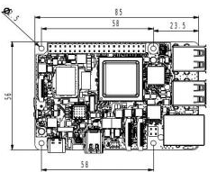
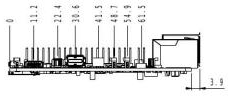
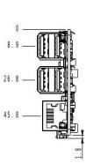

  

    

      
    

    

      Embrace Edge AI, Empower Intelligent Vision
    

  

  

    

      MO 68A AI Single Board Computer
    

    

      

        
· Open SDK

        
· Linux Distribution

      

      

        
· HAT Expansion

        
· Edge AI

      

    

  

# 1. Product Overview

**The MO-68A is an 8 TOPS edge AI single-board computer based on the TI AM68A SoC, designed for AI vision boxes, intelligent cameras, and edge AI inference terminals.**

**Product Features:**
- **Edge AI Acceleration:** 8 TOPS on-device AI inference with TI TIDL runtime supporting TFLite / ONNX
- **Complete Vision Pipeline:** Dual 4-lane MIPI CSI-2, VPAC, DMPAC, 4K@60fps H.265 / H.264 codec
- **Rich Interfaces:** Gigabit Ethernet, PCIe 3.0, 4 × USB 3.0, mini DP, 40-pin HAT connector
- **SBC Ecosystem:** Standard form factor, Debian 13 Trixie, open SDK, Python / C / C++
- **High Security:** Secure Boot, TrustZone, OP-TEE, hardware crypto accelerator

## Core Technical Specification

| Technical Indicator | Specification |
|---|---|
| OS | Debian 13 (Embedded Linux) |
| AI Accelerator | 2 x C7 x DSP + Deep Learning Accelerator, 8 TOPS |
| AI Runtime | TI TIDL, supports TFLite / ONNX |
| Vision | VPAC, DMPAC, 4K@60fps H.265 / H.264 codec |
| Security | Secure Boot, TrustZone, OP-TEE, Hardware AES-256 |
| Development | Python, C/C++, OpenCV, GStreamer |
| CPU | 2 × Cortex-A72 @ 2.0 GHz |
| RAM | LPDDR4 4 GB / 8 GB (default) |
| Interface | 1 × GbE, 4 × USB 3.0, PCIe 3.0, mini DP, MIPI DSI/CSI-2 |
| Power | USB Type-C 5 V / 5 A DC; ≤ 25 W |
| Dimensions (W × D × H) | 85 × 56 mm |
| Operating Temperature | 0 °C ~ +50 °C |

# 2. Product Dimensions

  

    
    
Top View

  

  

    
    
Side View

  

  

    
    
Interface View

  

  
  

    
Note:

    
1. All dimensions are in millimeters (mm).

    
2. All dimensions are approximate values for reference only.

    
3. The dimensions shown shall not be used for production or processing.

    
4. Dimensions shall comply with part and manufacturing tolerance requirements.

    
5. Dimensions are subject to change without notice.

  

# 3. Hardware Specifications

| Category / Parameter | Specification |
|--------------------------|------|
| **Hardware Platform** | |
| CPU | TI AM68A, 2 × Cortex-A72 @ 2.0 GHz |
| AI Accelerator | 2 x C7 x DSP + Deep Learning Accelerator, 8 TOPS |
| ISP / Vision | On-chip ISP + VPAC (RGB-IR, WDR, LDC) |
| RAM | LPDDR4 4 GB / 8 GB (default) |
| **Interface** | |
| Ethernet | 1 × Gigabit Ethernet |
| USB | 4 × USB 3.0 Type-A |
| PCIe | 1 × PCIe 3.0 |
| Display | 1 × mini DP + up to 2 × 4-lane MIPI DSI |
| Camera | up to 2 × 4-lane MIPI CSI-2 |
| Audio | I²S via 40-pin connector |
| 40-pin Connector | GPIO / I²C / I²S / SPI / UART / PCM, HAT-compatible |
| Fan Connector | 1 × 4-pin fan connector (5 V, PWM, GND, TACH) |
| Button | 1 × Reset button |
| Storage | Micro SD |
| Debug | 1 × TTL UART |
| LED | PWR, STATUS |
| **Power** | |
| Power Input | USB Type-C 5 V / 5 A DC |
| Power Consumption | 25 W (MAX) |
| **Mechanical** | |
| Dimensions (W × D × H) | 85 × 56 mm |
| Weight | 53 g |
| Housing | PCB |
| Cooling | Active fan (optional) |
| RTC | Support (battery backup) |
| **Environmental** | |
| Operating Temperature | 0 °C ~ +50 °C |
| Storage Temperature | -20 °C ~ +70 °C |

# 4. Software Specifications

| Category / Parameter | Specification |
|--------------------------|------|
| **Operating System** | |
| OS | Debian 13 Trixie |
| Kernel | Linux Kernel 6.12 |
| **AI & Vision** | |
| AI Runtime | TI TIDL, supports TFLite / ONNX |
| Vision SDK | TI EdgeAI SDK |
| Camera Framework | V4L2 |
| Display Framework | DRM / KMS |
| **Network Features** | |
| IP Application | TCP / UDP, ICMP, DNS, DHCP |
| IP Routing | Static routing |
| **Security** | |
| Secure Boot | Support |
| TrustZone | Support |
| OP-TEE | Support |
| Crypto Accelerator | Hardware AES-256 |
| **Development** | |
| Languages | Python, C/C++ |
| Libraries | OpenCV, GStreamer, NumPy |
| Package Manager | apt (Debian) |
| Open SDK | Supports custom system build by customer |
| **System Management** | |
| Remote Access | SSH |
| Firmware Upgrade | SD card flash |
| Debug | UART console |

# 5. Ordering Information

## Model Code Rule

**Model code:** MO-68A-\<x\>

\<-x\>: Memory

## Product Models

| Base Model | -x | Memory |
|---------|-------|-----------|
| MO-62A | 4G | 4GB |
| MO-62A | 8G | 8GB |

**Example** 
Model：MO-68A-8G  
"MO-62A" means Base Model 
"-8G" means 8GB memory

# 6. Contact Us

- **Official Website:** [InHand Networks](https://www.inhand.com)
- **Copyright Notice:** © InHand Networks. All rights reserved.
