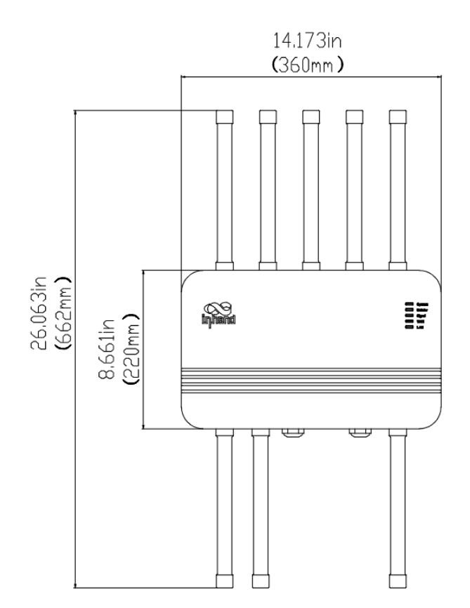
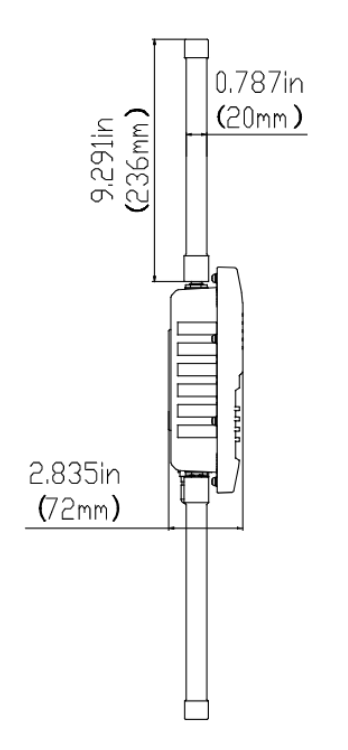

  

    

      
    

    

      Connect Beyond Boundaries
    

  

  

    

      ODU2002 5G Outdoor Unit
    

    

      

        
· 5G

        
· Cloud-Managed

      

      

        
· Outdoor IP67

        
· Link Backup

      

    

  

# 1. Product Overview

**The ODU2002 is a 5G outdoor unit delivering high-speed cellular connectivity with up to 4.76 Gbps downlink and 1.25 Gbps uplink, supporting SA/NSA networks and LTE CAT 19 fallback. It provides reliable high-speed access in harsh outdoor environments.**

**Features and Advantages:** 
- **Unleash the Power of 5G:** Up to 4.76 Gbps DL / 1.25 Gbps UL, LTE CAT 19 fallback
- **Worry-free Connectivity:** 5G/wired backup, cellular failover, dual SIM switching, optional eSIM, fault self-recovery
- **Harsh Outdoor Environments:** IP67 rating, wide temperature (-30 °C ~ +70 °C), GPS, PoE power, wall/pole mounting
- **Cloud-Managed:** InCloud Manager for zero-touch deployment, remote configuration, visualized monitoring
- **Security:** Robust protection for reliable outdoor deployment

## Core Technical Specifications

|Technical Item|Specification|
| --- | --- |
| Cellular | 5G SA/NSA + LTE Cat19; up to 4.76 Gbps DL / 1.25 Gbps UL (5G); dual SIM / optional eSIM |
| GNSS | GPS, GLONASS, Beidou, Galileo, QZSS |
| Cloud Management | InCloud Manager |
| VPN | IPsec, L2TP |
| Network & Security | IPv4/IPv6; VLAN, DHCP, DDNS; PPPoE; dual-SIM; link backup; NAT; firewall, ACL |
| Wi-Fi | 802.11 b/g/n, 2.4 GHz AP, 150 Mbps |
| Throughput / Users | Up to 2 Gbps; up to 200 users |
| SIM | 2 × Nano SIM (hot-swap); eSIM optional |
| Ethernet / PoE / USB | 2 × 2.5 GbE (WAN/LAN); PoE 802.3af/at in; USB-C 2.0 |
| Antennas | TNC: 6 × Sub-6 + 1 × GNSS + 1 × Wi-Fi |
| Power / Mechanical | PoE 802.3at; ≤15 W; 360 × 220 × 72 mm; 2.87 kg; metal; fanless; wall/pole; IP67 |
| Environment | -30 °C ~ +70 °C op.; IEC 60068 salt mist / shock / vibration / drop |

# 2. Product Dimensions

  

    
    
Front View

  

  

    
    
Interface Dimensions

  

  

    
    
Side View

  

  

    
Note:

    
1. All dimensions are in millimeters (mm).

    
2. Dimensions (L × W × H): 360 × 220 × 72 mm.

    
3. All dimensions are approximate, for reference only.

    
4. Dimensions shown shall not be used for production.

  

# 3. Hardware Specifications

| Category/Parameter | Specification |
| --- | --- |
| **Performance Metrics** | |
| Throughput | Up to 2 Gbps |
| Recommended Users | 200 |
| **Interfaces** | |
| Ethernet | 2 × 2.5 GbE RJ45, WAN/LAN switchable, dual-LAN |
| PoE | PoE in LAN port (802.3af/at) |
| USB | 1 × Type-C 2.0 |
| GNSS | GPS / GLONASS / Beidou / Galileo / QZSS |
| SIM | 2 × Nano 4FF, hot plug |
| Reset | Reset button |
| Ground | 1 × GND |
| LED | System, Cellular, Signal, WAN, LAN |
| Antenna | TNC-type; 6 × Sub-6, 1 × GNSS, 1 × Wi-Fi |
| **Cellular** | |
| Data Rate | 5G: 4.76 Gbps DL / 1.25 Gbps UL; 4G: 1.6 Gbps DL / 200 Mbps UL |
| 5G Antenna Freq. | 600–5000 MHz |
| 5G Antenna Gain | 6.46 dBi |
| **Wi-Fi** | |
| Frequency | 2.4 GHz single-band |
| Max Bandwidth | 150 Mbps |
| Protocol | 802.11 b/g/n |
| TX Power | 17 dBm |
| **Power** | |
| Input | Power over Ethernet (PoE) 802.3at |
| Power Consumption | ≤ 15 W |
| **Mechanical** | |
| Dimensions | 360 × 220 × 72 mm |
| Weight | 2.87 kg |
| Installation | Wall mounting, pole mounting |
| Housing | Metal, fanless |
| **Environment** | |
| Operating Temperature | -30 °C ~ +70 °C |
| Storage Temperature | -40 °C ~ +85 °C |
| Humidity | 5–95 % RH (non-condensing) |
| Protection | IP67 |
| Salt Mist | IEC 60068-2-52 |
| **EMC** | |
| ESD | EN 61000-4-2 Level 3 |
| RFI | EN 61000-4-3 Level 3 |
| EFT/Burst | EN 61000-4-4 Level 3 |
| Surge | EN 61000-4-5 Level 3 |
| Conducted | EN 61000-4-6 Level 3 |
| RE/CE | Class A, Margin 3 dB |
| **Physical** | |
| Shock | IEC 60068-2-27 |
| Vibration | IEC 60068-2-6 |
| Free Fall | IEC 60068-2-32 |
| **Certification** | |
| Certification | FCC, IC, PTCRB, Verizon, T-Mobile, CE |
| Warranty | 3 years |

# 4. Software Specifications

| Category/Parameter | Specification |
| --- | --- |
| **Cloud Management** | |
| Platform | InCloud Manager |
| Features | Centralized management, dashboard, batch upgrade, uplink management |
| **Network Features** | |
| Access | 5G/4G, Ethernet |
| Dialing | PPPoE, cellular auto redial, dual SIM switching, APN configuration |
| Link Backup | Packet-by-packet load balancing |
| Link Monitoring | Real-time delay, jitter, packet loss detection |
| Link Priority | Link priority adjustment |
| IP Protocol | IPv4 / IPv6 |
| Applications | VLAN, DHCP Server/Client, DNS, DDNS, Fixed Address, IP Passthrough |
| Interface | Duplex mode, link negotiation |
| **Security** | |
| VPN | IPSec VPN, L2TP VPN |
| Firewall | Access control, port mapping, port forwarding, MAC filtering |
| **Monitoring** | |
| Dashboard | Device info, interface status, traffic statistics |
| Cellular Signal | RSSI, RSRP, RSRQ, SINR |
| Logs | System logs, diagnostic logs, device events, email alerts |
| **Wi-Fi** | |
| Mode | 2.4 GHz AP mode |
| **Policy** | |
| Policy | Policy routing, traffic shaping |
| **Self Recovery** | |
| Watchdog | Software and hardware watchdog |

# 5. Ordering Information

## Model Code

**Model code:** ODU2002-\u003cWMNN\u003e

\u003cWMNN\u003e: Type & Module

## Product Models

<table style="width:100%; table-layout:fixed;">
  <colgroup>
    <col style="width:26%;">
    <col style="width:24%;">
    <col style="width:50%;">
  </colgroup>
  <tr><th>Model</th><th>Region</th><th>Specification</th></tr>
  <tr><td>ODU2002-NAVA</td><td>North America (Verizon)</td><td>5G Sub-6: n2/5/7/12/14/25/30/41/48/66/71/77/78; LTE-FDD B2/4/5/7/12/13/14/17/25/26/29/30/66/71; LTE-TDD B41/46/48; WCDMA B2/4/5</td></tr>
  <tr><td>ODU2002-NATM</td><td>North America (T-Mobile)</td><td>5G Sub-6: n25/41/66/71; LTE-FDD B2/4/5/12/66/71; LTE-TDD B41; LAA B46</td></tr>
  <tr><td>ODU2002-EUNR</td><td>Europe/Australia/Asia</td><td>5G Sub-6: n1/3/5/7/8/20/28/38/40/41/71/77/78/79; LTE-FDD B1/3/5/7/8/20/28/32/71; LTE-TDD B38/40/41/42/43</td></tr>
</table>

# 6. Contact Us

- **Website:** [InHand Networks](https://www.inhand.com.cn)
- **Copyright:** © InHand Networks. All rights reserved.
