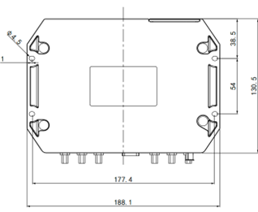

  

    

      
    

    

      High-performance, Powerful, Programmable
    

  

  

    

      VG710 4G Vehicle Gateway
    

    

      

        
· LTE CAT6/CAT4

        
· Wi-Fi 5

      

      

        
· Telematics

        
· Programmable Edge

      

    

  

# 1. Product Overview

**VG710 4G gateway provides reliable, secure, and programmable in-vehicle connectivity for logistics, transport, heavy equipment, and public safety scenarios.**

**Positioning:** Rugged LTE in-vehicle gateway for fleet telemetry and edge intelligence

**Key Features:**
- **Reliable LTE networking:** LTE CAT6/CAT4 with broad global and regional band coverage
- **Vehicle-grade robustness:** IP64 protection, wide input voltage, and industrial design
- **Rich telematics interfaces:** CAN, RS485, DI/DO/AI, and serial ports for vehicle integration
- **Accurate tracking:** GNSS + inertial navigation for stable positioning in complex environments
- **Open edge architecture:** Python/C/C++/Docker with cloud integration APIs

## Core Technical Specifications

| Technical Indicator | Specification |
|------|------|
| Cellular Network | LTE CAT6/CAT4, supporting global and regional band variants |
| Positioning Capability | GNSS (GPS/GLONASS/Galileo/Beidou) + inertial DR |
| Edge Computing | Supports Python, C/C++, and Docker application development and deployment |
| Cloud & IoT Integration | Supports MQTT, DDS, AMQP, REST, and CoAP; compatible with Azure and third-party platforms |
| VPN | Supports IPSec/OpenVPN/L2TP/GRE |
| Wireless Access | Dual-band Wi-Fi 5 (AP/Client) + Bluetooth 4.1 |
| Dimensions | 188.1 × 140.5 × 48.8 mm |
| Weight | 775 g |
| Vehicle Interfaces | 4 x Gigabit Ethernet, CAN, RS485, DI/DO/AI, RS232, USB 2.0 |
| Input Voltage Range | 9-36 V DC (configurable to 7-36 V DC) |
| Operating Temperature | -30 C to +70 C |
| Protection Rating | IP64 |

# 2. Product Dimensions

  

    

      
    

    
Front View

  

  

    

      
    

    
Bottom View

  

  

    

      
    

    
Side View

  

  
<strong>Notes:</strong>

    
1. All dimensions are in millimeters (mm).

    
2. All dimensions are approximate and for reference only.

    
3. Drawings must not be used for manufacturing.

    
4. Dimensions are subject to part and manufacturing tolerances.

    
5. Specifications may change without prior notice.

# 3. Hardware Specifications

| Category / Parameter | Specification |
|--------------------------|------|
| **Performance Metrics** | |
| CPU | ARM Cortex A7 |
| Main Frequency | 717 MHz |
| RAM | 1 GB / 512 MB DDR3 (model dependent) |
| Storage | 8 GB eMMC |
| **Connectivity** | |
| Cellular | LTE CAT6 / CAT4 |
| Ethernet | 4 × 10/100/1000 Mbps RJ45 |
| Serial Port | RS232 (DB-9) |
| USB Port | USB 2.0 Micro-B (up to 480 Mbps) |
| MicroSD | Up to 32 GB, 20 MB/s |
| Bluetooth | Bluetooth 4.1 |
| Antenna | SMA-K: Cellular/GNSS/Diversity; RP-SMA-K: 2 × Wi-Fi + BLE |
| **Satellite Navigation** | |
| GNSS Receiver | GPS, GLONASS, Galileo, Beidou |
| Built-in Sensor | Accelerometer + gyroscope, supports DR |
| Position Accuracy | 2.5 m CEP |
| Tracking Sensitivity | -160 dBm |
| Location Update Rate | Up to 30 Hz |
| **Wi-Fi** | |
| Frequency | 2.4 / 5 GHz dual-band |
| Protocol | Wi-Fi 5 |
| Max Output | 2.4G: 17 dBm; 5G: 17 dBm |
| Working Mode | AP / Client |
| **Automotive Interfaces** | |
| Diagnostics Interface | CAN bus |
| DI/DO/AI | 6 × DI, 4 × DO, 6 × AI |
| RS485 | RS485 serial (A+, B-, GND) |
| Other | 1-WIRE (driver ID / temperature) |
| **Power** | |
| Input Voltage | 9–36 V DC (configurable to 7–36 V DC) |
| Pin Definition | V+, V-, ignition signal, NC (4 pins) |
| Protection | Built-in voltage transient protection with delayed ignition induction |
| Standby Power | 0.006 W |
| Operating Power | 12.00 W average |
| Peak Power | 18.20 W peak |
| **Mechanical & Environment** | |
| Installation | Wall-mounting |
| Protection Rating | IP64 |
| Cooling | Radiation cooling |
| Housing | Die-cast aluminum |
| Dimensions (W × D × H) | 188.1 × 140.5 × 48.8 mm |
| Weight | 775 g |
| RTC | Supported |
| SIM | Dual SIM, 2FF |
| Operating Temp. | -30 °C ~ +70 °C |
| Storage Temp. | -40 °C ~ +85 °C |
| Humidity | 95% RH @ 60 °C |
| **Standards & Certifications** | |
| Vehicle Standard | ECE-R10, R118 |
| Rail Standard | EN50155, EN50121, EN61373 |
| Fire Prevention | EN45545-2:2020 |
| Certification | CE, E-Mark, ITxPT, FCC, IC, PTCRB, RoHS, VZW, AT&T, TMO |
| Warranty | 3 years |

# 4. Software Specifications

| Category / Parameter | Specification |
|--------------------------|------|
| **Network Features** | |
| Network Access | APN, VPDN |
| LAN Protocol | ARP, Ethernet |
| Authentication | CHAP/PAP/MS-CHAP/MS-CHAP V2 |
| IP Application | IPv6, Ping, Traceroute, DHCP server/relay/client, DNS relay, DDNS, Telnet, SSH, HTTP, HTTPS, TFTP, FTP, SFTP, Portal |
| IP Routing | Static routing, RIP, OSPF, BGP, IGMP Proxy |
| **Security** | |
| Firewall | SPI, DoS defense, multicast/Ping filter, ACL, NAT/PAT/DMZ/port mapping/virtual server |
| User Level | Administrator / read-only |
| AAA | Local authentication, Radius, Tacacs+, LDAP |
| CA Certificate | PEM, PKCS12, SCEP |
| VPN | IPSec VPN, L2TP, GRE, OpenVPN, CA |
| **Reliability** | |
| Backup | Floating routing, VRRP, interface backup |
| Link Detection | Heartbeat detection, auto redial |
| Watchdog | Self-detection and auto-repair |
| Offline Storage | Built-in cache when network unavailable |
| **Ports & WLAN** | |
| VLAN Partition | Supported |
| Port Mirroring | Supported |
| WLAN Protocol | IEEE 802.11 b/g/n/a/ac |
| WLAN Security | Shared key, WPA/WPA2, WEP/TKIP/AES |
| Configuration | Local/remote HTTP, HTTPS, Telnet, SSH |
| Upgrade | Local/remote WEB, DM, TFTP, FTP, SFTP server |
| Diagnostics | Ping, Traceroute, Sniffer |
| **Edge Computing** | |
| Edge Platform | Integrated network-computing-storage-application edge platform |
| Programmable | Python, C/C++, Docker |
| SDK | Python 3 SDK, Docker SDK, Azure IoT Edge SDK |
| IDE | Visual Studio Code |
| IoT Architecture | MQTT, DDS, AMQP, XMPP, JMS, REST, CoAP |
| 3rd Party Cloud | MS Azure, SmartFleet and APIs for third-party platforms |
| Docker Images | Node-RED, Ubuntu, Docker for ARM 32, etc. |
| **Application Services** | |
| Fleet Cloud | InHand SmartFleet for route planning, tracking, geofencing, and batch operations |
| Vehicle Telemetry | Rich interfaces for telemetry and asset tracking devices |
| Event Alarm | Customizable alarms for DI, network, service, power, temperature, voltage |
| Message Push | SMS, Email, App, digital output |

# 5. Ordering Information

## Model Rule

**Model code:** VG710-\<L/NA\>-\<WMNN\>

\<WMNN\>: Cellular Type & Module

## Product Models

<table style="width:100%; table-layout:fixed;">
  <colgroup>
    <col style="width:22%;">
    <col style="width:30%;">
    <col style="width:20%;">
    <col style="width:10%;">
    <col style="width:18%;">
  </colgroup>
  <tr><th>Model</th><th>Cellular Type</th><th>UE Category</th><th>RAM</th><th>Region</th></tr>
  <tr><td>VG710-L-FQ09</td><td>LTE-FDD/LTE-TDD/WCDMA (global bands)</td><td>LTE CAT6</td><td>1 GB</td><td>Global</td></tr>
  <tr><td>VG710-L-FQ78</td><td>LTE-FDD/TDD + WCDMA + GSM/EDGE</td><td>LTE CAT4</td><td>1 GB</td><td>Latin America, Australia, New Zealand</td></tr>
  <tr><td>VG710-FQ09</td><td>LTE-FDD/LTE-TDD/WCDMA (global bands)</td><td>LTE CAT6</td><td>512 MB</td><td>Global</td></tr>
  <tr><td>VG710-FQ78</td><td>LTE-FDD/TDD + WCDMA + GSM/EDGE</td><td>LTE CAT4</td><td>512 MB</td><td>Latin America, Australia, New Zealand</td></tr>
  <tr><td>VG710-EN00</td><td>NONE</td><td>NONE</td><td>512 MB</td><td>Global</td></tr>
</table>

## Antenna Options

<table style="width:100%; table-layout:fixed;">
  <colgroup>
    <col style="width:30%;">
    <col style="width:20%;">
    <col style="width:50%;">
  </colgroup>
  <tr><th>Antenna</th><th>Order Code</th><th>Specifications</th></tr>
  <tr><td>LTE 4G Antenna</td><td>AANT090025</td><td>LTE/GSM/CDMA multi-band antenna, SMA-J1.5 connector, RG-174, 2000±20 mm</td></tr>
  <tr><td>GNSS Antenna</td><td>AANT040005</td><td>GPS/GALILEO/GLONASS GNSS antenna, dimensions 55.6 × 50.5 mm</td></tr>
  <tr><td>GNSS Antenna</td><td>AANT040006</td><td>GPS/GALILEO/GLONASS GNSS antenna, dimensions 50 × 38.5 mm</td></tr>
  <tr><td>Wi-Fi Antenna (Rubber Ducky)</td><td>AANT060016</td><td>2400–2500 MHz / 4900–5850 MHz, peak gain 5±0.5 dBi</td></tr>
  <tr><td>Wi-Fi Antenna (Adhesive)</td><td>AANT060018</td><td>2400–2500 MHz / 4900–5850 MHz, peak gain ≤3 dBi, 2000±20 mm</td></tr>
  <tr><td>Bluetooth Antenna (Rubber Ducky)</td><td>AANT060017</td><td>2.4 GHz, peak gain ≤2 dBi</td></tr>
</table>

## Cable Options

<table style="width:100%; table-layout:fixed;">
  <colgroup>
    <col style="width:30%;">
    <col style="width:20%;">
    <col style="width:50%;">
  </colgroup>
  <tr><th>Cable</th><th>Order Code</th><th>Specifications</th></tr>
  <tr><td>Power Cable</td><td>SCAB000216</td><td>4PIN to open-end cable for field engineering; indoor test requires separate power adapter</td></tr>
  <tr><td>20 PIN Extension Cord</td><td>SCAB000219</td><td>20PIN extension cable for field engineering and testing</td></tr>
  <tr><td>OBD-II Power Cable</td><td>SCAB000235</td><td>20PIN + 4PIN power + OBD-II male + I/O open end + ignition wire</td></tr>
  <tr><td>J1939 9PIN Power Cable</td><td>SCAB000234</td><td>20PIN + 4PIN power + J1939 9PIN female + I/O open end + ignition wire</td></tr>
  <tr><td>J1939 6PIN Power Cable</td><td>SCAB000233</td><td>20PIN + 4PIN power + J1939 6PIN female + I/O open end + ignition wire</td></tr>
  <tr><td>20 PIN to OBD-II</td><td>SCAB000215</td><td>A/B/C/D end cable set for field projects and testing</td></tr>
</table>

# 6. Contact Us

- **Website:** [InHand Networks](https://www.inhand.com.cn)
- **Copyright:** © InHand Networks. All rights reserved.

# 7. 20PIN Definition

<table style="width:88%;">
  <colgroup>
    <col style="width:10%;">
    <col style="width:25%;">
    <col style="width:10%;">
    <col style="width:25%;">
  </colgroup>
  <tr><th align="center">PIN</th><th align="center">Definition</th><th align="center">PIN</th><th align="center">Definition</th></tr>
  <tr><td align="center">1</td><td align="center">-485</td><td align="center">11</td><td align="center">485</td></tr>
  <tr><td align="center">2</td><td align="center">CANL</td><td align="center">12</td><td align="center">CANH</td></tr>
  <tr><td align="center">3</td><td align="center">1-Wire</td><td align="center">13</td><td align="center">GND</td></tr>
  <tr><td align="center">4</td><td align="center">DO4</td><td align="center">14</td><td align="center">DO3</td></tr>
  <tr><td align="center">5</td><td align="center">DO2</td><td align="center">15</td><td align="center">DO1</td></tr>
  <tr><td align="center">6</td><td align="center">GND</td><td align="center">16</td><td align="center">GND</td></tr>
  <tr><td align="center">7*</td><td align="center">AI6/DI6</td><td align="center">17*</td><td align="center">AI5/DI5</td></tr>
  <tr><td align="center">8</td><td align="center">AI4/DI4</td><td align="center">18</td><td align="center">AI3/DI3</td></tr>
  <tr><td align="center">9</td><td align="center">AI2/DI2</td><td align="center">19</td><td align="center">AI1/DI1</td></tr>
  <tr><td align="center">10</td><td align="center">GND</td><td align="center">20</td><td align="center">GND</td></tr>
</table>

**Note:**
- `7*`: `AI6/DI6/FWD`
- `17*`: `AI5/DI5/WHEELTICK`

## Power Pin Definition (4 pins)

- `V+`: Power positive  
- `V-`: Power negative  
- `Ignition Signal`: ACC/IGN input  
- `NC`: Reserved (not connected)