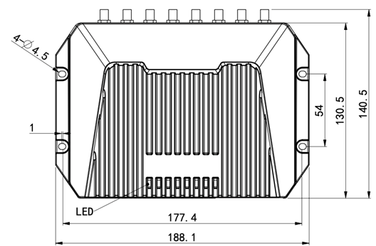
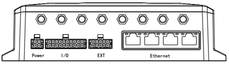
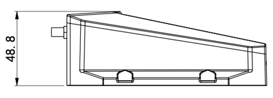

  

    

      
    

    

      High-performance, Powerful, Programmable
    

  

  

    

      VG710 5G Vehicle Gateway
    

    

      

        
· 5G

        
· Wi-Fi 5

      

      

        
· Telematics

        
· Programmable Edge

      

    

  

# 1. Product Overview

**VG710 5G gateway delivers secure high-speed in-vehicle networking for public transport, logistics, emergency fleets, and heavy-duty vehicles.**

**Key Features:**
- **Robust 5G access:** Supports SA/NSA with high throughput and backward compatibility
- **Vehicle-ready ruggedness:** IP64 protection with wide temperature and voltage operation
- **Rich telematics I/O:** CAN/J1708/LIN/RS232/RS485/DI-DO-AI for multi-system integration
- **Accurate positioning:** GNSS multi-constellation plus inertial navigation support
- **Cloud and edge ready:** Python/C/C++/Docker with mainstream cloud connectivity

## Core Technical Specifications

| Technical Indicator | Specification |
|------|------|
| Cellular Network | 5G SA/NSA Sub-6, with LTE/3G fallback (model dependent) |
| Positioning Capability | GPS/GLONASS/Galileo/Beidou + inertial navigation (DR) |
| Cloud & IoT Integration | Supports MQTT, DDS, AMQP, REST, and CoAP; compatible with Azure and third-party platforms |
| VPN & Security | Supports IPSec/L2TP/GRE/OpenVPN, with SPI firewall, ACL, AAA, and certificate management |
| WLAN & Bluetooth | Dual-band Wi-Fi 5 (AP/Client) + Bluetooth 4.1 |
| Edge Computing | Supports Python, C/C++, and Docker; provides Python 3, Docker, and Azure IoT Edge SDKs |
| Dimensions | 188.1 × 140.5 × 48.8 mm |
| Weight | 775 g |
| Interface Capability | 4× Gigabit Ethernet, 2× CAN, J1708, LIN, RS232, RS485, DI/DO/AI, 1-WIRE |
| Input Voltage Range | 9-36 V DC (configurable to 7-36 V DC) |
| Operating Temperature | -30 °C to +70 °C (minimum startup at -35 °C) |
| Protection Rating | IP64 |

# 2. Product Dimensions

  

    
    
Top View

  

  

    
    
Interface Side View

  

  

    
    
Height Side View

  

  

    
Notes:

    
1. All dimensions are in millimeters (mm).

    
2. All dimensions are approximate and for reference only.

    
3. Drawings must not be used for manufacturing.

    
4. Dimensions are subject to part and manufacturing tolerances.

    
5. Specifications may change without prior notice.

  

# 3. Hardware Specifications

| Category / Parameter | Specification |
|--------------------------|------|
| **Performance Metrics** | |
| CPU | ARM Cortex A7 |
| Main Frequency | 717 MHz |
| RAM | 1 GB DDR3 |
| Storage | 8 GB eMMC |
| **Connectivity** | |
| Cellular | 5G SA/NSA Sub-6 or LTE CAT6 (model dependent) |
| Ethernet | 4 × 10/100/1000 Mbps RJ45 |
| MicroSD | Up to 32 GB |
| Bluetooth | Bluetooth 4.1 |
| Antenna | SMA-K: Cellular/GNSS; RP-SMA-K: 2 × Wi-Fi + BLE |
| **Satellite Navigation** | |
| GNSS Receiver | GPS, GLONASS, Galileo, Beidou |
| Built-in Sensor | Accelerometer + gyroscope, supports DR |
| Position Accuracy | 2.5 m CEP |
| Tracking Sensitivity | -160 dBm |
| Navigation Update Rate | Max 10 Hz |
| **Wi-Fi** | |
| Frequency | 2.4 / 5 GHz dual-band |
| Protocol | Wi-Fi 5 |
| Max Output | 2.4G: 17 dBm; 5G: 17 dBm |
| Working Mode | AP / Client |
| **Vehicle Interfaces** | |
| Diagnostics | 2 × CAN bus, 1 × J1708, 1 × LIN bus |
| DO/DI/AI | 2 × DO, 4 × DI/AI or 2 × DI/AI |
| Audio/Voice | R, L, Mic |
| Serial Port | 1 × RS232, 1 × RS485 |
| Other | 1-WIRE (driver ID / temperature) |
| **Power** | |
| Input Voltage | 9–36 V DC (configurable to 7–36 V DC) |
| Pin Definition | V+, V-, ignition signal, NC (4 pins) |
| Protection | Built-in voltage transient protection with delayed ignition induction |
| Standby Power | 0.006 W |
| Operating Power | 12.00 W average |
| Peak Power | 18.20 W peak |
| **Mechanical & Environment** | |
| Installation | Wall-mounting |
| Protection Rating | IP64 |
| Cooling | Radiation cooling |
| Housing | Die-cast aluminum |
| Dimensions (W × D × H) | 188.1 × 140.5 × 48.8 mm |
| Weight | 775 g |
| SIM | Dual SIM, 2FF |
| Operating Temp. | -30 °C ~ +70 °C |
| Storage Temp. | -40 °C ~ +85 °C |
| Humidity | 95% RH @ 60 °C |
| Startup Temp. | -35 °C |
| **Standards & Certifications** | |
| Vehicle Standard | ECE-R10, R118 |
| Rail Standard | EN50155, EN50121, EN61373 |
| Fire Prevention | EN45545-2:2020 |
| Certification | CE, E-Mark, ITxPT, FCC, IC, PTCRB, RoHS, VZW, AT&T, TMO |
| Warranty | 3 years |

# 4. Software Specifications

| Category / Parameter | Specification |
|--------------------------|------|
| **Network Features** | |
| Network Access | APN, VPDN |
| LAN Protocol | ARP, Ethernet |
| Authentication | CHAP/PAP/MS-CHAP/MS-CHAP V2 |
| IP Application | IPv6, Ping, Traceroute, DHCP server/relay/client, DNS relay, DDNS, Telnet, SSH, HTTP, HTTPS, TFTP, FTP, SFTP, Portal |
| IP Routing | Static routing, RIP, OSPF, BGP, IGMP Proxy |
| Configuration | Local/remote HTTP, HTTPS, Telnet, SSH |
| Upgrade | Local/remote WEB, DM, TFTP, FTP, SFTP server |
| Diagnostics | Ping, Traceroute, Sniffer |
| **Security** | |
| Firewall | SPI, DoS defense, multicast/Ping filter, ACL, NAT/PAT/DMZ/port mapping/virtual server |
| User Level | Administrator / read-only |
| AAA | Local authentication, Radius, Tacacs+, LDAP |
| CA Certificate | PEM, PKCS12, SCEP |
| VPN | IPSec VPN, L2TP, GRE, OpenVPN, CA |
| **Reliability** | |
| Backup | Floating routing, VRRP, interface backup |
| Link Detection | Heartbeat detection, auto redial |
| Watchdog | Self-detection and auto-repair |
| Offline Storage | Built-in cache when network unavailable |
| **WLAN** | |
| Protocol | IEEE 802.11 b/g/n/a/ac |
| Security | Shared key, WPA/WPA2, WEP/TKIP/AES |
| **Edge Computing** | |
| Edge Platform | Integrated edge computing platform |
| Programmable | Python, C/C++, Docker |
| SDK | Python 3 SDK, Docker SDK, Azure IoT Edge SDK |
| IDE | Visual Studio Code |
| IoT Architecture | MQTT, DDS, AMQP, XMPP, JMS, REST, CoAP |
| 3rd Party Cloud | MS Azure, SmartFleet, and APIs for third-party platforms |
| Docker Images | Node-RED, Ubuntu, Docker for ARM 32, etc. |
| **Application Services** | |
| Cloud Services | Device Manager and InConnect |
| Vehicle Telemetry | Rich interfaces for telemetry and asset tracking |
| Event Alarm | Customizable alarms for DI, network, service, power, temperature, voltage |
| Message Push | SMS, Email, App, digital output |

# 5. Ordering Information

## Model Rule

**Model code:** VG710-H-\<WMNN\>

\<WMNN\>: Cellular Type & Module

## Product Models

<table style="width:100%; table-layout:fixed;">
  <colgroup>
    <col style="width:30%;">
    <col style="width:58%;">
    <col style="width:12%;">
  </colgroup>
  <tr><th>Model</th><th>3GPP / Cellular Type</th><th>Region</th></tr>
  <tr><td>VG710-H-NRQ5</td><td>5G NR NSA/SA + LTE-FDD/LTE-TDD + WCDMA (global multiband), 3GPP Rel-16</td><td>Global</td></tr>
  <tr><td>VG710-H-NRQ3</td><td>5G NR NSA/SA + LTE-FDD/LTE-TDD + LAA + WCDMA (global multiband), 3GPP Rel-15</td><td>Global</td></tr>
</table>

# 6. Contact Us

- **Website:** [InHand Networks](https://www.inhand.com.cn)
- **Copyright:** © InHand Networks. All rights reserved.

# 7. Terminal Pin Definition

## IO 20PIN Definition

| PIN | 定义 | PIN | 定义 |
|-----|------|-----|------|
| 1 | L_Channel | 11 | R_Channel |
| 2 | Mic_IN | 12 | GND |
| 3 | RS_485A | 13 | RS_485B |
| 4 | GND | 14 | GND |
| 5 | RS232_TX | 15 | RS232_RX |
| 6 | 1Wire | 16 | GNSS_1PPS |
| 7 | DO1 | 17 | DO2 |
| 8 | GND | 18 | GND |
| 9 | AI1/DI1 | 19 | AI2/DI2 |
| 10 | AI3/DI3/FWD* | 20 | AI4/DI4/WHEELTICK* |

## EXT 10PIN Definition

| PIN | 定义 | PIN | 定义 |
|-----|------|-----|------|
| 1 | K_LINE | 6 | L_LINE |
| 2 | CAN1_H | 7 | CAN1_L |
| 3 | GND | 8 | GND |
| 4 | CAN2_H | 9 | CAN2_L |
| 5 | J1708_A | 10 | J1708_B |
