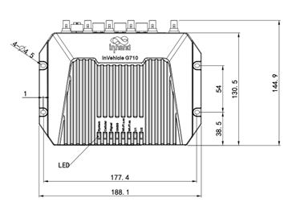
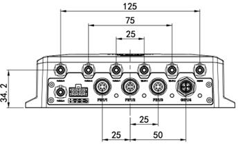
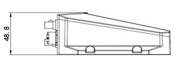
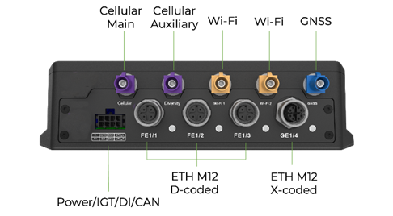
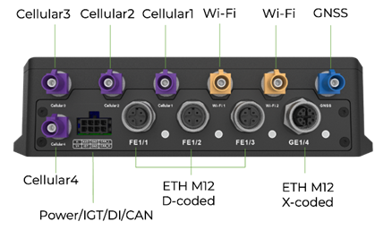

  

    

      
    

    

      High-performance, Powerful, Programmable
    

  

  

    

      VG710 Vehicle Gateway
    

    

      

        
· 5G/LTE

        
· Wi-Fi 5

      

      

        
· GNSS

        
· M12 Connector

      

    

  

# 1. Product Overview

**VG710 provides fast, secure, and reliable in-vehicle connectivity for public transport, heavy equipment, logistics, and emergency fleets.**

**Key Features:**
- **Vehicle-ready design:** M12 Ethernet interface with IP64 rugged protection and ITxPT compliance
- **High-speed connectivity:** 5G/LTE WAN + dual-band Wi-Fi + Gigabit Ethernet
- **Accurate telemetry:** GNSS multi-constellation positioning with inertial navigation support
- **Open edge platform:** Python/C/C++/Docker for rapid custom application development
- **Cloud integration:** Ready for Azure, AWS, and fleet management platforms

## Core Technical Specifications

| Technical Indicator | Specification |
|------|------|
| Cellular Network | Supports 5G / LTE CAT6 / LTE CAT4 (model dependent) |
| Positioning Capability | Supports GPS + BDS + Galileo + GLONASS + QZSS, with inertial navigation |
| Cloud | Supports MQTT, DDS, AMQP, REST, and CoAP |
| VPN | Supports IPSec/L2TP/GRE/OpenVPN |
| WLAN | Dual-band Wi-Fi 5 (2.4/5 GHz, AP/Client) |
| Edge Computing | Supports Python, C/C++, and Docker |
| Dimensions | 188.1 × 144.9 × 48.8 mm |
| Weight | 974 g |
| Interface Capability | 3× M12 10/100 + 1× M12 10/100/1000, Ethernet/CAN/AI-DI |
| Input Voltage Range | 9-36 V DC (configurable to 7-36 V DC) |
| Operating Temperature | -30 °C to +70 °C |
| Protection Rating | IP64 |

# 2. Product Dimensions

  

    
    
Front View

  

  

    
    
Interface Side View

  

  

    
    
Side View

  

  

    
Notes:

    
1. All dimensions are in millimeters (mm).

    
2. All dimensions are approximate and for reference only.

    
3. Drawings must not be used for manufacturing.

    
4. Dimensions are subject to part and manufacturing tolerances.

    
5. Specifications may change without prior notice.

  

# 3. Hardware Specifications

| Category / Parameter | Specification |
|--------------------------|------|
| **Hardware Platform** | |
| CPU | ARM Cortex A7 |
| Main Frequency | 717 MHz |
| RAM | 1 GB DDR3 |
| Storage | 8 GB eMMC |
| **Connectivity** | |
| Cellular | 5G, LTE CAT6, LTE CAT4 |
| SIM | Dual SIM, 2FF |
| Ethernet | 3 × M12 D-coded 10/100 Mbps; 1 × M12 X-coded 10/100/1000 Mbps |
| Antenna | Cellular: 4 or 2 × FAKRA D-coded; Wi-Fi: 2 × FAKRA I-coded; GNSS: 1 × FAKRA C-coded |
| **Satellite Navigation** | |
| GNSS Receiver | GPS L1 C/A + L5, BDS, Galileo, GLONASS, QZSS |
| Built-in Sensor | Accelerometer and gyroscope, supports inertial navigation |
| Position Accuracy | 1 m CEP |
| Tracking Sensitivity | -165 dBm |
| Update Rate | 10 Hz |
| **Wi-Fi** | |
| Frequency | 2.4 / 5 GHz dual-band |
| Protocol | Wi-Fi 5 |
| Max Output | 2.4G: 17 dBm; 5G: 17 dBm |
| Mode | AP / Client |
| **Vehicle Interfaces** | |
| CAN Bus | CAN Bus [2 pins], CAN 2.0 |
| I/O | 1 × AI/DI |
| Indicator | System, Cellular, Signal, GNSS, Wi-Fi 2.4G, Wi-Fi 5G, U1, U2 |
| RTC | Supported |
| **Power** | |
| Input Voltage | 9–36 V DC (configurable to 7–36 V DC) |
| Pin Definition | V+, V-, IGT (8 pins) |
| Protection | Built-in voltage transient protection, delayed ignition induction |
| Average Power | 6.44 W (RF module not at full load) |
| **Mechanical & Environment** | |
| Dimensions (W × D × H) | 188.1 × 144.9 × 48.8 mm |
| Weight | 974 g |
| Installation | Wall-mounting |
| Cooling | Radiation cooling |
| Housing | Die-cast aluminum |
| Protection Rating | IP64 |
| Operating Temp. | -30 °C ~ +70 °C |
| Storage Temp. | -40 °C ~ +85 °C |
| Humidity | 95% RH @ 60 °C |
| **Standards & Certifications** | |
| Vehicle Standard | ECE-R10, R118 |
| Rail Standard | EN50155, EN50121, EN61373 |
| Fire Prevention | EN45545 |
| Certification | CE, E-Mark, ITxPT, FCC, IC, PTCRB, RoHS, VZW, AT&T, TMO |
| Warranty | 3 years |

# 4. Software Specifications

| Category / Parameter | Specification |
|--------------------------|------|
| **Network Features** | |
| Network Access | APN, VPDN |
| LAN Protocol | ARP, Ethernet |
| Authentication | CHAP/PAP/MS-CHAP/MS-CHAP V2 |
| IP Applications | IPv6, Ping, Traceroute, DHCP server/relay/client, DNS relay, DDNS, Telnet, SSH, HTTP, HTTPS, TFTP, FTP, SFTP, Portal |
| IP Routing | Static routing, RIP, OSPF, BGP, IGMP Proxy |
| Configuration | HTTPS, Telnet, SSH, DeviceLive Platform |
| Upgrade | Local/remote WEB, DM, TFTP, FTP, SFTP server, DeviceLive Platform |
| Diagnostics | Ping, Traceroute, Sniffer |
| **Security** | |
| Firewall | SPI, DoS defense, multicast/Ping filter, ACL, NAT/PAT/DMZ/port mapping/virtual server |
| User Level | Administrator and read-only user |
| AAA | Local authentication, Radius, Tacacs+, LDAP |
| CA Certificate | PEM, PKCS12, SCEP |
| VPN | IPSec VPN, L2TP, GRE, OpenVPN, CA |
| **Reliability** | |
| Backup | Floating routing, VRRP, interface backup |
| Link Detection | Heartbeat detection, auto redial when disconnected |
| Watchdog | Self-detection and auto-repair of device faults |
| Offline Storage | Built-in cache for key data when network is unavailable |
| **WLAN** | |
| Protocol | IEEE 802.11 b/g/n/a/ac |
| Security | Shared key, WPA/WPA2, WEP/TKIP/AES |
| **Edge Computing** | |
| Edge Platform | Integrated edge platform for network, computing, storage, and applications |
| Programmable | Python, C/C++, Docker |
| SDK | Python 3 SDK, Docker SDK, Azure IoT Edge SDK |
| IDE | Visual Studio Code |
| IoT Architecture | MQTT, DDS, AMQP, XMPP, JMS, REST, CoAP |
| 3rd-party Cloud | MS Azure, SmartFleet, and APIs for 3rd-party platforms |
| Docker Images | Node-RED, Ubuntu, Docker for ARM 32, etc. |
| **Application Services** | |
| Fleet Management | InHand SmartFleet: task allocation, route planning, tracking, messaging, geofencing, batch upgrades |
| Vehicle Telemetry | Rich interfaces for telemetry and asset tracking devices |
| Event Alarm | Customizable alarms for DI, network, service, power, temperature, voltage |
| Message Push | SMS, Email, App, device digital output |

# 5. Ordering Information

## Model Rule

**Model code:** VG710-\<M/NA\>-\<WMNN\>

\<WMNN\>: Cellular Type & Module

## Product Models

<table style="width:100%; table-layout:fixed;">
  <colgroup>
    <col style="width:28%;">
    <col style="width:45%;">
    <col style="width:15%;">
    <col style="width:12%;">
  </colgroup>
  <tr><th>Model</th><th>Cellular Type</th><th>UE Category</th><th>Region</th></tr>
  <tr><td>VG710-M-NRQ5</td><td>5G NSA/SA; LTE-FDD; LTE-TDD; WCDMA (global multi-band)</td><td>5G</td><td>Global</td></tr>
  <tr><td>VG710-M-FQ09</td><td>LTE-FDD; LTE-TDD; WCDMA (global multi-band)</td><td>LTE CAT6</td><td>Global</td></tr>
  <tr><td>VG710-M-FQ58</td><td>LTE-FDD B1/B3/B7/B8/B20/B28A; LTE-TDD B38/B40/B41; WCDMA B1/B8; GSM B3/B8</td><td>LTE CAT4</td><td>EMEA / APAC</td></tr>
  <tr><td>VG710-M-EN00</td><td>NONE</td><td>-</td><td>Global</td></tr>
</table>

## Antenna Options

<table style="width:100%; table-layout:fixed;">
  <colgroup>
    <col style="width:30%;">
    <col style="width:20%;">
    <col style="width:50%;">
  </colgroup>
  <tr><th>Antenna</th><th>Order Code</th><th>Specifications</th></tr>
  <tr><td>4G FAKRA Antenna</td><td>AANT090038</td><td>4G adhesive antenna, FAKRA purple connector, 2000 mm cable</td></tr>
  <tr><td>5G FAKRA Antenna</td><td>AANT110017</td><td>5G adhesive antenna, FAKRA purple connector, 2000 mm cable</td></tr>
  <tr><td>Wi-Fi FAKRA Antenna</td><td>AANT060024</td><td>Wi-Fi/BLE 2.4-2.5 GHz / 5-5.8 GHz, FAKRA beige connector, 2000 mm cable</td></tr>
  <tr><td>GNSS FAKRA Antenna</td><td>AANT040013</td><td>GPS L1 + BD + GLONASS, 2000 mm cable</td></tr>
</table>

## Cable Options

| Cable | Order Code | Specifications |
|----------|----------|------|
| VG710-M12 Version Power Cable | SCAB000564 | 8PIN power cable for VG710-M12, 2000 mm |
| Network Cable M12 X to RJ45 | AETH050002 | M12 X-coded to RJ45 cable, 1000 mm |

# 6. Contact Us

- **Website:** [InHand Networks](https://www.inhand.com.cn)
- **Copyright:** © InHand Networks. All rights reserved.

# 7. Connector Pin Definition

  

    
    
引脚接口图4G版本

  

  

    
    
引脚接口图5G版本

  

  

