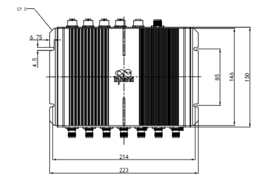
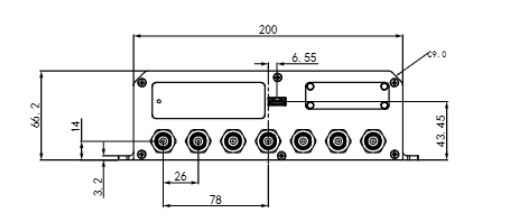
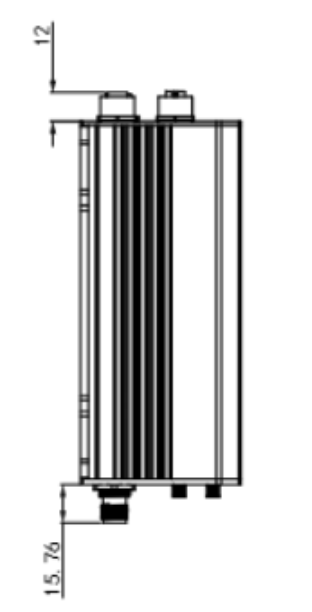
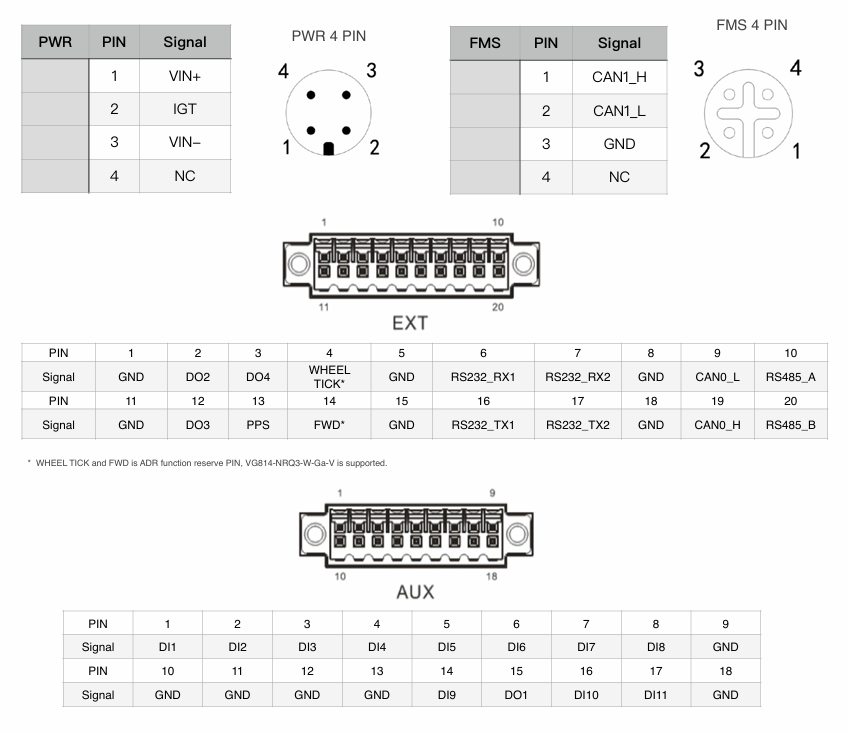

  

    

      
    

    

      All-in-one, high-performance, rugged rail cellular gateway
    

  

  

    

      InVehicle G814 Series Cellular Gateway
    

    

      

        
· 5G/LTE-A

        
· Dual-band Wi-Fi 5

      

      

        
· GNSS + ADR

        
· TNC + M12

      

    

  

# 1. Product Overview

**The InVehicle G814 is an ITxPT-ready cellular gateway designed for metro, light rail, and train deployments, delivering secure and reliable onboard broadband networking.**

**Positioning:** Rugged all-in-one rail gateway with high-speed WAN, Wi-Fi, GNSS, and edge computing

**Key Features:**
- **Rail-ready hardware:** TNC RF and M12 connectors for vibration and harsh environments
- **High-speed connectivity:** 5G/LTE-A, dual SIM, and link backup for uninterrupted service
- **Global positioning:** Multi-constellation GNSS with ADR and up to 10 Hz update rate
- **Open edge platform:** Supports C/C++, Python, Docker, and cloud SDK integration
- **Fleet operation enablement:** Supports diagnostics collection and OTA lifecycle management

## Core Technical Specifications

|Technical Metric|Specification|
|---|---|
|Cellular Network|5G SA/NSA (Sub-6) + LTE Cat6/Cat4, dual SIM (2 x Mini SIM)|
|Positioning|GPS/GLONASS/Galileo/Beidou, 10 Hz, ADR support|
|Cloud Management|InHand Device Manager for remote O&M|
|VPN & Security|IPsec/OpenVPN/L2TP/GRE, SPI firewall, ACL, AAA|
|Network Features|APN/VPDN, static routing/RIP/OSPF/BGP, VRRP, link backup|
|Edge Computing|C/C++, Python, Docker, MQTT/HTTP/TCP FlexAPI|
|Dimensions|223 x 177.76 x 66.2 mm|
|Weight|1438 g|
|Interfaces|4 x Gigabit Ethernet, 2 x RS232, 1 x RS485, 1 x USB 3.0, 2 x CAN, 11DI/4DO|
|Power Input|9-36 VDC (M12 A-coded)|
|Operating Environment|-30 C to +70 C; storage -40 C to +85 C; 95% RH @ 40 C|
|Protection & Structure|IP53, aluminum enclosure, fanless|

# 2. Product Dimensions

  

    
    
Front View

  

  

    
    
Interface View

  

  

    
    
Side View

  

  

    
Notes:

    
1. All dimensions are in millimeters (mm).

    
2. All dimensions are approximate and for reference only.

    
3. Drawings must not be used for manufacturing.

    
4. Dimensions are subject to part and manufacturing tolerances.

    
5. Specifications may change without prior notice.

  

# 3. Hardware Specifications

| Category / Parameter | Specification |
|--------------------------|------|
| **Core Platform** | |
| CPU | ARM Cortex-A7 (quad-core) |
| Frequency | 717 MHz |
| RAM | 1 GB DDR3L |
| Flash | 8 GB eMMC |
| **Cellular & Networking** | |
| Cellular | 5G SA/NSA (Sub-6), LTE Cat6/Cat4 |
| SIM | 2 x Mini SIM (2FF) |
| Ethernet | 4 x Gigabit Ethernet, M12 X-coded female |
| Antenna Connector | TNC |
| **Satellite Positioning** | |
| GNSS Receiver | GPS, GLONASS, Galileo, Beidou |
| Dead Reckoning | Built-in accelerometer and gyroscope |
| Position Accuracy | 2.5 m CEP |
| Tracking Sensitivity | -160 dBm |
| Update Rate | Max 10 Hz |
| ADR | 2% of distance traveled without GNSS |
| **Vehicle Interfaces** | |
| CAN Bus | 1 x CAN 2.0B + 1 x CAN 2.0B (FMS) |
| Serial | 2 x RS232, 1 x RS485 |
| USB | 1 x USB 3.0 (Type-A) |
| I/O | 11 x DI, 4 x DO |
| **Wi-Fi** | |
| Frequency | 2.4 / 5 GHz dual-band |
| Protocol | Wi-Fi 5 |
| Maximum Output | 2.4G: 17 dBm; 5G: 17 dBm |
| Working Mode | AP / Client |
| MIMO | 2 x 2 MU-MIMO |
| **Power** | |
| Power Connector | M12 A-coded male |
| Input Voltage | 9-36 VDC |
| Pin Definition | V+, V-, Ignition, NC (4 pins) |
| Standby Power | 0.006 W (ignition monitoring only) |
| Operating Power | 16.00 W (average, RF full load) |
| Peak Power | 20.0 W (RF full load) |
| **Mechanical & Environment** | |
| Dimensions (W x H x D) | 223 x 177.76 x 66.2 mm |
| Weight | 1438 g |
| Mounting | Wall mounting |
| Ingress Protection | IP53 |
| Cooling | Fanless cooling |
| Enclosure | Aluminum |
| Operating Temperature | -30 C to +70 C |
| Storage Temperature | -40 C to +85 C |
| Humidity | 95% RH @ 40 C |
| **Compliance & Certifications** | |
| Rail Standard | EN50155, EN50121-3-2, EN61373, EN45545-2 |
| Certification | CE, RoHS, E-Mark, ITxPT |

# 4. Software Specifications

| Category / Parameter | Specification |
|--------------------------|------|
| **Network Features** | |
| Network Access | APN, VPDN |
| LAN Protocol | ARP, Ethernet |
| Access Authentication | CHAP/PAP/MS-CHAP/MS-CHAP V2 |
| VLAN | VIDs: 1-127 |
| IP Application | Ping, Traceroute, DHCP server/relay/client, DNS relay, DDNS, Telnet, SSH, HTTP, HTTPS, MQTT |
| IP Routing | Static routing, RIP, OSPF, BGP |
| **Security** | |
| Firewall | SPI, DoS defense, multicast/Ping filtering, ACL |
| NAT | NAT, NAPT, DMZ, port mapping |
| User Level | Administrator and read-only user |
| AAA | Local authentication, Radius, TACACS+, LDAP |
| Certificate | PEM, PKCS12, SCEP, CRL |
| VPN | IPsec VPN, OpenVPN, L2TP, GRE |
| **Reliability** | |
| Redundancy | Floating static routes, VRRP, interface backup |
| Link Detection | Configurable target reachability detection for failover |
| Watchdog | Auto recovery from device faults |
| Offline Storage | Local storage of key data when network is unavailable |
| **WLAN Features** | |
| Protocol | IEEE 802.11 a/b/g/n/ac |
| Security | Shared key, WPA/WPA2 Personal/Enterprise |
| Encryption | WEP/TKIP/AES |
| Other | Multiple SSIDs, captive portal |
| **Edge Computing & Services** | |
| Programmable | C/C++, Python, Docker |
| SDK | Python 3 SDK, Docker SDK, Azure IoT Edge SDK |
| IDE | Visual Studio Code |
| API | FlexAPI over MQTT/HTTP/TCP |
| Cloud Integration | Microsoft Azure, AWS IoT, and third-party cloud platforms |
| Built-in Services | Inventory, time, GNSS, FMStoIP, MQTT broker |
| Management Platform | InHand Device Manager (cloud deployment and remote operations) |

# 5. Ordering Information

## Model Rule

**Model code:** VG814-\<WMNN\>-W-G-R

\<WMNN\>: Cellular Type & Module

## Product Models

<table style="width:100%; table-layout:fixed;">
  <colgroup>
    <col style="width:32%;">
    <col style="width:28%;">
    <col style="width:40%;">
  </colgroup>
  <tr><th>Model</th><th>Region</th><th>&lt;WMNN&gt;: Cellular Type &amp; Module</th></tr>
  <tr><td>VG814-FS59-W-G-R</td><td>Europe, Africa, APAC, Oceania</td><td>LTE-FDD: B1/3/5/7/8/18/19/20/26/28A/28B LTE-TDD: B38/39/40/41 TD-SCDMA: B34/B39 UMTS/HSPA+: B1/3/5/6/8 GSM/GPRS/EDGE: 900/1800 MHz</td></tr>
  <tr><td>VG814-FQ59-W-G-R</td><td>Europe, APAC</td><td>LTE-FDD: B1/3/5/7/8/20/28/32 LTE-TDD: B38/40/41 WCDMA: B1/3/5/8</td></tr>
  <tr><td>VG814-NRQ3-W-G-R</td><td>Global</td><td>5G NSA: n1/2/3/5/7/8/12/20/25/28/38/40/41/48/66/71/77/78/79 5G SA: n1/2/3/5/7/8/12/20/25/28/38/40/41/48/66/71/77/78/79 LTE-FDD: B1/2/3/4/5/7/8/9/12(17)/13/14/18/19/20/25/26/28/29/30/32/66/71 LTE-TDD: B34/38/39/40/41/42/43/48 LAA: B46 WCDMA: B1/2/3/4/5/6/8/19</td></tr>
</table>

# 6. Contact Us

- **Website:** [InHand Networks](https://www.inhand.com)
- **Copyright:** © InHand Networks. All rights reserved.

# 7. Terminal Definition

  

    
    

  

