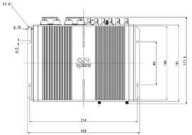
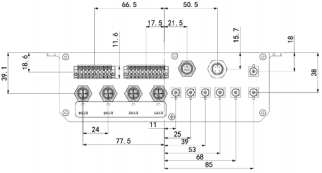
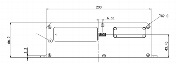
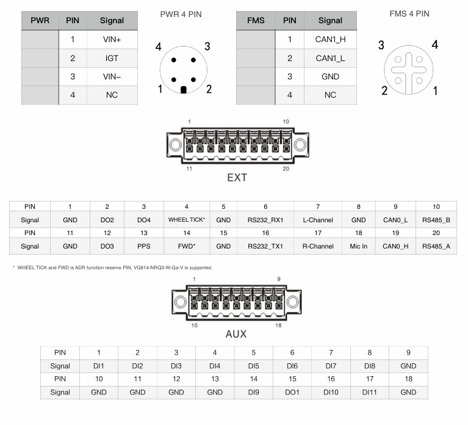

  

    

      
    

    

      High-performance, all-in-one, open vehicle gateway
    

  

  

    

      InVehicle G814 Series Cellular Gateway
    

    

      

        
· 5G/LTE-A

        
· Dual-band Wi-Fi 5

      

      

        
· GNSS

        
· M12 + FAKRA

      

    

  

# 1. Product Overview

**The InVehicle G814 is an ITxPT-ready cellular gateway for public transportation, delivering secure, high-speed onboard networking for buses, trams, metro, and rail scenarios.**

**Positioning:** Rugged all-in-one vehicle gateway with high-speed WAN, Wi-Fi, GNSS, and edge computing

**Key Features:**
- **High-speed connectivity:** 5G/LTE-A with dual SIM and link backup for always-on access
- **Vehicle-ready design:** FAKRA RF and M12 connectors built for harsh mobile environments
- **Integrated vehicle interfaces:** Supports OBD-II, J1939, CAN, serial, USB, and rich I/O
- **Open edge platform:** Supports Python, C/C++, Docker, and cloud integration
- **Fleet operation ready:** Supports fleet tracking, messaging, geofencing, and OTA

## Core Technical Specifications

|Technical Indicator|Specification|
|---|---|
|Cellular Network|4G Cat6 / 5G / 5G+5G RedCap (model-dependent)|
|Network Features|APN, VPDN, DHCP, DNS, DDNS, static routing/RIP/OSPF/BGP|
|Positioning Capability|GPS/GLONASS/Galileo/Beidou, 2.5 m CEP accuracy, up to 10 Hz|
|Security Capability|SPI firewall, ACL, NAT/NAPT, IPsec/OpenVPN/L2TP/GRE|
|Wi-Fi Capability|Wi-Fi 5 dual-band (2.4/5 GHz), AP/Client, multi-SSID, Captive Portal|
|Edge and Cloud|Supports C/C++, Python, Docker; compatible with Azure/AWS IoT; FlexAPI|
|Processing Platform|ARM Cortex-A7 quad-core 717 MHz, 1 GB DDR3L, 8 GB eMMC|
|Interface Capability|4 x Gigabit Ethernet (M12 X-coded), CAN, RS232, RS485, USB 3.0, 11DI/4DO|
|Power Supply and Consumption|9-48 VDC, typical power consumption 6.240 W, peak 15.192 W|
|Mechanical Dimensions|223 x 66.2 x 171.6 mm, 1340 g, wall mounting|
|Environmental Adaptation|-30 C to +70 C operating, -40 C to +85 C storage, 95% RH @ 40 C|
|Protection and Certifications|IP53, ECE R10/R118, EN45545-2/EN50155/EN50121/EN61373, CE/UKCA/RoHS/E-Mark/ITxPT|

# 2. Product Dimensions

  

    
    
Front View

  

  

    
    
Interface View

  

  

    
    
Side View

  

  

    
Notes:

    
1. All dimensions are in millimeters (mm).

    
2. All dimensions are approximate and for reference only.

    
3. Drawings must not be used for manufacturing.

    
4. Dimensions are subject to part and manufacturing tolerances.

    
5. Specifications may change without prior notice.

  

# 3. Hardware Specifications

| Category / Parameter | Specification |
|--------------------------|------|
| **Core Platform** | |
| CPU | ARM Cortex-A7 (quad-core) |
| Frequency | 717 MHz |
| RAM | 1 GB DDR3L |
| Flash | 8 GB eMMC |
| **Cellular & Networking** | |
| Cellular | 4G Cat6 / 5G / 5G+5G RedCap (model dependent) |
| SIM | 2 x SIM (2FF) |
| Ethernet | 4 x Gigabit Ethernet, M12 X-coded female |
| Antenna Connector | Cellular: FAKRA D-coded; Wi-Fi: FAKRA I-coded |
| **Satellite Positioning** | |
| GNSS Receiver | GPS, GLONASS, Galileo, Beidou |
| Dead Reckoning | Built-in accelerometer and gyroscope supported |
| Position Accuracy | 2.5 m CEP |
| Tracking Sensitivity | -160 dBm |
| Update Rate | Up to 10 Hz |
| **Vehicle Interfaces** | |
| CAN Bus | 1 x CAN 2.0B + 1 x CAN 2.0B FMS |
| Serial | 1 x RS232, 1 x RS485 |
| USB | 1 x USB 3.0 (Type-A) |
| I/O | 11 x DI, 4 x DO |
| Audio | Left/Right channel, Mic In |
| **Wi-Fi** | |
| Frequency | 2.4 / 5 GHz dual-band |
| Protocol | Wi-Fi 5 (IEEE 802.11 a/b/g/n/ac) |
| Output Power | 2.4G: 17 dBm; 5G: 17 dBm |
| Working Mode | AP / Client |
| **Power** | |
| Power Connector | M12 A-coded male |
| Input Voltage | 9-48 VDC |
| Pin Definition | V+, V-, Ignition, NC (4 pins) |
| Standby Power | 0.0416 W |
| Typical Operating Power | 6.240 W |
| Peak Power | 15.192 W |
| **Mechanical & Environment** | |
| Dimensions (W x H x D) | 223 x 66.2 x 171.6 mm |
| Weight | 1340 g |
| Mounting | Wall mounting |
| Protection Rating | IP53 |
| Cooling | Fanless |
| Enclosure | Aluminum |
| Operating Temperature | -30 C to +70 C |
| Storage Temperature | -40 C to +85 C |
| Humidity | 95% RH @ 40 C |
| **Compliance & Certifications** | |
| Vehicle Standard | ECE R10, ECE R118 |
| Rail Standard | EN45545-2, EN50155, EN50121, EN61373 |
| Certifications | CE, UKCA, RoHS, E-Mark, ITxPT |

# 4. Software Specifications

| Category / Parameter | Specification |
|--------------------------|------|
| **Network Features** | |
| Network Access | APN, VPDN |
| LAN Protocol | ARP, Ethernet |
| Access Authentication | CHAP/PAP/MS-CHAP/MS-CHAP V2 |
| VLAN | VIDs 1-127 |
| IP Applications | DHCP server/relay/client, DNS relay, DDNS, Telnet, SSH, HTTP, HTTPS, MQTT |
| IP Routing | Static routing, RIP, OSPF, BGP |
| Diagnostics | Ping, Traceroute, tcpdump, speed test |
| **Security** | |
| Firewall | SPI, DoS defense, multicast/Ping filtering, ACL |
| NAT | NAT, NAPT, DMZ, port mapping |
| User Levels | Administrator and read-only user |
| AAA | Local authentication, Radius, TACACS+, LDAP |
| Certificates | PEM, PKCS12, SCEP, CRL |
| VPN | IPsec VPN, OpenVPN, L2TP, GRE |
| **Reliability** | |
| Redundancy | Floating static routes, VRRP, interface backup |
| Link Detection | Configurable reachability detection for failover |
| Watchdog | Auto recovery from device faults |
| Offline Storage | Built-in storage for data caching during disconnection |
| **WLAN Features** | |
| Security | Shared key, WPA/WPA2 authentication |
| Encryption | WEP/TKIP/AES |
| Other | Multiple SSIDs, captive portal |
| **Edge Computing & Services** | |
| Programmability | C/C++, Python, Docker |
| SDK | Python 3 SDK, Docker SDK, Azure IoT Edge SDK |
| API | FlexAPI over MQTT/HTTP/TCP |
| Cloud Integration | Microsoft Azure, AWS IoT, and third-party platforms |
| Built-in Services | Inventory, time, GNSS, FMStoIP, MQTT broker |

# 5. Ordering Information

## Model Rule

**Model code:** VG814-\<WMNN\>-W-G-V

\<WMNN\>: Cellular Type & Module

## Product Models

<table style="width:100%; table-layout:fixed;">
  <colgroup>
    <col style="width:35%;">
    <col style="width:15%;">
    <col style="width:50%;">
  </colgroup>
  <tr><th>Model</th><th>Region</th><th>&lt;WMNN&gt;: Cellular Type &amp; Module</th></tr>
  <tr><td>VG814-FQ59-W-G-V</td><td>Europe, APAC</td><td>LTE-FDD: B1/3/5/7/8/20/28/32 LTE-TDD: B38/40/41 WCDMA: B1/3/5/8</td></tr>
  <tr><td>VG814-FQ59FQ69-W-G-V</td><td>Europe, APAC</td><td>LTE Cat6 dual module</td></tr>
  <tr><td>VG814-NRQ3-W-G-V</td><td>Global</td><td>5G NSA: n1/2/3/5/7/8/12/20/25/28/38/40/41/48/66/71/77/78/79 5G SA: n1/2/3/5/7/8/12/20/25/28/38/40/41/48/66/71/77/78/79 LTE-FDD: B1/2/3/4/5/7/8/9/12(17)/13/14/18/19/20/25/26/28/29/30/32/66/71 LTE-TDD: B34/38/39/40/41/42/43/48 LAA: B46 WCDMA: B1/2/3/4/5/6/8/19</td></tr>
  <tr><td>VG814-NRQ5-W-G-V</td><td>Global</td><td>5G SA/NSA: n1/2/3/5/7/8/12/13/14/18/20/25/26/28/29/30/38/40/41/48/66/70/71/75/76/77/78/79 LTE-FDD: B1/2/3/4/5/7/8/12/13/14/17/18/19/20/25/26/28/29/30/32/66/71 LTE-TDD: B34/38/39/40/41/42/43/48 LAA: B46 WCDMA: B1/2/4/5/8/19</td></tr>
  <tr><td>VG814-NRQ5RC25-W-G-V</td><td>Global</td><td>5G SA/NSA (Sub6): n1/2/3/5/7/8/12/13/14/18/20/25/26/28/29/30/38/40/41/48/66/70/71/75/76/77/78/79 RedCap RC25 SA: n1/2/3/5/7/8/12/13/14/18/20/25/26/28/30/38/40/41/48/66/70/71/77/78/79 LTE-FDD: B1/2/3/4/5/7/8/12/13/14/17/18/19/20/25/26/28/30/66/70/71 LTE-TDD: B34/38/39/40/41/42/43/48</td></tr>
</table>

# 6. Contact Us

- **Website:** [InHand Networks](https://www.inhand.com)
- **Copyright:** © InHand Networks. All rights reserved.

# 7. Terminal Definition

  

    
    

  

 